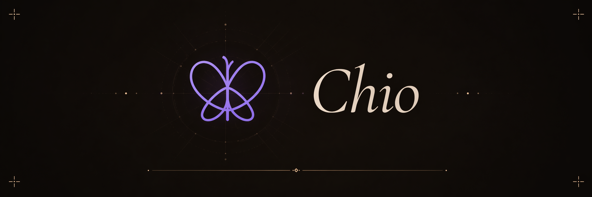
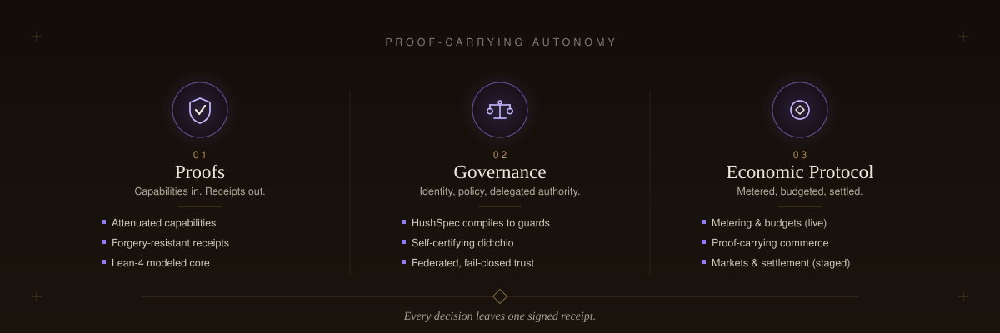
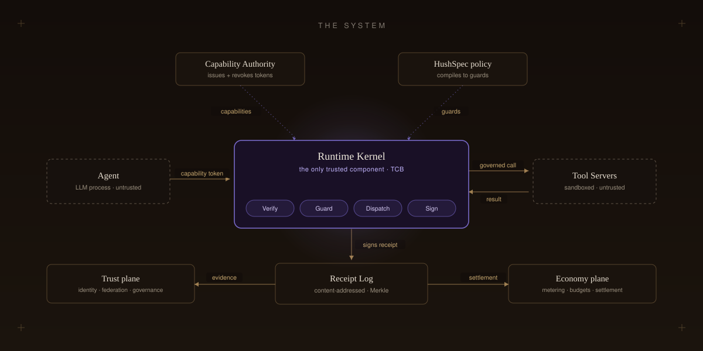
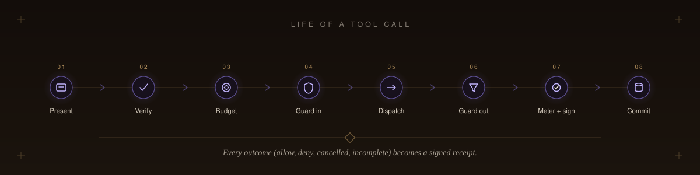
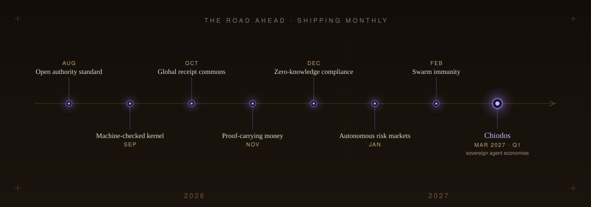

<p align="center">
  
</p>

<p align="center">
  <a href="LICENSE"></a>
  
  <a href="spec/PROTOCOL.md"></a>
  <a href="CHANGELOG.md"></a>
  <a href="docs/README.md"></a>
</p>

<p align="center">
  <strong>Proofs, Governance, and Economic Protocol for AI Systems</strong>
</p>

<p align="center">
  
</p>

<p align="center">
  <a href="#what-is-chio">What</a>&nbsp;&nbsp;&middot;&nbsp;&nbsp;
  <a href="#the-three-pillars">Pillars</a>&nbsp;&nbsp;&middot;&nbsp;&nbsp;
  <a href="#quickstart">Quickstart</a>&nbsp;&nbsp;&middot;&nbsp;&nbsp;
  <a href="#architecture">Architecture</a>&nbsp;&nbsp;&middot;&nbsp;&nbsp;
  <a href="#integrations-and-sdks">Integrations</a>&nbsp;&nbsp;&middot;&nbsp;&nbsp;
  <a href="#security-and-trust">Security</a>&nbsp;&nbsp;&middot;&nbsp;&nbsp;
  <a href="#roadmap">Roadmap</a>&nbsp;&nbsp;&middot;&nbsp;&nbsp;
  <a href="docs/README.md">Docs</a>&nbsp;&nbsp;&middot;&nbsp;&nbsp;
  <a href="spec/PROTOCOL.md">Spec</a>
</p>

---

```sh
curl -fsSL https://www.chio.computer/install.sh | sh
```

## What is Chio

Chio is the trust-control layer for autonomous AI. A capability-scoped Rust kernel
mediates every tool an agent calls: cryptographically attenuated capabilities go in,
forgery-resistant signed receipts come out. On that proof spine Chio builds a full
**governance** layer (self-certifying identity, delegated authority, policy, federation)
and an **economic protocol** (metering, budgets, markets, settlement), so agents can
act, transact, and be held to account, with cryptographic evidence for every decision.

> MCP tells an agent *how* to call a tool.
> Chio proves *what it was allowed to do, what it cost, and what happened.*

Proof-carrying tool calls turn software agents into first-class economic actors. Every tool
call is a priced, budgeted, metered transaction: a capability carries its own spend limits,
the kernel meters real cost and settles it, and the action closes into a signed receipt of
what was authorized, what it cost, and how it was paid. On that foundation Chio runs a
complete agent economy: discoverable service markets with open bidding and reputation-tiered
pricing, credit lines and bonded execution, liability underwriting and insurance, and on-chain
settlement anchored across EVM, Bitcoin, and Solana. Agents transact with one another and with
the outside world under signed policy, and every payment, claim, and credit decision cites
prior signed truth instead of restating it. The result is an agent economy that is auditable,
insurable, and settlement-ready by construction.

## The three pillars

<p align="center">
  
</p>

Three layers on one proof spine: every capability, decision, and payment resolves to a signed
receipt.

### Proofs

> Signed, attenuating capabilities go in. Forgery-resistant, independently verifiable receipts
> come out.

| Primitive | What it does |
| --- | --- |
| **Attenuated capabilities** | Ed25519-signed, time-bounded, budgeted tokens. Delegation proves it is a subset of its parent, so authority can only narrow, never widen. Post-quantum hybrid (ML-DSA-65) is supported. |
| **Forgery-resistant receipts** | Receipt identity is the hash of its own canonical content; the kernel recomputes that hash before signing and refuses on mismatch. `allow`, `deny`, `cancelled`, and `incomplete` are each signed. |
| **A verifiable log** | A content-addressed receipt DAG committed in RFC 6962 Merkle checkpoints. Canonical JSON (RFC 8785) makes a receipt signed in Rust verify byte-for-byte in TypeScript, Python, or Go. |
| **A Lean-4 modeled core** | The pure admission core (verify, resolve, evaluate, sign) is mechanically modeled with a published assumption boundary. |

### Governance

> Policy, identity, and delegated authority are native to the protocol, not bolted on.

| Primitive | What it does |
| --- | --- |
| **Policy that compiles to guards** | HushSpec YAML (allow / warn / deny, with inheritance) compiles directly into native guards. No external policy engine. |
| **A guard pipeline you can sandbox** | Forbidden-path, egress/SSRF, secret and PII/PHI, velocity, data-flow, jailbreak, and semantic SQL/vector checks. Custom guards run as fuel-metered WASM with no host access; cloud guardrails attach behind circuit breakers. |
| **Self-certifying identity** | A `did:chio` is the agent's Ed25519 key: no registry, no CA. Agent Passports and BBS+ selective disclosure travel with the agent and verify with no storage dependency. |
| **Authority without a central issuer** | Federation shares trust evidence while each operator activates locally. Governance charters, capability leases, and threshold multi-party approvals bind who may do what, to which request, for how long. |
| **One verifier for provenance** | A single fail-closed Sigstore verifier gates guard artifacts, signed model cards, and attestations; revocation is a signed sparse-Merkle oracle. |

### Economic protocol

> Every tool call is a priced, budgeted, metered transaction that settles into a signed receipt.

| Capability | What it does |
| --- | --- |
| **Metering and budgets** | Per-call compute, data, and API cost, with durable pre-execution budget holds against a capability's caps, sealed into signed economic receipt metadata. |
| **Proof-carrying commerce** | One signed receipt binds what was authorized, how it was priced, what it metered, and how it settled, so credit and insurance decisions cite prior signed truth. |
| **Markets, credit, and insurance** | Discoverable service markets with open bidding and reputation-tiered pricing, credit lines and bonded execution, and liability underwriting and insurance. |
| **Settlement and anchoring** | On-chain settlement with cross-chain checkpoint anchoring across EVM, Bitcoin, and Solana, backed by the Chio settlement contracts. |

## Quickstart

Chio is pre-release (0.1.0) and not yet published to a package registry, so build the `chio`
binary from source:

```bash
git clone https://github.com/backbay-labs/chio.git
cd chio
cargo build --release -p chio-cli   # produces ./target/release/chio
./target/release/chio --help
```

For the current source install path and the planned binary/Homebrew release contract, see
[docs/install/README.md](docs/install/README.md).

Now evaluate a single tool call against a policy. The example policy
[`examples/policies/hushspec-tool-allow.yaml`](examples/policies/hushspec-tool-allow.yaml)
allows a narrow read-only tool surface and blocks everything else. Chio is fail-closed: it
signs a receipt for every decision, so `chio check` needs a receipt database to record one.

An allowed call (`read_file` is in the allowlist) returns `ALLOW` and exits 0:

```bash
./target/release/chio --receipt-db /tmp/chio.db check \
  --policy examples/policies/hushspec-tool-allow.yaml \
  --tool read_file --params '{"path":"README.md"}'
```

```
verdict:    ALLOW
tool:       read_file
server:     *
receipt_id: 84c7f76d...
policy:     40f2f61d...
mode:       preflight
```

A call to a tool that is not in the allowlist returns `DENY` and exits 2:

```bash
./target/release/chio --receipt-db /tmp/chio.db check \
  --policy examples/policies/hushspec-tool-allow.yaml \
  --tool delete_database --params '{}'
```

```
verdict:    DENY
tool:       delete_database
reason:     requested tool delete_database on server * is not in capability scope
receipt_id: 66db67f0...
```

Both decisions are recorded as signed receipts. List them as one JSON object per line (the
read fails closed without an explicit tenant boundary, so pass `--admin-all` for this local
demo):

```bash
./target/release/chio --receipt-db /tmp/chio.db receipt list --admin-all
```

Each line carries the decision verdict, the policy hash, the signing kernel key, and an
Ed25519 signature over the receipt.

## Architecture

Chio is layered around a single trusted core. External ecosystems enter through protocol
edges that turn them into governed tool servers. The **Runtime Kernel** mediates every call
and is the only trusted component. A **trust plane** (identity, credentials, federation,
governance) and an **economy plane** (metering, budgets, settlement) draw on the receipts the
kernel signs, and every decision is committed to the **Receipt Log**.

<p align="center">
  
</p>

Only the Runtime Kernel is trusted (the TCB). The agent and tool servers are untrusted and
isolated, so a compromised agent or tool server cannot forge authorization or a receipt, and
any registry or artifact mismatch fails closed.

### Life of a tool call

<p align="center">
  
</p>

| Step | What happens |
| --- | --- |
| **1 &middot; Present** | The agent calls a tool and presents a capability token (Ed25519-signed, time-bounded, scoped) rather than ambient credentials. |
| **2 &middot; Verify** | The kernel runs the full capability check: signature and expiry, target within granted scope, delegation attenuates (the child scope is a proven subset of its parent), neither the capability nor any ancestor is revoked, and DPoP when the grant requires it. |
| **3 &middot; Budget** | If the grant carries monetary caps, the kernel places a durable pre-execution hold. An over-budget call is denied before anything runs. |
| **4 &middot; Guard (in)** | Input guards run in sequence over the parameters (forbidden paths, egress and SSRF, secrets, velocity, data-flow, jailbreak, semantic data checks). Any deny denies the call. |
| **5 &middot; Dispatch** | Only the kernel dispatches to the tool server. The agent never holds a handle to it. |
| **6 &middot; Guard (out)** | The result passes back through output and post-invocation guards (PII/PHI sanitization, anomaly and data-transfer checks). |
| **7 &middot; Meter and sign** | The kernel reconciles the budget hold to actual cost, assembles the receipt (decision, policy hash, guard evidence, economic metadata), recomputes the content hash inside its trust boundary, and signs it. A call it cannot sign is not allowed. |
| **8 &middot; Commit** | The receipt is written to the content-addressed log and folded into a Merkle checkpoint, where its evidence is available to the trust and economy planes. |

Every outcome (`allow`, `deny`, `cancelled`, `incomplete`) produces a signed receipt.

### The codebase

The workspace ships 100+ crates across 11 groups.

| Group | What lives there |
| --- | --- |
| `core` | Shared types (capabilities, receipts, canonical JSON, signing), errors, adversarial suite |
| `kernel` | Capability validation, guard pipeline, receipt signing, runtime and platform variants |
| `guards` | Native, data-layer, WASM, and external guards, plus HushSpec policy and the guard registry |
| `protocol` | The 27 protocol and provider edges (MCP, A2A, ACP-Client, AG-UI, OpenAPI, provider dialects, Tower, Envoy) |
| `economy` | Metering, budgets, pricing, markets, credit, settlement, anchoring, web3 bindings |
| `trust` | `did:chio`, credentials and passports, federation, governance, reputation, attestation, TEE, model cards |
| `observability` | SIEM export, lineage, log redaction, metrics, OTel receipt export |
| `platform` | Control plane, stores, signed manifests, config, workflow, HTTP and session primitives |
| `products` | The `chio` CLI, API Protect, Chio-Wall, MERCURY, Proof Room |
| `sdk` | Guard-authoring SDK, FFI bindings, receipt evaluation helpers |
| `tooling` | Conformance suite, spec codegen and validation, LSP, test support |

The crates most users touch are the `chio` CLI (`chio-cli`), `chio-api-protect` (a zero-code
reverse proxy that protects HTTP APIs with Chio receipts), and the libraries `chio-kernel`,
`chio-policy`, and `chio-guards`. The full crate map and component detail live in
[AGENTS.md](AGENTS.md) and [docs/architecture/](docs/architecture/).

## Integrations and SDKs

One kernel. Every major agent-interop protocol, eight provider tool-call dialects, eight
language SDKs, and 60+ framework, runtime, and infrastructure integrations. Chio wraps
existing ecosystems instead of replacing them: MCP, A2A, ACP-Client, AG-UI, OpenAPI, and provider
tool formats become governed Chio tool servers, while the kernel keeps dispatch and receipt
authority for the surfaces it mediates.

| Layer | Surfaces |
| --- | --- |
| **Protocols** | MCP &middot; A2A &middot; ACP-Client &middot; AG-UI &middot; OpenAPI&rarr;MCP &middot; Envoy/Istio `ext_authz` &middot; Tower |
| **Provider dialects** | Anthropic &middot; Bedrock &middot; OpenAI\* &middot; Gemini &middot; Groq &middot; Cohere &middot; Mistral &middot; Ollama |
| **Agent frameworks** | Hermes &middot; LangChain &middot; LangGraph &middot; LlamaIndex &middot; CrewAI &middot; AutoGen &middot; Vercel AI SDK |
| **Language SDKs** | TypeScript &middot; Python &middot; Go &middot; Rust &middot; C++ &middot; JVM/Kotlin &middot; Swift &middot; .NET |
| **Web and runtime** | FastAPI &middot; Django &middot; Next.js &middot; Express &middot; Fastify &middot; Elysia &middot; Spring Boot &middot; ASP.NET &middot; Cloudflare Workers &middot; Vercel Edge &middot; Deno |
| **Data and orchestration** | Temporal &middot; Airflow &middot; Dagster &middot; Prefect &middot; Ray &middot; Flink &middot; Kafka/NATS |
| **Infra and mesh** | Kubernetes &middot; AWS Lambda &middot; AWS Bedrock Marketplace &middot; VS Code &middot; Zed |
| **Agent and chat plugins** | Claude Code &middot; Cursor &middot; Codex &middot; OpenCode &middot; OpenClaw (Slack/Discord/Telegram) |

<sub>\* OpenAI interception is implemented; outbound execution is deferred (trace-only, not authoritative). Anthropic and Bedrock are the release-qualified providers.</sub>

<details>
<summary><strong>Full integration matrix (60+ surfaces)</strong></summary>

#### Protocols and transports (`crates/protocol/`)

| Surface | Package | What it does | Status |
| --- | --- | --- | --- |
| MCP adapter | `chio-mcp-adapter` | Wraps external MCP servers as Chio tool servers | Shipping |
| MCP edge | `chio-mcp-edge` | Exposes Chio tools over MCP (stdio JSON-RPC) | Shipping |
| MCP registry server | `integrations/mcp-adapter` | Registry-listed MCP server: Streamable HTTP, OAuth 2.1 + PKCE, RFC 9728 metadata, receipt emission | Shipping |
| Hosted / Remote MCP | `chio-hosted-mcp`, `chio-mcp-remote` | Hosted and remote MCP runtime surfaces | Shipping |
| A2A adapter | `chio-a2a-adapter` | A2A to Chio: agent-card discovery + `SendMessage` mediation | Shipping |
| A2A edge | `chio-a2a-edge` | Exposes Chio tools as blocking A2A skills | Shipping |
| ACP-Client edge | `chio-acp-edge` | Exposes Chio tools as ACP-Client capabilities with bridge-fidelity assessment | Shipping |
| ACP-Client proxy | `chio-acp-proxy` | Enforces Chio access control on ACP-Client agent sessions | Shipping |
| AG-UI proxy | `chio-ag-ui-proxy` | Capability-validated interception of agent-to-UI event streams | Shipping |
| OpenAPI | `chio-openapi` | OpenAPI 3.x spec parser to Chio tool manifest | Shipping |
| OpenAPI to MCP | `chio-openapi-mcp-bridge` | Exposes Chio-governed HTTP APIs as MCP tool surfaces | Shipping |
| Cross-protocol | `chio-cross-protocol` | Shared cross-protocol bridge contracts + orchestrator | Shipping |
| Tower middleware | `chio-tower` | Rust Tower middleware for capability validation + receipt signing | Shipping |
| Envoy `ext_authz` | `chio-envoy-ext-authz` | Service-mesh gRPC adapter bridging external authz to the kernel | Shipping |

#### Provider tool-call dialects (`crates/protocol/`)

Each adapter follows a lift to kernel-verdict to lower pipeline over a real HTTP transport with hermetic mock-server tests.

| Provider | Package | Status |
| --- | --- | --- |
| Anthropic (Messages tool-use) | `chio-anthropic-tools-adapter` | Shipping, release-qualified |
| AWS Bedrock (Converse) | `chio-bedrock-converse-adapter` | Shipping, release-qualified |
| OpenAI (Chat + Responses) | `chio-openai-adapter` | In-progress: interception only, execution deferred |
| Google Gemini | `chio-gemini-tools-adapter` | Built; not yet release-qualified |
| Groq | `chio-groq-tools-adapter` | Built; not yet release-qualified |
| Cohere | `chio-cohere-tools-adapter` | Built; governance-deferred |
| Mistral | `chio-mistral-tools-adapter` | Built; governance-deferred |
| Ollama | `chio-ollama-tools-adapter` | Built; not yet release-qualified |

#### Agent frameworks

| Framework | Package | Status |
| --- | --- | --- |
| Hermes Agent (NousResearch) | `chio-hermes` ([HERMES.md](docs/integrations/HERMES.md)) | Shipping (pre-1.0) |
| LangChain | `chio-langchain` | Shipping |
| LangGraph | `chio-langgraph` | Shipping |
| LlamaIndex | `chio-llamaindex` | Shipping |
| CrewAI | `chio-crewai` | Shipping |
| AutoGen | `chio-autogen` | Shipping |
| Vercel AI SDK (+ middleware) | `@chio-protocol/ai-sdk`, `@chio-protocol/ai-sdk-middleware` | Shipping |
| Agent observability | `chio-observability` (LangSmith / LangFuse spans) | Shipping |

#### Language SDKs (`sdks/`)

| Language | Package(s) | Status |
| --- | --- | --- |
| TypeScript | `@chio-protocol/sdk` | Shipping |
| Python | `chio-sdk` (in-process), `chio-sdk-python` (sidecar), `chio-adapter-base` | Shipping |
| Go | `chio-go` (in-process), `chio-go-http` (wire + `net/http` middleware) | Shipping |
| Rust | workspace crates + `chio-tower` | Shipping |
| C++ | `chio-cpp`, `chio-cpp-kernel`, `chio-drogon` (web middleware) | Shipping |
| JVM / Kotlin | `chio-sdk-jvm`, `chio-spring-boot`, `chio-streaming-flink`, `chio-kernel-mobile` (Android) | Shipping |
| Swift / iOS | Chio Swift SDK (`ChioKernel.xcframework`, App Attest) | Shipping |
| .NET | `Backbay.Chio.Middleware` (ASP.NET Core) | Shipping |
| Mobile (RN / Expo) | `@chio-protocol/mobile` | Shipping |

#### Guard-authoring SDKs (sandboxed WASM guest components)

| Language | Package | Status |
| --- | --- | --- |
| Rust (canonical) | `chio-guard-sdk` (+ macros) | Shipping |
| Python | `chio-guard-py` | Shipping |
| Go | `chio-guard-go` | Shipping |
| C++ | `chio-guard-cpp` | Shipping |
| TypeScript | `chio-guard-ts` | Shipping |

#### Web and runtime middleware

| Runtime | Package | Status |
| --- | --- | --- |
| FastAPI / ASGI / Django | `chio-fastapi`, `chio-asgi`, `chio-django` | Shipping |
| Next.js / Express / Fastify | `@chio-protocol/next`, `@chio-protocol/express`, `@chio-protocol/fastify` | Shipping |
| Elysia (Bun) | `@chio-protocol/elysia` | Shipping |
| Spring Boot / ASP.NET / Drogon | `chio-spring-boot`, `Backbay.Chio.Middleware`, `chio-drogon` | Shipping |
| Cloudflare Workers / Vercel Edge / Deno | `@chio-protocol/workers`, `@chio-protocol/edge`, `@chio-protocol/deno` | Shipping |
| Browser / Passkey | `@chio-protocol/browser`, `@chio-protocol/passkey` | Shipping |
| Scaffolder | `create-chio-app` | Shipping |

#### Data, orchestration, and infrastructure

| Surface | Package | Status |
| --- | --- | --- |
| Temporal / Airflow / Dagster / Prefect / Ray | `chio-temporal`, `chio-airflow`, `chio-dagster`, `chio-prefect`, `chio-ray` | Shipping |
| Apache Flink | `chio-streaming-flink` | Shipping |
| Streaming (Kafka, NATS, Pulsar, EventBridge, Pub/Sub, Redis) | `chio-streaming` | Shipping |
| Infrastructure-as-Code (Terraform, Pulumi) | `chio-iac` | Shipping |
| Kubernetes (controller, CRDs, webhooks) | `sdks/k8s` | Shipping |
| AWS Lambda (Rust + Python) | `chio-lambda-extension`, `chio-lambda-python` | Shipping |
| AWS Bedrock Marketplace | `chio-bedrock-control-plane` (`us-east-1`) | Shipping |
| Editors | `vscode-chio`, `zed-chio` (LSP-backed) | Shipping |

#### Products (`crates/products/`)

| Product | Package | What it is |
| --- | --- | --- |
| `chio` CLI | `chio-cli` | Operator binary: `check`, `mcp serve`, `trust serve`, `replay`, receipt inspection |
| API Protect | `chio-api-protect` | Zero-code reverse proxy: OpenAPI in, default policy, signed receipts out |
| Chio-Wall | `chio-wall` | Bounded control-path packages and evidence bundles |
| MERCURY | `chio-mercury` | Typed evidence contracts layered on receipt truth |
| Proof Room | `chio-proof-room` | Standalone verifier dashboard (Docker quickstart) |

</details>

### Ecosystem and plugins

Beyond this repository, the [`backbay-labs`](https://github.com/backbay-labs) org ships
companion plugins that bond an agent, IDE, or chat platform to a Chio policy. Each is a
separate repo built on the shared `@chio/bridge` library and the `chio` CLI, so any host can
mediate every tool call through the kernel and stream signed receipts.

| Plugin | Repo | What it does |
| --- | --- | --- |
| **Claude Code** | [chio-claude-code-plugin](https://github.com/backbay-labs/chio-claude-code-plugin) | Bonds any Claude Code session; mediates Bash/Write/Edit/Read and every MCP server, metered and receipt-signed |
| **Cursor** | [chio-cursor-plugin](https://github.com/backbay-labs/chio-cursor-plugin) | Bonds Composer, the Agent tab, inline AI, and mounted MCP servers via native Cursor hooks |
| **Codex** | [chio-codex-plugin](https://github.com/backbay-labs/chio-codex-plugin) | Bonds the OpenAI Codex CLI plan-then-act loop through the guard pipeline, with attested plans |
| **OpenCode** | [chio-open-code-plugin](https://github.com/backbay-labs/chio-open-code-plugin) | Native OpenCode TUI plugin: scaffold, wrap, and ship bonded agents |
| **OpenClaw** | [chio-open-claw-plugin](https://github.com/backbay-labs/chio-open-claw-plugin) | A hosted Chio edge in Slack, Discord, and Telegram: mention to propose a policy, passkey-countersign, then a bonded agent streams receipts to the thread |

Two demos worth a look: [chio-showcase](https://github.com/backbay-labs/chio-showcase) (an
"Internet of Agents" demo of four organizations transacting through Chio-mediated agent
commerce) and
[chio-hedge-fund-demo](https://github.com/backbay-labs/chio-hedge-fund-demo) (one sentence in
Claude Code becomes a bonded operator placing budget-gated paper trades with verifiable
receipts).

## Security and trust

Chio exists for the non-repudiation story, so security is the design center:

- **Fail-closed by construction.** Errors deny access, invalid policy is rejected at load, and
  the kernel will not allow a call it cannot also sign a receipt for.
- **A minimal trust boundary.** Only the Runtime Kernel is trusted (the TCB). The agent and
  tool servers are untrusted and isolated, and the kernel never leaks its address or signing
  key to the agent.
- **Canonical, verifiable signing.** Signed payloads use canonical JSON (RFC 8785) so receipts
  and attestations are byte-stable and verifiable across languages, with post-quantum hybrid
  signatures available.
- **Active defense.** Information-flow control, deception (canary capabilities and honey-tools),
  and reversible quarantine correlate and contain anomalous behavior before it crosses a trust
  boundary.
- **A modeled threat surface.** [spec/SECURITY.md](spec/SECURITY.md) names 20 threats, each with
  shipped controls, required mitigations, and residual risk, tracked against conformance and
  mutation evidence at [docs/security/threat-coverage.md](docs/security/threat-coverage.md).

Report vulnerabilities privately per [SECURITY.md](SECURITY.md). The normative threat model
lives in [spec/SECURITY.md](spec/SECURITY.md) and the coverage map in
[docs/security/threat-coverage.md](docs/security/threat-coverage.md).

## Roadmap

<p align="center">
  
</p>

The protocol is in place. What follows is the frontier it opens: an agent economy that is
sovereign, provable, and self-governing. We are shipping the whole arc on a monthly cadence,
targeting completion by Q1 2027; the windows below are indicative.

- **Aug 2026 &middot; The open authority standard.** A neutral, published protocol and a public
  certification program for third-party runtimes: the interoperable trust layer for the whole
  agent internet, owned by no one.
- **Sep 2026 &middot; A machine-checked kernel, end to end.** Extend the Lean 4 proof boundary
  from the decision core to the entire kernel and wire protocol: a trust base that is proven
  correct, not merely tested.
- **Oct 2026 &middot; The global receipt commons.** A federated, anti-equivocation transparency
  log for agent action: a public, searchable commons of proofs with independent monitors, so any
  claim about any agent can be checked by anyone.
- **Nov 2026 &middot; Proof-carrying money.** A universal settlement fabric where value itself
  carries provenance: one receipt standard that clears across every chain and rail, so a payment
  always knows where it came from and what it was authorized to do.
- **Dec 2026 &middot; Zero-knowledge compliance.** Prove KYC/AML, jurisdiction, data-residency,
  and policy adherence about an agent's actions without revealing the underlying data. Regulation
  anyone can verify; privacy no one has to surrender.
- **Jan 2027 &middot; Autonomous risk markets.** Live underwriting where an agent's signed history
  prices its own credit and insurance in real time. Reputation becomes collateral and premiums
  self-tune, so trust can be bought, sold, and hedged like any other asset.
- **Feb 2027 &middot; Swarm immunity.** Decoys, information-flow control, and quarantine composed
  into a fleet-wide immune system that shares threat intelligence across federated operators and
  adapts to new attacks in real time.
- **Mar 2027 &middot; Chiodos: sovereign agent economies.** Chartered digital nation-states of
  agents, each with its own treasury, constitution, and monetary policy, transacting across
  borders under signed treaties. Economic sovereignty as a first-class protocol primitive.

## Choose your path

- **Migrating an MCP server or coding-agent flow:**
  [docs/guides/MIGRATING-FROM-MCP.md](docs/guides/MIGRATING-FROM-MCP.md)
- **Protecting a web backend:**
  [docs/guides/WEB_BACKEND_QUICKSTART.md](docs/guides/WEB_BACKEND_QUICKSTART.md)
- **Authoring a native Chio tool server:**
  [docs/start-here/NATIVE_ADOPTION_GUIDE.md](docs/start-here/NATIVE_ADOPTION_GUIDE.md)

For a guided local walkthrough, start with the
[progressive tutorial](docs/start-here/PROGRESSIVE_TUTORIAL.md).

## Examples

- Example index: [examples/README.md](examples/README.md)
- One-page surface map: [examples/EXAMPLE_SURFACE_MATRIX.md](examples/EXAMPLE_SURFACE_MATRIX.md)
- Docker smoke path: [examples/docker/README.md](examples/docker/README.md)

## Contributing

Contributions are welcome. Read [CONTRIBUTING.md](CONTRIBUTING.md) for the workflow and
[CODE_OF_CONDUCT.md](CODE_OF_CONDUCT.md) for community expectations. Before opening a pull
request, run the verification gate (`make gate` for the minimal check, or `make ci` for the
full PR-tier lane CI enforces):

```bash
make gate
```

```bash
cargo build --workspace && \
cargo test --workspace && \
cargo clippy --workspace -- -D warnings && \
cargo fmt --all -- --check
```

## License

Apache-2.0. See [LICENSE](LICENSE) and [NOTICE](NOTICE).
