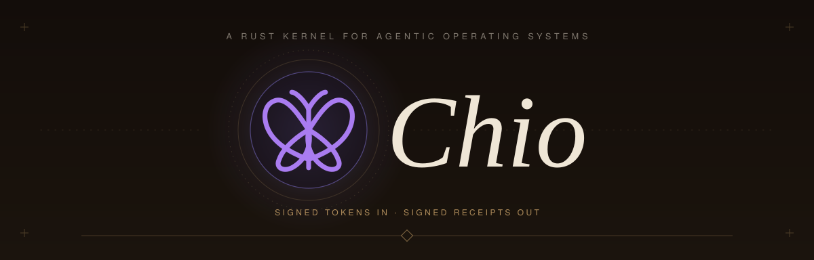
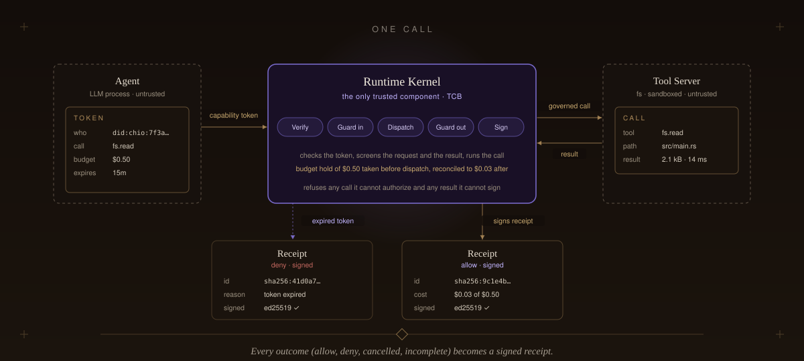
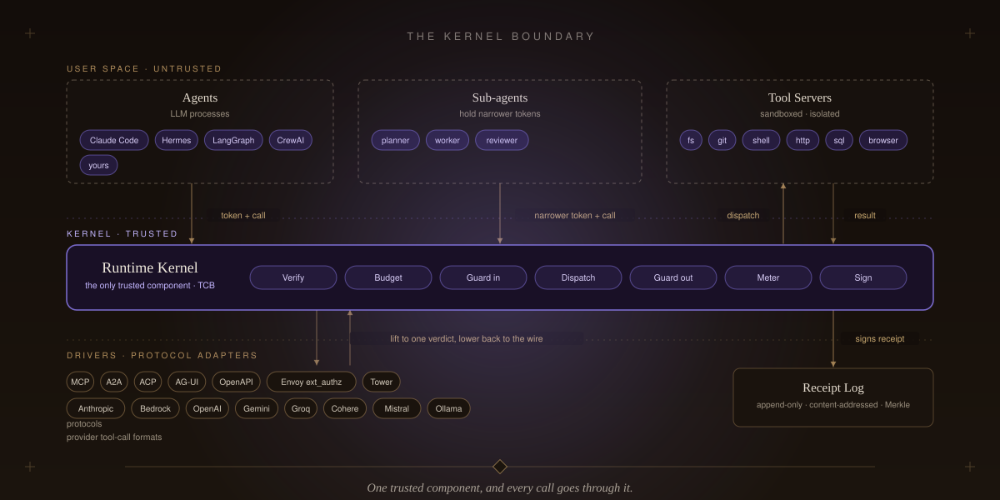
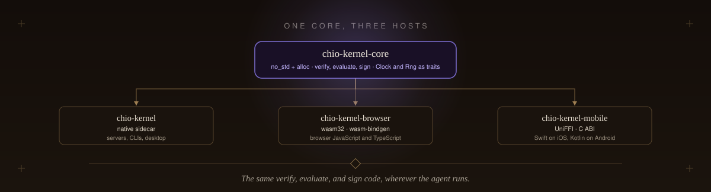
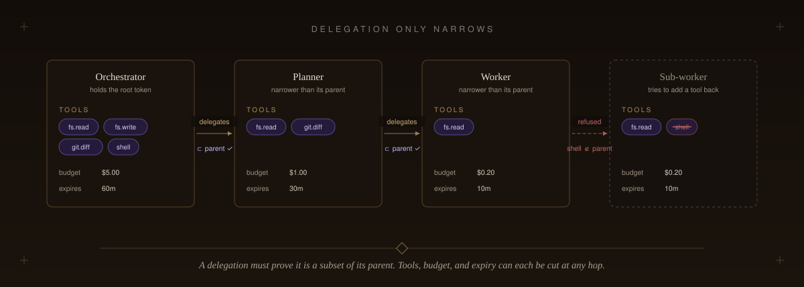
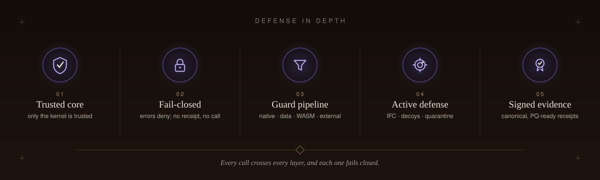

<p align="center">
  <picture>
    <source media="(max-width: 500px)" srcset="docs/assets/hero-mobile.svg" />
    
  </picture>
</p>

<p align="center">
  <a href="LICENSE"></a>
  
  <a href="spec/PROTOCOL.md"></a>
  <a href="docs/README.md"></a>
</p>

<p align="center">
  <strong>The kernel your agents answer to.</strong>
</p>

<p align="center">
  <picture>
    <source media="(max-width: 500px)" srcset="docs/assets/subhead-mobile.svg" />
    
  </picture>
</p>

<p align="center">
  <a href="#what-is-chio">What</a>&nbsp;&nbsp;&middot;&nbsp;&nbsp;
  <a href="#see-it-run">See it run</a>&nbsp;&nbsp;&middot;&nbsp;&nbsp;
  <a href="#why-it-is-a-kernel">Why a kernel</a>&nbsp;&nbsp;&middot;&nbsp;&nbsp;
  <a href="#delegation-and-swarms">Delegation</a>&nbsp;&nbsp;&middot;&nbsp;&nbsp;
  <a href="#the-three-pillars">Pillars</a>&nbsp;&nbsp;&middot;&nbsp;&nbsp;
  <a href="#quickstart">Quickstart</a>&nbsp;&nbsp;&middot;&nbsp;&nbsp;
  <a href="#architecture">Architecture</a>&nbsp;&nbsp;&middot;&nbsp;&nbsp;
  <a href="#integrations-and-sdks">Integrations</a>&nbsp;&nbsp;&middot;&nbsp;&nbsp;
  <a href="#security-and-trust">Security</a>&nbsp;&nbsp;&middot;&nbsp;&nbsp;
  <a href="#formal-verification">Proofs</a>&nbsp;&nbsp;&middot;&nbsp;&nbsp;
  <a href="docs/README.md">Docs</a>&nbsp;&nbsp;&middot;&nbsp;&nbsp;
  <a href="spec/PROTOCOL.md">Spec</a>
</p>

---

```sh
curl -fsSL https://www.chio.computer/install.sh | sh
```

## What is Chio

> MCP tells an agent *how* to call a tool.<br>
> A2A tells agents how to talk to each other.<br>
> **Chio proves what an agent was allowed to do, what it cost, and what happened.**

Chio is a Rust kernel that sits between an AI agent and everything it touches. Every tool
call, file read, API request, and payment goes through it, the same way every syscall goes
through an operating system kernel.

Before an agent can do anything, it presents a [signed token](spec/PROTOCOL.md#5-capability-contract) that says who it is, what it
may call, and how much it may spend. Chio checks the token, runs the call, and writes a
[signed receipt](spec/PROTOCOL.md#6-receipt-contract) of what happened. **If the token does not check out, the call does not run.**

<p align="center">
  <picture>
    <source media="(max-width: 500px)" srcset="docs/assets/one-call-mobile.svg" />
    
  </picture>
</p>

An agent can hand a token to a sub-agent, but only a narrower one. It can drop tools,
shrink the budget, or shorten the expiry. **It cannot add anything back.** Each hop is a signed
[delegation link](crates/core/chio-core-types/src/capability/attenuation.rs) carrying an
[attenuation proof](spec/PROTOCOL.md#capability-attenuation), a basis-point budget split, and
[caveats](crates/core/chio-core-types/src/capability/caveat.rs), and the kernel rechecks the whole
chain against a [Merkle revocation oracle](crates/trust/chio-revocation-oracle) on every call. A swarm of
sub-agents never holds more authority than the agent that spawned it, and
[one hop is shown in full below](#delegation-and-swarms).

Every receipt records what the call cost and who paid. That is enough to give an agent a
balance, [bill it per call](crates/economy/chio-metering), and let agents pay each other for work.
[Markets, credit, and insurance](crates/economy) in Chio are built on those receipts.

Agent swarms, security tooling, and cognition markets are built on those three things: the
token, the kernel, and the receipt.

## See it run

The [local agent workbench](crates/products/chio-workbench/README.md) runs a coding
task through an investigator, editor, and reviewer with kernel-mediated tools,
signed delegation, persistent run history, and a browser interface. The initial
Linux developer preview uses the Claude API and an operator-configured project
check command.

An orchestrator fans out to a researcher and a writer. Each child gets a narrower scope, a
route plan, a slice of the budget pool, and a continuation token bound to the signed task
graph. The [swarm authority](crates/kernel/chio-swarm-authority) verifies all of it before either
child runs, then refuses four tampered versions of the same graph.

```sh
cargo run -p chio-swarm-authority --example agent_os
```

<p align="center">
  <picture>
    <source media="(max-width: 500px)" srcset="docs/assets/swarm-mobile.svg" />
    
  </picture>
</p>

```text
verdict  verified  (3 tasks, 2 continuations, 1 joins, 2 routes)
  researcher   continuation continuation-researcher    witness witness-researcher (1 hop)
  writer       continuation continuation-writer        witness witness-writer (1 hop)

then someone tries to
  add an edge from the writer back to the orchestrator rejected: swarm task graph cycle at task-orchestrator
  hide a hop by understating the writer's depth        rejected: swarm task depth mismatch: task-researcher -> task-writer
  allocate 5,000 units out of a 100 unit pool          rejected: swarm budget allocations exceed pool total
  run the researcher after its task was revoked        rejected: swarm task is revoked: task-researcher
```

The example is [one file of ordinary Rust](crates/kernel/chio-swarm-authority/examples/agent_os.rs)
against the public crate API, and the same verifier runs inside the
[kernel's admission path](spec/PROTOCOL.md#642-swarm-authority-runtime-admission). Swap the two children for a hundred, or for agents
that spawn their own, and the checks do not change.

## Why it is a kernel

An OS kernel is the one piece of code every program has to go through to reach the
hardware. It decides what a process may open, keeps processes away from each other, and
writes the audit log. Chio is that layer for agents, and each part has a direct counterpart.

<p align="center">
  <picture>
    <source media="(max-width: 500px)" srcset="docs/assets/kernel-boundary-mobile.svg" />
    
  </picture>
</p>

| In an operating system | In Chio |
| --- | --- |
| **[Syscalls](crates/kernel/chio-kernel)** | Every tool call, file read, API request, and payment is dispatched by the kernel. An agent never holds a direct handle to a tool. |
| **[Process isolation](spec/PROTOCOL.md#3-components-and-trust-boundaries)** | The kernel is the only trusted component. Agents and tool servers run as untrusted, sandboxed processes, isolated from each other and from the agent. |
| **[Permissions](spec/PROTOCOL.md#5-capability-contract)** | Capability tokens: signed, expiring, budgeted, and only ever narrowable. |
| **[Syscall filters](crates/guards)** | A guard pipeline screens every request and every result. Custom guards run as [fuel-metered WASM](crates/guards/chio-wasm-guards) with no host access. |
| **[Drivers](crates/protocol)** | MCP, A2A, ACP-Client, AG-UI, OpenAPI, and eight provider tool-call formats each lift to the same kernel verdict and lower back to their own wire format. |
| **[Audit log](spec/PROTOCOL.md#6-receipt-contract)** | An append-only, content-addressed receipt log with [Merkle checkpoints](spec/PROTOCOL.md#65-checkpoints). A receipt signed in Rust verifies byte-for-byte in TypeScript, Python, or Go. |
| **[Resource accounting](crates/economy/chio-metering)** | Per-call metering, with a budget hold taken before the call runs and sealed into the receipt. |
| **[Portable core](crates/kernel/chio-kernel-core)** | [`chio-kernel-core`](crates/kernel/chio-kernel-core) is `no_std` and takes its clock and RNG as traits. The same verify, evaluate, and sign code ships as a native sidecar, in the [browser over wasm](crates/kernel/chio-kernel-browser), and on [iOS and Android over UniFFI](crates/kernel/chio-kernel-mobile). |
| **[Verified core](formal/lean4)** | The admission path (verify, resolve, evaluate, sign) is modeled in Lean 4 with a [published assumption boundary](docs/formal/COVERAGE.md). |

<p align="center">
  <picture>
    <source media="(max-width: 500px)" srcset="docs/assets/portable-core-mobile.svg" />
    
  </picture>
</p>

## Why build on it

- **You do not write permissions, delegation, audit, metering, or billing for your agent system.** The kernel does them, and they behave the same over every protocol and provider it speaks.
- **Sub-agents cannot escalate.** A swarm holds at most the authority of the agent that spawned it, because every [delegation proves it is a subset of its parent](spec/PROTOCOL.md#capability-attenuation).
- **Actions leave a receipt that verifies offline.** Anyone with the public key can [check what an agent did](examples/hello-receipt-verify) without access to your runtime.
- **Agents can pay each other.** [Metering, budgets, markets, credit, and insurance](docs/guides/ECONOMIC-LAYER.md) clear on receipts the kernel already writes, and [two agents procuring a service](examples/agent-commerce-network) is a worked example.
- **The model, the framework, and the tool servers are all swappable.** The kernel and the receipts do not change when you change any of them. See the [protocol adapters](crates/protocol) and [integrations](#integrations-and-sdks).
- **Deny is the default.** A token that does not verify, a budget that cannot be held, or a result that cannot be signed is a call that does not run.

## Delegation and swarms

Every sub-agent in a swarm runs on a token derived from its parent's. The derivation can drop
tools, shrink the budget, or shorten the expiry, and nothing can be added back.

<p align="center">
  <picture>
    <source media="(max-width: 500px)" srcset="docs/assets/attenuation-mobile.svg" />
    
  </picture>
</p>

Each hop is a signed link that the kernel rechecks on every call the child makes.

<p align="center">
  <picture>
    <source media="(max-width: 500px)" srcset="docs/assets/hop-mobile.svg" />
    
  </picture>
</p>

| The attack | What stops it |
| --- | --- |
| Claiming a bigger parent scope than the delegate was given | The parent scope hash must equal the [last link in the chain](spec/PROTOCOL.md#capability-attenuation). The subset witness has a [Lean 4 soundness theorem](formal/lean4/Chio/Chio/Proofs/AttenuationWitness.lean) and a [conformance fixture](crates/tooling/chio-conformance/tests/attenuation_witness_rejects_inflated_parent_scope.rs) for this exact case. |
| Two children together outspending their parent | Budgets split in basis points, and a [per-parent registry](spec/PROTOCOL.md#sibling-sum-budget-enforcement-w12) rejects oversubscribed siblings at every level of the tree. |
| A revoked ancestor's workers carrying on | Every ancestor is checked against a [Merkle revocation oracle](crates/trust/chio-revocation-oracle) with signed epoch roots. One revocation cuts off the whole subtree beneath it. |
| A leaked token replayed somewhere else | [Caveats](crates/core/chio-core-types/src/capability/caveat.rs) bind the token to a session, an audience, a region, or a time window. |
| A broken signature scheme | Ed25519 today, with a [hybrid ML-DSA-65 mode](crates/core/chio-core-types/src/pq.rs) where post-quantum is required. |

For recursive swarms, the [swarm authority](crates/kernel/chio-swarm-authority) verifies the whole task graph before a child task runs. The [example above](crates/kernel/chio-swarm-authority/examples/agent_os.rs) builds one end to end.

| | |
| --- | --- |
| **[Task graph](crates/kernel/chio-swarm-authority/README.md)** | One root, acyclic, bounded depth and fan-out, and a delegation witness covering every edge exactly once. |
| **[Continuation tokens](spec/PROTOCOL.md#642-swarm-authority-runtime-admission)** | Each is bound to the graph's canonical hash, its witness chain, a route-plan receipt, a live budget allocation, and the current revocation epoch. |
| **[Pooled budgets](crates/kernel/chio-swarm-authority/README.md)** | Allocations roll up against a shared pool with checked arithmetic, so the workers cannot spend more than the orchestrator was given. |

## The three pillars

<p align="center">
  <picture>
    <source media="(max-width: 500px)" srcset="docs/assets/pillars-mobile.svg" />
    
  </picture>
</p>

Three layers on one proof spine: every capability, decision, and payment resolves to a signed
receipt.

### Proofs

> Signed, attenuating capabilities go in. Forgery-resistant, independently verifiable receipts
> come out.

| Primitive | What it does |
| --- | --- |
| **[Attenuated capabilities](spec/PROTOCOL.md#capability-attenuation)** | Ed25519-signed, time-bounded, budgeted tokens. Delegation proves it is a subset of its parent, so authority can only narrow, never widen. Post-quantum hybrid (ML-DSA-65) is supported. |
| **[Forgery-resistant receipts](spec/PROTOCOL.md#wysiwys-signing-invariant)** | Receipt identity is the hash of its own canonical content; the kernel recomputes that hash before signing and refuses on mismatch. `allow`, `deny`, `cancelled`, and `incomplete` are each signed. |
| **[A verifiable log](spec/PROTOCOL.md#65-checkpoints)** | A content-addressed receipt DAG committed in RFC 6962 Merkle checkpoints. Canonical JSON (RFC 8785) makes a receipt signed in Rust verify byte-for-byte in TypeScript, Python, or Go. |
| **[A Lean-4 modeled core](formal/lean4)** | The pure admission core (verify, resolve, evaluate, sign) is mechanically modeled with a published assumption boundary. |

### Governance

> Policy, identity, and delegated authority are native to the protocol, not bolted on.

| Primitive | What it does |
| --- | --- |
| **[Policy that compiles to guards](crates/guards/chio-policy)** | HushSpec YAML (allow / warn / deny, with inheritance) compiles directly into native guards. No external policy engine. |
| **[A guard pipeline you can sandbox](crates/guards/chio-guards)** | Forbidden-path, egress/SSRF, secret and PII/PHI, velocity, data-flow, jailbreak, and semantic SQL/vector checks. Custom guards run as fuel-metered WASM with no host access; cloud guardrails attach behind circuit breakers. |
| **[Self-certifying identity](crates/trust/chio-did)** | A `did:chio` is the agent's Ed25519 key: no registry, no CA. Agent Passports and BBS+ selective disclosure travel with the agent and verify with no storage dependency. |
| **[Authority without a central issuer](crates/trust/chio-federation)** | Federation shares trust evidence while each operator activates locally. Governance charters, capability leases, and threshold multi-party approvals bind who may do what, to which request, for how long. |
| **[One verifier for provenance](crates/trust/chio-attest-verify)** | A single fail-closed Sigstore verifier gates guard artifacts, signed model cards, and attestations; revocation is a signed sparse-Merkle oracle. |

### Economic protocol

> Every tool call is a priced, budgeted, metered transaction that settles into a signed receipt.

| Capability | What it does |
| --- | --- |
| **[Metering and budgets](crates/economy/chio-metering)** | Per-call compute, data, and API cost, with durable pre-execution budget holds against a capability's caps, sealed into signed economic receipt metadata. |
| **[Proof-carrying commerce](docs/guides/ECONOMIC-LAYER.md)** | One signed receipt binds what was authorized, how it was priced, what it metered, and how it settled, so credit and insurance decisions cite prior signed truth. |
| **[Markets, credit, and insurance](crates/economy/chio-market)** | Discoverable service markets with open bidding and reputation-tiered pricing, credit lines and bonded execution, and liability underwriting and insurance. |
| **[Settlement and anchoring](crates/economy/chio-settle)** | On-chain settlement with cross-chain checkpoint anchoring across EVM, Bitcoin, and Solana, backed by the Chio settlement contracts. |

## Quickstart

Bond Claude Code to a policy in one line, then verify everything it did.

### 1. Install

```sh
curl -fsSL https://www.chio.computer/install.sh | sh
```

<sub>Or from source: <code>git clone https://github.com/backbay-labs/chio.git && cd chio && cargo build --release -p chio-cli</code></sub>

### 2. Put Claude or Hermes under policy

Coding agents reach their file, shell, and git tools over MCP. Wrap that server with Chio so
every call is checked by the kernel and sealed into a signed receipt. The bundled `code-agent`
preset is a safe starting policy: reads are allowed, writes to `.env`, `.git/`, and `.ssh/` are
denied, and so is `git push --force`.

**Claude Code** registers the wrapped server in one line:

```sh
claude mcp add fs -- \
  chio --receipt-db ./chio.db mcp serve --preset code-agent --server-id fs -- \
  npx -y @modelcontextprotocol/server-filesystem .
```

**Hermes** wraps the same server through its config. Add this under `mcp_servers` in
`~/.hermes/config.yaml`, then run `hermes mcp test chio` to confirm the edge is live:

```yaml
mcp_servers:
  chio:
    command:
      - chio
      - --receipt-db
      - ./chio.db
      - mcp
      - serve
      - --preset
      - code-agent
      - --server-id
      - fs
      - --
      - npx
      - "-y"
      - "@modelcontextprotocol/server-filesystem"
      - "."
    transport: stdio
```

The `--server-id fs` must stay `fs`: the `code-agent` preset only grants capabilities to the
`fs`, `shell`, and `git` server ids, so any other id fail-closes every call.

Either way, you use the agent exactly as before; every tool call it routes through that server
is now checked against policy and sealed into a receipt.

To govern an entire session, including the agent's native tools, install the host plugin.

**Claude Code** ([chio-claude-code-plugin](https://github.com/backbay-labs/chio-claude-code-plugin)) installs from the marketplace, then bond a session with `/chio:bond <policy>`:

```sh
claude plugin marketplace add backbay-labs/chio-claude-code-plugin
claude plugin install chio@chio
```

**Hermes** ([chio-hermes](docs/integrations/HERMES.md)) is not yet published to PyPI;
until it ships, follow the source install in the integration guide.

Enable the plugin and select its toolset in `~/.hermes/config.yaml` (the `toolsets` entry is
required, otherwise the `chio_*` tools never surface):

```yaml
plugins:
  enabled:
    - chio
toolsets:
  - chio
```

`hermes setup` does not prompt for entry-point plugins, so set the sidecar URL and capability id
yourself, or write them to `~/.hermes/.env`. Mint the capability with `hermes chio issue`:

```sh
export CHIO_SIDECAR_URL=http://127.0.0.1:9090
export CHIO_CAPABILITY_ID=<id from `hermes chio issue --json`>
```

### 3. Read the receipts

```sh
chio --receipt-db ./chio.db receipt list    --admin-all --limit 20
chio --receipt-db ./chio.db receipt explain <receipt-id> --admin-all
```

Every decision (allow, deny, cancelled, incomplete) is a signed, content-addressed receipt you
can verify offline.

### 4. Dry-run a policy, no agent required

```sh
chio init my-agent && cd my-agent

# allowed by the starter policy
chio --receipt-db ./chio.db --session-db ./session.db \
  check --policy policy.yaml --server hello --tool hello_world --params '{}'

# anything out of scope is denied, fail-closed
chio --receipt-db ./chio.db --session-db ./session.db \
  check --policy policy.yaml --server hello --tool drop_tables --params '{}'
```

The session database backs durable admission, which is on by default in the scaffold policy;
without it the kernel refuses to evaluate.

`chio init` scaffolds a project with an editable HushSpec `policy.yaml`; `chio check` evaluates
one tool call against it and prints the verdict.

### 5. Prove the agent's standing to a counterparty

```sh
# Mint an Agent Passport from the agent's signed receipt history
chio passport create --subject-public-key <agent-key> --signing-seed-file ./agent.seed --output passport.json

# A relying party evaluates it against their own bar, then admits or rejects the agent
chio passport evaluate --input passport.json --policy verifier-policy.yaml
```

An Agent Passport bundles the agent's `did:chio` identity and a signed reputation credential
built from its receipts. A counterparty verifies it with no shared server and, on accept, mints
it a scoped capability with `chio trust federated-issue`. This is how reputation and admission
cross operator boundaries.

### 6. Budget, meter, and settle

A capability caps what the agent may spend, and the kernel holds funds before each call and
denies anything over budget. Add ceilings to your policy (amounts in minor units, e.g. cents):

```yaml
# policy.yaml, under `rules:`
velocity:      { enabled: true, max_spend_per_window: 50000, window_secs: 60 }
human_in_loop: { enabled: true, approve_above: 15000, approve_above_currency: USD }
```

Every metered call records its cost in the receipt. Inspect spend and settlement:

```sh
chio --receipt-db ./chio.db receipt list --admin-all --min-cost 1 --cost-currency USD
chio settle status --store ./chio.db                                # pending, settled, dead-lettered
```

For a full market with buyers, providers, budgets, and settlement, run
[`examples/agent-commerce-network`](examples/agent-commerce-network).

---

**More:** `chio mcp serve-http` (hosted HTTP edge with OAuth/OIDC) &middot; `chio api` (zero-code
reverse proxy for any OpenAPI service) &middot; `chio federation` (cross-kernel treaties and
quorum) &middot; `chio trust` (revocation and trust-plane state).

More ways in: [import an existing MCP setup](docs/guides/ADOPT-EXISTING-MCP.md),
[migrate a coding agent from MCP](docs/guides/MIGRATING-FROM-MCP.md),
[run LangChain tools through the kernel with verified receipts](examples/langchain-kernel),
[add Chio to LangChain, LangGraph, CrewAI, or AutoGen](sdks/python),
[protect a web backend](docs/guides/WEB_BACKEND_QUICKSTART.md),
[author a native tool server](docs/start-here/NATIVE_ADOPTION_GUIDE.md),
[deploy to Kubernetes, Lambda, or Envoy](sdks/k8s),
[write a custom WASM guard](sdks/guard), or follow the
[progressive tutorial](docs/start-here/PROGRESSIVE_TUTORIAL.md).

## Architecture

Chio is layered around a single trusted core. External ecosystems enter through protocol
edges that turn them into governed tool servers. The **Runtime Kernel** mediates every call
and is the only trusted component. A **trust plane** (identity, credentials, federation,
governance) and an **economy plane** (metering, budgets, settlement) draw on the receipts the
kernel signs, and every decision is committed to the **Receipt Log**.

<p align="center">
  <picture>
    <source media="(max-width: 500px)" srcset="docs/assets/architecture-mobile.svg" />
    
  </picture>
</p>

Only the Runtime Kernel is trusted (the TCB). The agent and tool servers are untrusted and
isolated, so a compromised agent or tool server cannot forge authorization or a receipt, and
any registry or artifact mismatch fails closed.

### Life of a tool call

<p align="center">
  <picture>
    <source media="(max-width: 500px)" srcset="docs/assets/lifecycle-mobile.svg" />
    
  </picture>
</p>

| Step | What happens |
| --- | --- |
| **1 &middot; Present** | The agent calls a tool and presents a capability token (Ed25519-signed, time-bounded, scoped) rather than ambient credentials. |
| **2 &middot; Verify** | The kernel runs the full capability check: signature and expiry, target within granted scope, delegation attenuates (the child scope is a proven subset of its parent), neither the capability nor any ancestor is revoked, and DPoP when the grant requires it. |
| **3 &middot; Budget** | If the grant carries monetary caps, the kernel places a durable pre-execution hold. An over-budget call is denied before anything runs. |
| **4 &middot; Guard (in)** | Input guards run in sequence over the parameters (forbidden paths, egress and SSRF, secrets, velocity, data-flow, jailbreak, semantic data checks). Any deny denies the call. |
| **5 &middot; Dispatch** | Only the kernel dispatches to the tool server. The agent never holds a handle to it. |
| **6 &middot; Guard (out)** | The result passes back through output and post-invocation guards (PII/PHI sanitization, anomaly and data-transfer checks). |
| **7 &middot; Meter and sign** | The kernel reconciles the budget hold to actual cost, assembles the receipt (decision, policy hash, guard evidence, economic metadata), recomputes the content hash inside its trust boundary, and signs it. A call it cannot sign is not allowed. |
| **8 &middot; Commit** | The receipt is written to the content-addressed log and folded into a Merkle checkpoint, where its evidence is available to the trust and economy planes. |

Every outcome (`allow`, `deny`, `cancelled`, `incomplete`) produces a signed receipt.

### The codebase

The workspace ships 100+ crates across 11 groups.

| Group | What lives there |
| --- | --- |
| `core` | Shared types (capabilities, receipts, canonical JSON, signing), errors, adversarial suite |
| `kernel` | Capability validation, guard pipeline, receipt signing, runtime and platform variants |
| `guards` | Native, data-layer, WASM, and external guards, plus HushSpec policy and the guard registry |
| `protocol` | The 27 protocol and provider edges (MCP, A2A, ACP-Client, AG-UI, OpenAPI, provider dialects, Tower, Envoy) |
| `economy` | Metering, budgets, pricing, markets, credit, settlement, anchoring, web3 bindings |
| `trust` | `did:chio`, credentials and passports, federation, governance, reputation, attestation, TEE, model cards |
| `observability` | SIEM export, lineage, log redaction, metrics, OTel receipt export |
| `platform` | Control plane, stores, signed manifests, config, workflow, HTTP and session primitives |
| `products` | The `chio` CLI, API Protect, Chio-Wall, MERCURY, Proof Room |
| `sdk` | Guard-authoring SDK, FFI bindings, receipt evaluation helpers |
| `tooling` | Conformance suite, spec codegen and validation, LSP, test support |

The crates most users touch are the `chio` CLI (`chio-cli`), `chio-api-protect` (a zero-code
reverse proxy that protects HTTP APIs with Chio receipts), and the libraries `chio-kernel`,
`chio-policy`, and `chio-guards`. The full crate map and component detail live in
[AGENTS.md](AGENTS.md) and [docs/architecture/](docs/architecture/).

## Integrations and SDKs

One kernel. Every major agent-interop protocol, eight provider tool-call dialects, eight
language SDKs, and 60+ framework, runtime, and infrastructure integrations. Chio wraps
existing ecosystems instead of replacing them: MCP, A2A, ACP-Client, AG-UI, OpenAPI, and provider
tool formats become governed Chio tool servers, while the kernel keeps dispatch and receipt
authority for the surfaces it mediates.

| Layer | Surfaces |
| --- | --- |
| **Protocols** | MCP &middot; A2A &middot; ACP-Client &middot; AG-UI &middot; OpenAPI&rarr;MCP &middot; Envoy/Istio `ext_authz` &middot; Tower |
| **Provider dialects** | Anthropic &middot; Bedrock &middot; OpenAI\* &middot; Gemini &middot; Groq &middot; Cohere &middot; Mistral &middot; Ollama |
| **Agent frameworks** | Hermes &middot; LangChain &middot; LangGraph &middot; LlamaIndex &middot; CrewAI &middot; AutoGen &middot; Vercel AI SDK |
| **Language SDKs** | TypeScript &middot; Python &middot; Go &middot; Rust &middot; C++ &middot; JVM/Kotlin &middot; Swift &middot; .NET |
| **Web and runtime** | FastAPI &middot; Django &middot; Next.js &middot; Express &middot; Fastify &middot; Elysia &middot; Spring Boot &middot; ASP.NET &middot; Cloudflare Workers &middot; Vercel Edge &middot; Deno |
| **Data and orchestration** | Temporal &middot; Airflow &middot; Dagster &middot; Prefect &middot; Ray &middot; Flink &middot; Kafka/NATS |
| **Infra and mesh** | Kubernetes &middot; AWS Lambda &middot; AWS Bedrock Marketplace &middot; VS Code &middot; Zed |
| **Agent and chat plugins** | Claude Code &middot; Cursor &middot; Codex &middot; OpenCode &middot; OpenClaw (Slack/Discord/Telegram) |

<sub>\* OpenAI interception is implemented; outbound execution is deferred (trace-only, not authoritative). Anthropic and Bedrock are the release-qualified providers.</sub>

<details>
<summary><strong>Full integration matrix (60+ surfaces)</strong></summary>

#### Protocols and transports (`crates/protocol/`)

| Surface | Package | What it does | Status |
| --- | --- | --- | --- |
| MCP adapter | `chio-mcp-adapter` | Wraps external MCP servers as Chio tool servers | Shipping |
| MCP edge | `chio-mcp-edge` | Exposes Chio tools over MCP (stdio JSON-RPC) | Shipping |
| MCP registry server | `integrations/mcp-adapter` | Registry-listed MCP server: Streamable HTTP, OAuth 2.1 + PKCE, RFC 9728 metadata, receipt emission | Shipping |
| Hosted / Remote MCP | `chio-hosted-mcp`, `chio-mcp-remote` | Hosted and remote MCP runtime surfaces | Shipping |
| A2A adapter | `chio-a2a-adapter` | A2A to Chio: agent-card discovery + `SendMessage` mediation | Shipping |
| A2A edge | `chio-a2a-edge` | Exposes Chio tools as blocking A2A skills | Shipping |
| ACP-Client edge | `chio-acp-edge` | Exposes Chio tools as ACP-Client capabilities with bridge-fidelity assessment | Shipping |
| ACP-Client proxy | `chio-acp-proxy` | Enforces Chio access control on ACP-Client agent sessions | Shipping |
| AG-UI proxy | `chio-ag-ui-proxy` | Capability-validated interception of agent-to-UI event streams | Shipping |
| OpenAPI | `chio-openapi` | OpenAPI 3.x spec parser to Chio tool manifest | Shipping |
| OpenAPI to MCP | `chio-openapi-mcp-bridge` | Exposes Chio-governed HTTP APIs as MCP tool surfaces | Shipping |
| Cross-protocol | `chio-cross-protocol` | Shared cross-protocol bridge contracts + orchestrator | Shipping |
| Tower middleware | `chio-tower` | Rust Tower middleware for capability validation + receipt signing | Shipping |
| Envoy `ext_authz` | `chio-envoy-ext-authz` | Service-mesh gRPC adapter bridging external authz to the kernel | Shipping |

#### Provider tool-call dialects (`crates/protocol/`)

Each adapter follows a lift to kernel-verdict to lower pipeline over a real HTTP transport with hermetic mock-server tests.

| Provider | Package | Status |
| --- | --- | --- |
| Anthropic (Messages tool-use) | `chio-anthropic-tools-adapter` | Shipping, release-qualified |
| AWS Bedrock (Converse) | `chio-bedrock-converse-adapter` | Shipping, release-qualified |
| OpenAI (Chat + Responses) | `chio-openai-adapter` | In-progress: interception only, execution deferred |
| Google Gemini | `chio-gemini-tools-adapter` | Built; not yet release-qualified |
| Groq | `chio-groq-tools-adapter` | Built; not yet release-qualified |
| Cohere | `chio-cohere-tools-adapter` | Built; governance-deferred |
| Mistral | `chio-mistral-tools-adapter` | Built; governance-deferred |
| Ollama | `chio-ollama-tools-adapter` | Built; not yet release-qualified |

#### Agent frameworks

| Framework | Package | Status |
| --- | --- | --- |
| Hermes Agent (NousResearch) | `chio-hermes` ([HERMES.md](docs/integrations/HERMES.md)) | Shipping (pre-1.0) |
| LangChain | `chio-langchain` | Shipping |
| LangGraph | `chio-langgraph` | Shipping |
| LlamaIndex | `chio-llamaindex` | Shipping |
| CrewAI | `chio-crewai` | Shipping |
| AutoGen | `chio-autogen` | Shipping |
| Vercel AI SDK (+ middleware) | `@chio-protocol/ai-sdk`, `@chio-protocol/ai-sdk-middleware` | Shipping |
| Agent observability | `chio-observability` (LangSmith / LangFuse spans) | Shipping |

#### Language SDKs (`sdks/`)

| Language | Package(s) | Status |
| --- | --- | --- |
| TypeScript | `@chio-protocol/sdk` | Shipping |
| Python | `chio-sdk` (in-process), `chio-sdk-python` (sidecar), `chio-adapter-base` | Shipping |
| Go | `chio-go` (in-process), `chio-go-http` (wire + `net/http` middleware) | Shipping |
| Rust | workspace crates + `chio-tower` | Shipping |
| C++ | `chio-cpp`, `chio-cpp-kernel`, `chio-drogon` (web middleware) | Shipping |
| JVM / Kotlin | `chio-sdk-jvm`, `chio-spring-boot`, `chio-streaming-flink`, `chio-kernel-mobile` (Android) | Shipping |
| Swift / iOS | Chio Swift SDK (`ChioKernel.xcframework`, App Attest) | Shipping |
| .NET | `Backbay.Chio.Middleware` (ASP.NET Core) | Shipping |
| Mobile (RN / Expo) | `@chio-protocol/mobile` | Shipping |

#### Guard-authoring SDKs (sandboxed WASM guest components)

| Language | Package | Status |
| --- | --- | --- |
| Rust (canonical) | `chio-guard-sdk` (+ macros) | Shipping |
| Python | `chio-guard-py` | Shipping |
| Go | `chio-guard-go` | Shipping |
| C++ | `chio-guard-cpp` | Shipping |
| TypeScript | `chio-guard-ts` | Shipping |

#### Web and runtime middleware

| Runtime | Package | Status |
| --- | --- | --- |
| FastAPI / ASGI / Django | `chio-fastapi`, `chio-asgi`, `chio-django` | Shipping |
| Next.js / Express / Fastify | `@chio-protocol/next`, `@chio-protocol/express`, `@chio-protocol/fastify` | Shipping |
| Elysia (Bun) | `@chio-protocol/elysia` | Shipping |
| Spring Boot / ASP.NET / Drogon | `chio-spring-boot`, `Backbay.Chio.Middleware`, `chio-drogon` | Shipping |
| Cloudflare Workers / Vercel Edge / Deno | `@chio-protocol/workers`, `@chio-protocol/edge`, `@chio-protocol/deno` | Shipping |
| Browser / Passkey | `@chio-protocol/browser`, `@chio-protocol/passkey` | Shipping |
| Scaffolder | `create-chio-app` | Shipping |

#### Data, orchestration, and infrastructure

| Surface | Package | Status |
| --- | --- | --- |
| Temporal / Airflow / Dagster / Prefect / Ray | `chio-temporal`, `chio-airflow`, `chio-dagster`, `chio-prefect`, `chio-ray` | Shipping |
| Apache Flink | `chio-streaming-flink` | Shipping |
| Streaming (Kafka, NATS, Pulsar, EventBridge, Pub/Sub, Redis) | `chio-streaming` | Shipping |
| Infrastructure-as-Code (Terraform, Pulumi) | `chio-iac` | Shipping |
| Kubernetes (controller, CRDs, webhooks) | `sdks/k8s` | Shipping |
| AWS Lambda (Rust + Python) | `chio-lambda-extension`, `chio-lambda-python` | Shipping |
| AWS Bedrock Marketplace | `chio-bedrock-control-plane` (`us-east-1`) | Shipping |
| Editors | `vscode-chio`, `zed-chio` (LSP-backed) | Shipping |

#### Products (`crates/products/`)

| Product | Package | What it is |
| --- | --- | --- |
| `chio` CLI | `chio-cli` | Operator binary: `check`, `mcp serve`, `trust serve`, `replay`, receipt inspection |
| API Protect | `chio-api-protect` | Zero-code reverse proxy: OpenAPI in, default policy, signed receipts out |
| Chio-Wall | `chio-wall` | Bounded control-path packages and evidence bundles |
| MERCURY | `chio-mercury` | Typed evidence contracts layered on receipt truth |
| Proof Room | `chio-proof-room` | Standalone verifier dashboard (Docker quickstart) |

</details>

### Ecosystem and plugins

Beyond this repository, the [`backbay-labs`](https://github.com/backbay-labs) org ships
companion plugins that bond an agent, IDE, or chat platform to a Chio policy. Each is a
separate repo built on the shared `@chio/bridge` library and the `chio` CLI, so any host can
mediate every tool call through the kernel and stream signed receipts.

| Plugin | Repo | What it does |
| --- | --- | --- |
| **Claude Code** | [chio-claude-code-plugin](https://github.com/backbay-labs/chio-claude-code-plugin) | Bonds any Claude Code session; mediates Bash/Write/Edit/Read and every MCP server, metered and receipt-signed |
| **Cursor** | [chio-cursor-plugin](https://github.com/backbay-labs/chio-cursor-plugin) | Bonds Composer, the Agent tab, inline AI, and mounted MCP servers via native Cursor hooks |
| **Codex** | [chio-codex-plugin](https://github.com/backbay-labs/chio-codex-plugin) | Bonds the OpenAI Codex CLI plan-then-act loop through the guard pipeline, with attested plans |
| **OpenCode** | [chio-open-code-plugin](https://github.com/backbay-labs/chio-open-code-plugin) | Native OpenCode TUI plugin: scaffold, wrap, and ship bonded agents |
| **OpenClaw** | [chio-open-claw-plugin](https://github.com/backbay-labs/chio-open-claw-plugin) | A hosted Chio edge in Slack, Discord, and Telegram: mention to propose a policy, passkey-countersign, then a bonded agent streams receipts to the thread |

Two demos worth a look: [chio-showcase](https://github.com/backbay-labs/chio-showcase) (an
"Internet of Agents" demo of four organizations transacting through Chio-mediated agent
commerce) and
[chio-hedge-fund-demo](https://github.com/backbay-labs/chio-hedge-fund-demo) (one sentence in
Claude Code becomes a bonded operator placing budget-gated paper trades with verifiable
receipts).

## Security and trust

<p align="center">
  <picture>
    <source media="(max-width: 500px)" srcset="docs/assets/security-mobile.svg" />
    
  </picture>
</p>

The kernel is the entire trusted base. Around it, five layers of defense, each one fail-closed:

- **Trusted core.** Only the Runtime Kernel is trusted (the TCB). The agent and tool servers are
  untrusted and isolated, and the kernel never leaks its address or signing key.
- **Fail-closed by construction.** Errors deny access, invalid policy is rejected at load, and
  the kernel will not allow a call it cannot also sign a receipt for.
- **Guard pipeline.** Native, data-layer, sandboxed WASM, and external guards screen every input
  and output before it crosses a trust boundary.
- **Active defense.** Information-flow control, deception (canary capabilities and honey-tools),
  and reversible quarantine correlate and contain anomalous behavior.
- **Signed evidence.** Every decision is sealed into a canonical-JSON (RFC 8785),
  post-quantum-ready receipt, so receipts and attestations verify byte-for-byte across languages.

### The threat model

[spec/SECURITY.md](spec/SECURITY.md) names twenty threats, each with its shipped controls,
required mitigations, and residual risk. Eight of them:

| Threat | What stops it |
| --- | --- |
| [Capability token theft](spec/SECURITY.md#21-capability-token-theft) | Tokens are bound to a subject key, expire, and can require DPoP proof of possession. Revocation is an epoch-rooted Merkle oracle every ancestor is checked against. |
| [Kernel impersonation](spec/SECURITY.md#22-kernel-impersonation) | Receipts verify against a pinned kernel key, and the kernel recomputes a receipt's content hash inside its trust boundary before signing. |
| [Tool server escape](spec/SECURITY.md#23-tool-server-escape) | Tool servers run as sandboxed processes with no handle to the kernel or to each other. Only the kernel dispatches. |
| [Delegation chain abuse](spec/SECURITY.md#26-delegation-chain-abuse) | Scope-hash chain binding, the sibling-sum budget registry, and ancestor revocation checks, covered in [Delegation and swarms](#delegation-and-swarms). |
| [SSRF via the HTTP substrate](spec/SECURITY.md#27-ssrf-via-http-substrate) | Every outbound target passes a declared [egress contract](crates/protocol/chio-egress-contract). A missing or invalid contract fails closed. |
| [PII and PHI in responses](spec/SECURITY.md#28-piiphi-exposure-in-responses) | Response sanitization guards redact secrets, PII, and internal data from tool results before they reach the agent. |
| [WASM guard resource exhaustion](spec/SECURITY.md#212-wasm-guard-resource-exhaustion) | Custom guards run [fuel-metered with no host access](crates/guards/chio-wasm-guards). |
| [Post-quantum signature downgrade](spec/SECURITY.md#213-post-quantum-signature-downgrade) | Hybrid Ed25519 and ML-DSA-65 signatures, with verifiers dispatching from the signature prefix and rejecting a mismatched algorithm hint. |

Coverage state per threat is generated into
[docs/security/threat-coverage.md](docs/security/threat-coverage.md), with a conformance test
and an adversarial corpus case behind each row.

### How it is attacked on purpose

- **A guard pipeline of 26 named guards** in [`chio-guards`](crates/guards/chio-guards): forbidden
  paths, shell commands, egress allowlists, internal networks, secret leaks, prompt injection,
  jailbreaks, data flow, velocity, behavioral sequences, patch integrity, computer use, and browser
  automation among them. Any deny denies the call.
- **An adversarial corpus.** [`chio-adversarial-suite`](crates/core/chio-adversarial-suite) is a
  curated set of malicious but well-formed cases, grouped by attack class, that downstream test
  suites use as a deny answer key.
- **A coliseum.** [`chio-arena`](crates/core/chio-arena) runs scenarios against a real kernel,
  mutates and co-evolves adversary populations against the guard pipeline, and promotes the
  failures into the corpus.
- **Fuzzing.** 28 fuzz targets run under ClusterFuzzLite on every pull request and in batch, with
  crash triage and corpus sync as separate workflows. See [`fuzz`](fuzz).
- **Timing leaks.** dudect harnesses check constant-time behavior for signature-byte equality
  and scope subset checks. See [`tests/dudect`](crates/kernel/chio-kernel-core/tests/dudect).
- **Replay.** `chio replay` re-evaluates a captured receipt log against the current build, and a
  replay gate runs in CI.
- **Supply chain.** cargo-vet audits and cargo-deny bans, advisories, and licenses are required
  checks on `main`. See [`supply-chain`](supply-chain) and [`deny.toml`](deny.toml).

Report vulnerabilities privately per [SECURITY.md](SECURITY.md).

## Formal verification

Chio has an implementation-linked verified core, defined in
[`formal/proof-manifest.toml`](formal/proof-manifest.toml). The admission path the kernel runs
on every call, verify, resolve, evaluate, sign, is modeled in Lean 4, and the model is tied to
the production Rust instead of sitting beside it. Every explicit axiom in the Lean tree is a
named cryptographic idealization in [`formal/assumptions.toml`](formal/assumptions.toml). No
serializer, protocol, or kernel behavior is axiomatized.

<p align="center">
  <picture>
    <source media="(max-width: 500px)" srcset="docs/assets/proofs-mobile.svg" />
    
  </picture>
</p>

### What is proved

Each property has bounded Lean proofs over the verified-core model. The bounds and the
assumptions each one relies on are in the [claim registry](docs/reference/CLAIM_REGISTRY.md).

| | Property | What the proofs say |
| --- | --- | --- |
| **P1** | [Capability attenuation](formal/lean4/Chio/Chio/Proofs/Monotonicity.lean) | A delegated scope is a subset of its parent, the attenuation witness is sound under chain binding, and sibling shares cannot sum past the parent's share. |
| **P2** | [Revocation](formal/lean4/Chio/Chio/Proofs/Revocation.lean) | A revoked token, or a revoked presented ancestor, cannot pass the pure revocation and evaluation model. Runtime revocation stores are qualified separately. |
| **P3** | [Fail-closed evaluation](formal/lean4/Chio/Chio/Proofs/Evaluation.lean) | The pure evaluator is total and fails closed on an invalid signature, an expired window, a revocation, or an out-of-scope request. |
| **P4** | [Receipt integrity](formal/lean4/Chio/Chio/Proofs/MerkleWalk.lean) | Within the published eight-leaf bound, the inclusion-proof walk Rust relying parties execute refines the proved model, with collision resistance under ASSUME-SHA256. Concrete hashing and signing are runtime-qualified. |
| **P5** | [Delegation chains](formal/lean4/Chio/Chio/Proofs) | Structural theorems for the presented-chain model. |
| **P6** | [Parent links](formal/lean4/Chio/Chio/Proofs) | An observed local parent edge implies a parent request existed in the same authenticated session. |
| **P7** | [Receipt lineage](formal/lean4/Chio/Chio/Proofs/Receipt.lean) | Verified lineage requires verified receipts, a trusted kernel signature, and signed linkage. |
| **P8** | [Session continuity](formal/lean4/Chio/Chio/Proofs) | Verified continuity requires a valid session anchor and a continuation artifact. |
| **P9** | [Call-chain consistency](formal/lean4/Chio/Chio/Proofs) | Verified call chains require consistent subjects and parent capability references. |
| **P10** | [Report truthfulness](formal/lean4/Chio/Chio/Proofs/FindingStatusFreshness.lean) | Report and export labels cannot upgrade asserted or observed evidence to verified evidence. |

### How the model is tied to the code

| Lane | What it does | Where |
| --- | --- | --- |
| **Lean 4** | 149 catalogued declarations, one cryptographic axiom, thirteen registered assumptions, and no placeholders. `lake build` and `sorry` hygiene run on every pull request. | [`formal/lean4`](formal/lean4) |
| **Aeneas extraction** | Safe Rust from the kernel core and the economy is extracted through Charon and Aeneas into Lean, and every generated decision helper is proved equivalent to the handwritten model before the model theorems apply. | [`formal/aeneas`](formal/aeneas), [`formal_aeneas.rs`](crates/kernel/chio-kernel-core/src/formal_aeneas.rs) |
| **Hashed mirrors** | 57 registered mirrors over 171 bindings hash the named Rust items and the Lean and TLA+ modules they correspond to. Drift on either side fails the gate. | [`formal/MAPPING.md`](formal/MAPPING.md) |
| **Creusot contracts** | Contracts on the core verify, resolve, evaluate, subset, and sign symbols, required for strict CI. | [`creusot-contracts.toml`](formal/rust-verification/creusot-contracts.toml) |
| **Kani harnesses** | 41 public harnesses on the pull-request tier: an untrusted issuer is rejected before any signature check, a widened child scope is rejected, a receipt is refused on a kernel-key or content-hash mismatch, revocation predicates are idempotent. | [`kani_public_harnesses.rs`](crates/kernel/chio-kernel-core/src/kani_public_harnesses.rs) |
| **TLA+ and Apalache** | Bounded state-machine invariants: a call joins an allowed set only after its receipt exists, an interrupted kernel transition rolls back budget and receipts, revocation cuts are complete, and every admitted resource reaches exactly one terminal disposition. Sixteen negative models are the falsifiability gate. | [`formal/apalache`](formal/apalache) |
| **Loom** | Ten concurrency models of the kernel and its stores, under three preemptions and 10,000 deterministic schedules. | [`chio-kernel`](crates/kernel/chio-kernel), [`chio-store-sqlite`](crates/platform/chio-store-sqlite) |
| **Mutation** | The retained Rust proof campaign killed 160 of 166 mutants and the specification campaign 32 of 33. Every survivor is an open issue. | [current state](docs/formal/CURRENT_STATE.md) |

Counts are from the [current-state snapshot](docs/formal/CURRENT_STATE.md); the generated
[proof coverage matrix](docs/formal/COVERAGE.md) maps every artifact to the Rust surface it
constrains. The economy's collection-level conservation proof is the one planned item still
open, blocked on the netting surface. The model itself is written up in
[**Programmable Sovereignty**](docs/papers/programmable-sovereignty).

## Examples

- Example index: [examples/README.md](examples/README.md)
- One-page surface map: [examples/EXAMPLE_SURFACE_MATRIX.md](examples/EXAMPLE_SURFACE_MATRIX.md)
- Docker smoke path: [examples/docker/README.md](examples/docker/README.md)

## Contributing

Contributions are welcome. Read [CONTRIBUTING.md](CONTRIBUTING.md) for the workflow and
[CODE_OF_CONDUCT.md](CODE_OF_CONDUCT.md) for community expectations. Before opening a pull
request, run the verification gate (`make gate` for the minimal check, or `make ci` for the
full PR-tier lane CI enforces):

```bash
make gate
```

```bash
cargo build --workspace && \
cargo test --workspace && \
cargo clippy --workspace -- -D warnings && \
cargo fmt --all -- --check
```

## License

Apache-2.0. See [LICENSE](LICENSE) and [NOTICE](NOTICE).
