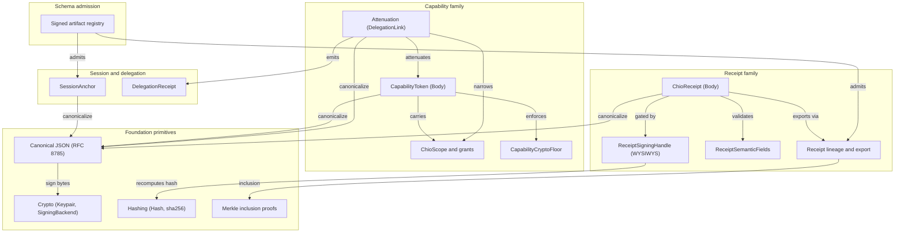

# chio-core-types architecture

## Overview

chio-core-types is the innermost crate in the Chio dependency graph: pure
in-memory types, validation, and cryptography, with no I/O, no runtime state,
and no internal `chio-*` dependencies. Every other Chio crate that signs,
verifies, or reasons about capabilities and receipts depends on the shapes
defined here, whether directly or through the `chio-core` facade. The crate
compiles `no_std + alloc` by source; the default `std` feature only swaps in
`std`-backed error impls, which is what lets `chio-kernel-core` cross-compile
to `wasm32-unknown-unknown` and other embedded kernels.

Most leaf modules (`canonical`, `crypto`, `hashing`, `merkle`, `session`,
`manifest`, `message`, `plan`, `signed_artifact`, `runtime_attestation`,
`oracle`, `loaded_weights`, `delegation_receipt`) are flattened to the crate
root via `pub use`. `capability` (whose own module doc calls this
intentional, "so callers import the domain they depend on") and `receipt`
are not: both stay namespaced, so callers reach types through
`capability::token::CapabilityToken`, `receipt::body::ChioReceipt`, and so
on. The design repeated across every signed module is the same pattern: a
plain `*Body` struct is the signing input, canonicalized via RFC 8785,
signed, and re-derived on verification, so the crate never trusts a
caller-supplied hash or signature in isolation from the fields it claims to
cover.

## Diagram

## Module map

| Path | Responsibility |
|------|----------------|
| `src/lib.rs` | Public module declarations, the crate's stable re-export surface, and the `AgentId`/`ServerId`/`CapabilityId` opaque `String` aliases. |
| `src/error.rs` | Crate-wide `Error` enum and `Result` alias; parallel `std` (`thiserror`) and `no_std` (`core::fmt::Display` + `core::error::Error`) impls with identical text. |
| `src/canonical.rs` | RFC 8785 canonical JSON: `canonicalize`, `canonical_json_bytes`/`_string`, the strict `_from_str` I-JSON entry points, and the `CanonicalBytes` witness type. |
| `src/crypto.rs` | `Keypair`, `PublicKey`, `Signature`, `SigningAlgorithm`, the `SigningBackend` trait, `Ed25519Backend`; FIPS `P256Backend`/`P384Backend` behind `fips`. |
| `src/pq.rs` (feature `pq`) | `MlDsa65Backend` and `HybridBackend`: ML-DSA-65 and classical-plus-PQ hybrid signing. |
| `src/hashing.rs` | `Hash` (typed 32-byte hash) and `sha256`/`sha256_hex`. |
| `src/merkle.rs` | RFC 6962 `MerkleTree` / `MerkleProof` for receipt-log inclusion proofs. |
| `src/manifest.rs` | `ToolManifest`, `ToolDefinition`, `ToolAnnotations`, `ToolPricing`: signed tool-server manifests. |
| `src/message.rs` | `AgentMessage` / `KernelMessage` wire enums and `ToolCallResult` / `ToolCallError`. |
| `src/plan.rs` | Pre-flight plan-evaluation DTOs (`PlanEvaluationRequest`/`Response`, `PlannedToolCall`, `StepVerdict`) for `POST /evaluate-plan`. |
| `src/oracle.rs` | `OracleConversionEvidence`: signed price-oracle evidence for cross-currency cost conversion. |
| `src/runtime_attestation.rs` | Attestation schema constants, `AttestationVerifierFamily`, and vendor-claim normalization shared by the appraisal/trust boundary. |
| `src/loaded_weights.rs` | `LoadedWeights` trait and `LoadedWeightsUnavailable`: recomputed model-weight digests, fail-closed when a provider cannot expose the artifact. |
| `src/delegation_receipt.rs` | `DelegationReceipt`, `ScopeAttenuation`: the signed envelope emitted by `capability::attenuation::delegate`. |
| `src/signed_artifact.rs` | Fail-closed signed-artifact schema registry: `KNOWN_SIGNED_ARTIFACT_SCHEMAS`, `validate_signed_artifact_schema`, `built_in_signed_artifact_registry`. |
| `src/schema_binding.rs`, `src/signer_binding.rs` (private) | Shared `ensure_schema_matches` / `ensure_*_matches_embedded_key` helpers used by every `sign()` / `verify_signature()` pair in the crate. |
| `src/_generated/` | Typify-generated bindings from `spec/schemas/chio-wire/v1`, regenerate-only; not declared as a `mod` from `lib.rs`, so it is not part of the compiled crate or public API today. |
| `src/capability/mod.rs` | Declares the capability submodules; deliberately no flat re-export layer. |
| `src/capability/token.rs` | `CapabilityToken`, `CapabilityTokenBody`: signing, schema/chain-binding validation, floor- and time-aware verification. |
| `src/capability/scope.rs` | `ChioScope`, `ToolGrant`, `ResourceGrant`, `PromptGrant`, `Operation`, `Constraint`, `MonetaryAmount`, `ModelMetadata`, subset checks. |
| `src/capability/attenuation.rs` | `DelegationLink`, `Attenuation`, attenuation witnesses/proofs, chain validation, the `delegate()` mint helper. |
| `src/capability/caveat.rs` | `Caveat`, `CaveatKind` (declared but rejected fail-closed at admission), `GrantSubsetRelation`. |
| `src/capability/crypto_floor.rs` | `CapabilityCryptoFloor`, `CapabilityFloorVerifyError`: minimum signature-algorithm posture for tokens. |
| `src/capability/features.rs` | `CapabilityNegotiation`: peer feature-negotiation bitset, validation, and intersection. |
| `src/capability/validation.rs` | Budget-share basis-point validators (`pub(crate)` functions) shared by token signing and delegation. |
| `src/capability/governance.rs` | Governed autonomy/commerce/billing context, call-chain provenance and continuation tokens, `GovernedApprovalToken`. |
| `src/capability/runtime_attestation.rs` | `RuntimeAssuranceTier`, `RuntimeAttestationEvidence`, effective-assurance resolution against a trust policy. |
| `src/capability/trust_policy.rs` | `AttestationTrustPolicy` / `AttestationTrustRule`: verifier-family and assertion matching rules. |
| `src/capability/workload_identity.rs` | `WorkloadIdentity`: SPIFFE URI parsing and validation. |
| `src/receipt/mod.rs` | Declares the receipt submodules. |
| `src/receipt/body.rs` | `ChioReceipt`, `ChioReceiptBody`, receipt-id derivation, and every `ChioReceipt::sign*` entry point including WYSIWYS handle-based signing. |
| `src/receipt/signing.rs` | `ChioReceiptSigningBody`, `BbsReceiptSignature`, nonce binding, `ReceiptSigningHandle` (content-hash recompute-and-refuse gate). |
| `src/receipt/crypto_floor.rs` | `ReceiptCryptoFloor`, `ReceiptFloorVerifyError`. |
| `src/receipt/kinds.rs` | `ReceiptKind`, `BoundaryClass`, `ObservationOutcome`, `ToolOrigin`, `RedactionMode`, `TrustLevel` enums. |
| `src/receipt/decision.rs` | `Decision`, `ToolCallAction` (parameter hashing). |
| `src/receipt/metadata.rs` | `ReceiptSemanticFields` (decision/kind/boundary compatibility matrix), `ActorRef`, `GuardEvidence`, attribution metadata. |
| `src/receipt/lineage.rs` | `ChildRequestReceipt`, `ReceiptLineageStatement`, hybrid logical clock, `SignedExportEnvelope<T>`. |
| `src/receipt/checkpoint.rs` | Checkpoint publication and trust-anchor identity types distinguishing trust-anchored from local-preview publication. |
| `src/receipt/economics.rs` | Financial/budget/settlement metadata and the versioned `EconomicAuthorizationReceiptMetadata` envelope. |
| `src/receipt/governance.rs` | Governed-transaction receipt metadata: approval, runtime assurance, commerce, metered billing, autonomy. |
| `src/receipt/validation.rs` | Crate-private module (`pub(crate) mod`): field-shape validators (`require_exact`, `require_lowercase_hex`, `require_wire_identifier`). |
| `src/session.rs` | Declares the session submodules and re-exports the public session API. |
| `src/session/identifiers.rs` | `SessionId`, `RequestId`, `ProgressToken`. |
| `src/session/auth.rs` | `SessionAuthMethod`, `SessionAuthContext`, enterprise/OAuth federation context. |
| `src/session/anchor.rs` | `SessionAnchor`: signed session-continuity anchor bound to a normalized auth context. |
| `src/session/lineage.rs` | `RequestLineageRecord`: persisted provenance-DAG node for one request. |
| `src/session/operation.rs` | `OperationKind`, `OperationContext`, `OperationTerminalState`. |
| `src/session/ownership.rs` | `SessionTransport`, `WorkOwner`, `StreamOwner`, request/task ownership snapshots. |
| `src/session/normalization.rs` | `NormalizedRoot`, `ResourceUriClassification`: filesystem-root and resource-URI enforceability normalization. |
| `src/session/payloads.rs` | `ReadResourceOperation`, `GetPromptOperation`, `CompleteOperation`. |
| `src/session/resources.rs` | `ToolCallOperation` and resource/prompt/sampling definitions and results. |
| `src/session/messages.rs` | `CreateMessageOperation`/`Result`, `CreateElicitationOperation`/`Result`. |
| `src/session/session_op.rs` | `SessionOperation`: the tagged union of every normalized operation kind. |

## Sign/verify lifecycle

Every signed artifact in this crate (capability tokens, receipts, session
anchors, delegation links, manifests, governance approval tokens, lineage
statements, call-chain continuation tokens) follows the same shape:

1. A caller builds a `*Body` struct holding every field except the signature.
2. `T::sign(body, &Keypair)` (or `sign_with_backend` for capability tokens,
   governed approval tokens, and receipts) validates schema and
   embedded-key binding, canonicalizes the body via RFC 8785
   (`canonical::canonical_json_bytes`), signs the bytes, and returns the
   full signed artifact.
3. `T::verify_signature()` reconstructs the same body from the signed
   artifact's own fields, re-canonicalizes it, and checks the signature
   against the embedded public key; it never trusts a `signature` field in
   isolation from the fields it claims to cover.
4. Schema-tagged artifacts (session anchors, receipt-lineage statements,
   call-chain continuation tokens, and every entry in the `signed_artifact`
   registry) additionally reject an unrecognized `schema` string before
   verification runs.

Receipts extend step 2 with a WYSIWYS ("what you see is what you sign")
gate: `receipt::signing::ReceiptSigningHandle` is built from the exact
canonical bytes a producer evaluated and recomputes `content_hash` from
them; every handle-based `ChioReceipt::sign_with_handle*` entry point
refuses to sign when the caller's body claims a different `content_hash`,
closing a render-A/sign-B forgery where a human sees content `A` but a body
claiming content `B`'s hash gets signed.

Capability delegation is a related but distinct path:
`capability::attenuation::delegate()` takes a parent `CapabilityToken`, a
narrower child `ChioScope`, and a `ScopeAttenuation` request; it checks
every declared attenuation step is a true narrowing of the parent, checks
the narrowing is actually reflected in the child scope being minted, signs
a fresh `DelegationLink`, and returns a `DelegationReceipt` binding that
link onto the parent's delegation chain.

## Invariants and failure modes

- Canonical JSON fails closed on ambiguous input: the strict `_from_str`
  entry points reject duplicate object keys, integers outside the I-JSON
  safe range `[-(2^53-1), 2^53-1]`, and fractional literals that are not
  already their own shortest round-tripping decimal, so a render-A/sign-B
  collision is never signable.
- Schema admission runs before signature verification for every
  schema-tagged artifact: a valid signature over an unrecognized schema is
  rejected.
- `CapabilityCryptoFloor` / `ReceiptCryptoFloor` enforcement runs before the
  cryptographic check, and a declared `algorithm` envelope field that
  disagrees with the signature's actual algorithm is treated as a downgrade
  signal and rejected outright.
- Capability attenuation is reduce-only in both directions:
  `validate_attenuation_step` proves each declared step narrows the parent
  (never raises a cap, targets a tool outside the parent's grants, or
  extends expiry), and `validate_steps_reflected_in_child` separately
  proves the minted child scope actually honors every declared step, so a
  signed delegation link and its child token can never disagree.
- Delegation chain-binding closes parent-scope inflation:
  `attenuation_proof.parent_scope_hash` must equal the trust-root scope
  hash (direct issue) or the previous chain link's signed `scope_hash`
  (delegated issue); multi-hop attenuated chains are rejected until every
  hop carries a per-hop witness.
- `CapabilityToken::validate_schema` rejects any token carrying non-empty
  `caveats` fail-closed: caveats are a declared but unenforced surface, so a
  token that relies on one is refused rather than silently admitted.
- `ReceiptSemanticFields::validate_decision` enforces one fixed
  compatibility matrix between `receipt_kind`, `boundary_class`,
  `observation_outcome`, and `decision` (for example, `mediated_decision`
  receipts require the `Prevent` boundary, no observation outcome, and a
  present decision); `BoundaryClass::CannotSee` is never valid on a signed
  receipt.
- Time-window checks (`verify_signature_at` on capability tokens, receipts,
  governed approvals, call-chain proofs, and continuation tokens) always
  check the signature before the time window, so an attacker cannot use the
  returned error variant to distinguish "expired" from "never validly
  signed".
- The FIPS and PQ verification paths are always compiled in and fail closed
  to `false` (never panic) when the `fips`/`pq` feature is off, so a token
  or receipt claiming a P-256/P-384/hybrid signature on a classical-only
  build is rejected rather than mishandled.
- The `std`/`no_std` split is behavior-preserving: `Error`'s `Display` text
  and every type's serde shape are identical whether `thiserror` derives
  them (`std`) or the crate provides hand-written `core::fmt::Display` +
  `core::error::Error` impls (`no_std`).

## Dependencies

None internal: `chio-core-types` has no `chio-*` runtime dependencies (only
`chio-test-support` and `chio-spec-codegen` as dev-dependencies), which is
what makes it the base of the dependency graph. External, architecturally
significant: `serde`/`serde_json` (with `float_roundtrip`, needed for exact
`f64` canonical-signature stability) for every wire shape; `ed25519-dalek`
for the default signing backend; `rand_core` (with `getrandom`'s `js`
feature on `wasm32`) for key generation; `sha2` for hashing; `hex` and
`ryu` (shortest-float rendering) for canonical encoding; `percent-encoding`
and `url` for session root/resource URI normalization; `thiserror`
(optional, `std`-only) for the derived `Error` impl; `aws-lc-rs` (optional,
`fips`) and `fips204` (optional, `pq`) for the FIPS and post-quantum
backends.

## Extension points

- `crypto::SigningBackend` - dyn-compatible trait implemented by
  `Ed25519Backend` and the feature-gated
  `P256Backend`/`P384Backend`/`HybridBackend`. `CapabilityToken::sign_with_backend`,
  `GovernedApprovalToken::sign_with_backend`, `ChioReceipt::sign_with_backend`,
  and `ChildRequestReceipt::sign_with_backend` all accept `&dyn
  SigningBackend`, so a new signing algorithm needs only one trait impl to
  become usable everywhere those types are signed.
- `loaded_weights::LoadedWeights` - implemented by a model-weights provider
  to expose bytes for a recomputed SHA-256 digest; a provider that cannot
  expose the artifact returns `LoadedWeightsUnavailable` so the caller
  fails closed instead of trusting an unverifiable claim.
