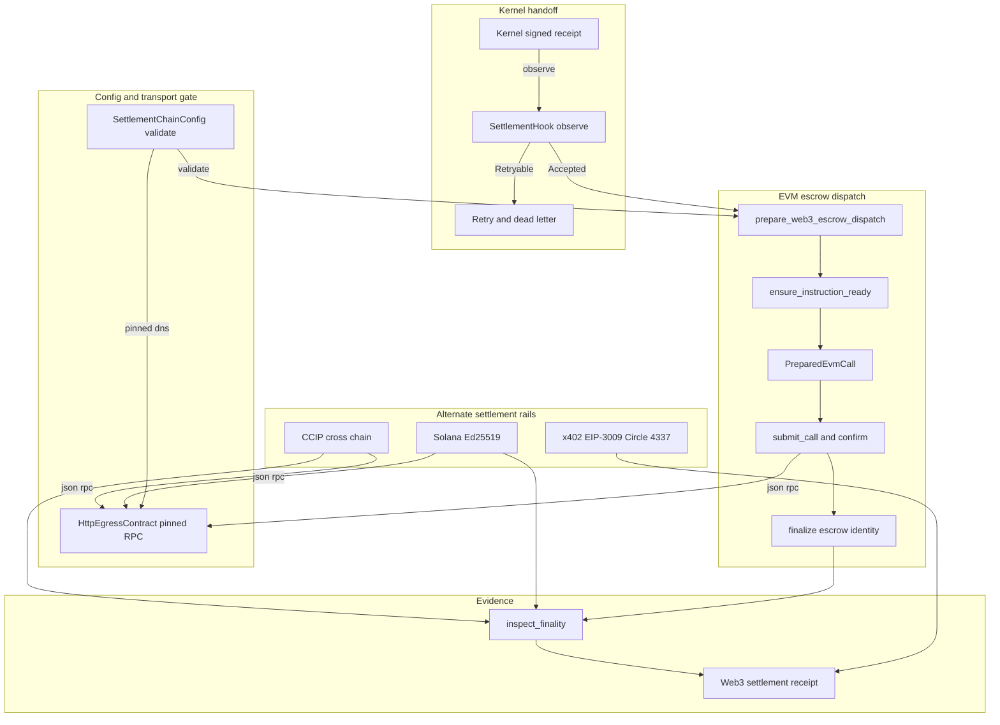

# chio-settle architecture

## Overview

`chio-settle` executes approved Chio capital instructions against real
chains and projects the results back into signed Chio settlement receipts.
It is the money-moving layer directly downstream of the kernel: the kernel
signs and persists a receipt, then calls into this crate (through
`SettlementHook`) to turn that receipt into an EVM, Solana, or cross-chain
settlement action, or into a payment-rail compatibility artifact (x402,
EIP-3009, Circle, ERC-4337). The crate owns no persistence, scheduling, or
kernel state, those live in `chio-store-sqlite` and `chio-kernel`, and every
function re-verifies its own inputs (signatures, identity bindings, anchor
proofs, chain config) instead of trusting the caller. Where a second
on-chain call depends on a first (root publication after a Merkle release
or bond impair/release), preparing the second call re-derives the same
commitment from the caller-supplied `Prepared*` value and rejects any
mismatch, so a tampered intermediate value cannot reach the chain.

## Diagram

## Module map

| Path | Responsibility |
|------|----------------|
| `src/lib.rs` | Facade: `#![cfg(feature = "web3")]` gates the whole crate body. Declares `SettlementError`, `SettlementCommitment`, and the completion-flow row-id binding helpers. |
| `src/config.rs` | `SettlementChainConfig` and its policy/oracle/evidence sub-config; devnet RPC `HttpEgressContract` construction (loopback-only); `LocalDevnetDeployment` loader. |
| `src/hook.rs` | `SettlementHook` trait, `SettlementObservation`, `SettlementOutcome`: the kernel post-dispatch extension point. |
| `src/retry.rs` | `RetryPolicy`, `classify_attempt`, `DeadLetterRecord`: pure-function bounded backoff and dead-lettering for hook failures. |
| `src/ops.rs` | Emergency controls, indexer/lane runtime-status classification, incident alerts, `SettlementRuntimeReport`, and the completion-flow binding check `evm::ensure_instruction_ready` calls. |
| `src/automation.rs` | Watchdog job construction and fingerprint/ordering assessment for cron-triggered settlement automation. |
| `src/evm/mod.rs` | EVM submodule aggregator; declares the ERC-20 `approve`-only `sol!` interface. |
| `src/evm/types.rs` | EVM wire and snapshot types: `PreparedEvmCall`, the `Prepared*` family, `EscrowSnapshot`, `EvmBondSnapshot`, the JSON-RPC envelope. |
| `src/evm/prepare.rs` | Call preparation for every EVM settlement action (escrow dispatch/release/refund, bond lock/release/impair/expire, root publication), on-chain snapshot reads, and RPC submission. |
| `src/evm/sign.rs` | Capital-instruction and identity-binding readiness checks, the EIP-712 dual-sign digest, secp256k1 signing. |
| `src/evm/decode.rs` | ABI/log decoding and the shared `HttpEgressContract`-gated JSON-RPC transport (`rpc_call`). |
| `src/evm/finalize.rs` | Post-submission identity finalization (`finalize_escrow_dispatch`, `finalize_bond_lock`) and failure/reversal receipt builders. |
| `src/observe.rs` | Finality assessment (confirmations, dispute window, reorg) and escrow/bond lifecycle projection into `Web3SettlementExecutionReceiptArtifact`. |
| `src/solana.rs` | Bounded Solana-native Ed25519 settlement path; binding/receipt verification and cross-lane commitment comparison. |
| `src/ccip.rs` | Chainlink CCIP settlement-message preparation and delivery reconciliation (duplicate suppression, delay detection). |
| `src/payments.rs` | x402 payment requirements, EIP-3009 `transferWithAuthorization` (with a replay-resistant nonce store), Circle nanopayment, and ERC-4337 paymaster compatibility. |

## Settlement lifecycle

Two entry paths, both fail-closed at every step:

1. **Kernel-triggered observation.** The kernel signs and durably stores a
   receipt, then calls `SettlementHook::observe` with a
   `SettlementObservation` (finalized receipt id, amount, content and
   policy hash). A hook implementation classifies it into
   `Accepted`/`Skipped`/`Retryable`/`Permanent`; `retry::classify_attempt`
   turns `Retryable` into a backoff-and-replay decision or a
   `DeadLetterRecord`. `observe` must not mutate the receipt store, and a
   settlement failure never rolls back dispatch.
2. **EVM dispatch.** `evm::prepare_web3_escrow_dispatch` (or a bond
   counterpart) validates the chain config, verifies the capital
   instruction signature and identity binding, and derives the on-chain id
   via a static `eth_call` before returning a `PreparedEvmCall`. The caller
   submits it (`submit_call`), waits for the mined receipt
   (`confirm_transaction`), and finalizes on-chain identity from the
   emitted event (`finalize_escrow_dispatch`/`finalize_bond_lock`).
   `observe::inspect_finality` then classifies confirmations, dispute
   window, and reorg state against the configured amount tier, and
   `observe::project_escrow_execution_receipt` folds the result into a
   `Web3SettlementExecutionReceiptArtifact`.

Every RPC call in both paths (`evm::decode::rpc_call`, `observe`'s own
`settlement_rpc_call`) re-validates
`SettlementChainConfig::validate_rpc_egress_contract` immediately before
dispatch.

## Invariants and failure modes

- `SettlementChainConfig::validate` gates every `prepare_*`, `read_*`, and
  RPC call: required fields non-blank, oracle/evidence/policy sub-configs
  valid, amount tiers non-empty and non-regressing with at least one
  confirmation each, and the RPC URL allowed by its `HttpEgressContract`
  with pinned-DNS revalidation at connect time.
- `evm::ensure_instruction_ready` requires a verified capital-instruction
  signature, `TransferFunds` action, `Web3` rail kind, jurisdiction
  matching the chain id, a `governed_receipt_id`/`completion_flow_row_id`
  pair that binds under `ops::ensure_settlement_completion_flow_binding`,
  explicit `automatic_dispatch_supported`, and a destination address equal
  to the beneficiary, before any escrow dispatch is prepared.
- The Merkle release path binds the anchor proof's receipt nonce and
  content hash to the dispatch's `governed_receipt_id`
  (`ensure_anchor_receipt_binds_dispatch`) and its `chain_anchor` to the
  configured registry contract, operator address, and a non-zero operator
  key hash, before deriving the typed release leaf.
- Dual-signature release re-reads the identity registry at a specific
  block, rejects if the block hash changed before the digest was computed,
  requires an active operator with a non-zero epoch, and only supports
  full-amount release.
- Bond impair requires slash shares to sum exactly to the slash amount,
  beneficiaries to be non-zero addresses bounded to 16 entries, and the
  slash to not exceed remaining collateral (`locked - already-slashed`).
- CCIP reconciliation fails closed on payload-hash mismatch, suppresses
  replays via a caller-supplied `seen_messages` set, and marks delivery
  after `expires_at` as `Delayed` rather than `Reconciled`.
- EIP-3009 preparation checks nonce freshness against the domain-scoped
  `Eip3009NonceStore`, the `(validAfter, validBefore)` window against
  `now`, that `validBefore` does not outlive the governing approval, and
  that chain, payee, amount, and token contract all match the
  `ApprovalBinding`; the nonce is recorded only after every other check
  passes, so a rejected authorization never burns its nonce.
- x402 requirement construction rejects blank or whitespace-bearing
  facilitator, resource, or accepted-token fields.
- The retry policy is a pure function with no owned clock or storage:
  permanent outcomes dead-letter on the first attempt, and a `Retryable`
  outcome dead-letters once `max_retries` is exhausted.

## Dependencies

`chio-core` supplies the protocol types this crate consumes through its
facade (`chio_core::credit`, `chio_core::web3::{anchors, identity,
settlement, trust_profile}`, `chio_core::capability::scope::MonetaryAmount`,
`chio_core::receipt`). `chio-credit`, `chio-web3`, and `sha2` are also
direct Cargo dependencies, but no source file in this crate names them
directly; every use goes through the `chio_core` facade. `chio-web3-bindings`
supplies the generated Solidity interfaces (`IChioEscrow`, `IChioBondVault`,
`IChioIdentityRegistry`, `IChioRootRegistry`) called through
`alloy-sol-types`. `chio-egress-contract` supplies `HttpEgressContract` and
the pinned-DNS HTTP client every RPC call routes through. `alloy-primitives`
and `alloy-sol-types` provide EVM ABI encoding and Keccak; `secp256k1` signs
the dual-signature EIP-712 digest; `bs58` validates Solana base58 addresses;
`reqwest` is the underlying HTTP transport; `tokio` backs the confirmation
poll loop. Dev-only: `chio-anchor` and `chio-link` build anchor proofs and
oracle rates for the integration tests, `chio-kernel` supplies the
checkpoint and evidence-export helpers those tests exercise, and
`chio-test-support` provides the `test_unwrap`/`test_expect` assertion
helpers used throughout the unit tests.

## Extension points

`SettlementHook` (in `hook`) is the trait a kernel deployment implements to
route finalized receipts into this crate's settlement pipeline;
`chio-kernel`'s post-dispatch observer slot holds it as
`Arc<dyn SettlementHook>`. `Eip3009NonceStore` (in `payments`) is the trait
a deployment implements for durable replay-resistant nonce storage;
`InMemoryEip3009NonceStore` is the process-local default.
