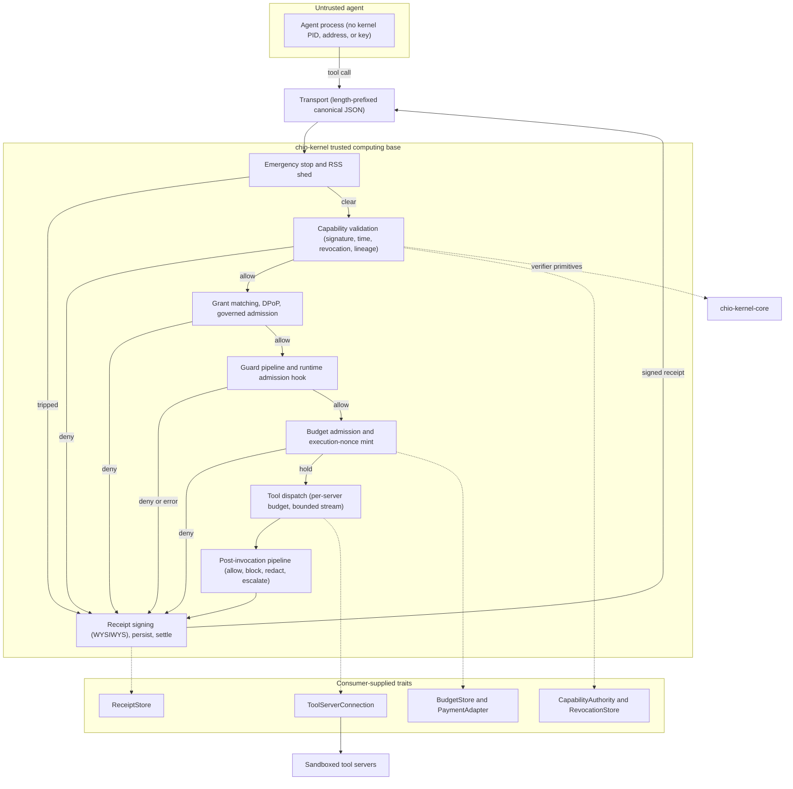

# chio-kernel Architecture Notes

## Boundary

`chio-kernel` is the hosted enforcement layer. It validates capabilities,
matches tool grants, applies budget and governed-admission checks, runs guards,
performs runtime admission, dispatches registered tools, reconciles budget
holds, signs receipts, and persists receipt evidence. Portable verifier logic
lives in `chio-kernel-core`; durable storage implementations live in storage
crates such as `chio-store-sqlite`.

Registered native connections can receive `ToolInvocationContext` after
admission and input guards. It binds the request and route to the selected
capability ID, subject and full canonical capability digest, without exposing
a signed token or signing material. Construction stays inside the kernel.
Value, cost-reporting, streaming and nested dispatch carry the same binding;
denied calls never reach a connection. Existing connectors keep their old
invocation, cost and streaming overrides through default trait methods.
Context-aware native connections must implement the context methods needed by
their supported dispatch modes, including cost reporting. This adds identity
binding for native services, not another authorization or dispatch path.

## Diagram

## Module Layout

- `kernel/validation.rs` owns capability issuance and revocation, tool-server
  event drains, portable verdict evaluation, and budget charge/reconcile
  helpers.
- `kernel/error.rs` owns `KernelError` and structured operator error reports.
- `kernel/governed_validation.rs` owns governed transaction admission:
  approval token trust checks, runtime assurance, metered billing, call-chain
  proof checks, autonomy bond checks, and governed call-chain receipt evidence.
- `kernel/dispatch.rs` owns guard evaluation, runtime admission, and tool
  dispatch.
- `budget_store.rs` owns the budget trait, request/decision records, and
  budget commit metadata. `budget_store/in_memory.rs` owns the in-memory
  backend, hold state, idempotent mutation events, and concrete `BudgetStore`
  implementation.
- `receipt_support.rs` owns receipt evidence scopes, governed receipt
  metadata, child receipt helpers, stream receipt content, and receipt
  attribution helpers. `receipt_support/signing.rs` owns the kernel crypto
  floor, hybrid receipt signing entrypoints, and signing backend construction.
- `session.rs` owns session lifecycle state, negotiated peer capabilities,
  in-flight request tracking, subscriptions, terminal request state, session
  anchors, and session-aware kernel responses. `session/tests.rs` owns the
  session unit tests.

## Security And API Constraints

- Capability validation, governed-admission checks, and budget reconciliation
  must continue to fail closed.
- Approval tokens, runtime-attestation records, call-chain proofs, autonomy
  bonds, and receipt evidence must preserve canonical bytes and verification
  semantics.
- Public kernel and receipt-store APIs must preserve explicit security
  invariants. Settlement observers install only as paired runtimes, and
  unsupported atomic projections fail closed.
