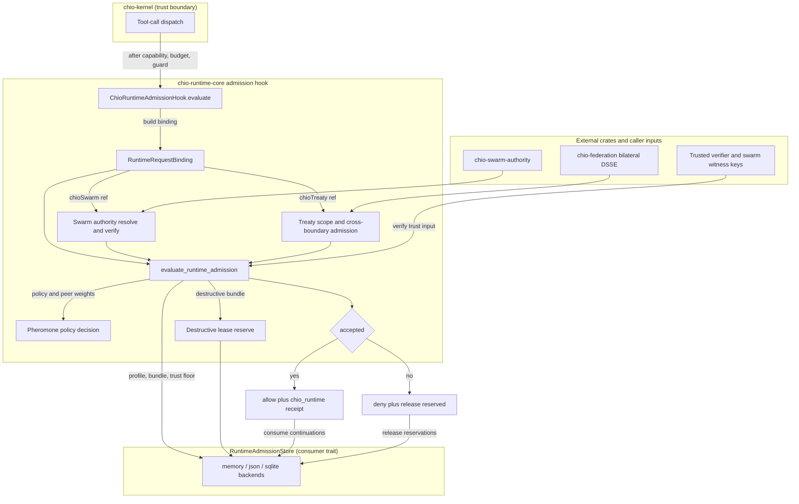

# chio-runtime-core architecture

## Overview

`chio-runtime-core` sits inside the kernel's trust boundary, not at its edge. `ChioRuntimeAdmissionHook` implements `chio_kernel::RuntimeAdmissionHook`, so `chio-kernel` calls into this crate synchronously during tool-call dispatch, after capability, budget, and guard checks pass but before the call actually dispatches, and the hook's decision gates whether it proceeds. The crate has no transport and no async runtime: the kernel supplies the request, the wall clock (`now_unix_ms` on every call), and, through a `RuntimeAdmissionStore`, storage. Every artifact (admission bundle, treaty scope, buyer attestation packet, orchestration report, ...) is a `serde`-derived struct carrying its own `schema` string, and every admission or verification function returns a structured report (`accepted: bool`, `failure_code: Option<String>`, `checks: Vec<String>`) instead of throwing, so a rejection is itself an auditable, receipt-embeddable artifact.

## Diagram

## Module map

| Path | Responsibility |
|------|----------------|
| `src/lib.rs` | Declares the modules and re-exports the public surface. `#![forbid(unsafe_code)]`. |
| `src/types.rs` | Every wire artifact as a `serde` struct: admission profile/bundle/report, verifier trust bundle, pheromone policy/advisory, treaty scope, ladder intersection, buyer attestation packet/review, orchestration profile/plan/run report, provider bindings, ops status. |
| `src/schema.rs` | `CHIO_RUNTIME_*_SCHEMA` / `CHIO_FEDERATION_*_SCHEMA` / `CHIO_ATTEST_*_SCHEMA` constants (with back-compat aliases) and `CHIO_RUNTIME_FAILURE_CODES`, the failure-code registry. |
| `src/error.rs` | `ChioRuntimeError`: `Rejected { code, detail }` plus store/IO/JSON/canonicalization variants. |
| `src/hash.rs` | Canonical-JSON SHA-256 helpers for every hashed artifact type. |
| `src/admission.rs` | `evaluate_runtime_admission`: the admission state machine (profile freshness, bundle lookup, runtime-trust-input verification and trust-floor transition, pheromone-policy evaluation, destructive-lease reservation). |
| `src/admission_hook.rs` (+ `admission_hook/`) | `ChioRuntimeAdmissionHook`. Submodules: `dsse` (bilateral DSSE treaty binding), `metadata` (denial metadata), `request` (`RuntimeRequestBinding` from `ToolCallRequest`), `store_artifacts` (typed artifact loads by hash), `swarm_authority` / `swarm_ref` (swarm delegation evidence), `treaty_evidence` / `treaty_ref` (treaty evidence resolution). |
| `src/buyer.rs` (+ `buyer/`) | Buyer-attestation packet and review-package verification. Submodules: `packet` (packet-to-treaty-evidence binding), `proof_package` (proof-package and lineage-bundle checks), `review_hydration` (parses the 14 required review artifacts), `review_package` (the full review pipeline), `runtime_report` (binds runtime run/proof-regeneration reports), `strict_dsse` (treaty-bound strict-DSSE signer verification), `helpers`. |
| `src/treaty.rs` | Federation data model and validators: treaty scope, governance ladder manifest, ladder intersection (`compute_ladder_intersection`), cross-boundary admission (`evaluate_cross_boundary_admission`), receipt lineage statement/bundle, bilateral invocation. |
| `src/orchestration.rs` | Loads and cross-validates a run's evidence directory (workflow run report, proof regeneration report, evidence manifest, verifier report) against a `RuntimeRunContract`. |
| `src/ops.rs` | Builds orchestration plans and generates operational reports: evidence-sink health, provider health (model-card and loaded-weights binding via `chio_weights` / `chio_kernel::weights_binding`), proof-drift, artifact-retention plans. |
| `src/pheromone_policy.rs` | Evaluates a signed pheromone policy, peer weights, and query report into an allow/deny/escalate `RuntimePheromonePolicyDecision`. |
| `src/serde_io.rs` | `*_from_json` / `*_json` parse-and-serialize pairs; serializers validate before emitting. |
| `src/validation.rs` (+ `validation/`) | Fail-closed structural validators split by domain: `common` (shared hash/label/non-empty checks), `evidence` (workflow/step/manifest/sink-health), `ops` (supervisor/lease/scheduler/retention/provider/ops-status), `orchestration` (profile/contract/plan/run-report/resume/status), `proof` (drift, regeneration input/report/artifacts; parity delegated to `chio-runtime-proof-parity`). |
| `src/store/` | `RuntimeAdmissionStore` trait plus implementations: `memory` (in-process `Mutex<BTreeMap>`), `json` (single JSON file, validated on every write), `trust_floor` (JSON-file trust-floor-only store), `traits::LayeredRuntimeAdmissionStore` (composes a separate admission store and trust-floor store). |
| `src/store/sqlite/` | `SqliteRuntimeOrchestrationStore`: WAL-mode SQLite backing both `RuntimeAdmissionStore` and the orchestration surface (runs, step states, leases, scheduler ticks, recovery drills, evidence artifacts, treaty artifacts, swarm authority bundles, provider/evidence-sink health), split across `admission_replay`, `replay_source`, `runs_steps`, `leases_scheduler`, `evidence_artifacts`, `treaty_artifacts`, `swarm_authority_bundles`, `trust_floors`, `health_summaries`, `schema_migrations`. |
| `src/replay_source.rs` (+ `replay_source/`) | Bounded, canonical legacy replay inventory and source-seal evidence. These values are not qualified operation claims. |

## Admission lifecycle

1. The kernel evaluates a `ToolCallRequest` and calls `ChioRuntimeAdmissionHook::evaluate`.
2. The hook reads the `chioAdmission` context (required once any Chio runtime context is present) and the optional `chioSwarm` / `chioTreaty` context, builds a `RuntimeRequestBinding`, and loads one bundle snapshot. Its admission ID must match the lookup, and any pinned hash must match that exact bundle. Treaty and core verification use that same snapshot.
3. If a swarm reference is present, the hook resolves and verifies the referenced `SwarmAuthorityBundle` (delegation witness chain, route-plan and route-metadata match, revocation epoch, budget pool). `swarm_request_binding` then binds the selected continuation's task to the complete canonical signed request capability and its scope before marking the continuation for consumption.
4. If a treaty reference is present, the hook resolves treaty scope and ladder intersection from the store, optionally verifies cross-kernel continuation, receipt-lineage bundle, bilateral invocation, and bilateral DSSE evidence, calls `evaluate_cross_boundary_admission`, and marks the treaty continuation for consumption.
5. Core preparation checks profile schema and freshness, bundle presence/schema/identity, runtime-trust-input signatures, host-kernel match, request binding, pheromone policy, and destructive lease/governance prerequisites. It produces owned inputs without consuming participants or writing the trust floor. Preparation rejection or dropping a prepared value requires no cleanup and does not attest reservations.
6. The prepared hook plan is bound to its originating hook. Its consuming reservation step claims treaty, swarm and destructive participants in that order, then validates and records the trust-floor transition through the existing store port. Stores without an explicit atomic implementation fail closed. Memory and JSON stores serialize transitions across shared handles; SQLite serializes them across database connections. Independently opened JSON stores are not coordinated. A concurrent floor advance still rejects. Only successful consumption produces reserved-resource metadata. Commit rejection releases confirmed reservations; mutate-then-error/panic does not establish ownership of the ambiguous participant or authorize its release. Acceptance returns `allow` with receipt metadata under `chio_runtime`.
7. If the kernel denies or cleans up the call before dispatch, it calls `release_reserved` with that receipt metadata to release the destructive lease and any treaty/swarm continuation; a failure discovered after dispatch deliberately skips `release_reserved` and leaves reservations in place, fail-closed, since a side effect may already have run.

The preparation and reservation implementations live in
`admission/preparation.rs`, `admission_hook/preparation.rs` and
`admission_hook/reservation.rs`. `evaluate_runtime_admission` uses the same core
preparation and commit logic for standalone callers. The prepared types remain
crate-private, non-deserializable and non-cloneable; they do not emit an accepted
report before commit. Final kernel dispatch revalidation remains non-consuming
and checks a fresh bundle snapshot, including its pinned hash and original
admission identity.

This separation is a prerequisite for operation-bound runtime custody, not its
implementation. Current replay markers remain in the legacy runtime store;
they do not enforce the qualified admission authority's owner fence. A future
owned profile must use one replay authority, exact participant claims and safe
legacy sealing/migration before it can authorize external caller execution.

### Legacy replay source sealing

The SQLite store and runtime facade expose an explicit, permanent
`seal_legacy_replay_source` operation. In one IMMEDIATE transaction it inventories
all destructive, treaty and swarm replay markers, records the source binding,
and installs persistent INSERT, UPDATE and DELETE rejection triggers on all
three marker tables and the seal record. New typed mutation calls also reject
no-op releases after sealing. The triggers apply to ordinary SQL mutations from
connections and statements opened before the seal, not just the upgraded API.
Callers must quiesce already admitted work before using this migration step.

Sealing requires WAL and synchronous FULL. Verification reads through SQLite,
not just the main database file, and does not require a checkpoint. Exact retry
and reopen reconstruct the same inventory and barrier catalog. A commit error
can follow a committed seal; callers resolve it with load/verify and never
interpret it as permission to resume legacy mutation. Damaged or partial seal
evidence rejects before schema initialization can repair missing protected
objects. There is no unseal or automatic migration on open.

The canonical, domain-separated SHA-256 artifact binds operator-selected source,
runtime-authority and destination-authority labels, the actual open SQLite
file's device/inode/single-link identity, the exact protected schema, and every
marker. File identity uses the existing `chio-sqlite-file-identity` OS boundary;
runtime-core remains unsafe-free. Decimal strings preserve full-width device
and inode values. Inventory is limited to 16,384 total markers and 8 MiB of
canonical evidence, with validated identifiers at most 512 bytes. SQL size/type
checks precede untrusted row or blob allocation; limits reject without truncation
and roll back a new seal. Copies, symlinks and path/descriptor disagreement do
not silently rebind a sealed source.

This is storage-enforced source retirement, not destination activation. Labels
and historical admission IDs do not authenticate operation ownership. A future
qualified destination must retain an independently expected source binding and
import historical markers as unresolved replay-blocking claims. The artifact
has no public decoder that turns caller JSON into verified source evidence.
Schema tampering by a database administrator, disabling SQLite triggers, full
erasure of seal evidence and filesystem rollback are outside this barrier's
enforcement boundary; the source alone supplies no independent antirollback
anchor. It also cannot revoke in-memory effects admitted before sealing. These
limitations do not permit activation of a second replay ledger alongside legacy
consumers.

### Swarm request binding

`swarm_request_binding` runs after the shared offline bundle verifier, both at
admission and final dispatch revalidation. A capability digest is SHA-256 over
the canonical JSON of the complete signed `CapabilityToken`, not its ID, signing
body, or scope alone. The graph node's scope hash must match the request scope.
Every incident witness edge must agree on that task's capability: incoming
edges bind their last child hop, outgoing edges their first parent hop. This
supports multi-hop delegation and a fan-in continuation returning to a root
with only outgoing edges, while rejecting contradictory task identities.

The selected witness must belong to the continuation's task, and a direct
continuation must reference its own witness chain. A join continuation must
reference its own join receipt. Receipt metadata records graph ID, task ID,
capability hash, scope hash, and a canonical hash of the normalized evidence
references under `chio_runtime.verified_swarm_request_binding`. Revalidation
requires the same binding, including for resumable continuations that have no
single-use reservation. Removing runtime context after an accepted admission
is not a non-runtime fallback.

This is additional authority, not a replacement for kernel capability signature,
issuer, subject, expiry, revocation, and grant checks. It does not make swarm
context mandatory on a capability that was issued without a task-bound policy.
The edge must install the hook, provision verifier-owned evidence and pinned
keys, and enforce mandatory task context before claiming live task binding.
For the native kernel, call `ChioKernel::require_swarm_admission()` before
serving, or load Chio policy with `kernel.require_swarm_admission: true`.
The runtime implementation and public facade declare swarm authority support
and require final dispatch revalidation. Legacy hooks default to unsupported;
clearing or replacing a hook cannot downgrade a required-swarm kernel.
Shared task-pool accounting, session anchors, root transaction binding and
current revocation-authority updates require their own integration evidence.

## Boundaries

- No transport and no async runtime: the crate is synchronous, plain Rust plus SQLite (`rusqlite`, bundled); the kernel owns HTTP/stdio and calls in.
- No wall-clock reads for correctness: every evaluation takes `now_unix_ms` from the caller.
- No key management: signature verification consumes `PublicKey`s the caller already resolved as trusted (trusted verifier keys, treaty participant keys, swarm witness keys); this crate does not look up or rotate keys.

## Invariants and failure modes

- `#![forbid(unsafe_code)]`, and the workspace's `unwrap_used = "deny"` / `expect_used = "deny"` clippy lints hold with no crate-level overrides; there is no `unwrap`, `expect`, or `unsafe` in `src/`.
- Destructive admission bundles must carry both a `lease_id` and a `governance_receipt_id`; the destructive lease is reserved (single-consume, replay-rejected) before a report is returned accepted.
- Runtime trust-floor entries only move forward: reusing a version requires an identical bundle hash, advancing a version requires `previous_hash_sha256` to chain from the currently persisted floor hash, and version zero is rejected both when a runtime trust input is validated (`runtime_trust_version_zero`) and when a trust-floor entry reaches any store (`runtime_trust_floor_version_zero`).
- Pheromone-policy evaluation is all-or-nothing: supplying only one of policy or peer weights is rejected, and once both are supplied a runtime trust input and a signed query report become mandatory too; a destructive bundle additionally requires policy, peer weights, and query report to be present at all (`runtime_pheromone_required_for_destructive`).
- The `RuntimeAdmissionStore` trait's default `consume_treaty_continuation` / `consume_swarm_continuation` reject with an unsupported-store error; every bundled store overrides them as single-consume, replay-rejected operations.
- Buyer-attestation review is fail-closed across the 14-artifact chain: a hash mismatch anywhere (packet, lineage statement/bundle, continuation, admission report, bilateral invocation/DSSE, workflow receipt, proof package, verifier report, proof-regeneration report/input, evidence manifest) rejects with a specific `chio_buyer_review_*` code, and the trust-context-free entry point (`verify_buyer_attestation_review_package`) always terminates in a `chio_buyer_review_strict_dsse_signer_mismatch` rejection once it reaches the trust-bundle-dependent checks; only `verify_buyer_attestation_review_package_with_trust` can accept.
- Evidence paths are always validated as safe relative paths (`validate_relative_evidence_path`): no absolute paths, `.`/`..` segments, backslashes, or repeated separators, shared by evidence-manifest validation, orchestration evidence loading, proof-drift artifact paths, and SQLite evidence-artifact recording.
- The SQLite store opens with WAL journaling and `synchronous = FULL`, and enforces the same replay and uniqueness invariants as the in-memory and JSON stores via `INSERT OR IGNORE` and primary keys rather than duplicating validation logic.

## Dependencies

Replay-source sealing reuses `chio-sqlite-file-identity` for the actual SQLite
file descriptor's physical identity. Unsupported OS/VFS identity queries deny
sealing; they do not change the portability of unsealed legacy admission.

Internal: `chio-attest-buyer-core` (verifier-report, proof-package, and trust-bundle parsing for buyer review), `chio-core-types` (canonical JSON, hashing, signing envelopes, `PublicKey`), `chio-federation` (`bilateral_dsse` / `bilateral_verifier`), `chio-kernel` (`RuntimeAdmissionHook` trait, `ToolCallRequest`, `KernelError`, `weights_binding` evaluation), `chio-runtime-proof-parity` (`RuntimeProofParityReport` / `RuntimeProofParityMismatch` and their validator), `chio-swarm-authority` (`SwarmAuthorityBundle`, `verify_swarm_authority_bundle`), `chio-weights` (`ModelCard`). Dev-only: `chio-attest-loopback` (buyer-review test fixtures), `base64` / `chrono` / `tempfile` (test support). External: `rusqlite` (bundled SQLite, the orchestration store), `serde` / `serde_json` (every artifact), `thiserror` (`ChioRuntimeError`). No dependency is aliased; every `chio-*` Cargo dependency name matches the crate name used in source.

## Extension points

- `RuntimeAdmissionStore` (and `RuntimeTrustFloorStore`) is the trait a caller implements to plug in a different persistence backend; `LayeredRuntimeAdmissionStore` composes an admission store with a separate trust-floor store when they should not share a backend.
- `ChioRuntimeAdmissionHook<S>` is generic over any `S: RuntimeAdmissionStore + Send + Sync`, making it the extension point for wiring a custom store into `chio_kernel::RuntimeAdmissionHook`.
