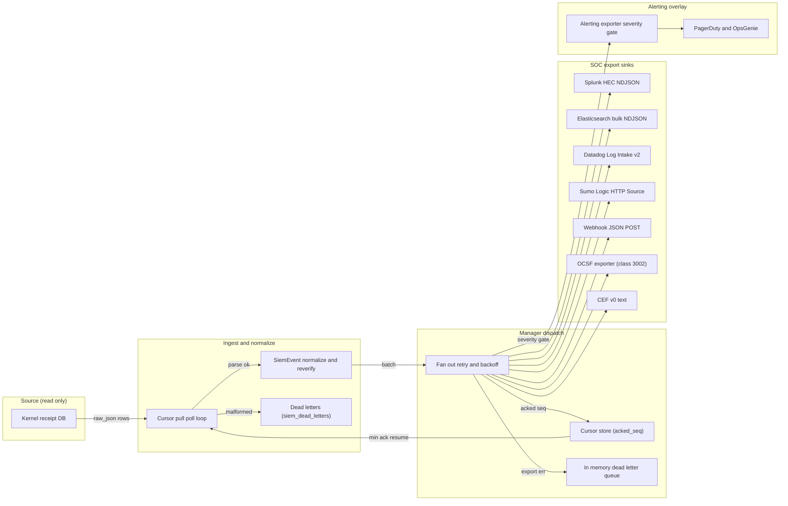

# chio-siem architecture

## Overview

chio-siem sits outside the kernel trust boundary. It reads kernel receipts
through an explicit, admin-scoped `ReceiptReadContext`, but never signs
receipts, mutates revocation state, issues capabilities, enforces runtime
policy, or owns the receipt database schema; its own writes are confined to a
separate, SIEM-owned SQLite cursor store. The dependency on `chio-kernel` is
one-directional (chio-kernel does not depend on chio-siem), which keeps the
SIEM HTTP-client surface out of the kernel TCB.

The manager's central design commitment is durable, at-least-once export:
when a cursor store is configured, the read cursor can advance only to the
slowest exporter's acknowledged high-water mark, so a failing exporter forces
redelivery instead of silently losing receipts.

## Diagram

## Module map

| Path | Responsibility |
|------|----------------|
| `src/lib.rs` | Public module declarations and the crate's re-export surface. |
| `src/manager.rs` | `ExporterManager`: cursor-pull poll loop, per-exporter retry/backoff, cursor persistence, DLQ routing, metric emission. |
| `src/event.rs` | `SiemEvent`: wraps `ChioReceipt`, recomputes id/signature/parameter-hash validity and signer trust, extracts `financial` metadata. |
| `src/exporter.rs` | `Exporter` trait, `ExportError`, `ExportFuture`. |
| `src/cursor_store.rs` | `SiemCursorStore`: RW SQLite store for per-exporter `acked_seq` and durably captured malformed rows (`siem_dead_letters`). |
| `src/dlq.rs` | `DeadLetterQueue`: bounded, drop-oldest in-memory queue for events that exhaust retry. |
| `src/ratelimit.rs` | `ExportRateLimiter`: per-exporter token-bucket batch rate limiting. |
| `src/metrics_sink.rs` | `SiemMetricsSink` trait and `NoopMetricsSink`; decouples the manager and alerting exporter from a metric registry. |
| `src/redaction.rs` | `redact_for_operator_log`, wrapping `chio-log-redact`, applied to every error surfaced to tracing. |
| `src/ocsf.rs` | `receipt_to_ocsf` / `siem_event_to_ocsf`: stateless mapping to OCSF 1.3.0 Authorization events (class_uid 3002). |
| `src/alerting.rs` | `AlertSeverity`, `derive_severity`, `AlertBackend`, `PagerDutyBackend`, `OpsGenieBackend`, `AlertingExporter`: severity-gated paging overlay. |
| `src/exporters/mod.rs` | Shared HTTPS-scheme enforcement (`require_https_endpoint`) used by every network exporter. |
| `src/exporters/splunk.rs` | `SplunkHecExporter`: newline-delimited JSON to Splunk HEC; classifies HEC's 200-with-embedded-error responses. |
| `src/exporters/elastic.rs` | `ElasticsearchExporter`: NDJSON `_bulk` API; detects per-item partial failure inside a 200 response. |
| `src/exporters/datadog.rs` | `DatadogExporter`: Datadog Log Intake v2 API. |
| `src/exporters/sumo_logic.rs` | `SumoLogicExporter`: Sumo Logic HTTP Source, with Json/Text/KeyValue wire formats. |
| `src/exporters/ocsf_exporter.rs` | `OcsfExporter`: OCSF events over HTTPS as a JSON array or NDJSON; usable as a pure formatter when `endpoint` is empty. |
| `src/exporters/cef.rs` | `CefExporter`: CEF v0 text formatting only, no transport. |
| `src/exporters/webhook.rs` | `WebhookExporter`: generic HTTPS JSON POST/PUT; `from_endpoint` is the production SOC-sink constructor. |

## Poll and export cycle

1. `ExporterManager::new` opens a read-only, no-mutex SQLite connection to the
   kernel receipt database (`SQLITE_OPEN_READ_ONLY | SQLITE_OPEN_NO_MUTEX`,
   wrapped in a `Mutex` so the manager stays `Send + Sync`), and rejects a
   non-`AdminAll` `ReceiptReadContext`, a zero `batch_size`, or a zero
   `poll_interval` before the database is touched.
2. `add_exporter` registers a backend; with a cursor store configured, an
   unseen exporter's `cursor_identity()` is seeded at baseline 0, and the
   resume cursor is recomputed as the minimum acknowledged seq across all
   registered exporters.
3. Each tick (`run`'s `tokio::time::interval` driving the internal
   `poll_once`) reads up to `batch_size` rows with `seq > cursor` and parses
   each `raw_json` into a `ChioReceipt`.
4. A row that fails to parse is durably persisted to `siem_dead_letters`
   (when a cursor store is configured) before the cursor is allowed past it;
   a persist failure leaves the cursor behind the row so the next poll
   retries it.
5. Every parsed row becomes a `SiemEvent` via
   `SiemEvent::from_receipt_with_trusted_kernel_keys`, recomputing
   authorization independently of the embedded `decision`.
6. The batch fans out to each registered exporter through
   `export_with_retry` (exponential backoff capped at
   `MAX_RETRY_BACKOFF_MS` = 60s), gated by the optional `ExportRateLimiter`.
7. A returned `Ok(n)` acks only the delivered prefix (`n` may be less than
   the batch size); a returned `Err` leaves that exporter's high-water mark
   untouched and pushes every event in the batch onto the `DeadLetterQueue`.
   An exporter with `is_soc_export_sink() == false` (the alerting overlay)
   still advances its own cursor but is excluded from SOC export/lag/DLQ
   metrics, so a failed page cannot burn the SOC export SLO.
8. The read cursor advances to the minimum acknowledged seq across
   registered exporters (or unconditionally, in the legacy no-cursor-store
   mode, where a restart replays from seq 0 and downstream ingest must dedup
   idempotently).

## Invariants and failure modes

- `ExporterManager::new` fails closed on a non-admin `ReceiptReadContext`,
  `batch_size == 0`, or `poll_interval == 0`, all before opening the receipt
  database.
- The receipt database connection is opened read-only; the cursor database
  is the only SQLite file this crate writes.
- `SiemEvent::authorized` requires receipt id, signature, and action
  parameter hash to verify AND the signer to be in the caller-supplied
  trusted-kernel-key set; a self-signed or untrusted receipt is never
  reported as authorized.
- Every exporter that accepts a caller-supplied endpoint URL (Splunk HEC,
  Elasticsearch, Sumo Logic, webhook, the OCSF exporter with a non-empty
  endpoint, PagerDuty, OpsGenie) rejects a non-`https://` scheme at
  construction and requires an `HttpEgressContract`. The Datadog exporter
  takes only a `site` suffix and always builds an
  `https://http-intake.logs.<site>` URL, so it needs no scheme check but
  still requires the contract. `*_for_tests` / `*_plaintext_for_tests`
  constructors are the only bypass, intended for local `wiremock` targets.
- A malformed receipt row is durably captured before the cursor advances
  past it. With no cursor store configured the crate falls back to
  advancing unconditionally past malformed rows.
- The durable per-exporter cursor is keyed by `Exporter::cursor_identity()`,
  not registration order, so reordering exporters in config cannot make one
  inherit another's high-water mark. `WebhookExporter` folds its
  (userinfo/query-stripped) URL into its identity because every instance
  otherwise shares the bare name `"webhook"`.
- Error text passed to `tracing` is routed through `redact_for_operator_log`
  before it is logged.

## Dependencies

- `chio-core` (Cargo alias for `chio-core-types`, not the `chio-core` facade
  crate) - `ChioReceipt`, `Decision`, `FinancialReceiptMetadata`,
  `GuardEvidence`, and the crypto/signing types this crate reads and never
  writes.
- `chio-kernel` - `ReceiptReadBoundary`, `ReceiptReadContext`; the dependency
  is one-directional, so the SIEM HTTP-client surface stays out of the
  kernel TCB.
- `chio-egress-contract` (`reqwest-egress` feature) - `HttpEgressContract`,
  `client_builder_with_contract`, `send_with_contract`; every network
  exporter builds its `reqwest::Client` and sends every request through this
  contract.
- `chio-log-redact` - `redacted!`, wrapped by
  `redaction::redact_for_operator_log`.
- `rusqlite` - direct, synchronous access to the read-only kernel receipt
  database and the read-write SIEM cursor store.
- `reqwest` (`rustls`), `tokio`, `url`, `zeroize` - HTTP transport, the async
  poll loop, endpoint parsing/validation, and zeroizing of routing
  keys/tokens/passwords held by exporters and alert backends.

## Extension points

Implement `Exporter` (`export_batch`, `name`; optionally `cursor_identity`
and `is_soc_export_sink`) and register the instance with
`ExporterManager::add_exporter` to add a backend. Implement `AlertBackend`
(`name`, `dispatch`) and attach it to an `AlertingExporter` via
`AlertingExporterBuilder::with_backend` to add a paging destination.
Implement `SiemMetricsSink` and attach it with
`ExporterManager::with_metrics_sink` or
`AlertingExporterBuilder::with_metrics_sink` to wire metrics into a
registry.
