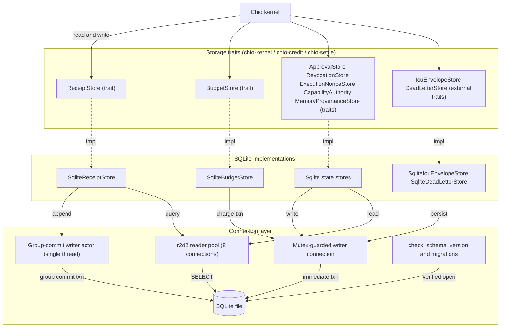

# chio-store-sqlite architecture

## Overview

`chio-store-sqlite` is the durable backend behind the kernel's trust
decisions: it does not decide policy, but a degraded or corrupted store can
still let an unrecorded tool call through or lose the evidence a dispute
depends on. The receipt-commit writer is marked trust-critical explicitly
(`SupervisorConfig { tcb_critical: true, .. }`, with the comment "Durable
receipt persistence is on the money path: a degraded writer must fail
evaluations closed rather than execute tools without a receipt"). The crate's
design idea is a single-writer, multi-reader split per store: one dedicated
writer connection (a group-commit actor for the receipt store, a mutex-guarded
connection for the smaller stores) serializes every mutation, while an
8-connection reader pool serves concurrent queries against the same file.

## Diagram

## Module map

| Path | Responsibility |
|------|-----------------|
| `src/lib.rs` | Crate root: pool-size defaults, `SqlitePoolConfig`/`SqliteStoreOptions`, in-memory-path detection, top-level re-exports. |
| `src/receipt_store.rs` + `src/receipt_store/**` | `SqliteReceiptStore`: group-commit writer actor, checkpoints, retention, lineage, liability/underwriting persistence, reports. See the submodule map below. |
| `src/receipt_query.rs` | `SqliteReceiptStore::query_receipts`, filtered and cursor-paginated. |
| `src/budget_store.rs` + `src/budget_store/**` | `SqliteBudgetStore`: per-grant spend limits, authorization holds, replication sequencing. |
| `src/approval_store.rs` | `SqliteApprovalStore`: human-approval requests, resolutions, consumed-token replay guard. |
| `src/batch_approval_store.rs` | `SqliteBatchApprovalStore`: standing approvals matched by pattern, call count, and spend cap. |
| `src/revocation_store.rs` | `SqliteRevocationStore`: durable, monotonic capability revocation list. |
| `src/execution_nonce_store.rs` | `SqliteExecutionNonceStore`: one-time execution-nonce reservation with retention-extended expiry. |
| `src/authority.rs` | `SqliteCapabilityAuthority`: kernel signing-key custody, rotation, trusted-key history, cluster-leader fencing. |
| `src/capability_lineage.rs` | `impl SqliteReceiptStore` extension: capability delegation lineage (parent/child, depth, recursive ancestor query). Not a standalone store. |
| `src/evidence_export.rs` | `impl SqliteReceiptStore` extension: builds `EvidenceExportBundle`s (receipts, lineage, checkpoints, Merkle inclusion proofs). |
| `src/encrypted_blob.rs` | `SqliteEncryptedBlobStore`: tenant-scoped ChaCha20-Poly1305 blob storage. |
| `src/memory_provenance_store.rs` | `SqliteMemoryProvenanceStore`: hash-chained audit trail of agent-memory writes. |
| `src/iou_store.rs` | `SqliteIouEnvelopeStore`: persists `chio_credit::IouEnvelope`s; can share a receipt store's pool. |
| `src/dead_letters.rs` | `SqliteDeadLetterStore`: permanently failed settlement receipts (`chio_settle::DeadLetterRecord`); always opened alongside another store's pool. |
| `src/lineage_cte.rs` (`lineage` feature) | Recursive-CTE forward/reverse walks over `receipt_lineage_statements`. |
| `src/schema_version.rs` | Shared open-path schema/anchor-table gate used by every store above. |

### receipt_store submodule map

| Path | Responsibility |
|------|-----------------|
| `receipt_store/bootstrap/open.rs` | `SqliteReceiptStore::open*`: pragmas, schema creation and migration, pool construction, actor spawn. |
| `receipt_store/bootstrap/federated.rs` | Import and query federated evidence shares from partner Chio instances. |
| `receipt_store/bootstrap/listing.rs` | Paginated tool/child receipt listing and counts. |
| `receipt_store/evidence_retention.rs` | Checkpoint-aligned archival watermark; archive-then-delete rotation. |
| `receipt_store/support/store_impl.rs` | `impl ReceiptStore for SqliteReceiptStore` - the trait's method surface. |
| `receipt_store/support/receipt_verify.rs` | Signature and action-hash verification before a receipt is trusted. |
| `receipt_store/support/retention_watermark.rs` | The archival watermark that gates skipping full checkpoint-chain re-verification. |
| `receipt_store/support/lineage.rs` | Session anchors, request lineage, receipt-lineage statements. |
| `receipt_store/support/claim_log/**` | The unified `claim_receipt_log_entries` projection: schema, validation, authorization/metadata extraction, query matching, enum codecs. |
| `receipt_store/support/checkpoint_projection.rs` | Re-derives checkpoint transparency-projection tables for verification; backfill and repair. |
| `receipt_store/support/checkpoint_validate.rs` | Checkpoint signature, predecessor-chain, and Merkle-root validation. |
| `receipt_store/reports/*` | Ten operator report families (analytics, authorization, behavioral, billing, compliance, cost attribution, economic, reconciliation, settlement, shared evidence). |
| `receipt_store/liability_claims.rs` | Claim to response to dispute to adjudication to payout to settlement persistence. |
| `receipt_store/liability_market.rs` | Provider, quote, placement, pricing-authority, and auto-bind persistence. |
| `receipt_store/underwriting_credit.rs` | Underwriting decisions, appeals, credit facilities, credit bonds, credit-loss lifecycle. |

Every file under `receipt_store/` other than `receipt_store.rs` itself is
wired in with `#[path = "..."] mod x;` and opens with `use super::*;`, so
these are organizational splits of one Rust module, not a nested module tree:
each file's `impl SqliteReceiptStore` block shares `receipt_store.rs`'s
imports and adds methods to the same struct.

## Group-commit write path

1. A caller invokes an append method on `SqliteReceiptStore` (directly, or
   through `impl ReceiptStore for SqliteReceiptStore` in `support/store_impl.rs`).
2. The call increments `ReceiptCommitWriterHealth::inflight` (`AtomicU64`)
   and `try_send`s a `ReceiptCommitCommand` on a bounded
   `mpsc::sync_channel` (capacity `RECEIPT_GROUP_COMMIT_MAX_BATCH * 16` = 1024)
   to the single writer thread. A full queue fails closed with
   `ReceiptStoreError::Pool`; a disconnected channel returns
   `ReceiptStoreError::WriterDead`.
3. The writer thread (`ReceiptCommitActor`, run under `SupervisedThread`)
   drains up to `RECEIPT_GROUP_COMMIT_MAX_BATCH` (64) queued commands, or
   waits up to `RECEIPT_GROUP_COMMIT_FLUSH_DELAY` (500 microseconds), then
   commits them as one SQLite transaction with a `SAVEPOINT` per record so
   one bad receipt fails only its own slot. `inflight` is decremented
   unconditionally on dequeue.
4. `receipt_verify.rs` checks each receipt's signature
   (`ReceiptCryptoFloor::AllowHybrid`) and action hash before it is trusted;
   failures fail closed as `ReceiptStoreError::Conflict`.
5. With `incremental_verification` enabled (the default), the actor's cached
   `VerifiedHead` advances with an O(1) predecessor check plus an O(b) delta
   cross-check against the newly committed claim-log rows. Disabled, the
   actor instead re-runs full O(N) claim-log and checkpoint-chain
   verification on every batch, for A/B verification of a suspect database.
6. After a durable append, `build_due_checkpoints_and_record` builds any
   checkpoints now owed (count-triggered against
   `BackgroundCheckpointSigner::max_batch`), wrapped in `catch_unwind` so a
   checkpoint failure only records `health.last_error` and never fails or
   blocks the caller's write.
7. A panic in batch commit or checkpoint build is caught and poisons
   `ReceiptCommitWriterHealth::head_poisoned` (`true` by default until the
   open path seeds a verified head), which `writer_serving_closed` surfaces
   to the kernel's pre-dispatch gate. A poisoned store still runs
   `RetentionRepair` (its own command variant) but refuses ordinary appends
   until `reseed_verified_head` (the `chio receipt audit --repair` path)
   re-verifies from scratch.

## Invariants and failure modes

- The write queue is bounded and non-blocking (`try_send` only, capacity
  1024); a saturated queue rejects new work rather than growing unbounded or
  blocking the caller. `tests/loom_receipt_writer.rs` model-checks the
  inflight-counter accounting under concurrent producers.
- `ReceiptCommitWriterHealth` starts `head_poisoned: true`, so a freshly
  opened store cannot serve ordinary appends until its head is seeded.
- Retention never deletes a live row that is not byte-identical in the
  archive first (`verify_co_archival_complete`), never prunes past the last
  checkpoint the actor has itself verified (`verified_checkpoint_ceiling`),
  and refuses tenant-scoped retention outright
  (`ReceiptStoreError::RetentionTenantScopeUnsupported`).
- The archival watermark that lets checkpoint-chain verification skip
  rebuilding the Merkle tree is itself guarded at the SQL layer
  (`receipt_retention_watermark_reject_update` / `_reject_delete` /
  `_reject_regression` triggers); a `None` watermark disables the skip
  exemption entirely rather than assuming zero.
- Every store gates its on-disk file through
  `schema_version::check_schema_version` before any write: a foreign file, a
  file missing this store's anchor tables, or a schema newer than the binary
  supports is refused, never adopted or upgraded silently.
- `SqliteEncryptedBlobStore` binds tenant id, blob id, and creation timestamp
  into the ChaCha20-Poly1305 associated data, so ciphertext copied onto
  another row's handle fails authentication instead of decrypting under the
  wrong scope.
- `SqliteExecutionNonceStore` and `SqliteRevocationStore` are monotonic: a
  reserved nonce or a revoked capability has no store-level "undo" path.
- `SqliteBudgetStore` evaluates and writes each limit check
  (`try_charge_cost_with_ids_and_authority`) inside one `Immediate`
  transaction, so no interleaved write can land between check and commit;
  denied attempts are still durably logged to `budget_mutation_events`.
- Double-adjudication in the liability-claim workflow is blocked at the
  schema layer: `liability_claim_adjudications.dispute_id` and `.claim_id`
  are `UNIQUE`, so a second adjudication against the same dispute or claim
  fails the constraint independent of the Rust-level checks.

## Dependencies

Internal: `chio-kernel` defines the store traits this crate implements
(`ReceiptStore`, `BudgetStore`, `ApprovalStore`, `BatchApprovalStore`,
`RevocationStore`, `ExecutionNonceStore`, `CapabilityAuthority`,
`MemoryProvenanceStore`) and the protocol-adjacent types persisted here
(checkpoints, retention config, report and query types). `chio-credit`
supplies `IouEnvelope` and the `IouEnvelopeStore` trait. `chio-settle`
supplies `DeadLetterRecord`. `chio-supervisor` runs the receipt-commit actor
as a supervised, restart-bounded thread (`max_restarts: 5`,
`trip_after: 1`). The dependency named `chio-core` in `Cargo.toml` is
aliased to `package = "chio-core-types"`: every `chio_core::` path in this
crate's source resolves to `chio-core-types`, not the `chio-core` facade
crate.

External: `r2d2` / `r2d2_sqlite` / `rusqlite` for pooled SQLite access;
`chacha20poly1305` and `zeroize` for encrypted-blob key handling; `uuid`
(`v7` feature) for time-ordered identifiers; `thiserror` for error types;
`tracing` for instrumentation. Dev-only: `loom` models the commit actor's
channel accounting, `proptest` and `criterion` exercise the receipt-store and
budget-store paths, `tempfile` backs on-disk test databases, and
`chio-test-support` supplies shared test fixtures.
