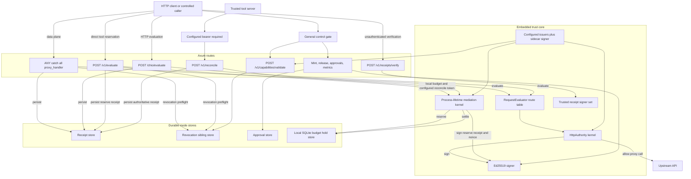

# chio-api-protect architecture

## Overview

`chio-api-protect` is a self-contained edge service with two authorization
cores and one signer. Proxied HTTP requests and `POST /chio/evaluate` use
`RequestEvaluator`, whose `chio_http_core::HttpAuthority` embeds a
`chio_kernel::ChioKernel`. Direct tool authorization and reconciliation use a
separate long-lived mediation kernel at `POST /v1/evaluate` and
`POST /v1/reconcile`.

The HTTP authority matches OpenAPI-derived routes and only forwards an allow
verdict to the upstream. The mediation kernel never dispatches a tool. It
reserves budget, mints an execution nonce, and later settles the reservation
when the trusted tool server reconciles. Durable mode uses SQLite receipt,
approval, and revocation storage. Direct mediation additionally uses a local
SQLite budget-hold store and a configured signer seed so admission ownership
remains stable across restart.

## Diagram

## Module map

| Path | Responsibility |
|------|----------------|
| `src/lib.rs` | Public crate boundary: `ProtectConfig`, `ProtectProxy`, `RequestEvaluator`, `EvaluationResult`, `RouteEntry`, `ProtectError`, and spec-loading functions. |
| `src/error.rs` | `ProtectError`, the product error surface. |
| `src/evaluator.rs` | OpenAPI route matching, caller identity, capability extraction, and `HttpAuthority` evaluation. |
| `src/spec_discovery.rs` | OpenAPI discovery/loading and `default_upstream_egress_contract`. |
| `src/proxy.rs` | Proxy submodule map, crate-internal re-exports, and integration-test containers. |
| `src/proxy/config.rs` | `ProtectConfig`, threshold collector configuration, and `DEFAULT_UPSTREAM_REQUEST_TIMEOUT`. |
| `src/proxy/state.rs` | `ProxyState`, receipt tables, durable receipt/approval and sibling revocation store construction, mediation-kernel lifetime, readiness, and startup. |
| `src/proxy/router.rs` | Router assembly, proxy dispatch, control middleware, revocation preflight, and receipt persistence. |
| `src/proxy/sidecar.rs` | HTTP evaluation, receipt verification, capability lifecycle, advisory evaluation, readiness, and general control gating. |
| `src/proxy/mediated.rs` | Direct tool request parsing, budget-store selection, process-lifetime mediation kernel, reserved-hold authorization, nonce minting, reconciliation, and TTL reaping. |
| `src/proxy/approval.rs` | Single and threshold approval routes. |
| `src/proxy/attenuation.rs` | `/v1/capabilities/attenuate`, always `403`. |
| `src/proxy/http.rs` | Query/header parsing, response shaping, forwarded-header filtering, and execution-nonce extraction. |
| `src/proxy/decision.rs` | Decision labels and verdict-to-status mapping. |
| `src/proxy/errors.rs` | JSON error responses. |
| `src/proxy/receipts.rs` | Manual receipts for paths that do not call `HttpAuthority`. |
| `src/proxy/scope_subset.rs` | Expected-scope subset checks for capability validation. |

## HTTP request lifecycle

1. `proxy_handler` or `/chio/evaluate` parses the HTTP request and rejects
   malformed transport input before evaluation.
2. Revocation preflight short-circuits a revoked capability to a signed denial.
3. `RequestEvaluator::evaluate*` matches the OpenAPI route in declaration
   order. An unmatched path falls back to the method default. The resulting
   request runs through `HttpAuthority::evaluate` and its embedded kernel.
4. `/chio/evaluate` returns the decision. The proxy returns a denial directly,
   or sends an allow through `HttpEgressContract`, binds the upstream status to
   the finalized receipt, and returns the upstream response.
5. The route writes the finalized `HttpReceipt` to the configured durable store
   before recording it in the in-process log.

## Direct tool lifecycle

1. `/v1/evaluate` decodes the bounded direct-tool body with unknown-field
   rejection. A presented `execution_nonce` is rejected because this endpoint
   mints rather than consumes nonces.
2. The route requires a local hold-capable `budget_db` and a configured
   nonblank `sidecar_control_token`. A remote `control_url` alone is not
   hold-capable. The evaluate caller does not present the control token.
3. Leaf and delegation-chain revocation checks run before the shared mediation
   kernel verifies the capability and supplied security artifacts.
4. An allow reserves the worst-case budget under the request id and returns a
   signed reserve receipt plus a fresh execution nonce. No tool dispatch or
   spend settlement occurs in this process.
5. The caller presents the nonce to the real tool server. The trusted tool
   server calls `/v1/reconcile` with the exact arguments and realized cost.
   Reconcile requires the configured matching bearer token with no loopback
   exemption, consumes the nonce, settles the hold, and returns the
   authoritative spend receipt.
6. The TTL reaper closes an abandoned reservation that is never reconciled.

## Direct tool request contract

`/v1/evaluate` requires `capability`, `tool_server`, and `tool_name`. It accepts
the optional fields `parameters`, `agent_id`, `request_id`, `governed_intent`,
`approval_token`, `approval_tokens`, `threshold_approval_proposal`,
`supplemental_authorization`, `declassification_grant`, and `dpop_proof`.
`execution_nonce` is decoded only to reject it explicitly. Unknown fields are
rejected.

`approval_token` and `approval_tokens` are mutually exclusive. Threshold
authorization uses the token list with a policy-authority-signed proposal bound
to the explicit request id and governed intent. An omitted request id is minted
by the sidecar, so pre-signed approval material requires its bound id to be
supplied. The threshold collector routes that create and deliver these
artifacts are mounted only when `with_threshold_approval_collector(...)`
supplies a trusted policy authority and request-context resolver.

Supplemental authorization has the wire shape `{ reference, artifact }`, where
`artifact` is a nonempty bounded byte array. The field is forwarded and never
silently ignored. The default proxy installs no supplemental quota verifier or
admission registrar, so a request carrying the field receives a deny verdict
unless that authority is added to the mediation kernel.

## Invariants and failure modes

- Durable-by-default startup requires a plain, persistent `receipt_db` unless
  `allow_ephemeral_receipts` is true. `:memory:` and `mode=memory` do not count
  as durable.
- A durable receipt database co-locates receipt and approval data and opens a
  sibling revocation store. `revocation_db` is an additional fail-closed
  startup source, not a substitute for `receipt_db`.
- Threshold collection requires the durable approval store derived from
  `receipt_db`, even when ephemeral operation is otherwise allowed.
- `ProxyState::capability_is_revoked` treats a revocation-store query error as
  revoked.
- Side-effect methods deny by default absent an OpenAPI override. Safe methods
  allow with an audit receipt.
- Chio transport and hop-by-hop headers are stripped before upstream dispatch.
- `/v1/evaluate` only reserves and mints. It never dispatches, accepts a
  presented nonce, reconciles, or settles.
- `/v1/reconcile` only reconciles and settles. It does not grant a new
  authorization.
- `/v1/evaluate/advisory` performs local revocation and parameter-hash checks
  only. It is active only when `allow_advisory` is true; otherwise it returns
  `409` with `chio_advisory_disabled`.
- Capability validation enforces trusted issuer, signature, expiry, leaf and
  ancestor revocation, and optional exact-subject and scope-subset constraints.
  It does not authorize a concrete call.
- Mint, release, validate, attenuate, receipt submission, approvals, and
  `/metrics` use the general control gate. A configured nonblank token requires
  a constant-time matching bearer from every caller, including loopback. With
  no token, only loopback passes. A configured blank token rejects all callers.
  Evaluate and receipt-verification routes are outside this gate.
- `/v1/reconcile` always requires a configured matching bearer token and never
  grants a loopback exemption.
- Three issuer-enforcement surfaces exist: the `HttpAuthority` kernel for the
  proxy and `/chio/evaluate`, the process-lifetime mediation kernel for
  `/v1/evaluate`, and direct `/v1/capabilities/validate`. Each trusts the
  sidecar signer plus the configured issuer list.
- The upstream egress contract limits redirects and response size and denies
  loopback, link-local, and IPv6 ULA destinations unless the configured
  upstream is itself loopback.

## Dependencies

- `chio-http-core` (`reqwest-egress`) supplies `HttpAuthority` for proxied HTTP
  and `/chio/evaluate`, `HttpEgressContract`, and shared HTTP sidecar types.
- `chio-kernel` supplies the direct mediation kernel, budget and nonce
  authorities, store traits, and Prometheus guard metrics.
- `chio-openapi` supplies parsing, Chio extensions, and route policy defaults.
- `chio-store-sqlite` supplies durable receipt, revocation, approval, and budget
  stores.
- `chio-core-types` supplies capabilities, scopes, governed and threshold
  artifacts, receipts, cryptography, and canonical JSON.
- `chio-http-serve` supplies drain, connection-cap, and peer-address hygiene.
- `chio-metrics-spec` supplies alert-pack metrics rendered at `/metrics`.
- `axum`, `tokio`, `reqwest`, `rusqlite`, `subtle`, `sha2`, `hex`, `uuid`, and
  `chrono` provide server, transport, storage, constant-time comparison, and
  utility primitives.
