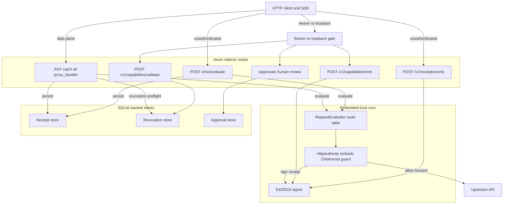

# chio-api-protect architecture

## Overview

`chio-api-protect` is a self-contained edge service. It embeds its own
`chio_kernel::ChioKernel` instance (via `chio_http_core::HttpAuthority`) and
Ed25519 signer rather than calling out to a separately hosted kernel, so it
is the trust boundary for whatever HTTP API it fronts. Every request is
matched against an OpenAPI-derived route table, projected as a synthetic
`authorize_http_request` tool call through the embedded guard pipeline, and
receipted regardless of outcome; only an allow verdict proceeds to the
upstream. The crate composes `chio_http_core`'s authority and
egress-contract primitives with an Axum server, SQLite-backed
receipt/revocation persistence, and sidecar control routes for capability
lifecycle and human-approval operations.

## Diagram

## Module map

| Path | Responsibility |
|------|----------------|
| `src/lib.rs` | Public crate boundary: `ProtectConfig`, `ProtectProxy`, `RequestEvaluator`, `EvaluationResult`, `RouteEntry`, `ProtectError`, spec-loading functions. `#![forbid(unsafe_code)]`. |
| `src/error.rs` | `ProtectError`, the product error surface. |
| `src/evaluator.rs` | `RequestEvaluator`: route-table matching, caller-identity extraction, and the call into `chio_http_core::HttpAuthority`. |
| `src/spec_discovery.rs` | OpenAPI spec discovery/loading and `default_upstream_egress_contract`. |
| `src/proxy.rs` | Declares the `proxy/*` submodules via `#[path]`, re-exports their crate-internal items, and hosts the `#[cfg(test)]` integration suites `tests` and `nonce_tests`. |
| `src/proxy/config.rs` | `ProtectConfig`, `DEFAULT_UPSTREAM_REQUEST_TIMEOUT`; `Debug` redacts the control token, signer seed, and spec content. |
| `src/proxy/state.rs` | `ProxyState`, the product-local `SqliteReceiptStore` (`http_receipts`/`tool_receipts`/`revoked_capabilities` tables), and `ProtectProxy` startup. |
| `src/proxy/router.rs` | `build_app`, `proxy_handler` (evaluate, forward, receipt), revocation preflight, receipt persistence helpers. |
| `src/proxy/sidecar.rs` | Sidecar control-route handlers: evaluate, verify, mint, release, validate, receipt submit/verify, advisory tool-call evaluation, bearer/loopback gating. |
| `src/proxy/approval.rs` | Human-approval routes: submit, list pending, get, respond, batch respond, operator-respond. |
| `src/proxy/attenuation.rs` | `/v1/capabilities/attenuate`, always `403`. |
| `src/proxy/http.rs` | Query/header parsing, advisory response shaping, forwarded-header filtering, execution-nonce header extraction. |
| `src/proxy/decision.rs` | Decision-label and verdict-to-HTTP-status mapping. |
| `src/proxy/errors.rs` | JSON error-response builders. |
| `src/proxy/receipts.rs` | `build_manual_receipt`, the signer for hand-built receipts that bypass `HttpAuthority` (revocation denials, submitted receipts). |
| `src/proxy/scope_subset.rs` | `is_scope_subset`, used by `/v1/capabilities/validate`. |

## Request lifecycle

1. `proxy_handler` (or a sidecar evaluate route) reads method, path, query,
   headers, and body, rejecting a duplicate query key or malformed
   execution-nonce header before evaluation.
2. A revocation preflight runs first (`revoked_proxy_response` /
   `revoked_sidecar_evaluate_response`): a revoked capability short-circuits
   to a signed deny receipt without calling `HttpAuthority`.
3. `RequestEvaluator::evaluate*` matches the path against the OpenAPI route
   table: each route's pattern is compared segment by segment (literal or
   `{param}` wildcard) in spec-declaration order, first match wins; an
   unmatched path falls back to a method-based default (safe methods allow,
   side-effect methods deny). The matched policy and request go to
   `HttpAuthority::evaluate`, which runs the embedded kernel guard pipeline
   and returns a decision `HttpReceipt`.
4. A denial returns immediately with a finalized deny receipt. An allow
   proxies the request upstream (`send_with_contract`, under the upstream
   `HttpEgressContract`), then finalizes the receipt with the real upstream
   response status (`RequestEvaluator::finalize_receipt`) before returning
   the response.
5. Every finalized receipt is cached in-process and, when `receipt_db` is
   configured, persisted to SQLite (`record_receipt` / `record_tool_receipt`).

## Invariants and failure modes

- Fail-closed durability: `ProtectProxy::run_with_observer` refuses to start
  without a durable `receipt_db` unless `allow_ephemeral_receipts` is set. An
  in-memory SQLite path (`:memory:`, `mode=memory`) does not count as
  durable.
- Fail-closed revocation: `ProxyState::capability_is_revoked` treats a
  durable revocation-store query error as revoked, not as not-revoked.
- Side-effect methods (`POST`/`PUT`/`PATCH`/`DELETE`) deny by default absent
  an OpenAPI-extension override; safe methods (`GET`/`HEAD`/`OPTIONS`) allow
  with an audit receipt.
- Chio transport headers (`x-chio-capability`, `x-chio-execution-nonce`) and
  hop-by-hop headers are stripped before a request reaches upstream
  (`should_forward_request_header`).
- `/v1/capabilities/attenuate` always returns `403`: the sidecar never holds
  the parent subject's signing key, so it cannot mint an attenuated child.
- `/v1/evaluate` is a kernel-mediated pre-execution reservation gate. It
  requires a local hold-capable budget store and a configured control token
  for downstream reconciliation. It mints execution nonces, never dispatches
  or settles a tool. `/v1/evaluate/advisory` performs local revocation and
  parameter-hash checks only and is explicitly not kernel authorization.
- Sidecar control routes (approvals, mint, release, validate, receipts,
  reconciliation, `/metrics`) require a configured token and one matching
  bearer header, compared in constant time (`subtle::ConstantTimeEq`).
  Missing or blank configuration disables control access, including loopback.
  Duplicate headers deny. The shared gate lives in `proxy/control.rs`.
- Nonempty control tokens are validated before startup I/O against Bearer-token
  syntax and a 512-byte bound. Before body reads or kernel admission, the proxy
  rejects their raw bytes in any request header value. A 64 KiB name/value budget
  bounds the scan, including duplicates. Ordinary upstream credentials stay
  byte-preserved; this is not body, URL or encoded-secret inspection.
- The upstream egress contract denies redirect chains beyond 4 hops, caps
  response bodies at 64 MiB, and denies loopback/link-local/IPv6-ULA
  destinations unless the configured upstream host is itself loopback.
- Two independent trusted-issuer checks exist: `HttpAuthority` (mediated
  evaluation) always trusts its own signer key in addition to the configured
  list; `ProxyState.trusted_capability_issuers` (`/v1/capabilities/validate`
  only) is built separately in `run_with_observer` and also adds the signer
  key explicitly.

## Dependencies

- `chio-http-core` (`reqwest-egress` feature) - `HttpAuthority` (embeds a
  `ChioKernel`; this crate evaluates every request through it),
  `HttpEgressContract` and its dispatch helpers, and the shared sidecar types
  (`ChioHttpRequest`, `HttpReceipt`, `ApprovalAdmin`, `EvaluateResponse`).
- `chio-kernel` - `ApprovalStore`, `ReceiptStore`, `RevocationStore`,
  `SignedExecutionNonce`, and their in-memory implementations; also the
  Prometheus guard-metrics renderer mounted at `/metrics`.
- `chio-openapi` - OpenAPI parsing, Chio policy extensions, and
  `DefaultPolicy` derivation per route.
- `chio-store-sqlite` - durable receipt, revocation, and approval store
  implementations backing `chio_kernel`'s traits.
- `chio-core-types` - capability tokens, scopes, receipts, crypto
  primitives, canonical JSON.
- `chio-http-serve` - server hygiene (drain timeout, connection cap,
  `CappedPeerAddr`) applied to the Axum listener.
- `chio-metrics-spec` - alert-pack Prometheus family rendering for
  `/metrics`.
- External: `axum`/`tokio` (server), `reqwest` (upstream client), `rusqlite`
  (the product's own receipt/revocation tables), `subtle` (constant-time
  bearer-token comparison), `sha2`/`hex`/`uuid`/`chrono`.
