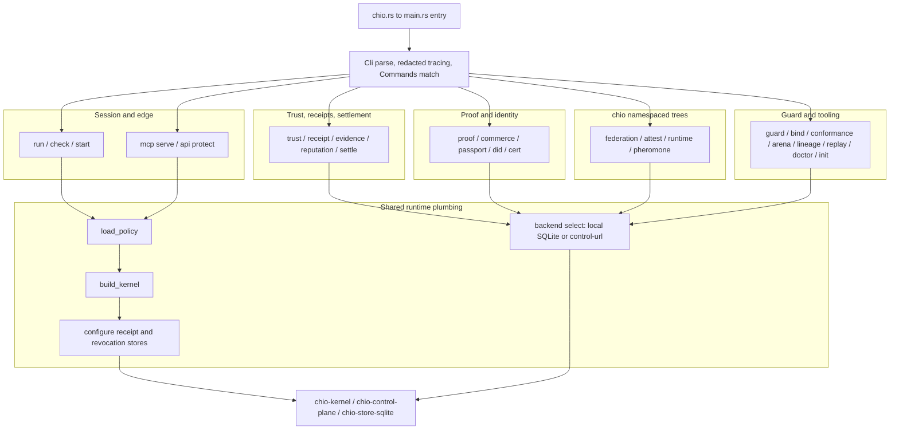

# chio-cli architecture

## Overview

`chio-cli` builds the `chio` binary, the public entry point for the Chio
protocol (`[package.metadata.chio] public_entrypoint = true`). It sits outside
the kernel's trust boundary: the crate parses arguments, chooses a local
(file/SQLite) or remote (`--control-url`) backend, and renders output. Policy
evaluation, capability issuance, artifact signing, and verification are
performed by the crates it calls into (`chio-kernel`, `chio-control-plane`, and
52 other internal `chio-*` crates), not by this crate. Every command
follows the same shape: a clap type defines the surface, a dispatch function
routes it, and either a same-crate module or an external crate implements it.

## Diagram

The local process host in `src/cli/process_host/` composes existing policy
loading, policy-gated capability issuance, the durable authority runtime and
MCP adapters and native mailbox tools with `chio-process`. An exclusive state lock serializes serving
and offline administration before startup reconciliation. Policy hashes and
tool definitions and mailbox quotas are pinned at initialization; the process journal keeps
capabilities, logical operation identities and cancellation across restart.
Connection descriptors are private worker credentials and contain no signing
keys or capability tokens. `tests/process_host.rs` qualifies the CLI boundary
with real MCP and Python subprocesses, host death and original receipt replay.
It also tests a native mailbox-only host without an MCP subprocess. Each
mailbox endpoint uses the same worker invocation and kernel capability path.

## Module map

| Path | Responsibility |
|---|---|
| `src/bin/chio.rs`, `src/main.rs` | Binary entry point. `bin/chio.rs` is a two-line `include!` of `main.rs`. `main.rs` mounts every `cli/*` file as a crate-root sibling module via `#[path]` (not `mod cli;`), re-exports `chio-control-plane`'s policy/kernel helpers and `CliError` at the crate root, and defines `fn main()`. |
| `src/cli/types.rs` + `cli/types/{runtime,trust,receipt,passport,proof,workflow,replay}.rs` | The full `Cli`/`Commands` clap surface: ~29 top-level commands and their nested subcommand trees. Despite its name, `types/runtime.rs` defines Federation/Attest/Arena/Settle/Lineage/Conformance/Guard/Mcp/Api, not `chio runtime` (see next row). |
| `src/cli/chio/types.rs` + `chio/types/{authority,runtime,treaty}.rs` + `chio/types/pheromone/*.rs` | Clap definitions for the `chio`-namespaced trees: `ChioRuntimeCommands` (`chio runtime`), `ChioPheromoneCommands` (`chio pheromone`, the deepest tree in the crate at 7 levels), `ChioAuthorityCommands`/`ChioTrustBundleCommands`/`ChioTreatyCommands` (nested under `chio federation`). |
| `src/cli/dispatch/mod.rs` | `run()`: parses `Cli`, installs the redacting tracing subscriber, matches every `Commands` variant to a dispatch function, writes the terminal error and exit code. |
| `src/cli/dispatch/{trust,api_mcp,market,lineage,settle_arena,reputation_guard,certify_cert,did_passport,receipt_evidence,output}.rs` | Pure routers: destructure one `Commands` variant's clap fields and call an implementation function elsewhere in the crate. |
| `src/cli/dispatch/proof.rs` + `dispatch/proof/*.rs` | Router for `Commands::Proof`/`Commands::Commerce` plus the Transaction Passport verifier engine itself (claim families, required-claim tables, error-to-exit mapping); the fixture catalog (`fixture.rs`, 6275 lines) is generated in part from a workspace-level fixture directory via `build.rs`. |
| `src/cli/dispatch/{federation,attest,runtime,pheromone}.rs` | Routers for the `chio`-namespaced trees. Mostly pure dispatch into `cli/chio/dispatch/*`; `attest.rs` additionally implements `supply-chain verify` and `runtime-quote verify` directly, with no `chio/dispatch/` counterpart. |
| `src/cli/chio/dispatch.rs` + `chio/dispatch/{authority,buyer,io,treaty}.rs` + `chio/dispatch/pheromone/*.rs` + `chio/dispatch/runtime/*.rs` | Implementation layer the previous row's routers call into, reached through a chain of `use super::*` glob re-exports rooted at `main.rs`'s `use chio_dispatch::*;`. Includes the optional iroh P2P transport lane for the pheromone relay (`pheromone/iroh_mount.rs`). |
| `src/cli/runtime.rs` | `cmd_run`, `cmd_check`, `cmd_start`, `cmd_api_protect`, `cmd_mcp_serve[_http]`, `cmd_trust_{serve,status,revoke}`: the session and edge-hosting implementations. |
| `src/cli/session/*.rs` | The `chio run` message loop: agent-message normalization, capability selection, tool-response mapping, session stats, a signed deny receipt on kernel-internal failure. |
| `src/cli/trust_commands.rs` + `cli/trust/*.rs` + `cli/runtime/trust_reports.rs` | `chio trust` implementation: credit, liability, underwriting, runtime-attestation appraisal, capital/exposure/behavioral-feed reports. `cli/trust/receipt/*.rs` physically nests here but implements the separate top-level `chio receipt` command. |
| `src/cli/replay.rs` + `cli/replay/*.rs` | The `chio replay` pipeline: reader, schema/redaction gates, signature and Merkle verification, verdict rederivation, traffic replay/diff/bless. |
| `src/cli/mcp.rs` + `cli/mcp/*.rs` | `chio mcp wrap`: manifest-gated stdio MCP wrapper (default-deny), IDE config emission, tool-scope classification. |
| `src/cli/doctor.rs` + `doctor/*.rs` | `chio doctor`: six ordered environment probes (toolchain, OCI, cosign, OTEL, kernel `/metrics`, `chio.yaml`). |
| `src/cli/conformance.rs`, `cli/arena.rs` | `chio conformance run/fetch-peers`, `chio arena run/replay/evolve`: validated front ends onto `chio-conformance`/`chio-arena`/`chio-replay-corpus`. Arena bounds and validates inputs but does not execute scenarios in-process. |
| `src/admin.rs` | `chio trust provider`/`federation-policy`/`federated-issue`/`federated-delegation-policy-create` and `chio certify registry` CRUD, local-file or remote backend. |
| `src/passport.rs` + `passport/verifier.rs` | `chio passport` and its `policy`/`challenge`/`status`/`issuance`/`oid4vp` subtrees. Unrelated to `chio proof`'s Transaction Passport concept beyond the shared word. |
| `src/market.rs` | `chio guard market`: tenant-scoped pricing, reputation-gated discovery, credit-ceiling-gated install. |
| `src/settle.rs` | `chio settle status`: read-only pending/settled/dead-lettered classification over the receipt-store schema. |
| `src/cert.rs`, `src/did.rs`, `src/lineage.rs` | `chio cert` (on `chio-acp-proxy`), `chio did resolve` (on `chio-did`), `chio lineage` (on `chio-lineage`). |
| `src/archive.rs` | Hardened tar.gz/tar.zst codec (path-traversal, zip-bomb, and symlink guards on both read and write) shared by proof export, pheromone archive packaging, conformance corpus extraction, and guard pack/install. |
| `src/guard.rs` + `guard/*.rs` + `src/commands/{bind,guard_blocklist}.rs` | `chio guard` WASM lifecycle (scaffold, build, inspect, test, bench, pack, publish/pull over OCI, sign/verify, install) and `chio bind` (model-card weights binding). |
| `src/scaffold.rs` + `templates/init/*.tmpl` | `chio init`: renders an embedded example project whose generated `demo.rs` drives a real `chio mcp serve` round trip and prints the resulting signed receipt. |
| `src/policies/mod.rs` | Bundled `chio mcp serve --preset code-agent` policy YAML, materialized to a temp file per invocation so it reuses the normal `load_policy(&Path)` path. |
| `dashboard/` | Standalone React/TypeScript operator dashboard (Vite), built separately to `dashboard/dist/`. `chio proof serve` serves it as a static SPA (falls back to `/opt/chio/dashboard/dist` when not found alongside the crate). |
| `src/main_tests_*.rs`, `tests/*.rs` | `#[cfg(test)]` CLI-parsing/entrypoint-surface suites compiled into the test binary only, and black-box integration tests (roughly one file per command family) that spawn the built `chio` binary. |

## Command dispatch flow

1. `main()` calls `dispatch_cli::run()`.
2. `Cli::parse()` parses argv (clap derive on `Cli`/`Commands`); global flags
   (`--receipt-db`, `--control-url`, ...) are cloned out before the command is
   matched.
3. `init_redacted_tracing()` installs an `EnvFilter` plus a
   `chio_log_redact::RedactionLayer` subscriber so every log field is redacted
   and control-character-escaped before it reaches stderr, then seeds known
   metric label sets.
4. The parsed `Commands` variant is matched to one dispatch function in
   `dispatch/mod.rs::run`'s single `match`.
5. The dispatch function either implements the command inline (rare, for
   example `attest.rs`'s supply-chain and runtime-quote arms), forwards to a
   same-crate module (`admin`, `passport`, `market`, `settle`, `archive`,
   `guard`, `doctor`, `cli/replay`, `cli/trust_commands`,
   `cli/dispatch/proof`), or calls an external `chio-*` crate.
6. `Result<(), CliError>` propagates back to `run()`. `Err` writes a JSON or
   human error envelope (`write_cli_error`) to stderr and exits 1. `chio doctor`
   bypasses this path: it calls `std::process::exit` directly with its own
   worst-severity code. `chio replay` and `chio check` use their own documented
   exit-code registries (see Invariants).

Two dispatch layers exist side by side: flat routers at
`cli/dispatch/{federation,attest,runtime,pheromone}.rs` match each `Commands`
variant, then delegate into the nested `cli/chio/dispatch/*` implementation
tree for the `chio`-namespaced command families (federation, runtime,
pheromone).

## Invariants and failure modes

- Local-versus-remote backend selection is a uniform branch repeated across
  trust, receipt, evidence, passport, and admin dispatch: `--control-url`
  (with `--control-token`, checked by `require_control_token`) selects the
  remote trust-control client; its absence requires the matching local file or
  SQLite path, else the command fails closed rather than defaulting.
- Local receipt reads (`chio receipt list`/`explain`, `chio trust
  evidence-share`/`authorization-context`) require exactly one of `--tenant
  <id>` or `--admin-all`; clap's `conflicts_with` blocks both, and the local
  read-context constructor independently rejects neither being set. Receipt
  operator commands (`health`, `flush`, `checkpoint`, `audit --repair`,
  `retention repair`) are local-only and reject any `--control-url` outright;
  their repair paths are explicitly offline and say so in their own output.
- `chio replay <log>` exit codes: `0` clean, `10` verdict drift, `20`
  signature or Merkle mismatch, `30` parse error, `40` schema mismatch, `50`
  redaction mismatch (`cli/replay/report.rs::exit_code_for`, unit-tested
  against every `EXIT_*` constant). `chio doctor` exit codes: `0`
  ok/info/warning, `1` error, `2` fatal (`doctor::DoctorRun::exit_code`); its
  `--fix` repairs only the `chio.yaml` probe, idempotently.
- `chio check --mode preflight` refuses a policy that has any post-invocation
  guard rather than silently skipping it; `--mode full` requires an explicit
  `--output-fixture`.
- Receipt durability fails closed: booting without a durable
  `--receipt-db`/`--receipt-store` path requires an explicit
  `--allow-ephemeral-receipts` opt-in, and SQLite `:memory:`/`mode=memory`
  sentinels count as no path, not as durable. One-shot local sessions (`run`,
  `check`) auto-opt into ephemeral revocation; the long-running MCP edge never
  does, and denies dispatch without durable revocation, a control URL, or an
  explicit policy opt-in.
- `chio mcp wrap` is default-deny: a tool absent from a promoted manifest, or
  any run with no `--manifest` at all, is denied. `--strict-execution-nonce`
  swaps the pass-through path for an in-process kernel with a two-phase
  mint/present nonce dispatch.
- `chio mcp serve-http` resolves `--auth-token`/`--admin-token` in three
  layers: the flag, then the clap-level `CHIO_AUTH_TOKEN`/`CHIO_ADMIN_TOKEN`
  env vars, then an additional `CHIO_MCP_AUTH_TOKEN`/`CHIO_MCP_ADMIN_TOKEN`
  fallback applied in `cmd_mcp_serve_http`. `chio start`/`chio api protect`
  read a sidecar control token from `CHIO_SIDECAR_CONTROL_TOKEN`, then
  `CHIO_API_PROTECT_CONTROL_TOKEN` (no flag). Remote MCP auth builds a
  default-deny SSRF egress contract over the operator's own configured auth
  URLs, capped at 3 redirects and 1 MiB.
- `chio proof`/`chio commerce` claim verification pulls trusted signer keys
  exclusively from `CHIO_*_TRUSTED_*_KEYS` env vars; a missing var is a hard
  error, never an empty trust-nothing default.
- The archive codec (`src/archive.rs`) rejects absolute paths, `.`/`..`
  segments, backslashes, non-UTF8, and duplicate or case-fold-colliding
  members, and caps compressed size, decompressed size, and member count.
  Extraction never follows symlinks and stages into a sibling directory before
  an atomic rename into place.
- `chio guard publish` requires the manifest's `wasm_sha256` to match the
  built artifact's actual hash and the WIT world to match the pinned
  `GUARD_WIT_WORLD` before it pushes to the OCI registry. `chio guard pull`
  checks a local digest blocklist before caching.
- `chio runtime` orchestration and admission gates are conjunctions, not
  single checks: `orchestrate run` only accepts a run if profile hash, time
  window, evidence freshness, evidence-to-contract binding, and the verifier
  report's own acceptance all hold, each with a distinct failure code. Paired
  flags (`--runtime-trust-input`/`--trusted-verifiers`,
  `--static-package`/`--static-report`) must be supplied both or neither.
- The pheromone relay's optional iroh transport lane (`--iroh-enable`) fails
  closed at load time if a caller requests the revocation or bilateral
  co-sign lanes, rather than wiring no-op stand-ins that would silently fail
  open.
- `chio arena run/replay/evolve` validate and bound their inputs
  (scenario-id charset, `--generations <= 200`, `--wall-seconds <= 1800`) and
  hand off to `chio-arena`/`chio-replay-corpus`; they do not execute scenarios
  in-process.
- The `chio run` session loop signs and returns a `Deny` receipt on a
  kernel-internal evaluation error rather than dropping the request; only a
  subsequent signing failure is logged and dropped.
- `chio cert generate` self-certifies against the caller's own
  `--authority-seed-file`; `chio cert verify` requires a separately supplied
  `--trusted-kernel-pubkey` and always exits 1 on a failed verification.

## Dependencies

52 internal `chio-*` crates (see `Cargo.toml`), grouped by the command
families they back:

- **Kernel and protocol**: `chio-kernel` (session and tool-call evaluation,
  transport) and `chio-core`/`chio-core-types` (capabilities, receipts,
  sessions, messages) back `run`, `check`, `mcp serve[-http]`, and the message
  loop in `cli/session/*`.
- **Control plane**: `chio-control-plane` supplies policy loading, kernel
  construction and configuration, `certify`, `evidence_export`,
  `federation_policy`, `issuance`, `passport_verifier`, `reputation`,
  `scim_lifecycle`, and the `trust_control` HTTP service. Re-exported at the
  crate root, it is the largest single source of business logic behind
  `admin.rs`, `passport.rs`, and the trust/receipt dispatch.
- **MCP edge**: `chio-mcp-adapter` and `chio-mcp-remote` (imported in-code as
  `remote_mcp`) host the stdio and HTTP MCP edges behind `mcp serve[-http]`.
- **Federation and runtime**: `chio-federation`, `chio-federation-authority`,
  `chio-federation-transport-iroh` back `federation`; `chio-runtime-core`,
  `chio-runtime-harness`, `chio-runtime` back `runtime`; `chio-pheromone`,
  `chio-pheromone-relay`, `chio-pheromone-runtime` back `pheromone`.
- **Attestation and identity**: `chio-attest-buyer[-core]`,
  `chio-attest-verify`, `chio-attest-loopback` back `attest`;
  `chio-credentials`, `chio-did` back `passport`/`did`.
- **Guards**: `chio-guard-registry` (OCI publish/pull) and `chio-wasm-guards`
  (wasmtime build/inspect/test/bench) back `guard`.
- **Proof and verification**: `chio-proof-room` (bundle format, dashboard
  serving), `chio-commerce-order`, `chio-swarm-authority`,
  `chio-selective-disclosure`, and `chio-runtime-core` supply the claim-family
  verifiers behind `proof`/`commerce`; `chio-egress-contract` pins the
  public-settlement chain-head fetch to a single host with no redirects.
- **Storage and scenarios**: `chio-store-sqlite` backs local receipt,
  revocation, and settlement persistence; `chio-lineage`, `chio-arena`,
  `chio-replay-corpus`, `chio-conformance` back their namesake commands.
- **Edge hosting**: `chio-api-protect` backs the `api protect`/`start` HTTP
  sidecar.

No dependency in `Cargo.toml` is package-aliased; every `chio-*` name resolves
to the identically-named crate in the workspace root. `axum`, `tokio`,
`reqwest`/`ureq`, `rusqlite`, `tower-http`, and `p256`/`p384`/`ed25519-dalek`
are the externally significant HTTP, storage, and cryptography dependencies.
