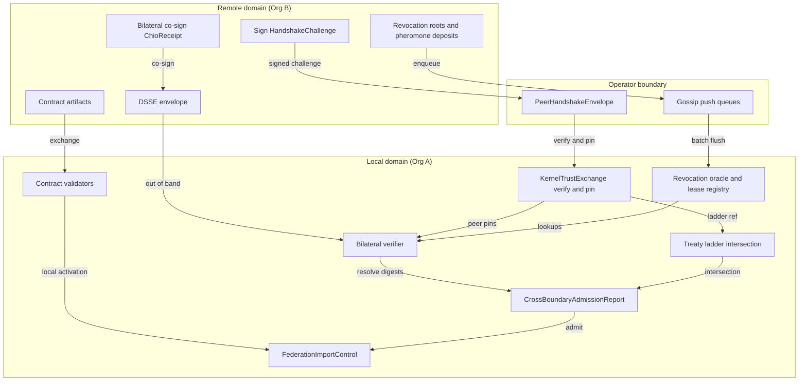

# chio-federation architecture

## Overview

`chio-federation` is a pure library: no I/O, no sockets, no timers,
`#![forbid(unsafe_code)]`. It defines two layers. The first is a set of JSON
contract artifacts (trust activation, quorum reports, open-admission policy,
reputation clearing, a qualification matrix) that operators validate in
memory and exchange out of band. The second is the cryptographic and
protocol mechanics that move and authenticate those artifacts, and the
tool-invocation receipts they gate, across an operator boundary: bilateral
co-signing and DSSE envelopes, an mTLS-style trust-establishment handshake,
governance-ladder treaty intersection, and gossip transport for revocation
roots and pheromone deposits.

Every surface is fail-closed: a malformed, stale, or under-evidenced
artifact is rejected, never defaulted. Admission into federation data does
not imply runtime trust; `FederationImportControl` requires explicit local
activation and manual review before any contract takes effect locally.
Kernel-level artifact issuance and network transport are out of scope:
`chio-federation-authority` issues these artifacts at runtime, and
`chio-federation-transport-iroh` carries the gossip envelopes over the wire.
This crate owns only the shapes, the validators, and the signing and
verification math.

## Diagram

## Module map

| Path | Responsibility |
|------|----------------|
| `src/lib.rs` | Crate doc, re-exports (`capability`, `receipt` from `chio-core-types`; `listing`, `open_market`), and public module declarations. |
| `src/error.rs` | `FederationContractError`, shared by the five root contract-validator modules below. |
| `src/artifacts.rs` | Cross-artifact reference, trust scope, delegation control, and import control shared by every root contract. |
| `src/activation.rs` | Trust-activation exchange artifact and its validator. |
| `src/quorum.rs` | Publisher observation, conflict evidence, anti-eclipse policy, quorum report, and its validator. |
| `src/open_admission.rs` | Federated stake requirement and open-admission policy artifact, and its validator. |
| `src/reputation.rs` | Reputation input reference, sybil control, clearing continuity, reputation clearing artifact, and its validator. |
| `src/qualification.rs` | Qualification case/matrix artifact and its validator; enforces coverage of five fixed `TRUSTMAX-0N` ids. |
| `src/validation.rs` | Private validation helpers (non-empty, uniqueness, hex-digest, positive-money, cross-reference checks) shared by the six modules above. |
| `src/bilateral.rs` | Dual-signed-receipt co-signing protocol (`BilateralCoSigningProtocol`, `InProcessCoSigner`) and the fixture helper that drives signing and verification together. |
| `src/bilateral_dsse.rs` | DSSE wire-format doc and re-exports; declares the five submodules below via explicit `#[path]`. |
| `src/bilateral_dsse/types.rs` | Wire types and constants: `DsseEnvelope`, `DsseStatement`, `BilateralPredicate`, `Keyid`, hash/lease/governance/treaty-binding records. |
| `src/bilateral_dsse/builder.rs` | DSSE PAE encoding and predicate/statement construction for both profiles. |
| `src/bilateral_dsse/policy.rs` | `PolicyEvaluationSummary` validation (verdict agreement, non-empty policy ids). |
| `src/bilateral_dsse/sign.rs` | Envelope signing: local dual-keypair and cosigner-mediated, for both profiles. |
| `src/bilateral_dsse/verify.rs` | Envelope verification for both profiles, plus treaty-binding-ref checks shared with `bilateral_verifier`. |
| `src/bilateral_verifier.rs` | Partial-verifier scope doc, submodule declarations, and re-exports. |
| `src/bilateral_verifier/state.rs` | `PeerPinSet`/`PinnedPeer`, `PinnedEpoch`, and the `ReceiptStore` / `RevocationOracle` / `CapabilityLeaseRegistry` / `GovernanceReceiptStore` traits plus in-memory implementations. |
| `src/bilateral_verifier/config.rs` | `VerifierConfig`, `ActionClassKind`, `UnknownActionClassPolicy`, `VerifiedBilateralCoSignInvocation`, treaty-review input types. |
| `src/bilateral_verifier/cosign.rs` | `verify_bilateral_cosign_invocation` (signature-slice profile) and `verify_chio_bilateral_invocation` (strict Chio profile). |
| `src/bilateral_verifier/error.rs` | `VerifierError` (spec Section 7.1 codes) and the `BilateralCoSigningError` to `VerifierError` mapping. |
| `src/bilateral_verifier/support.rs` | Private canonical-JSON, digest, and verdict helpers shared across the verifier submodules. |
| `src/bilateral_verifier/treaty.rs` | `verify_treaty_bound_chio_bilateral_invocation` and treaty-binding-ref reconciliation against a buyer-supplied review package. |
| `src/trust_establishment.rs` | mTLS-style handshake (`KernelTrustExchange`, `PeerHandshakeEnvelope`), peer-pin store, conformance-tier derivation, `QuorumPolicy` tier gating. |
| `src/treaty.rs` | Governance ladder manifest, treaty scope, ladder-intersection computation, cross-boundary admission evaluation. |
| `src/revocation_gossip.rs` | Revocation-root gossip envelope, per-peer push queue, bounded catch-up/gap-fill protocol. |
| `src/pheromone_gossip.rs` | Pheromone-deposit gossip envelope (direct and multi-hop transit), push queue, transit-policy verification. |
| `src/metrics.rs` | Federation-hop counters and latency histogram, registered under `chio-metrics-spec` names. |
| `src/demo.rs` | `DemoAllowAllRevocationOracle`, gated to `cfg(test)` or the `demo` feature. |

## Protocol surfaces

**Contract documents.** `activation`, `quorum`, `open_admission`,
`reputation`, and `qualification` each define one JSON artifact, a
schema-tag constant, and a `validate_*(&Artifact) -> Result<(),
FederationContractError>` function. Validation checks the schema tag,
required and non-empty fields, cross-field consistency (a quorum report's
`final_state` must agree with its publisher and conflict evidence), and
that `FederationArtifactReference`s resolve to the expected
`FederationArtifactKind`. None of the five touches a store, a wall clock, or
each other.

**Bilateral co-signing and verification.** A tool-host kernel (Org B) builds
a `ChioReceipt`, then either drives `bilateral::co_sign_with_origin[_full]`
against a `BilateralCoSigningProtocol` to get a `DualSignedReceipt` plus a
signature-slice `DsseEnvelope`, or calls
`bilateral_dsse::sign_chio_bilateral_dsse_envelope[_with_cosigner]` to
produce a strict-profile envelope whose predicate carries `tool_args_hash`,
`capability_lease_ref`, and `policy_evaluation_summary`. A verifier holding
a `VerifierConfig` (peer pins, receipt store, revocation oracle, lease
registry, governance receipt store, pinned epoch) calls
`verify_bilateral_cosign_invocation` for the signature-slice profile,
`verify_chio_bilateral_invocation` for the strict profile, or
`verify_treaty_bound_chio_bilateral_invocation` when reviewing a
treaty-bound invocation against an expected binding. Each resolves the
receipt from its own store and compares digests rather than trusting the
embedded payload.

**Trust establishment.** Two kernels each sign a `HandshakeChallenge`
(kernel ids, nonce, timestamp, capabilities, conformance tier, optional
ladder-manifest ref) into a `PeerHandshakeEnvelope` and exchange envelopes
out of band. `KernelTrustExchange::accept_envelope[_with_policy]` checks the
signature, the addressee, the claimed remote id, clock skew, the declared
key against a trust anchor or existing pin, and (with a policy) the
conformance-tier floor, then pins a `FederationPeer` with a `rotation_due`
deadline. `resolve` refuses a pin past that deadline.

**Treaty ladder intersection.** `treaty::compute_ladder_intersection` takes
a `TreatyScope` and one `GovernanceLadderManifest` per participant, confirms
the manifest hashes match the scope, and folds each shared
`action_class_id` into a `LadderIntersectionActionClass` (strictest mode,
union of required evidence, strongest co-sign requirement).
`evaluate_cross_boundary_admission` checks one action request against a
computed intersection (freshness, an explicit intersection-hash binding,
required evidence present and verified) and returns an accept/reject
`CrossBoundaryAdmissionReport`.

**Gossip transport.** `RevocationGossipPushQueue` and
`PheromoneGossipPushQueue` are in-process, per-peer FIFO queues: a producer
enqueues a signed artifact, a periodic flush drains each peer's queue into a
batch envelope, and a transport outside this crate delivers the batch.
Revocation gossip also serves `respond_to_catchup`, which returns a
bounded, gap-free suffix of epoch history from a `RevocationCatchupHistory`
implementation.

## Invariants and failure modes

- Every root-contract validator returns `Result<(), FederationContractError>`
  with no partial-success path: schema tag, required fields, and
  cross-references are checked before any `Ok`.
- `FederationImportControl` and `FederationDelegationControl` validate
  all-or-nothing: every field must already hold the safe value (explicit
  local activation, manual review, stale-input rejection, attenuation
  required, visibility-only-until-activation), so an exchange cannot opt out
  of any one of them.
- `open_admission` and `reputation` bound their numeric fields
  (`weight_bps`/`oracle_cap_bps` in `1..=10_000`, bond amounts positive with
  an uppercase 3-letter currency code) so a policy cannot advertise
  unbounded or ambiguous collateral.
- `qualification::validate_federation_qualification_matrix` fails unless the
  matrix's cases jointly cover all five fixed `TRUSTMAX-01`..`TRUSTMAX-05`
  ids.
- Each protocol surface below the root contracts owns its own error enum
  rather than sharing `FederationContractError`:
  `bilateral::BilateralCoSigningError`, `bilateral_verifier::VerifierError`,
  `trust_establishment::PeerHandshakeError`, `treaty::FederationTreatyError`,
  `revocation_gossip::RevocationGossipError`,
  `pheromone_gossip::PheromoneGossipError`. All reject the offending
  artifact rather than defaulting it.
- The strict Chio predicate (`PREDICATE_TYPE_CHIO_BILATERAL_INVOCATION`) and
  the signature-slice predicate (`PREDICATE_TYPE_BILATERAL`) are mutually
  exclusive on the wire: `receipt_canonical_json` is required by one and
  forbidden by the other, and `tool_args_hash` is the reverse. A verifier
  for one profile rejects an envelope built for the other.
- `verify_chio_bilateral_invocation` additionally requires both pinned peers
  to carry a `LadderManifestRef` that is fresh at the verifier's pinned
  epoch; that reference is only ever populated by a prior
  `trust_establishment` handshake.
- `KernelTrustExchange` never auto-renews a pin: `resolve` fails once
  `now >= rotation_due`, and the caller must re-run the handshake. The
  module does not track handshake nonces itself; replay protection is a
  transport-layer responsibility.
- `validate_governance_ladder_manifest` (and the intersection it feeds)
  rejects a `destructive` action class that resolves below `receipt_backed`
  mode or pairs with `crdt_commutative` consistency, and rejects any
  manifest whose `default_unknown_mode` is not `"deny"`.
- `RevocationCatchupRequest` caps one exchange at
  `REVOCATION_CATCHUP_MAX_EPOCHS` (4096) and rejects an inverted range;
  `respond_to_catchup` stops at the first internal gap in its own retained
  history instead of skipping over it.
- `verify_pheromone_gossip_frame` requires a relayed deposit's transit chain
  to start at the deposit's own origin, stay within the deposit's
  `treaty_scope`, pass through at least one `accepted_hubs` entry, and never
  repeat a kernel hop.

## Dependencies

Internal: `chio-core-types` supplies the receipt, capability, canonical-JSON,
and crypto primitives the bilateral, DSSE, and handshake mechanics sign and
verify (only `capability` and `receipt` are re-exported at the crate root;
the crate also reaches into `chio_core_types::crypto` and
`chio_core_types::canonical` directly by full path). `chio-listing`
(re-exported as `listing`) and `chio-open-market` (re-exported as
`open_market`) supply the actor-kind, admission-class, freshness, publisher,
bond-class, and fee-schedule types the root contracts validate against.
`chio-metrics-spec` supplies the federation-hop metric names and latency
buckets. `chio-pheromone` supplies `PheromoneDeposit`, transported by
`pheromone_gossip`. `chio-revocation-oracle` supplies
`EpochRoot`/`SignedEpochRoot`/`RootSignature`, transported by
`revocation_gossip`. Dev-only: `chio-kernel-core` supplies `RevocationView`,
the verifier-side surface `tests/oracle_gossip_e2e.rs` exercises.

External: `serde`/`serde_json` (every wire artifact), `thiserror` (the
per-surface error enums), `base64`/`sha2`/`hex` (DSSE PAE encoding and
verification, canonical digesting, and keyid fingerprints, used across the
`bilateral_dsse` and `bilateral_verifier` module trees). No dependency in
this crate's `Cargo.toml` is aliased via `package = ...`.

## Extension points

- `bilateral::BilateralCoSigningProtocol` - remote co-signature transport;
  production wraps an mTLS-backed RPC client, `InProcessCoSigner` is the
  in-process reference implementation.
- `bilateral_verifier::{ReceiptStore, RevocationOracle,
  CapabilityLeaseRegistry, GovernanceReceiptStore}` - verifier-side lookups;
  each has an `InMemory*` reference implementation.
- `trust_establishment::FederationPeerStore` - pinned-peer persistence
  (`InMemoryPeerStore` is the default).
- `revocation_gossip::RevocationCatchupHistory` - backing store for the
  catch-up responder.
