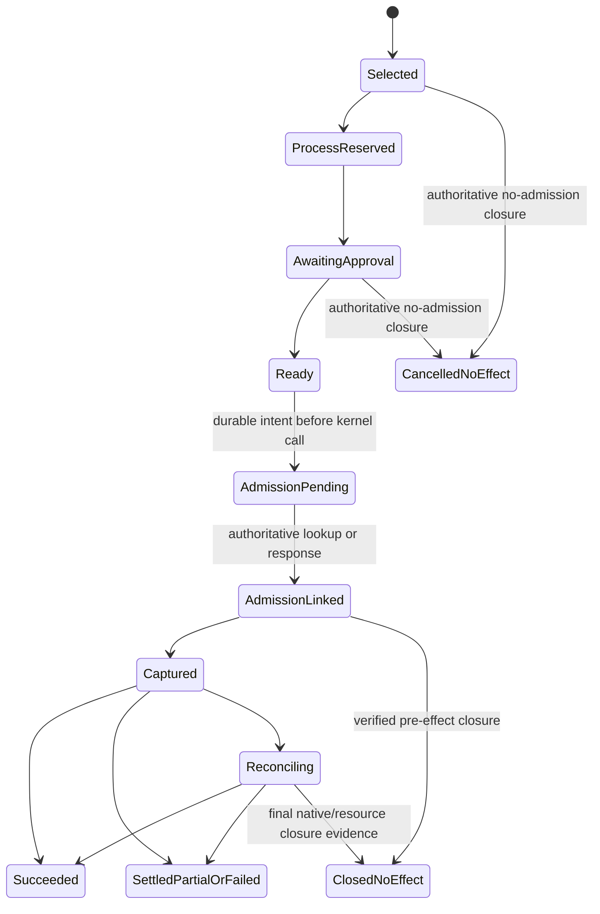

# Recovery, exact approval and durable continuation protocol

## Identities

An application creates a workflow using an authenticated tenant/process identity and a caller idempotency key. The same key plus the same canonical intent returns the same workflow; changed content conflicts. A workflow is coordination identity, not a capability. Each planned effect has a stable `StepId`; each attempt to remedy a known no-effect failure of that step gets a distinct continuation. A continuation is one prospective immutable tool call. A native admission operation remains the execution owner.

A completed step cannot acquire another continuation. A prerequisite's success may enable a different step in the approved DAG, with its own purpose and authority. The workflow serializes unresolved effectful steps initially; this is not a claim that an entire multi-step workflow has only one effect. Compensation is a separately authorized step and never erases the original history.

Reserve a continuation identifier and deterministic process operation key before requesting approval, without admitting the final tool request. This resolves the apparent cycle: approval can bind the future request identity, then the finalized request can include that signed approval before its first process admission.

The process layer needs a host-only, idempotent `reserve_recovery_call` operation. It reserves the existing process-derived request ID and logical-call slot under a continuation reference and unsigned intent digest. It returns the same reservation on replay and conflicts on changed intent. Finalization records the final process binding once and atomically connects it to `process_calls`; ordinary `invoke` must refuse an unfinalized or foreign recovery reservation. Reservation failures cannot cause a second key to be minted. No network operation occurs in this process-store transaction.

The final process binding is not just a serialized request hash. Existing `invoke_with_recovery` normalizes the first request ID, hashes the complete caller-supplied request, then binds known-outcome-only mode, the host route and the security profile. Extract and reuse that exact owning derivation for reservation finalization and invocation; retain separate `ProcessRequestDigest` and `ProcessCallBindingDigest` types. Route/profile selection is host-owned and frozen with the reservation. Finalization consumes the previously reserved logical-call slot exactly once, without a second increment through ordinary admission. Byte-equivalence fixtures preserve existing legacy hashes and refuse changed recovery mode, route or profile. The operation-owned nonce attachment below is a distinct existing protocol, not a mutation of this caller-supplied envelope.

Existing call identities and read-only retry rules remain stable. New effectful recovery uses the equivalent of existing `invoke_known_only`. A distinct workflow cannot be assumed globally equivalent to another merely because its text resembles it; application-level idempotency keys and provider resource contracts define that wider boundary.

## From a candidate plan to an exact offer

The pure planner can propose a `CandidatePlanV1` before every future result exists. Its bounded DAG declares step purposes, registered operation templates, fixed resource/recipient constraints, permitted output schemas, evidence predicates and authority requirements. Symbolic edges name prior step outputs; they are not fabricated evidence digests or wildcard authority. Accepting this plan agrees to its bounded behavior. It does not approve undisclosed future bytes or mint grants for every step.

Only an executable step becomes a `RemedyOfferV1`. The host first verifies its completed prerequisite evidence and materializes exact arguments, artifact versions, destination and output disposition. It assigns the prospective continuation and namespaced operation key, then predicts the first-call request ID with the existing deterministic `ProcessRuntime::request_id` derivation. This prediction allocates no quota and grants no authority. The immutable signed offer binds that complete action. Selection and the process reservation bridge then claim exactly the predicted identity before approval; an occupied or mismatched key conflicts and cannot be silently replaced under the same offer.

After a prerequisite or input transformation succeeds, the next step receives its own materialized intent and offer. A changed or nondeterministic result is fresh evidence, never an in-place edit to an approved intent. The verifier checks every resolved value against the retained plan's constraints. Exact disclosure approval waits until the final bytes and required facts are available. Out-of-contract values require a new accepted plan revision while preserving all prior operations and effects.

An effectful prerequisite has its own native operation and any required exact authority. Output transformations whose bytes become known only after an external effect keep those bytes staged: a prior policy may authorize a pinned reusable projection, or a later exact release approval may authorize the resulting artifact. Neither choice permits resending the completed external operation. A driver may automatically select a subsequent offer only under explicit selection capability and the retained accepted plan; it cannot supply missing reviewer or owner authority.

## Canonical binding without recursion

Define `ActionIntentV1` over: authority-domain ID; tenant/process/capability identity and capability signing-body digest; workflow/step/continuation/request identity; normalized server/tool and provider destination; canonical argument/artifact-version references; purpose; selected remedy; output disposition; prerequisite evidence digests; policy/contract/authority versions; input confidentiality/influence basis; exact authorization requirements; and isolation lineage/epoch. Governed intent, model metadata constraints, federation identity and every other semantic request field require an explicit projection rule. There is no default rule that drops a field because it is outside the tool arguments.

Exclude authorization signatures, native-issued nonce bytes and the final process-request hash from this unsigned body. Their unsigned requirements and permitted attachment protocols remain bound. Compute `IntentDigest = SHA256(domain || 0x00 || canonical(ActionIntentV1))` using the exact domain in the contract catalog. The reviewed caller envelope is constructed after its fixed authorization artifacts arrive and hashed with the existing process derivation. Native admission computes its different immutable-material binding through its owning kernel API. Retain these digests separately and verify the semantic and authorization projections of the complete envelope against the intent. Exclusion from an action digest is not permission to vary a frozen process request.

`AuthorizationRequirementsV1` is unsigned reviewed data, embedded in the action. It fixes the source-label/influence basis, exact admitted target label, requested confidentiality and integrity powers, recipient/purpose, affected owner/compartment obligations, permitted issuer/delegation scopes, validity ceilings and native attachment profile. Grant identity, signatures and approval evidence are absent. Compute requirements before the action; then compute the offer, review intent, authenticated decisions, coverage evidence, grant and finalized request in that order. None refers to its own or a later object's digest. Native verification recomputes the required restriction changes and rejects a grant whose target or powers differ, even when its tool arguments and destination match.

An explicitly supported owning protocol may attach its own retained credentials without changing the frozen caller envelope. Excluding a field from action identity alone does not authorize refresh. Provider destination, request body, tool schema, output treatment and recovery policy are never implicitly refreshable. An expired capability or changed body requires a new reviewed intent and continuation closure protocol for new work; historical settlement follows its distinct authority contract.

### Exact envelope custody and operation-owned attachments

Retain a bounded `FinalizedRequestEnvelopeV1` in protected authority custody before process finalization can succeed. It contains the exact canonical caller-supplied request, fixed authorization artifacts or durable exact-byte references, action/requirements/process digests and the pinned route/profile/mode. P1 can use bounded protected rows; it does not need the complete P4 artifact backend. Resolve every reference and verify the complete process digest before invoking. A stored digest alone cannot reconstruct a signed request after restart. Missing or corrupt custody refuses live progress; it cannot be repaired by obtaining a fresh signature under the same call key.

Keep that envelope separate from the existing native `RetainedToolAdmissionRequestV1`, which deliberately strips one-shot credentials and uses its own immutable-material hash. Do not add those credentials back to the native historical record or expose them through workflow views. Prefer the existing authority-owned credential custody where its exact binding, durability and readback contract suffice; otherwise add a narrowly protected record under the same authority. Pin required bytes through unresolved work, then retain replay tombstones under the declared retention policy. Custody and successful decoding confer no current execution authority.

Strict nonce mode has a closed two-stage protocol. The existing process layer freezes the initial request, obtains or loads the original native issuance, retains it in `process_call_nonces`, and presents it in a derived execution request. The kernel binds that issuance to the same native operation. P1 recovery must preserve this path:

1. Retain admission intent before nonce preflight, not merely before the final execution call. Preflight already owns native state and may join source knowledge or reserve an internal budget hold.
2. Recover missing nonce acknowledgements from the original native issuance and compare/attach those exact bytes to the original process call. An absent process nonce row is not proof that issuance never committed. No renewal, second nonce or new operation key follows from a lost acknowledgement.
3. Present only the original issuance as a typed native attachment. The process envelope/digest stays unchanged, the kernel's immutable-material binding stays unchanged, and native nonce equality/consumption supplies the separate attachment authority. Changing a grant, DPoP proof or capability is not this attachment.
4. Before capture, validate cancellation, current authority and the existing nonce lifecycle. An expired unbound nonce cannot be renewed in place. After native binding, use the operation's existing phase/deadline rules; do not invent a blanket nonce-expiry check that prevents historical settlement.
5. Close preflight only through owning native evidence that fences execution and accounts for nonce, internal hold and knowledge participants. Apply the proven same-call knowledge transition rule to preflight as well as dispatch preparation.

Required native feature combinations are explicit deployment profiles. A profile combining recovery with an unsupported nonce, governed-approval, DPoP or supplemental-authority lifecycle refuses; it cannot disable that participant. Historical reconciliation retains the original participant inventory. P1 qualification includes ordinary and strict operation-owned nonce paths plus every other combination it advertises.

## Offers and authority

`RemedyOfferV1` contains schema/domain version, offer ID, workflow and proposed action digest, parent denial/effect observation reference, bounded typed plan, source observation basis, issuer/key/deployment identity, expiry and safe explanation reference. The host signs it for authenticity and retains it in the serving authority. The caller's authenticated channel determines who may inspect/select it; possession of an offer ID grants nothing. The server reloads and revalidates its retained offer, not client-supplied fields.

A plan can request exact disclosure, select a registered destination, run an authorized transformation, obtain an evidenced prerequisite, withhold output, or create a confined reader/return. User acceptance of narrower behavior is explicit and bound to the plan digest. It cannot endorse an arbitrary description or modify the selected plan in place.

Only one selected effectful continuation may own a workflow at a time. Selection uses expected workflow revision and an idempotent command ID; same command/same body returns the same retained result, changed body conflicts. Multiple offers may remain viewable but cannot each acquire ownership. A plan's prerequisite DAG allocates calls deterministically and records each dependency's authoritative result. Its default execution is sequential; parallel read-only prerequisites require a separately qualified profile and cannot use effectful grants.

## Disclosure grant v2

Keep existing v1 verification for explicitly selected legacy profiles. Introduce a closed v2 signed body for recovery, retaining every v1 claim and adding a mandatory binding:

```text
RecoveryGrantBindingV1
  authority_domain_id
  workflow_id / step_id / continuation_id / process_id
  native_request_namespace_digest / request_id
  action_intent_digest
  selected_offer_digest / approved_plan_digest
  policy_digest / semantic_contract_digest / authority_scope_digest
  isolation_lineage_id / isolation_epoch_id
  output_disposition_digest
```

The v2 body binds the exact native request identity known after process reservation; it need not contain an operation ID that the admission store has not allocated. At admission, the kernel binds that request to the actual operation ID and retains the join. V2 signatures use a distinct domain and a closed mandatory version. A v2 artifact can never be decoded as v1 by dropping fields. A recovery-capable deployment rejects a v1 grant as recovery authority, even if its content, signer and purpose otherwise match.

Approval has two linked layers. The reviewer authorizes a bounded `ApprovalIntentV1` with the exact rendered action, authorization-requirements digest, source/recipient facts and expiry. The trusted issuer verifies reviewer identity, tenant and authority scope, then signs v2. A human approval is not automatically data-owner authority. The issuer must satisfy every affected owner and compartment policy. P1 uses one recovery grant and an explicit operator-scoped aggregate issuer after collecting the all-required bounded attestation set. This issuer has no implicit universal power: native verification independently checks the coverage evidence and authority configuration. Without such an authorized issuer, this profile refuses. A direct multi-grant execution protocol requires separate qualification; multiple ordinary v1 grants are not a substitute.

Compute required coverage from the exact source-to-target restriction change and integrity request. Every contributing attestation binds the same action, requirements, review intent/challenge, tenant/domain and source basis; it names the obligations that signer is currently authorized to discharge. Verify all required obligations before exposing a prepared grant. Deduplicate attestation identities and represented principals so repeated signatures, rotated keys and delegation aliases cannot manufacture additional approvers. Owner release, compartment release, user acceptance and integrity endorsement are separate obligation classes. A data owner's approval cannot satisfy an endorsement requirement merely because the same key is trusted elsewhere. Threshold policies, if supported, count their declared distinct principals within an obligation, never the length of a signature vector.

Coverage is conjunctive evidence for one exact target, not a sequence of progressively weaker target labels. All checks and one-shot consumption feed the existing native grant participant. Failed composition exposes no partially authorized release; any already retained consumption remains conservative native history. Empty, partial, foreign-action, expired or wrong-power coverage refuses even if an individual signature verifies.

Grant v2 remains a disclosure grant. Integrity endorsement is a separate typed authority path with its own verifier and native participant; a disclosure signature cannot substitute for it. An endorsement-only action needs no fabricated no-op disclosure grant. P1's disclosure profile requires confidentiality coverage; P3 may add separately typed endorsement evidence to the same reviewed action. Complete action authorization is the conjunction of its declared participants, not an expansion of the disclosure grant's powers.

Review displays use the same canonical action projection as verification. Distinct recipients, transformed bytes, attachments and purpose are visible or precisely referenced through an authorized artifact preview. A viewer who cannot read protected input may approve only a policy-authorized projection; the UI must not fabricate an exact-content approval from hidden or truncated material. Decision requests and notifications themselves pass audience/egress checks.

Native capture rechecks current revocation, trusted authority, clock, capability, policy/contract selection, source knowledge and available budget. Offer expiry and grant expiry are independent. Revalidation uses scoped object revisions so unrelated tenants do not stale an offer. The first implementation starts conservatively with exact relevant policy/contract/source/authority equality; capability revocation and affordability are fresh predicates, not a copied balance or blanket database generation. No monetary budget is reserved merely to render an explanation or wait for human approval; the selected process call still reserves its logical-call slot.

Resolve the approval basis after retaining all input already observed. If native preparation adds the same call's required input observation, verify its exact monotone transition from the recorded basis and the signed resulting source join. Do not confuse that proven self-transition with unrelated concurrent knowledge changes or blindly ignore a changed generation. Additional observed knowledge or a changed source join requires replanning and, where authority scope changes, fresh approval.

### Durable approval and grant issuance

Retain each exact approval intent, challenge and authenticated decision under the issuing authority. A unique issuance key uses authority domain, issuer scope, challenge and any fixed issuance slot declared by the approval intent. Action and coverage digests are immutable compared values, not extra key fields that allow the same challenge to address another row. Before calling a signer, reserve the exact immutable grant body, including grant identity, signing key, issuance time and expiry. Signing occurs outside the store transaction. Verify and durably attach the resulting signature before exposing the grant. A crash after signing but before attachment recovers the same body and identity; a lost response returns the retained signed grant, never a fresh grant with a later expiry.

Issuer-side `CommitUnknown` requires readback of that issuance key. Cancellation or expiry while signing prevents publication and cannot unconsume the original challenge. Fresh consent uses a new approval intent/challenge; it may retain the same unsigned action only while its basis is current and the process request is still unfinalized. Once the final request is frozen, replacing its grant requires the normal verified closure and new-continuation protocol. External issuers must expose equivalent idempotency and evidence semantics through the bound issuer contract; the initial profile may refuse issuers without them.

## Authoritative records and transactions

The recovery execution owner lives in the existing serving authority database under its mutation fence and rollback protection. Proposed protected tables:

| Table | Key and purpose |
|---|---|
| `recovery_workflows` | Tenant/domain/workflow; revision, original intent, active continuation, terminal disposition |
| `recovery_steps` | Workflow/step; approved-plan binding, dependencies and settled effect disposition |
| `recovery_offers` | Workflow/offer; immutable body, issuer/signature, basis and expiry |
| `recovery_continuations` | Workflow/continuation; parent closure, process reservation, action/request/process-binding digests, immutable admission intent and native-operation reference |
| `recovery_request_envelopes` | Continuation; protected exact reviewed request and authorization custody/reference inventory, process digest and retention pins |
| `recovery_commands` | Authenticated actor/command ID; command digest and retained result reference |
| `recovery_approvals` | Issuer/domain/challenge; immutable review intent, authenticated decision, validity and consumption state |
| `recovery_grant_issuances` | Unique issuance key; reserved canonical grant body, signing-key binding, signature attachment and publication state |
| `recovery_events` | Append-only sequence; typed transition and classified evidence references |
| `recovery_deliveries` | Transactional notification outbox; idempotent delivery without execution authority |

The active-continuation constraint is enforced inside the authoritative transaction, not by a cached boolean or partial index alone. Row creation and events are committed together. Native operation/capture linkage participates in the same admission mutation protocol and protected participant inventory. Table edits outside the owning adapter cannot manufacture accepted evidence.

The process journal is a separate database. Do not use SQLite `ATTACH` to pretend it shares the serving authority's commit. Use an idempotent, ordered bridge:

1. **Select:** authority CAS retains one selected continuation and immutable intent basis. No native dispatch is possible.
2. **Reserve process call:** the process journal reserves its deterministic identity/slot. Repeated selection recovery reuses the same continuation key.
3. **Attach reservation:** authority CAS verifies the process/runtime/capability reservation and retains it. Lost acknowledgement is resolved by exact readback.
4. **Approve/finalize:** collect exact v2 authority, construct and retain the reviewed request envelope, then finalize the process reservation from that custody. Attach its immutable digest to the continuation. Resolve uncertain commits by exact readback; never regenerate fixed proof bytes.
5. **Admit/capture:** first retain an immutable admission intent under the serving authority, binding the finalized process request/binding and the kernel's complete existing admission lookup identity. Enter even a nonce preflight only after its known commit. Native attachment issuance/readback follows the owning protocol above. The recovery participant validates workflow ownership, current basis, request/grant binding and serving fence inside native capture. The continuation-native-operation link and capture evidence commit through the existing authority protocol before execution ownership is released.
6. **Effect/outcome:** execute only with the captured native owner. Reconcile and retain outcomes using existing kernel/resource contracts.
7. **Project:** update workflow status from verified native evidence and deliver a classified result. A lost workflow projection or notification cannot create another dispatch.

The process store may temporarily contain an orphan reservation. It is safe because it grants no dispatch authority. Reconciliation either attaches it to the same selected continuation or closes it under verified no-capture evidence. Logical-call reservations are not refunded automatically. The authority store must retain enough links to prevent a restored/stale process journal from allocating a fresh identity for an existing workflow.

An admission intent means admission may have happened even when the response or workflow projection is missing. Reconciliation resolves the existing kernel lookup identity and validates its full request binding; it never waits for a callback to supply the only operation reference. An unavailable lookup, lagging projection or absent local process response is not no-admission evidence. Pre-admission closure requires an authoritative terminal tombstone that fences late submissions for that exact intent, checked by both admission and capture. If the present kernel ports cannot establish this closure, P1 must add them and their cutpoint tests. Do not close from a negative read followed by a separate write.

## State machine and closure

The first draft used a flat state enum that mixed execution, output release and workflow control. Revision 2 separates those facts. Recovery-owned progress records selection, process reservation/finalization and immutable admission intent. Native evidence owns admission, capture and effect settlement. A separate release record owns output staging, approval and delivery. Durable cancellation and quarantine gate new work without changing native effect facts. Constructors and store transitions validate legal combinations; this is not a bag of independently writable booleans.

Native effect observations distinguish unresolved, verified no-effect closure, and settled effects with a disposition of succeeded, partially applied or failed after effect. A settled operation with any effect permanently spends that step's execution identity. Known partial failure cannot reopen it and cannot satisfy a successful-prerequisite predicate. Compensation or work on a verified unaffected remainder is a separately reviewed step with exact scope. If any participant can still produce an unaccounted effect, settlement remains unresolved.

The owning native participant inventory determines finality. A resource success response alone cannot close native caller-report, dispatch or return custody that remains unresolved. Separating result views does not authorize bypassing that inventory. Any transfer from existing return custody into a separately admitted release needs an explicit native handoff with retained ownership, or must wait for the original contract to settle.

`OutputWithheld` is a result projection, never the effect state. An external operation can be settled while its output awaits approval, remains withheld or has uncertain delivery. Later release operates on the retained exact result under a distinct release identity; it cannot resend the external tool. Public phase names such as `WaitingForApproval`, `ReconciliationRequired`, `CompletedWithEffects` and `Withheld` are derived views. They may lag native truth and are never closure evidence.

The following diagram shows only the execution dimension. Cancellation, quarantine and result delivery are separate:



Failures and ambiguity may move any nonterminal stage to reconciliation or quarantine, not back to an earlier executable stage. Native approval-required operations follow their existing lifecycle, which may differ from the new pre-admission approval flow. Unsupported combinations refuse until mapped explicitly.

Quarantine retains unresolved ownership and its replay/retention pins. It cannot free the active slot because a decoder or verifier failed. An operator may repair evidence or configuration and request reconciliation; a generic force-unlock cannot replace verified closure. Durable workflow cancellation blocks future selection/admission while permitting reconciliation and authorized observation of previously captured effects.

To release the execution slot, the owning authority verifies complete effect settlement or an irreversible no-effect closure. Any settled effect prohibits replacement of that step, regardless of output availability. A no-effect closure binds operation or never-admitted intent, version, complete participant inventory, current serving fence and final disposition; it closes late admission and old dispatch attempts before another continuation becomes selectable. A caller-side denial string cannot supply it. Output-release records and references remain pinned independently until their own obligations settle.

## Cutpoint behavior

| Interruption | Recovery |
|---|---|
| Before selection commit | Replay command; select at most once |
| Selection committed, response lost | Read exact command result; same continuation |
| Process reservation committed, attachment absent | Reopen deterministic reservation; attach once |
| Approval received twice | Same decision/grant retained once; conflicting decision refused |
| Request finalized, authority attachment absent | Read exact process hash; attach same request |
| Kernel admitted/captured, response or workflow link lost | Resolve the retained admission intent through native lookup; retain the same operation |
| Native capture may have committed | Reconcile original native operation; never reconstruct a live permit |
| External effect happened, response lost | Preserve unknown outcome and original provider identity |
| Outcome durable, workflow projection absent | Verify outcome and repair projection only |
| Result notification lost | Redeliver authorized projection; no effect retry |
| Expiry/cancellation after capture | Reconcile; preserve consumed authority and reservations |
| Old worker resumes after takeover | Native/store epoch checks reject its mutation/capture |

## Obligations

| ID | Normative obligation | Proposed acceptance test | Phase |
|---|---|---|---|
| REC-01 | Workflow creation/commands MUST be idempotent and conflict on changed canonical content. | `recovery::command_replay_and_substitution` | P1 |
| REC-02 | Continuation selection MUST atomically enforce one unresolved effectful continuation. | `recovery::two_coordinators_select` | P1 |
| REC-03 | Approval MUST bind an identity reserved before immutable request admission. | `recovery::reserve_approve_finalize_restart` | P1 |
| REC-04 | Existing frozen requests MUST never be rewritten to add grants or refreshed authority. | `process::frozen_request_authorization_conflict` | P1 |
| REC-05 | Recovery grants MUST use v2 and refuse downgraded, stripped or cross-workflow bindings. | `grants::v2_binding_and_downgrade_vectors` | P1 |
| REC-06 | Owner/compartment approval coverage MUST be verified against operator authority scope. | `grants::multiple_owners_require_coverage` | P1 |
| REC-07 | Approval presentation MUST bind the exact canonical action and authorized preview. | `approval::display_digest_and_recipient_substitution` | P1 |
| REC-08 | Native capture MUST own the recovery participant, grant consumption and budget join. | `native::recovery_capture_participant_atomicity` | P1 |
| REC-09 | Cross-store attachment MUST recover idempotently without assuming a distributed transaction. | `recovery::process_authority_bridge_cutpoints` | P1 |
| REC-10 | Active ownership MUST close only from authoritative final effect/no-effect evidence. | `recovery::closure_requires_all_participants` | P1 |
| REC-11 | Reconciliation MUST never reset consumed grants or create a fresh identity for an uncertain effect. | `recovery::unknown_does_not_reset_authority` | P1 |
| REC-12 | A bounded plan's prerequisite edges MUST reference verified effects under exact scope and provenance. | `recovery::prerequisite_substitution_and_cycles` | P3 |
| REC-13 | Withheld output MUST preserve completed-effect identity and prevent replacement dispatch. | `recovery::withheld_output_is_not_no_effect` | P3 |
| REC-14 | Offer use MUST revalidate scoped versions, fresh revocation, budget and time. | `recovery::basis_change_between_review_and_capture` | P1 |
| REC-15 | Existing pending native approval operations MUST retain their owning resume protocol. | `recovery::native_pending_approval_adapter` | P1 |
| REC-16 | Capture MUST distinguish the proven same-call input observation from unrelated source-generation changes. | `recovery::self_observation_and_concurrent_knowledge` | P1 |
| REC-17 | Exact offers and approvals MUST bind materialized step inputs; accepting a plan MUST NOT authorize unknown future output or bypass per-step authority. | `recovery::prerequisite_result_materialization` | P3 |
| REC-18 | Approval/grant issuance MUST retain one exact challenge-bound body across signing, lost acknowledgements, expiry and restart. | `approval::issuer_sign_attach_publish_cutpoints` | P1 |
| REC-19 | Admission intent MUST be durable before entering the kernel, and closure MUST fence late admission using authoritative state even when projections are absent. | `recovery::admit_before_link_and_late_submission` | P1 |
| REC-20 | Partial or failed-after-effect settlement MUST spend the step identity independently of result availability and cancellation. | `recovery::partial_effect_and_delayed_release` | P1 |
| REC-21 | Reservation finalization MUST reuse the existing complete process binding and charge the logical-call slot exactly once. | `process::finalization_binding_and_quota_equivalence` | P1 |
| REC-22 | Approval and coverage MUST bind the exact unsigned authorization requirements and satisfy every required authority class for the same action without cycles or duplicated approvers. | `grants::coverage_conjunction_target_and_binding_graph` | P1 |
| REC-23 | Finalization MUST retain recoverable exact request and fixed authorization custody separately from credential-free native history. | `recovery::signed_envelope_custody_after_restart` | P1 |
| REC-24 | Recovery MUST preserve operation-owned nonce preflight, exact issuance attachment and phase-specific closure without rewriting the frozen process envelope. | `recovery::nonce_preflight_lost_ack_and_expiry` | P1 |
