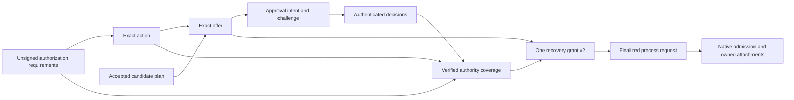

# Contract catalog and authority-port semantics

This is the proposed implementation contract catalog. Bodies are bounded, closed, canonical typed data. Actual JSON schemas and generated bindings are P0/P1 implementation work. This catalog reserves meanings and field obligations, not a permissive generic map that implementations may interpret differently.

## Common envelope and digests

Signed artifacts use the existing Ed25519/canonical-body primitives and an explicit artifact-specific domain. The implementation must register new domains in the repository's existing domain/schema inventory and supply cross-domain substitution vectors. Signature framing follows the owning signed-artifact conventions; do not implement another signing utility in the recovery crate.

Proposed digest domains are UTF-8 strings terminated by a zero byte, followed by canonical body bytes: `chio.recovery.action-intent.v1`, `chio.recovery.offer.v1`, `chio.recovery.plan.v1`, `chio.recovery.basis.v1`, `chio.recovery.explanation.v1`, `chio.semantic.deployment.v1`, `chio.artifact.provenance.v1`, and `chio.isolation.return-contract.v1`. Digests use existing SHA-256. The framing is `SHA256(domain || 0x00 || canonical_body)` with no implicit whitespace or string interpolation. These new digest meanings never replace existing request/receipt digest algorithms.

Grant v2 uses signature domain `chio:declassification-grant:v2`, distinct from existing `chio:declassification-grant:v1`, followed by a zero byte and canonical v2 body exactly as the existing grant signing helper frames v1. All signed bodies bind their schema/version and authority/deployment scope where relevant. The signer key identifier is verified against the selected trust policy; an embedded public key is not its own trust root. Raw digest bytes use the existing generated digest representation, not a new case-insensitive string convention.

The new tool-request protocol carries an explicitly version-selected disclosure-grant sum type. Its request/profile version and signed body's version must agree. Do not implement an untagged decoder that tries v2 and falls back to v1, or add security-relevant optional fields that old hosts silently ignore. Historical v1 request bytes retain their original decoder and identity; new recovery requests require the v2-capable profile.

The retained `chio.recovery.action-intent.v1` contract has two explicitly admitted contextual profiles. The legacy compatibility shape omits `origin` and remains decodable with its original canonical bytes and digest. That shape supplies historical evidence only; it cannot establish authority for fresh recovery selection, review, issuance or capture. The fresh native profile requires the complete closed `origin` object binding the original operation, request and verified effect-free closure. Only native context verifies that original operation and determines freshness. A schema validator or generated model validates the wire shape and cannot grant freshness. Explicit `origin: null`, incomplete objects and unknown members refuse in both profiles. Removing or adding the object changes the action digest, and older closed decoders refuse the new member. This retained compatibility rule does not permit future optional authority extensions without an explicit version or profile transition.

The shared authority corpus labels legacy compatibility vectors separately from current native-origin vectors. It preserves historical signed bytes while adding current positives and closed-shape negatives. `schema_valid` records structural validation after JSON parsing; `valid` additionally records the native canonical parser and signature result. Duplicate keys, noninteger tokens in integer fields and noncanonical whitespace can pass structural validation after information has been discarded, but must refuse at native ingress. Consumers preserving authoritative bytes must use a duplicate-rejecting parser before conversion.

The raw action decoder also retains the existing safe-integer range, including zero, for `source_generation` and `isolation_epoch`. Those data values do not establish a current source version or serving epoch. Fresh native checks bind the actual current context and refuse an unqualified epoch; signed recovery grant bindings require a positive epoch. Tightening the historical action decoder would not replace those live checks and could make retained data unreadable.

## Binding graph and digest meanings

Add digest domain `chio.recovery.authorization-requirements.v1` with the same zero-byte framing. The signed-object dependency graph is acyclic:

An arrow means the later object binds the earlier object or its digest. Requirements contain intended powers and obligations, never decision/grant digests. Plans contain symbolic constraints rather than hashes of future materialized actions. Native-issued nonce bytes appear only after native admission and never feed backward into the action, grant or frozen initial process envelope. Include a dependency-order fixture and reject any schema extension that creates a digest cycle.

The diagram shows disclosure approval. Governed approvals and scoped endorsements are separate sibling artifacts bound to the same reviewed action/requirements, each enforced by its owning participant. They cannot be replaced by a disclosure grant or by another participant's coverage. A scoped endorsement uses its own registered signing domain, proposed `chio:scoped-endorsement:v1`, with the existing zero-byte/canonical-body framing.

| Typed meaning | Exact input and owning derivation |
|---|---|
| `CanonicalPayloadDigest` | Existing flow `canonical_request_hash` over canonical tool arguments for the current adapter; this is the existing v1 grant's `request_hash` meaning |
| `AuthorizationRequirementsDigest` | Canonical unsigned restriction change, authority obligations and attachment profile under the new requirements domain |
| `IntentDigest` | Full reviewed semantic action including authorization requirements; excludes later signature/nonce bytes |
| `ProcessRequestDigest` | Existing process hash of the complete caller-supplied request normalized to its first request ID, including its fixed signed artifacts |
| `ProcessCallBindingDigest` | Existing process request hash plus retry-mode, route and security-profile wrapping |
| `NativeAdmissionDigest` | Existing kernel immutable request material, matched grants, post-return plan, trusted security binding and authority profile; not the process hash |
| Native participant attachment digest | The owning participant's retained nonce/approval/custody artifact binding; verified against its operation rather than substituted for an immutable request hash |

Preserve all existing algorithms and wire field meanings. In particular, adding recovery binding to grant v2 does not repurpose v1 `request_hash` to mean the final process request. Equal digest values never authorize casting between these meanings. The implementation obtains native lookup/binding material through an owning kernel API instead of copying its algorithm into the process or control-plane crate.

## Required body fields

| Body | Required field groups | Verification owner |
|---|---|---|
| `CandidatePlanV1` | Schema/planner version; authority domain/tenant/workflow; bounded step IDs and DAG; registered operation templates; fixed resource/recipient constraints; symbolic output references and required evidence predicates; authority requirements; accepted behavior and expiry | Pure planner, plan-selection authority and step materializer |
| `AuthorizationRequirementsV1` | Schema; exact source-label/influence basis; admitted target label; separate confidentiality/integrity powers; recipient/purpose; affected owner/compartment obligations and authority scopes; validity ceilings; supported native attachment profile; no signatures or later-object digests | Pure flow/authority requirement derivation and native verifier |
| `ActionIntentV1` | Authority domain; tenant/process; capability ID/signing-body digest; workflow/step/continuation; request namespace/ID; canonical tool/schema/arguments and artifact references; actual destination/purpose; remedy/output disposition; prerequisite evidence; policy/contract/authority versions; source/confidentiality/influence/isolation basis; exact authorization requirements; complete semantic request projection | Kernel recovery binding |
| `FinalizedRequestEnvelopeV1` | Authority domain/tenant; workflow/step/continuation; exact canonical caller request and fixed authorization custody references; action/requirements/process-request/process-call digests; pinned mode/route/profile; retention inventory | Protected recovery custody and process finalization |
| `AdmissionIntentV1` | Authority domain/tenant; workflow/step/continuation; finalized process request and complete process-call binding digests; existing native admission lookup identity and version; selected host route/profile and attachment protocol; cancellation/closure revision | Serving authority and native admission/capture, including preflight |
| `RemedyOfferV1` | Offer/workflow/step IDs; exact action/plan/basis digests; parent operation/closure observation; typed bounded steps; required authority classes; issuer/deployment; issued/expiry times; safe explanation reference | Recovery service plus native revalidation |
| `ApprovalIntentV1` | Exact offer/action/plan and authorization-requirements digest; immutable reviewed preview/artifact digests; recipients/purpose; owner/compartment obligations; reviewer audience; allowed decision; review deadline and challenge | Approval presentation/issuer boundary |
| `ApprovalDecisionV1` | Approval-intent digest; challenge; authenticated reviewer identity/authority scope; approve/reject; issued/expiry times; policy binding and signature | Authority issuer |
| `AuthorityCoverageV1` | Exact action/requirements/review-intent/challenge and tenant/domain; required obligation classes; applicable authority assignments/delegations; distinct-principal attestation bindings per obligation; scope/revocation versions; exact source/target and integrity power | Grant verifier/native participant |
| `ScopedEndorsementV1` | Closed exact-action or exact-artifact target; domain/tenant; original influence; exact endorsed assertions/powers; requirements and supporting evidence; authorized verifier/scope/delegation; purpose/recipient and validity; one-shot action or explicitly reusable artifact policy | Independent integrity verifier and native endorsement/artifact participant |
| Recovery grant v2 | Every existing v1 claim plus mandatory `RecoveryGrantBindingV1`, coverage digest and exact approved action | Core signature verifier, flow verifier and native recovery participant |
| `RecoveryEventV1` | Authority domain/tenant; workflow/step/continuation; event sequence/revision; prior-event digest; command/actor reference; typed transition; native operation/version/evidence references; event label/influence; trusted timestamp | Serving authority commit and read projection |
| `RecoveryExplanationReportV1` | Planner/deployment versions; intent/snapshot/result digests; validity; expected issuer; classified graph and projected result references | Pure report verifier plus audience projection |
| `RecoveryExplanationViewV1` | Recipient/audience binding; opaque report reference; only authorized projected facts; projection version; validity and expected issuer | Audience projection verifier; full report remains protected |
| `AudienceObservationV1` | Provider/account/resource/query/subject mapping; resolver/version; audience result; complete evidence digest; provider version or freshness interval; label/influence | Operator-bound fact resolver and capture freshness check |
| `EffectContractV1` | Provider/account/resource scope; effect cardinality; stable submission identity; transport retry policy; provider deduplication scope/expiry/equivalence; lookup/finality semantics; partial settlement and supported recovery profile | Semantic deployment verifier and native connector boundary |
| `TransformationAttestationV1` | Exact input versions/source joins; code/config/schema digests; producer operation; output version/digest; target restrictions; exception/projection authority; purpose/recipient scope; failure disposition | Transform verifier and native output/artifact release |
| `ArtifactVersionV1` | Opaque version/reference; bytes digest/size/schema; producer/dependencies; label/influence; lineage/epoch; classification/transform evidence; policy; storage seal and retention | Artifact publication/read authority |
| `ReleaseIntentV1` | Producing operation and exact artifact; release identity; existing-return or separately-admitted-release variant; recipient process/lineage/session/provider context; source/admitted restrictions; authority references; native observation transition and delivery state | Native output/artifact release authority |
| `LabeledCheckpointV1` | Process/runtime and checkpoint revision; governed artifact references; model/provider context; monotone knowledge; lineage/epoch; native evidence sequence and policy | Process checkpoint/restore mediator |
| `IsolationBoundaryV1` | Parent/child identities and delegated capability; ancestry and confined lineage/epoch; seed artifacts; profile/image/provider context; launch evidence; return contract; aggregate limits | Host/kernel isolation authority |
| `ReturnAdmissionV1` | Exact child/parent/boundary; return artifact/contract; source and admitted target restrictions; grant/transform/endorsement evidence; parent observation transition; release sequence | Kernel return/artifact mediator |
| `PolicyChangeProposalV1` | Base/target policy digests; affected deployment/contracts; classified report references; structured diff; benign/adversarial fixture set; expected effect changes; reviewer and rollback requirements | Separate operator deployment authority |

Authorization decisions are challenge-bound and idempotent. A challenge is single-use for a particular immutable approval intent, not a reusable bearer credential. Rejected decisions do not become approval by selecting another transport status. A reviewer may revoke previously issued authority through the existing revocation process; that is a new event rather than editing the original decision.

Candidate plans may contain typed future-output references. Action intents, exact offers and grant bindings may not: they require verified materialized values and evidence. A plan digest commits the permitted computation and constraints; it cannot stand in for a later exact action digest. The step materializer verifies both bindings before requesting or consuming authority.

Grant v2's coverage digest is verified against retained authenticated coverage evidence. If the evidence cannot be loaded and verified at the required capture boundary, capture refuses. An envelope's internal digest is not proof of the referenced object's correctness or availability.

P1 coverage produces one verified composite and one recovery grant, with all-required owner/compartment attestations under an explicitly scoped aggregate issuer. Recompute required coverage from the reviewed restriction change. Verify every contributing attestation's exact context, power and current assignment, then check the whole obligation set. Do not count duplicate signatures or aliases as distinct approvers, accept an arbitrary nonempty subset, apply target labels sequentially, or let an endorsement and a confidentiality exception satisfy each other's obligations.

Each evidence kind proves only its declared power. V2 disclosure preserves the flow verifier's strict-downgrade semantics; integrity-only actions do not create a no-op disclosure grant. Where an action requires both kinds, capture needs independently verified disclosure and endorsement participants. An aggregate issuer's authority in one domain does not authorize signing another artifact kind.

Issuance records retain the canonical signed-body bytes, selected key and challenge binding before the signer is invoked. Signature attachment and publication are distinct durable states. The signed body cannot be regenerated from current time on command replay. Issuer publication rechecks cancellation and validity; kernel capture independently rechecks live authority even for a published grant.

## Required authority ports

Ports are implemented by trusted deployment components, selected under an authority/profile binding. External observation adapters return untrusted bounded data; owning verifiers construct verified types. Passing a custom adapter cannot bypass verification. Mutation ports must retain the existing native store/serving fence discipline.

| Proposed port operation | Input/result contract | Authority boundary |
|---|---|---|
| `RecoveryReadPort::load` | Authenticated query -> historical, audience-qualified workflow/effect basis | No execution owner returned |
| `RecoveryMutationPort::select` | Exact command + expected revision + store fence -> retained selection or conflict/commit-unknown | One selected continuation and event in authoritative commit |
| `ProcessRecoveryPort::reserve` | Host binding + continuation + unsigned intent -> stable process reservation | Logical-call quota and existing request derivation |
| `ProcessRecoveryPort::finalize` | Same reservation + exact protected request custody + pinned host route/profile/mode -> existing complete process-call binding | One finalization and one logical-call charge; changes conflict |
| `KernelRecoveryPort::resolve_admission` | Retained admission intent -> native binding/effect evidence or authoritative closed-before-admission proof | Missing workflow projection never implies native absence |
| `KernelRecoveryPort::observe` | Bound original operation -> sealed verified effect observation | Uses native operation/outcome evidence, never a receipt verdict alone |
| `KernelRecoveryPort::close_without_effect` | Original operation + complete verified participant evidence -> irreversible closure reference | Fences old attempts before releasing workflow ownership |
| `KernelRecoveryPort::drive` | Authenticated workflow/continuation reference -> progress or authorized result | Enters existing admission/capture; never returns a serializable permit |
| `KernelRecoveryPort::settle_retained` | Current internal recovery scope + exact retained operation -> verified historical progress/evidence | Existing fenced reconciliation owner; no new continuation, renewed caller authority or implicit output release |
| `ApprovalIssuerPort::issue_exact` | Verified intent/decision/coverage/current basis -> recovery grant v2 | Has issuer authority, no direct dispatch ability |
| `ArtifactReleasePort::read_into` | Verified exact version + recipient/sink binding -> admitted release/outcome | Commits knowledge before any sink sees data |
| `ConfinedReturnPort::admit` | Verified boundary + staged return + parent authority -> retained return admission | Same data release discipline; no raw child callback |

`CommitUnknown` is a first-class storage result for uncertain acknowledgement. It carries only the original operation/command reference needed for exact readback. It is not retry permission with a new ID. `Conflict`, `Unavailable`, `Corrupt`, `UnsupportedProfile`, `StaleBasis`, `Revoked`, `Expired`, `BudgetUnavailable`, `UnknownEffect` and `AudienceDenied` are distinct bounded error categories. Public projections may coarsen categories when their distinction leaks protected facts.

Native nonce issuance/readback remains an operation-owned participant API, not a method on an arbitrary signer or provider adapter. Its exact issuance can be attached to the original process call after a missing acknowledgement; a process-cache miss alone cannot trigger new issuance. Historical settlement ports do not call ordinary process `invoke` with a substituted maintenance capability. External lookup and recipient delivery have their own current authority boundaries.

## SQL constraints and consistency

The serving authority owns workflow/step/continuation identity and unresolved status. Keys include authority domain and tenant unless the containing store's enforced namespace makes them redundant and that invariant is checked at open. Composite foreign keys prohibit cross-workflow references. Unique indexes enforce command idempotency and immutable native request/operation attachment; mutation methods verify canonical body hashes on conflict.

`recovery_steps` adds stable step ID, approved-plan digest, prerequisite references and settled effect disposition. A workflow's active continuation points to one existing unresolved step continuation. A step with any settled effect cannot be reopened, including partial failure. Output release and cancellation are independently retained facts. Each transition increments a bounded revision and records an event in the same authoritative transaction. No-op command replay refers to the original event/result and does not increment quotas or revision; every response receives fresh audience authorization.

Native capture must verify the latest step/continuation state inside its protected authoritative mutation, not only in the service before acquiring a writer. The continuation cannot be closed concurrently with a successful capture. If existing participant phases require multiple commits, every intermediate state retains ownership and monotone consumed-authority evidence; the adapter cannot expose a new selectable slot between them.

For the separate process journal, require a unique `(runtime_namespace, process_id, continuation_id)` reservation and unique final operation key. The reservation fixes capability and unsigned intent, while finalization fixes the complete signed request. A partial record, changed capability, missing authority attachment or mismatched runtime/store identity refuses. Same-file identity/owner protections and versioned schema checks must match the existing process store contract.

The protected request envelope must be durable before the separate process finalization commit. Compare its original process digest on every readback. Native retained request material remains credential-free; credential custody and participant attachments have separate protected records. A lost process nonce attachment is repaired from exact native issuance under the original operation, never by altering request-envelope bytes or blindly accepting a client-supplied nonce.

Keep identity keys separate from compared content. Adding a changed request/coverage digest to a uniqueness key must not let a reused command, challenge or operation identifier create a second row. Issuance keys use a fixed approval challenge/slot; request keys reuse the kernel's complete existing scope. Every conflict path compares all immutable bindings before returning evidence. No-admission closure and late admission must serialize on the same protected intent/tombstone, not on an eventually consistent projection.

Type declarations and authority table modules use a closed transition vocabulary. The pure reducer may propose a transition and its required observations, but only the owning mutation validates current revisions/fences and commits it. Native effect truth is never independently rewritten into a recovery table as another source of authority. Views/events retain native references and verification provenance. Do not introduce a second event-sourced execution engine or storage-wide global coordinator lease where existing scoped native ownership suffices.

The SQL schema is an implementation deliverable, reviewed with its migration, integrity inventory, transaction boundaries and fault fixtures. The catalog intentionally avoids publishing a create-table sketch that could omit the repository's protected-state/rollback machinery and then be mistaken for a sufficient implementation.
