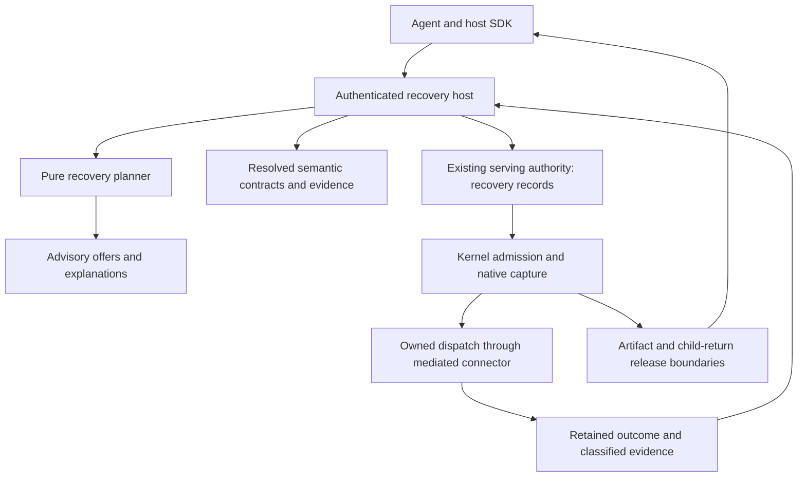

# Recoverable agent runtime: architecture specification

Status: proposed architecture, revision 3, October 2, 2026. This package specifies implementation work. It does not announce implemented APIs, public availability, or completed security qualification. Normative MUST/MUST NOT requirements are acceptance obligations. Rust API names, schema names and test names introduced here are proposed unless marked existing.

## Decision

Build recoverable agent execution into Chio's modern Rust kernel for agentic operating systems. An agent should be able to recover legitimate work after a denial while the kernel retains authority over identity, information flow, budgets, irreversible effects and evidence.

Use one native admission and execution authority. Add a small pure recovery planner, semantic tool contracts, durable recovery records inside the existing serving authority, and mediated artifact/child-return paths. Host adapters expose this behavior through a common protocol. They do not become independent approval or retry authorities.

The first deliverable is a private support ticket converted into one owner-approved public issue, including denial, exact review, continuation allocation, native capture, process death, outcome recovery and refused reuse. The final scope also includes compatible destinations, authorized transformations, prerequisites, withheld outputs, isolated reads, counterfactual explanations, durable labeled memory, policy trajectories, connector packages and reviewed policy maintenance.

## Read in this order

1. [Security model and invariants](01-security-model.md): threat model, authority, knowledge, effect truth and resource bounds.
2. [Rust structure and contracts](02-rust-design.md): crate ownership, dependency direction, live handles, errors and async discipline.
3. [Recovery and approval protocol](03-recovery-protocol.md): identities, grant v2, records, transactions, state machines and crash recovery.
4. [Counterfactual explanations](04-counterfactuals.md): pure evaluation, safe explanations and signed advisory evidence.
5. [Semantic connectors and transformations](05-semantic-contracts.md): package format, ACL evidence, integrity, transformations and coverage.
6. [Artifacts and process memory](06-artifacts-memory.md): versioned content, publication, mediated reads, checkpoints, export and retention.
7. [Confined children and returns](07-confined-returns.md): isolation authority, ancestry, return admission and every output channel.
8. [Protocol, operations and policy maintenance](08-protocol-operations.md): SDK/CLI contracts, migration, cancellation, observability and policy proposals.
9. [Conformance and comparative evaluation](09-conformance.md): trajectory fixtures, failure campaigns, model checking and utility metrics.
10. [Delivery plan and architectural decisions](10-delivery-decisions.md): dependency-ordered implementation, rejection criteria and unresolved deployment choices.
11. [Contract catalog](11-contract-catalog.md): required signed fields, digest framing, authority ports and storage constraints.

[Requirements](requirements.json) map every numbered acceptance obligation to its owning specification, proposed test and delivery phase. The [source crosswalk](source-map.md) explains the historical architecture inputs, and [source inventory](source-map.json) records input hashes. [Validation](validation.json) retains historical document checks; [model evidence](model/results.txt) reports bounded architecture exploration. Neither substitutes for implementation qualification.

From the development checkout root, run `python3 docs/architecture/recoverable-agent-runtime/check.py --source-revision de84fc306` to verify document traceability, local links and the architecture's historical source inputs after implementation begins. Omitting `--source-revision` checks the working tree and rejects source/build-input drift from the architecture baseline. Historical validation reports its explicit revision and does not qualify the changed implementation. The [model instructions](model/README.md) reproduce the separate Rust protocol exploration. The validator checks retained model and foundation-test evidence; it does not compile or rerun either itself.

The current implementation state is [remediation and pending requalification](implementation/STATUS.md).
The P0-P6 implementation is present. Phase completion and review closure in the
retained records apply to their exact source inventories and declared profiles,
which precede the naming cleanup and current runtime repairs. They do not
establish current-source qualification or absence of open review findings.

| Historical phase record | Retained scope |
|---|---|
| [P0 plan](implementation/p0/PLAN.md), [review](implementation/p0/REVIEW.md), [verification](implementation/p0/verification.json) | Contracts, pure dependency boundaries, resource ceilings and local assurance baseline. |
| [P1 plan](implementation/p1/PLAN.md), [review](implementation/p1/REVIEW.md), [verification](implementation/p1/verification.json), [operations](implementation/p1/OPERATIONS.md) | Sequential native support disclosure, exact durable recovery and its recorded local acceptance. |
| [P2 plan](implementation/p2/PLAN.md), [review](implementation/p2/REVIEW.md), [verification](implementation/p2/verification.json), [operations](implementation/p2/OPERATIONS.md) | Bounded advisory explanations, audience projection and fresh native refusal. |
| [P3 plan](implementation/p3/PLAN.md), [review](implementation/p3/REVIEW.md), [verification](implementation/p3/verification.json), [operations](implementation/p3/OPERATIONS.md) | Bounded native support reads, issue creation and field projection. |
| [P4 plan](implementation/p4/PLAN.md), [review](implementation/p4/REVIEW.md), [verification](implementation/p4/verification.json), [operations](implementation/p4/OPERATIONS.md) | Host-private Unix SQLite artifacts, labeled checkpoints, restore, adoption and collection. |
| [P5 plan](implementation/p5/PLAN.md), [review](implementation/p5/REVIEW.md), [verification](implementation/p5/verification.json), [operations](implementation/p5/OPERATIONS.md) | Sealed Boolean-only, model-disabled GNU/musl Linux acceptance at source binding `562a3c35`. |
| [P6 plan](implementation/p6/P6-PRODUCT-PLAN.md), [review](implementation/p6/REVIEW.md), [verification](implementation/p6/verification.json), [supported matrix](implementation/p6/supported-matrix.json) | Archived local, Linux and finite live qualification at runtime binding `b1bcd48c` and qualification binding `3a13a9bc`. |

Full bindings, archive hashes, review scopes, retained failures and unknown
outcomes are stated in [execution status](implementation/STATUS.md). At the
cumulative review snapshot, 113 of 735 P6-qualified sources differed after naming
cleanup; subsequent repairs add further drift. The retained package auditors
refuse the current working tree. Fresh repair review, owning regressions and
source/profile-bound requalification are required before a qualified candidate
can enter release integration. Linux, live providers, formal tools, hosted CI
and production acceptance remain separate evidence dimensions. The roadmap ends
at P6; the next work is remediation and requalification.

The [October 2 principal-engineering review](review-2026-10-02.md) records the material corrections in revision 2, their rationale, and the limits of the retained verification.

The [third-pass review](review-third-pass-2026-10-02.md) records revision 3: exact request custody and digest meanings, operation-owned nonce integration, acyclic multi-owner approval, scoped historical settlement, and separate planner/driver APIs. The native kernel remains the single execution authority; the review adds no runtime or coordinator.

## Current foundation and required delta

| Existing foundation | Required architectural change |
|---|---|
| `ProcessRuntime` freezes the complete caller-supplied request under its logical key | Introduce a distinct recovery workflow and continuation identity; retain immutable requests |
| Process binding includes retry mode, host route and security profile | Reuse the complete derivation during finalization and charge each reservation once |
| Strict nonces attach original native issuance after the initial process request is frozen | Preserve preflight/readback/attachment under the original operation and distinct digests |
| Native retained requests deliberately omit one-shot credentials | Retain separate protected exact reviewed-envelope custody for process recovery |
| Native flow preparation and `capture_invocation` join disclosure/budget custody | Add a recovery participant to the same authoritative capture protocol |
| Declassification grant v1 binds exact content and security identity | Introduce a v2 recovery binding to authority domain, process, workflow and exact continuation request |
| Native admission/outcome projections and no-effect evidence | Expose a sealed effect observation for recovery; never infer no effect from a `Deny` receipt |
| Host-owned process security profile | Add an explicitly authorized confined lineage boundary with verified launch evidence |
| Process checkpoints and immutable blobs | Bind content versions to labels, producer evidence and mediated read/restore paths |
| Verified manifests, policy and egress contracts | Resolve semantic connector packages into these authorities with explicit complete coverage |
| Explicit active-response simulation | Reuse its separation of advisory and live authority; create a recovery-specific pure evaluator |
| Receipt replay and generated protocol bindings | Add recovery trajectories, shared negative vectors and common host operations |
| Substrate crates support Rust 1.93 and alloc-only consumers | Preserve their MSRV/proof/feature contracts while adding pure crates |

The existing `chio-workflow` skill-sequencing API remains useful for manifests and receipts. Its in-memory execution tracking does not become the owner of durable recovery. The current disclosure-lineage verifier can contribute proof verification after an explicit schema crosswalk; its existence does not establish artifact publication or read mediation.

## Capability crosswalk

| OpenAPPA-inspired capability | Chio design | Improvement to demonstrate |
|---|---|---|
| Policy-derived remedies and durable offers | Typed finite plans and authority-owned offer records | Exact operation binding and native effect recovery |
| Approval and acceptance of narrower behavior | Grant v2 and explicit plan acceptance | Approval cannot widen capability, clear knowledge or restart an uncertain effect |
| Alternate destinations | Registered destination alternatives | Provider identity/ACL evidence bound through capture and actual delivery |
| Input derivation and output sanitization | Authorized, pinned transformations | Exact input/output provenance and independent confidentiality/integrity authority |
| Prerequisites and history requirements | Bounded DAG with verified effect references | No inferred ordering from text, wall time or unrelated receipts |
| Withheld output | Bound `Withhold` disposition | No raw success/error bytes escape through alternate channels |
| Confined child reads and constrained returns | Host-issued isolation boundary and mediated return | Kernel-bound ancestry, launch evidence and restart-safe release |
| Connector batteries and dynamic annotations | Semantic packs plus operator deployment bindings | Complete coverage, scoped ACL freshness and explicit annotator powers |
| Coding-agent file semantics | Immutable artifact versions and mediation | Labels survive restart, concurrent mutation, restore and export |
| Policy examples and replay | Typed trajectory/effect assertions | Negative cases paired with successful useful work |
| Policy feedback and maintenance | Classified reports and signed policy-change proposals | Replay, rollout and rollback under operator authority |
| Guided protected setup | Validated deployment profile and coverage report | No quiet fallback to an unmediated launch path |
| Benchmarks | Matched two-workflow/two-host evaluation | Count actual effects, recovered work and host code removed |

## Architecture

There are three different classes of object: untrusted requests, authenticated historical evidence, and live execution ownership. Deserializing the first two can never manufacture the third. An offer is a proposal, approval is scoped authority, and native capture establishes the live operation owner.

## Design confidence

High: preserving immutable call identity, using native capture, separating effect truth from receipt verdict, refusing unknown-outcome retries, and keeping labels through memory/return mediation. These decisions are grounded in the inspected architecture-baseline source and the earlier 104-test research result.

Moderate: the proposed recovery participant can be added without broad changes to capture latency or storage contention; scoped version observations can make approval practical; artifact and isolated-return mediation can share existing guards. These require the implementation phases and their failure campaigns.

Unknown: comparative user completion, integration effort saved, production latency and operational adoption. The evaluation contract specifies how to measure them. There is no universal security or exactly-once claim over arbitrary external providers.

The complete [preceding research](../../research/openappa-2026-10-01/README.md) and [flow/grant prototype](../../../labs/openappa-recovery/README.md) are retained alongside this specification. Research transfer hashes are in the [import manifest](../../research/openappa-2026-10-01/import-manifest.json).
