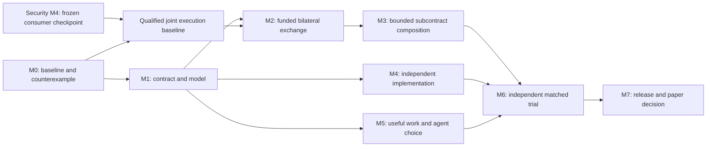

# Implementation roadmap and execution backlog

Status: proposed work, 2026-09-14. No milestone is marked complete by this plan.
Program entry: [README](README.md). Protocol design: [02](02-protocol.md).
The [repository reconciliation](08-repository-review.md) adds mandatory
integration work P40-P55 to the original P00-P39 below.
The [security synchronization review](09-security-roadmap-sync-review.md)
extends those packages with S01-S10; it does not create a second work queue.

## 1. Build on the current repository

The current checkout includes uncommitted research and other user work. Before
implementation, inventory that work and prepare a reproducible baseline without
resetting it, sweeping it into one unrelated commit or treating old logs as
current qualification. Report 35's immutable source inventory is a reference,
not a substitute for a clean buildable integration candidate.

| Existing surface | Reuse | Work still required |
| --- | --- | --- |
| [Federated work example](../../../examples/federated-work/README.md) and [subcontracts](../../../examples/federated-work/SUBCONTRACT.md) | Agreement flow, HTTPS enrollment, permits, disclosure, nested evidence and crash harness | Extract only the reusable profile; replace fixed specialist/per-job credits with bounded selection and real allocation semantics |
| [Open market](../../../crates/economy/chio-open-market/README.md) | Signed bids, asks, acceptance and purchase validation | Bind authoritative funding to admission; pure acceptance must remain distinct from reservation |
| [Purchase coordinator](../../../crates/platform/chio-control-plane/src/trust_control/finding_purchase_coordinator.rs) | Durable coordination and stable logical payment references | Map reuse boundaries for independent operators; avoid making this single coordinator the global authority |
| [Kernel durability tests](../../../crates/kernel/chio-kernel/tests/durable_admission_sqlite.rs) | Admission, uncertainty and recovery semantics | Extend only for actual new funding/claim transitions, preserving unknown side effects |
| [Native unknown release](../../../crates/kernel/chio-kernel/src/payment/unknown_release.rs) and [SQLite authority](../../../crates/platform/chio-store-sqlite/src/admission_operation_store/unknown_release.rs) | Incident-bound financial resolution with immutable execution history | Cross-rail resolution bindings, deadlines and reconciliation |
| [Finding artifacts](../../../crates/economy/chio-finding/src/lib.rs) | Content-addressed output, evidence and declared guarantee class | New task profiles and retrievable acceptance inputs |
| [Settlement runtime](../../../crates/economy/chio-settle/README.md), [web3](../../../crates/economy/chio-web3/README.md), [contracts](../../../contracts/README.md) | Prepare, submit, reconcile, finality and escrow/bond mechanisms | Exact F1 fit audit, exclusive work allocation, claim/refund ordering and noncooperative payer qualification |
| [Underwriting](../../../crates/economy/chio-underwriting/README.md) | Risk vocabulary and pure decision interfaces | No funded risk transfer is assumed; initial child losses use segregated payer funds |
| [A2A edge](../../../crates/protocol/chio-a2a-edge/README.md) and [interop test](../../../crates/tooling/chio-conformance/tests/a2a_client_edge_interop.rs) | Existing transport integration and receiver enforcement | Public profile negotiation, independent provider compatibility and downgrade tests |
| [Transparency program](../../architecture/transparency/README.md) | Existing consistency, witness and claim-completeness work | Reuse its claim gates; funding prevention and history-equivocation detection stay distinct |
| [Budget proof plan](../../formal/plan/FV-B3-budget-conservation-law.md), [economy proofs](../../formal/plan/FV-D3-economy-conservation.md), [typestates](../../formal/plan/FV-D5-protocol-typestates.md) | Existing verification methods and scalar helpers | Prove the new liability/allocation transition properties against actual production functions |
| [Composed baseline](../../../examples/composed-baseline/) and [outcome comparison](../../../examples/outcome-ledger-comparison/) | A working alternative and adversarial comparison discipline | Give it the same funded-work, verifier and recovery facilities |

This is a source reuse map, not a fresh audit of every listed crate or the old
formal plans' implementation status. Verify exact APIs and current qualification
at the milestone that changes them.

The expanded [source review and full workspace inventory](08-repository-review.md)
cover additional pool, swarm, workflow, commercial proof, custody, disclosure,
adapter, SDK and deployment surfaces. The root workspace currently has 163
members, including 142 functional crates. The standalone research examples
must be selected explicitly in qualification.

The active security branch is a separate 175-member candidate. Its authenticated
caller lifecycle, verified manifests, negotiated consumers and native custody
are the intended integration foundation. Freeze Security M4, then rehearse the
paper changes on it in isolation before changing native funding admission.
Security M4 is an external dependency, distinct from this program's M4. The
process-runtime stack is a further optional dependency for the live-agent host;
it must first incorporate the newer security changes. Model/spec work can
continue without waiting for either branch's release campaign.

Prefer pure contract validation in existing economy/protocol crates, local
enforcement in the kernel, durable state in the owning store and rail transitions
in settlement. A proposed new crate requires a dependency-boundary reason.
Do not move example-specific work executors into the kernel.

## 2. Dependency graph and effort assumptions

M4 can start on the frozen contract before funding integration finishes, but
cannot pass its exit gate without M2 interoperability. M5's offline workload
research can start after M0; its funded autonomous runs depend on M3. Parallel
work here describes staffing options, not authorization to spawn agents.

| Milestone | Planning estimate, engineer-weeks | Exit gate |
| --- | --- | --- |
| M0 | 1-2 | G0 and reproducible baseline |
| M1 | 3-5 | Contract/model ready for two implementations, including artifact/claim/numeric mappings |
| M2 | 6-10 | G1 under F1's declared assumptions, with one payment lifecycle and qualified signing/egress |
| M3 | 5-8 | G2 through existing pool/swarm machinery, including prospective budget and disclosure enforcement |
| M4 | 5-9 | Independent provider, SDK compatibility and explicit local enrollment policy |
| M5 | 5-7 | Held-out workload, live-choice qualification and authoritative instrumentation |
| M6 | 5-10 | G3/G4 measured on the selected operational profile, with negative results retained |
| M7 | 3-6 | Explicit suite selection, release scope and paper claim decided from evidence |

These revised estimates sum to 33-57 engineer-weeks before review and contingency.
The earlier 26-45 range did not explicitly account for the integration work
identified in the repository review. P40-P55 refine and complete existing
milestones; they are not sixteen extra milestones added after M7. Reserve a
further 25 percent for security findings, integration and failed hypotheses.
A team with three implementation engineers, a protocol/research lead and
part-time independent review might plan roughly 20-30 elapsed weeks, contingent
on partner availability and the escrow fit. This is a sizing assumption, not a
delivery promise. A single implementer should sequence the same gates and
expect a longer calendar; generated code does not remove review or independent
authorship requirements.

The security review does not justify subtracting effort because a large branch
exists. Re-estimate after P40's integration rehearsal: schema reconciliation,
consumer migration, selected host support and executor retention now have
concrete dependencies. Security checkpoint availability can extend the native
implementation critical path while independent model and workload work continues.

The critical path is M0, M1, M2, M3, M6, M7. External recruitment, independent
implementation and real-funds readiness can extend it. Re-estimate after M1
and M3 rather than treating the initial range as a deadline.

## 3. M0: freeze the problem and reproduce the funding gap

Owner role: protocol lead with kernel/settlement support. Dependencies: none.

| ID | Work package | Acceptance evidence |
| --- | --- | --- |
| P00 | Inventory the dirty checkout, source manifests, relevant branches and build environments; construct an isolated reproducible research baseline | Source/build hashes, ownership of included changes, retained report-35 artifacts and a clean candidate diff |
| P01 | Contrast unsafe forkable local balances with the actual qualified pool ledger and the stronger dishonest-company adversary | Credit existing store-binding/rollback defenses; retain any demonstrated stronger counterexample with exact assumptions; do not assume the real ledger is vulnerable |
| P02 | Freeze H1-H5, baseline freedoms, workload selection procedure and scoring thresholds | Versioned preregistration with unresolved assumptions listed |
| P03 | Audit existing escrow release/refund and registry semantics against F1 | Every needed transition mapped to a real API or a named gap; refund-race example retained |
| P04 | Pin primary prior art and construct the strongest feasible competing design | Dated versions/hashes, executable comparison proposal and novelty objections |

G0 fails if the only adversary is an untrusted agent inside an otherwise honest
shared administrator, or if the baseline is artificially restricted. Repair
the experiment before moving on. If the existing rail already closes P01,
record the exact mechanism and remove that part from Chio's novelty claim.

## 4. M1: specify and model the smallest interoperable contract

Owner role: protocol lead. Dependencies: M0.

| ID | Work package | Acceptance evidence |
| --- | --- | --- |
| P05 | Map proposed objects onto existing schemas; write a versioned work-profile draft and canonical vectors | Exact field/byte rules; positive and negative vectors usable without Rust internals |
| P06 | Specify separate work, funding, delivery and resolution state machines | Complete terminal matrix, transition authority, deadline ordering and error codes |
| P07 | Model exclusive funding and liability under concurrency, parent failure and payer rollback | Bounded exhaustive exploration plus explicit unbounded proof obligations and retained counterexamples |
| P08 | Define F1's verifier custody, evidence eligibility, dispute/refund and rail-finality contract | Trust assumptions and an enforceable path for an eligible seller without a new buyer signature |
| P09 | Produce a minimal independent implementer kit | Wire examples, parser vectors, state traces, public verifier inputs and a documented local test endpoint |

Exit also requires P45, P47 and P53: the existing finding/commerce claim and
numeric/retention mappings are part of the contract. Exit requires no unknown owner of a reachable loss and no magical atomic step
spanning an ordinary database and the rail. An unresolved fair-exchange or
timely-claim/refund condition blocks dependent funded execution. Keep the
contract narrow enough for another implementer to understand without the
entire workspace architecture.

## 5. M2: one funded bilateral exchange

Owner role: settlement engineer with kernel/store engineer. Dependencies: M1.

| ID | Work package | Acceptance evidence |
| --- | --- | --- |
| P10 | Implement exclusive allocation and authoritative funding verification, reusing or narrowly extending existing contracts | P01 attack rejected at the authority, including concurrent conflicting acceptance |
| P11 | Bind finalized backing to native admission and the accepted agreement | No payable dispatch for stale, absent, wrong-domain, wrong-beneficiary or consumed backing |
| P12 | Implement F1 artifact custody, acceptance certificate and claim submission | Valid seller gets the fixed eligible payout despite buyer refusal; invalid output cannot earn service payment |
| P13 | Persist rail intents, claims and reconciliation using stable IDs | Crash at every submit/confirm boundary yields one monetary effect and truthful pending states |
| P14 | Implement deadline, refund, dispute and admin/registry transition handling | Timely eligible evidence cannot race into a conflicting refund; unsupported rail states stop new work |
| P15 | Export an offline-verifiable work/funding evidence package | Independent reader reconstructs terms and finality assumptions without trusting a provider summary |

G1 requires the complete attack matrix on a local chain, followed by a pinned
external test environment for finality and network behavior. A passing local
chain test is not a real-funds qualification. No paid production trial starts
with an unresolved escrow fit or unaudited new fund-moving contract.
P44, P48 and P51 are required integration gates for this selected profile.
P44 includes security's committed start/durable executor contract and the
paper's independent unknown-payment successor. The joint source must preserve
both lifecycles before P11/P13 builds funded execution on them.

## 6. M3: aggregate budgets and subcontract composition

Owner role: kernel/store engineer. Dependencies: M2.

| ID | Work package | Acceptance evidence |
| --- | --- | --- |
| P16 | Replace independent synthetic child balances with a shared payer exposure ledger and exclusively backed child allocations | Parallel child acceptance never exceeds the payer's authorized ceiling |
| P17 | Generalize exact procurement permits to one level, at most four children and locally permitted specialist choice | Receiver denies altered parent/child/input/delegate/beneficiary and unauthorized onward delegation |
| P18 | Preserve separate parent and child obligations across crashes, cancellation and rejected parent output | Completed child is paid exactly once even when parent revenue is zero |
| P19 | Make disclosure projection and resource limits enforceable in the actual hostile-worker path | Canary, alternate protocol client, filesystem escape and network escape probes cannot bypass the selected boundary |
| P20 | Add claim retrieval and child recovery that work after the intermediary application disappears | Specialist and buyer can progress through documented verifier/rail interfaces without B's database |
| P21 | Extend to depth three and sixteen edges only after the smaller profile passes | Cycle/duplicate/amplification tests and liability proofs cover the published bounds |

G2 first covers P16-P20. P21 is an explicit scope expansion and can be deferred
without mislabeling the one-level result. Reject designs that require the root
buyer to pay for failed final work merely to conceal an intermediary's loss.
P41-P43 and P49 must pass for the bounded profile; their deeper-delegation
extensions track P21 if it proceeds.

## 7. M4: independent provider and open enrollment

Owner role: independent implementer, with specification questions recorded.
Dependencies: M1 for start, M2 for completion.

| ID | Work package | Acceptance evidence |
| --- | --- | --- |
| P22 | Build a provider and funding verifier from the public kit in another implementation | No linking to our Rust verifier/core transition code; independent parser and persistence |
| P23 | Run the buyer/provider implementation matrix and malformed-input corpus | Agreement on normalized decisions, accepted amounts and resolution outcomes |
| P24 | Add policy-based enrollment and discovery with multiple registries or direct offers | New specialist joins by configuration under existing policy; no per-pair code change or root import |
| P25 | Qualify key rotation, profile negotiation, revocation and downgrade rejection | Existing obligations survive legitimate rotation; new untrusted authority and weaker terms fail closed |

The independent author must control their implementation and disclose code
reuse and assistance. A second language written by the same author is a useful
differential check, but does not meet the independent-authorship criterion.
P46 and P50 make the local-activation and shared-CLI-verifier boundaries explicit.

## 8. M5: useful work and actual procurement decisions

Owner role: workload/verifier engineer. Dependencies: M1; M3 for funded runs.

| ID | Work package | Acceptance evidence |
| --- | --- | --- |
| P26 | Freeze W1 tasks, checker environments, held-out evaluation and result-use criteria | Reproducing failures, independent acceptance and a split between development and scored tasks |
| P27 | Implement repair artifact execution and verification with source isolation | Useful accepted patches without unapproved source mutation or checker credential exposure |
| P28 | Give a live agent bounded procurement tools and several eligible specialists | Recorded non-scripted choices, attempts, denial reasons and complete spend accounting |
| P29 | Measure verification/production costs and compare fixed-chain and direct-agent controls | H2/H4 evaluated with equal resource allowances and all failure costs |
| P30 | Run a two-engineer-week W2/F2 feasibility spike | A measured certificate/proof candidate and use case, or a recorded decision to stop |

M5 does not pass because a model narrates a successful collaboration. It needs
delivered useful artifacts, independently assessed quality and actual bounded
payment obligations. P30 is conditional research and does not block the F1 trial.
P54 supplies authoritative measurement; P42/P49/P51 also apply to the actual
model, checker and artifact-host routes introduced here.

## 9. M6: independent matched trial

Owner role: experiment lead and participating operators. Dependencies: M3-M5.

| ID | Work package | Acceptance evidence |
| --- | --- | --- |
| P31 | Establish three independently administered operators and at least two jurisdictions for the cross-border phase | Separate keys/accounts/administrators; documented local policies and authorized data/funding scope |
| P32 | Extend the composed baseline with the same rail, verifier, tasks and attack schedule | Equally provisioned implementation reviewed for obvious avoidable disadvantages |
| P33 | Run preregistered useful-work, fault, new-partner and operator-removal experiments | Raw event logs, complete costs, task-level paired outcomes and integration-time records |
| P34 | Conduct a bounded real-funds canary after external activation prerequisites are satisfied | Independent funding and withdrawal, named loss caps, final balances and retained failures |
| P35 | Analyze outcomes and publish an internally reviewable reproduction bundle | Confidence intervals, assumption violations, negative results and H1-H5 verdicts |

P34 requires a concrete deployment review, participating operators and separate
authorization for actual fund movement. These planning documents do not supply
that authorization. M6 may report test-environment results while P34 is pending,
but cannot call them real paid cross-company qualification.
P52 qualifies the chosen node or hosted deployment profile before P33/P34's
scored external runs.

## 10. M7: release and claim decision

Owner role: protocol lead and maintainer. Dependencies: M6.

| ID | Work package | Acceptance evidence |
| --- | --- | --- |
| P36 | Reconcile implementation, spec, schema inventory, SDKs and required CI on the release candidate | Exact-source traceability; no feature advertised beyond its qualified profile |
| P37 | Package conformance, operator recovery and implementer documentation | Independent operator reproduces setup and an incident using published material |
| P38 | Write the paper from the claim/evidence register and strongest counterexample | Assumptions, mechanism, comparisons, economics and limitations agree with executed evidence |
| P39 | Decide foundational research, focused systems contribution or product-only direction | Written judgment naming the strongest objection and what would change it |

Release the smallest qualified useful profile. Preserve later research as
explicitly experimental. No paper sentence should turn local evidence into
public deployment, signatures into truth, or a passing finite model into an
unbounded implementation theorem.
P55 is required before claiming the new standalone suites are CI-qualified.

## 11. First ten working days

This is the next implementation sequence after this planning change, not work
claimed to have happened already.
The [first-slice implementation plan](../../superpowers/plans/2026-09-14-open-agent-work.md)
provides exact files, an executable model/test blueprint, escrow-inspection
commands and review checkpoints for the initial research deliverables.

| Days | Concrete output | Continue only if |
| --- | --- | --- |
| 1-2 | P00/P40 baseline inventory, security checkpoint/sync map and isolated reproduction; actual pool/swarm/claim owners | Reviewed inputs are pinned; dirty source and divergent store histories remain preserved |
| 3-4 | P01 unsafe-model versus qualified-ledger comparison and P03 escrow transition/timeout audit | Existing clone/rollback protections are credited; any stronger counterexample has an explicit adversary |
| 5 | P02 preregistration and initial fair baseline specification | Comparison permits ordinary application extensions and equivalent funding |
| 6-7 | P05/P06 plus P45/P47/P53 artifact, facet, numeric and terminal mappings | Every terminal names a decision authority, monetary effect and existing verifier boundary |
| 8-9 | P07 model and P08 verifier/claim/refund design review | No reachable unbacked admitted claim or contradictory refund remains unexplained |
| 10 | Reviewable M0/M1 progress package and revised estimate | The next code slice is one funded bilateral exchange, with unresolved issues visible |

Do not expand this sequence into a generic marketplace rebuild. If the funding
model fails, finish the counterexample and repair the model before more transport
or agent-planning code. If an existing mechanism solves the problem cleanly,
reuse it and move the research question to composition and measured utility.

## 12. Review cadence and changes of scope

At each milestone review: demonstrate the capability, run the strongest attack,
inspect actual balances and raw artifacts, compare with the baseline, and
update the claim register. A work package is complete only when its acceptance
evidence exists against the candidate source.

Changes to the adversary, settlement trust, task family, trial thresholds or
delegation bounds receive a dated decision and new trial version before scored
runs. Failed attempts remain in the record. Adding a new rail, subjective
verifier or publicly writable market is a separate qualification scope.

## 13. Integration work required by the repository review

These packages close [R01-R16](08-repository-review.md). Each is reviewed within
its owning milestone. Prerequisites below are input deliverables; completion
of the milestone also requires its original packages and qualification gates.
Where a profile grows later, rerun the relevant package's boundary checks for
the new route rather than assuming the earlier result covers it.

| ID | Milestone and prerequisites | Deliverable and acceptance evidence |
| --- | --- | --- |
| P40 | M0; P00 | Freeze members, artifacts, features and consumers for the clean candidate; checkpoint paper/security inputs and rehearse their integration in isolation, recording dirty overlaps and store/ABI predecessors before native funding changes |
| P41 | M3; P10/P11 | Adapt `QualifiedFindingPoolLedger`, signed allocation and SQLite rollback/outbox seams for company procurement; concurrent child reservations, store substitution and authoritative-backing checks pass without a second wallet implementation |
| P42 | M3, exercised again in M5; P41 | Connect prospective model/tool/checker cost reservations to the durable authority; concurrent calls cannot all spend one old snapshot, and actual/unknown charges reconcile without a second service debit |
| P43 | M3; P07/P41 | Map agreements/permits to swarm graphs, continuations, issued capabilities and supported aggregate roots; distinguish invocation/resource ceilings from intercompany money, and qualify any selected process stack against the same security checkpoint |
| P44 | M2; P03/P08 | Compose original admission, authenticated start/claim/report, payment journal, rail intent and observer; preserve waiting versus terminal unknown and financial successors, guarded output, zero-dispatch unfunded rejection and no duplicate debit under report/refund races |
| P45 | M1; P04/P05 | Map task acceptance to finding facets, verified-fix artifacts, standing and challenge roles; required unavailable/failed facets reject, and F1's custody/claim semantics are separately specified before P12 |
| P46 | M4; P09 | Reuse listing/federation enrollment under a locally selected policy; demonstrate a newcomer without pair-specific code and preserve mandatory trust-import gates and blocked root activation |
| P47 | M1; P05 | Map work claims to commerce/passport/risk/financial evidence and fee vocabulary; preserve old unsupported-claim rejections and distinguish a report or credential from funded capital |
| P48 | M2; P08/P09 | Select supported signing backends, executor pins, role/algorithm bindings and key/broker custody; no agent-accessible signing or administration oracle, and eligible old obligations survive the specified rotation policy |
| P49 | M3; P05/P17 | Bind disclosure across all recipients and the selected native flow/declassification path; retain exact data-owner/destination/purpose and one-shot custody, checkable predicates and guarded released bytes |
| P50 | M4; P09 | Migrate selected examples and SDK/CLI clients to verified manifests, negotiated authority and caller transport contracts; test session downgrade/restore and unsupported-envelope denial, while preserving the independent-implementation and shared-code map |
| P51 | M2, extended in M5; P05/P09 | Enforce egress and artifact-loading policy on every new route; connect-time DNS, redirect, size, credential-forwarding and malicious-checker tests exercise real dispatch |
| P52 | M6; P13/P25/P31 | Qualify the selected independent node or hosted profile with actual auth, stores, workers, confinement, retention and canary; Disabled swarm smoke, deferred cage evidence and ordinary process hosts cannot qualify an enforced flow profile |
| P53 | M1; P00/P03 | Freeze numeric encodings, nested-evidence limits, store/ABI predecessors and claim/retention horizons; distinguish divergent version-10 histories, preserve anchored custody in supported migrations and qualify sustained executor retention beyond its current 64-operation cap |
| P54 | M5, used in M6; P15/P26 | Correlate authoritative operations, allocations, receipts and rail effects with telemetry; instrument all costs and extend domain/Proof Room verification without trusting a supplied success summary |
| P55 | M7; P23/P35 | Select standalone research suites plus affected security caller/native/consumer/flow and process inventories; regenerate schemas/errors/SDKs/formal indices, pin exact-source CI/run attempts and resolve required review/audit/advisory gates without treating metadata as proofs |

P40, P45, P47 and P53 are protocol-lead work. P41-P44 are kernel/store and
settlement work. P48/P51/P52/P55 need operator/security support. P46/P50 need
the independent implementer, while P49/P54 join the verifier and workload
engineer's responsibilities. No package requires a new crate by default.

## Current bounded native delivery

The [resolution and earned-child execution](execution/21-native-resolution-earned-child.md)
advances P11/P12/P14/P44: original native funding and outcome identity survives
contractual refund resolution, and separately funded earned child work survives
actual native parent death. P45 registered artifact/facet integration, P48 signing
and rotation profiles, P49 disclosure, P53 sustained retention, and P22/P31
independent implementations/operators remain separate gates. The new native
financial authority does not qualify those broader packages by itself.

The [registered-work acceptance extension](execution/23-registered-work-finding-acceptance.md)
advances the bounded P45 mapping: registered agreement/submission/dependency/decision
bytes, original context and facet requirements, exact verifier-derived assessment,
shared Rust/Python malformed vectors and no payment when required evidence is
unavailable or unsupported. Full Finding backing, verified-fix/standing/challenge
roles and the general market/public-finality boundary remain unqualified.
