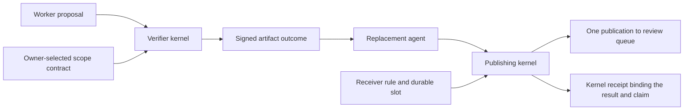
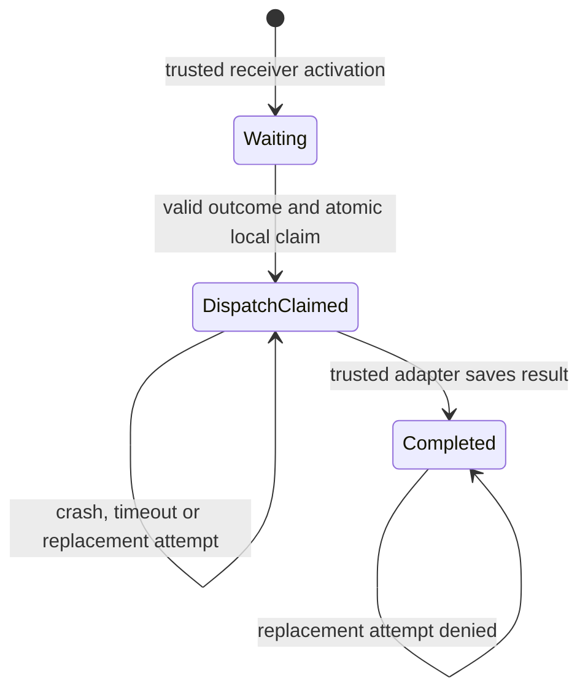

# Outcome-driven work with replaceable agents

2026-09-13. Implementation experiment following
[the research proposal](16-outcome-continuation-research.md). The previous turn
made progress by implementing and testing receiver-owned presentation state.
This turn implements a successor effect mechanism and executes an artifact
workflow through two kernel identities. The breakthrough objective is still
unproven.

## What now runs

An owner wants a capability policy that permits reading a source checkout and
does not exceed that permission. The verifier's contract contains a ceiling
scope and a required scope. It uses Chio's native attenuation validator in
both directions. An overbroad candidate fails; a repaired candidate passes.
Neither candidate is executable code. The verifier signs the exact artifact
digest, contract digest, destination slot, predecessor step, result and time.

Another kernel hosts a publishing tool. Its owner has already activated a
rule selecting the verifier key, contract, logical workflow step, resource,
target and validity. The publisher reads and hashes the artifact once, then
atomically verifies current receiver state and claims the slot before the
external write. The same hashed bytes become the reviewable approved artifact.
The returned result includes the effect claim, and its canonical hash is
checked against the signed kernel receipt's content hash.

The offline checker takes explicitly pinned publisher and verifier keys. It
verifies both kernel receipts, links the exact artifact, contract, outcome and
claim, and independently recomputes the native scope contract. It rejects a
different root and altered artifact bytes. It does not prove global absence of
duplicate publication. To check an exported directory without starting kernels:

```sh
cargo run --locked -p chio-runtime-core --example outcome_artifact_workflow -- \
  --verify DIRECTORY PUBLISHER_PUBLIC_KEY VERIFIER_PUBLIC_KEY
```

Obtain those trusted keys independently of an untrusted bundle; the local
demonstration reports the keys it generated. The checker is
[verify.rs](../../../crates/kernel/chio-runtime-core/examples/outcome_artifact_workflow/verify.rs).



Run the experiment with:

```sh
cargo run --locked -p chio-runtime-core --example outcome_artifact_workflow
```

The program creates a fresh temporary output directory and prints its location.
An optional first argument chooses a new directory; an existing directory is
rejected. It retains the policy candidates, approved policy, owner contract,
receiver rule, signed outcome, publication result, verification and publication
receipts, replacement denial, receipt databases and a summary. No source
checkout is modified. The example is
[outcome_artifact_workflow.rs](../../../crates/kernel/chio-runtime-core/examples/outcome_artifact_workflow.rs).

## The durable invariant

The logical slot is the owner-selected tuple `(receiver, workflow, step)`.
Its identity contains no artifact digest, proof, capability, request, session,
or agent identifier. The owner activates one immutable rule for that slot.
Agent-carried evidence cannot activate a rule or change its verifier.

The SQLite backend uses its existing WAL and `synchronous=FULL` configuration.
A claim uses an immediate transaction to resolve the rule, check revocation
and validity, verify the signed outcome and effect binding, and write the
sole claim. A concurrent contender sees the committed claim and cannot run
another effect. Re-signing the same successful outcome or verifying a different
candidate does not create another budget unit. Repeating trusted activation
with identical bytes preserves consumption and revocation; changing the rule
under the same logical identity rejects.



The new API is in
[outcome_continuation.rs](../../../crates/kernel/chio-runtime-core/src/outcome_continuation.rs)
and [the SQLite backend](../../../crates/kernel/chio-runtime-core/src/store/sqlite/outcome_continuation.rs).
Kernel dispatch revalidation remains non-consuming. The example claims at the
registered protected tool's boundary, after kernel admission, and exposes no
raw publishing route. Other integrations must establish that boundary too;
merely linking this module does not protect arbitrary registered tools.

## Adversarial and crash evidence

The [store and process tests](../../../crates/kernel/chio-runtime-core/tests/outcome_continuation.rs)
exercise the following requirements:

| Attempt or fault | Required observation |
| --- | --- |
| Wrong verifier, contract, predecessor, receiver, workflow, step, artifact, resource, tool or server | Reject without spending the valid slot |
| Failed verification, future or stale verification, unsigned rewrite or foreign schema | Reject without spending the valid slot |
| Revocation or expiry after a successful preview | Final claim rejects, including after reopening |
| Fresh request, fresh valid evidence or another verified artifact after consumption | No new claim |
| Eight receiver processes released from a shared race barrier | One physical append, one completed slot |
| Kill the owned dispatcher after claim but before external append | Zero appends; restart preserves DispatchClaimed and cannot retry |
| Kill after the append is synced but before result persistence | One append; restart preserves DispatchClaimed and cannot repeat it |
| Failed candidate or artifact substitution in the kernel workflow | Zero publications |
| Repaired candidate followed by receiver reopening and a fresh agent capability | One publication total, retained result and signed receipt |

The crash tests terminate actual owned child processes at observed checkpoints.
The surviving process opens the same SQLite database. A subprocess helper
calls the effect-slot API and appends a line to an external file, so those tests
qualify this claim/effect boundary, not the kernel's entire recovery pipeline.
The demonstration separately verifies that the protected publisher is reached
through kernel capability admission and that its publication result is signed.

## Retained validation

[Manifest and source hashes](evidence/17-outcome-continuation/manifest.json),
[process fault evidence](evidence/17-outcome-continuation/fault-evidence.txt), and
[the exported artifact workflow](evidence/17-outcome-continuation/artifact-workflow/summary.json)
are retained with the test logs. The export includes the approved policy,
contract, rule, outcome, result, signed receipts and a receiver-slot snapshot.
The offline checker needs no running kernel or original database to check it.

| Check | Result |
| --- | --- |
| Runtime library, integrations and workflow example | 255 tests passed |
| Later admission/registry and example check | 48 tests passed |
| Final process fault and binding tests | 7 tests passed; eight contenders, one write; both crash checkpoints ended in SIGKILL |
| Final artifact and offline-verifier test | Passed, including wrong-root and changed-artifact rejection |
| Final executable and separate offline-verifier process | Passed; one publication, signed claim/result binding, native contract recomputed |
| Final all-target Clippy | Passed with warnings denied |
| Formatting, diff whitespace and paper macro drift | Passed |
| Rebuilt whitepaper | 12 pages, 4,773 body words; reference and layout gates passed |

The full run covered the effect-slot mechanism. The subsequent error-registry,
export-verifier and artifact-sync changes received the focused checks, final
executable run and all-target Clippy listed above. This remains an uncommitted
local working-tree result, with no exact-commit remote CI or release qualification.

## What this does not prove

The demonstration runs local kernels in one process with separate identities;
it is not an independently operated remote deployment. Candidate policies are
fixed experiment inputs, not a live model repairing arbitrary repositories.
The native scope contract supplies a useful safe workload without launching
untrusted candidate code. General coding outcomes require a separately bounded
execution and verification environment.

The receiver trusts the selected verifier for its contract result, its own
tool adapter for completion, and its local store and clock. It does not defend
against an administrator cloning or rolling back the database, nor against
a dishonest verifier declaring a false result. Revocation prevents subsequent
claims; it cannot undo an effect already authorized. External effects, slot
state and kernel receipt persistence are not one transaction. A crash can
therefore lose useful work while preserving uncertainty and preventing repeats.
There is no automatic recovery or operator resolution API for an uncertain slot.

The result record is not itself a kernel receipt. The example exports both and
checks the signed receipt's binding to the returned publication result. It uses
persistent receipt logs, but does not qualify full durable kernel admission or
all crash points of a distributed workflow.

## Next discriminating experiment

Follow-up: [the matched ledger experiment](18-matched-outcome-ledger.md) now
implements this comparison. The two gates match on its measured outcomes;
the open requirement below records the frontier at the time of this report.

Build the equally stateful receiver-issued opaque-handle alternative with the
same keys, owner contract, durable state, and external append semantics. It
must receive the same opportunities to reject substitutions and preserve
uncertainty. Compare end-to-end useful work, recovery intervention and
application-specific security code, not wire-field counts. Equivalent outcomes
would refute a claim that this local mechanism alone creates a new capability.

Then extend the workload across independently restarted receivers with
successor activation driven by verified predecessor outcomes. The present
experiment preactivates one conditional successor; it does not yet construct
and recover a general graph of work. Existing treaty denial co-signing,
budget-release diagnostics and the retained concurrency sweep also remain
separate unfinished work. Nothing in this result establishes Bitcoin-scale
impact or closes the broader objective.
