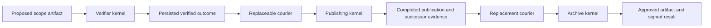

# Work survives the courier, within the receiver trust boundary

2026-09-13. Continuing the breakthrough objective after
[the matched local ledger comparison](18-matched-outcome-ledger.md).
The previous turn made progress by implementing a fair alternative and
eliminating a local novelty claim. This turn implements and tests a recovery
path across three receiver processes. The broader objective is still unproven.

## The concrete capability

A receiver verifies a proposed capability policy against its owner's native
attenuation contract. A second receiver publishes the exact approved artifact.
A third archives it after verifying evidence from the publisher. Each operation
starts a fresh kernel process with the receiver's own key and persistent stores.
The courier transports arguments and signed outputs between these endpoints.

The new capability is recovery from saved receiver outcomes. If a completed
operation's response disappears, a replacement courier retrieves its output
through a kernel-mediated status call, verifies the receipt against the
configured endpoint key, and continues delivery. It does not reconstruct
authorization from an agent's recollection. A publisher's stored completed
result includes the signed evidence its successor needs. A claimed effect
without a result exposes no success evidence.

The [executable graph](../../../examples/outcome-ledger-comparison/src/graph/mod.rs)
uses the existing Chio effect gate and the independent ledger from report 18.
It shares the native verifier, kernel host, protected publishing adapter and
courier around those gates. Both implementations receive the same state,
cryptography, contract and append semantics throughout the graph.



The [receiver](../../../examples/outcome-ledger-comparison/src/graph/receiver.rs)
keeps outcome evidence inside its completed result. It never exports success
from an uncertain claim. Verification results are written atomically to a
content-addressed local cache; publication and archival still use ordinary
external appends followed by durable result persistence. Those appends have
no deduplication. Reading a result is distinct from dispatching the effect again.

The [transport harness](../../../examples/outcome-ledger-comparison/src/graph/transport.rs)
starts and reaps owned processes with bounded waits. It checks receipt keys,
signatures, action hashes, exact request parameters, targets, decisions and
result content hashes. The courier receives public job metadata and no key
through this interface. Each receiver's public test ingress issues a capability
for the requested operation under its local key; this is not a production
identity or credential distribution service.

## Fault and adversarial results

[The retained comparison](evidence/19-receiver-outcome-graph/graph-comparison.json)
records eleven paired execution scenarios and six paired adversarial scenarios.
All measured observations match between Chio's gate and the ordinary ledger.

| Scenario | Result for both gates |
| --- | --- |
| Normal delivery | One publication and one archive entry |
| Verifier killed after storing its output, before its response | Replacement retrieves the cached outcome and completes the graph |
| Publisher killed after completion, before its response | Replacement retrieves successor evidence and archives once |
| Archive killed after completion, before its response | Replacement retrieves the completed result; no repeated effect |
| Publisher or archive killed before claim | Replacement completes the remaining work |
| Publisher or archive killed after claim, before external append | Graph remains uncertain; no success evidence or repeated effect |
| Publisher or archive killed after synced append, before completion | Existing effect remains; graph remains uncertain and does not repeat it |
| Courier killed between publication and archival | Fresh courier discovers the completed publication and archives once |
| Another fresh courier after each scenario | Same terminal or uncertain state, with unchanged physical effect counts |

There are seven completing execution scenarios and four uncertain scenarios
per gate. Every successful run preserves the exact artifact bytes. The fault
run observes eighteen receiver SIGKILL terminations and two courier SIGKILL
terminations. Receiver checkpoints occur inside actual kernel tool evaluation,
before the kernel returns a response. Consequently, a status receipt after
recovery attests retrieval of the stored result; it is not fabricated as the
missing original invocation receipt.

The six adversarial deliveries are an overbroad policy candidate, skipping the
publisher, substituting artifact bytes, forging publisher completion, moving
evidence to a foreign workflow, and duplicate delivery. Each is rejected. A
legitimate courier then completes the graph, or retrieves the completion in
the duplicate case, with one publication and one archive entry in total.
These attacks exercise dependency and artifact bindings; they are not a
prompt-injection benchmark or a test of arbitrary agent-generated programs.

The retained executable run contains 224 request traces across 102 receiver
directories, each with a distinct key and persistent receipt store. Eighteen
traces end at a receiver checkpoint; the other 206 contain replies whose
receipt bindings were checked during the run. The caller and receiver processes
are fresh, but all run under one operating-system user on one host.

## What the result establishes, and what it does not

We can now recover this artifact graph after loss of a completed response and
replacement of its courier. This is stronger execution evidence than the
previous in-process artifact demonstration. It does not remove the receiver,
verifier, protected adapter, database or clock from the trusted base.

Separate processes and key files do not establish isolation from a malicious
same-user process that can access the filesystem. Independent administration,
transport authentication across hosts and enforcement of the courier's lack
of key access remain unqualified. The artifact is a static native policy input.
No live model, arbitrary source patch, untrusted executable or deployment
change is part of this run. A new directory contains the output and test keys;
the retained review export excludes those private keys and binary databases.

Uncertainty is preserved rather than solved. A receiver can have a durable
claim and zero physical effects. The courier cannot safely assume either
success or failure, so it cannot advance the graph or repeat that effect.
The experiment does not turn this into an automatic retry, reset the logical
budget, or assert exactly-once arbitrary external execution.

The strongest objection to calling this a breakthrough is now executable:
the matched ledger completes and stops in the same cases. The graph still
requires application code for provisioning, result publication, successor
construction and recovery. We have not measured lower integration cost,
operator intervention, latency or storage cost than that alternative.

## Prior art and the next discriminating work

Rajagopalan and Rao's February 2026 Authenticated Workflows preprint describes
signed completion attestations used as workflow prerequisites and independent
policy enforcement at receiving boundaries. We read the primary paper; we
have not reproduced its implementation or accepted its broader completeness
and performance claims. Its described mechanism is enough to rule out
attestation chaining alone as our novelty claim.
[Authenticated Workflows](https://arxiv.org/html/2602.10465v1).

The May 2026 Verifiable Agentic Infrastructure preprint similarly connects
structured approval evidence, bounded execution authority and an audit lifecycle.
Its replay discussion concerns reconstructing authorization decisions from
recorded inputs. We have not reproduced its reported experiments, and do not
interpret that use of replay as recovery of unknown external effects.
[Verifiable Agentic Infrastructure](https://arxiv.org/html/2605.15228v1).

The next useful boundary is an independently administered deployment carrying work
whose output matters outside this fixture, with receiver credentials inaccessible
to the courier. That deployment must retain the same ledger alternative and
measure completed work and intervention under faults. Any stronger claim needs
a concrete advantage there, or a mechanism addressing a currently unmet
requirement. More names, fields or steps would not supply that evidence.

## Reproduction and validation

```sh
CARGO_TARGET_DIR=target cargo run --locked \
  --manifest-path examples/outcome-ledger-comparison/Cargo.toml -- --graph
CARGO_TARGET_DIR=target cargo test --locked \
  --manifest-path examples/outcome-ledger-comparison/Cargo.toml
CARGO_TARGET_DIR=target cargo clippy --locked \
  --manifest-path examples/outcome-ledger-comparison/Cargo.toml \
  --all-targets -- -D warnings
```

The graph command prints its new output directory. An optional argument after
`--graph` selects a new directory. `--graph-courier PUBLIC_JOB_JSON none`
starts a fresh courier against one generated public job. Both graph and
original local comparison execute in the integration suite. The original
comparison still passes all 28 paired scenarios after the shared kernel-host
refactor.

[The evidence manifest](evidence/19-receiver-outcome-graph/manifest.json)
records source and artifact hashes, checks and limits. The two integration
tests and all-target Clippy passed. This work changes the independent
experiment and paper, with no production runtime implementation changes in
this continuation. It remains local and uncommitted on the existing branch;
there is no exact-commit remote CI, release qualification or completed
breakthrough claim.

| Check | Result |
| --- | --- |
| Original local comparison | 28 paired scenarios still pass |
| Graph comparison | Eleven execution scenarios and six attacks match for both gates |
| Process fault evidence | Eighteen receiver and two courier exits observed as SIGKILL |
| Integration suite | Two tests passed |
| All-target Clippy | Passed with warnings denied |
| Formatting and diff whitespace | Passed |
| Paper build, references and macro checks | Passed: 12 pages, 4,918 body words |

The graph uses one fixed logical clock for evidence and capability evaluation.
Its wall-clock duration is not a latency measurement or a validity-window test.

[Report 20](20-isolated-outcome-graph.md) subsequently runs this graph with
Linux namespace isolation and credential-access probes. The evidence and
unisolated trust boundary recorded above remain specific to this earlier run.
