# A real source repair becomes the verified work product

2026-09-13. Continuing the breakthrough objective after
[credential isolation](20-isolated-outcome-graph.md). This turn fixes an actual
Git-hook execution defect in Chio's Python adapters and carries the repaired
source through a kernel-mediated verification and publication experiment.
The ordinary ledger still matches the measured outcome guarantees. The
breakthrough objective remains unproven.

## The defect and repair

`harden_git_argv` inserted `--no-verify` into direct commits, while the Hermes
dedicated commit executor also supplied that flag itself. The integration
documentation described this as suppressing repository hooks, including
prepare-commit-msg. An actual commit in an owned test repository contradicted
that claim: prepare-commit-msg and post-commit both ran. Expanded regression
tests also observed reference-transaction hooks.

Git documents that prepare-commit-msg is not suppressed by `--no-verify`, and
that post-commit runs after the commit. It separately documents disabling hooks
through a per-command `core.hooksPath=/dev/null` setting.
[Git hooks](https://git-scm.com/docs/githooks),
[Git configuration](https://git-scm.com/docs/git-config#Documentation/git-config.txt-corehooksPath).

The [shared helper](../../../sdks/python/chio-adapter-base/src/chio_adapter_base/security.py)
now inserts that override after caller-supplied global configuration and
immediately before the commit subcommand. It retains `--no-verify`, rejects
explicit `--verify` and remains idempotent. The
[Hermes dispatch path](../../../sdks/python/chio-hermes/src/chio_hermes/executors.py)
applies the helper after constructing the final argument vector, covering both
the dedicated commit executor and generic Git executor. Other Git commands and
non-hook execution mechanisms remain outside this helper's contract. These
functions are not a sandbox for unrestricted Git use.

The behavioral tests create real commits and inspect hook effects and committed
content. They cover configured hook directories, caller-supplied configuration,
repeated configuration, environment-backed configuration and an existing
`--no-verify` flag. The control confirms that `--no-verify` alone still executes
three hook classes. Both Hermes entrypoints have real commit regressions too.

## What the workflow actually verifies

The new [repair experiment](../../../examples/outcome-ledger-comparison/src/graph/repair.rs)
uses two source files from this repository as its artifact. Its historical
baseline is copied byte for byte from commit
`2b3b5af8cbfbc6f16ce6005de3f97cd149803b81`, with hashes in the
[fixture manifest](../../../examples/outcome-ledger-comparison/fixtures/git-hook-repair/manifest.json).
This was an existing defect, not one inserted to make a demonstration pass.

The owner contract binds those baseline hashes, the two permitted source paths,
seven invocation cases, the candidate invocation shim, checker source and
isolation policy. Candidate Python runs in a Bubblewrap sandbox containing
only its two source files, public inputs, the shim, read-only runtime files and
an empty read-only work-directory placeholder. It receives no signer keys,
authority database or actual checker repository.

The candidate process returns proposed argument arrays. The trusted Rust
checker parses that output as data. A success assertion, exit code zero or
printed test verdict cannot authorize publication. The checker permits only
the exact requested direct commit, with optional hook-disabling arguments.
It then runs Git in another sandbox against a checker-created repository and
observes the committed message, file bytes and five hook markers.

This separation matters. Running a Python test in the same interpreter as
candidate code would let that candidate monkeypatch the test machinery.
Letting it return arbitrary Git commands would also be unsafe: a shell alias
could execute hooks and then erase their markers. The checker now rejects
that configuration before dispatch. Its tests therefore measure a bounded
interface, with the observer and setup outside candidate control.

```mermaid
flowchart LR
    C[Candidate source files] --> P[Isolated Python invocation]
    P --> A[Proposed arguments]
    A --> V[Trusted argument restriction and checker]
    V --> G[Separate Git sandbox]
    G --> O[Observed commit and hook effects]
    O --> K[Verifier kernel signs exact-source outcome]
    K --> R[Publisher kernel and durable outcome gate]
    R --> F[Approved source files in a new review directory]
```



Only after all seven checks pass does the verifier tool return a signed
outcome binding the exact source artifact to the owner's publication rule.
The receiving kernel checks that evidence through either Chio's outcome gate
or the independent ledger and publishes those bytes into a new review
directory. The sink uses an ordinary append with no deduplication. A reopened
receiver refuses another publication under a fresh capability.

The experiment does not apply files to the operator's checkout. The production
source fix was authored and applied during this session; the executable reads
that candidate and produces a separate review artifact. It does not contain a
live model or claim that a new agent autonomously discovered the bug.

## Observed results

[The final comparison](evidence/21-verified-source-repair/repair-comparison.json)
records equal observations for both outcome gates.

| Input or transition | Observation for each gate |
| --- | --- |
| Historical source | All seven commit cases execute forbidden hooks; verification denies |
| Shared helper fixed, dedicated Hermes path still old | Six cases pass; the dedicated commit executes three hook classes and denies the artifact |
| Complete two-file repair | All seven cases create the expected commit and file, with zero hook markers |
| Candidate prints `passed: true` and exits successfully | Output rejected as the wrong data shape |
| Candidate returns a no-op Git command | Rejected before checker dispatch |
| Candidate returns an alias that erases hook evidence | Executable configuration rejected before checker dispatch |
| Baseline hash changed | Rejected against the owner's contract |
| Source bytes substituted after verification | Publication denied; zero publication effects |
| Verified source bytes delivered | One publication; approved files equal the checked bytes |
| Reopened publisher and fresh capability | Repeated publication denied; effect count stays one |

The final run executes six candidate Python processes per gate. Three reach
the seven-case behavioral checker: original source, partial repair and full
repair. The remaining three return self-asserted success, a no-op command or
an executable alias and are rejected before behavioral dispatch. A wrong-base
artifact is rejected before starting candidate Python. Across both gates,
there are 42 checked commit attempts. The baseline produces 42 hook markers,
the partial repair six, and the full repair none.

Each gate records ten kernel decisions: six rejected verification inputs,
one accepted verification, a rejected source substitution, one accepted
publication and a rejected repeat. All twenty receipt signatures and allowed
output hashes are checked during execution. Their raw records, checker
observations, candidate output, contract, exact source artifacts, approved
files, review patch and store snapshots are retained in the
[evidence manifest](evidence/21-verified-source-repair/manifest.json).

## Validation and limits

| Check | Result |
| --- | --- |
| Adapter-base Python suite | 205 passed |
| Hermes Python suite | 196 passed, four skipped |
| Rust experiment integration suite | Four passed, including both earlier graph modes and the original local comparison |
| All-target Rust Clippy | Passed with warnings denied |
| Changed Python files and invocation shim | Ruff passed |
| Rust formatting and diff whitespace | Passed |
| Paper build, references and derived macros | Passed: 12 pages, 4,960 body words |

The existing Hermes lockfile did not satisfy `uv sync --locked`; it already
needed re-resolution before this change. Dependencies were installed from the
existing lockfiles using `uv sync --frozen --extra dev` without changing either
lockfile. Hermes initially imported an installed snapshot of its path
dependency, so the final full-suite run explicitly selected the current shared
source through `PYTHONPATH` and recorded both tested file hashes. This does not
establish that a fresh dependency resolution is qualified. The four Hermes live-sidecar
tests require `CHIO_INTEGRATION=1` and were skipped, not counted as passing.

The seven-case contract is finite. It does not prove that arbitrary code is
correct, preserve all Git semantics, eliminate every command-execution surface
or prevent a program from special-casing known test inputs. The host checker,
Git and Python runtimes, signer, stores, host operator and shared Linux kernel
remain trusted. Isolation uses the existing narrow mount policy, bounded
output and waits; aggregate resource quotas and a seccomp policy remain absent.
The comparison uses known source and adversarial fixtures and does not qualify
arbitrary hostile program execution or denial-of-service resistance.

This two-kernel repair run checks receiver reopen and repeat rejection. It does
not inherit the three-receiver graph's crash qualification, and does not claim
remote administration, host power-loss durability or deployment activation.
The full graph regression still passes separately. Neither comparison is a
latency or integration-cost measurement.

The strongest objection to a breakthrough claim remains executable: the
independent ledger obtains the same result. The useful progress is an actual
security repair and a workflow that can check and carry its source without
trusting the candidate's own test verdict. That extends the earlier static
policy artifact into repository work, but the verification discipline and
namespace mechanisms are established techniques. A measured advantage in
useful completed work, application-specific security effort or trusted parties
is still needed to change the broader judgment.

## Reproduction

```sh
uv sync --frozen --extra dev --project sdks/python/chio-adapter-base
uv sync --frozen --extra dev --project sdks/python/chio-hermes
sdks/python/chio-adapter-base/.venv/bin/python -m pytest -q sdks/python/chio-adapter-base/tests
PYTHONPATH=sdks/python/chio-adapter-base/src \
  sdks/python/chio-hermes/.venv/bin/python -m pytest -q sdks/python/chio-hermes/tests
CARGO_TARGET_DIR=target cargo run --locked --offline \
  --manifest-path examples/outcome-ledger-comparison/Cargo.toml -- \
  --repair examples/outcome-ledger-comparison/fixtures/git-hook-repair/base .
CARGO_TARGET_DIR=target cargo test --locked --offline \
  --manifest-path examples/outcome-ledger-comparison/Cargo.toml
```

The Linux prerequisites are documented in the
[experiment README](../../../examples/outcome-ledger-comparison/README.md).
Offline Cargo commands require cached dependencies. The runner prints its new
output directory and aborts if isolation or checker setup fails. All work
remains local and uncommitted on the existing branch; it has no exact-commit
remote CI, release qualification or achieved-breakthrough claim.
