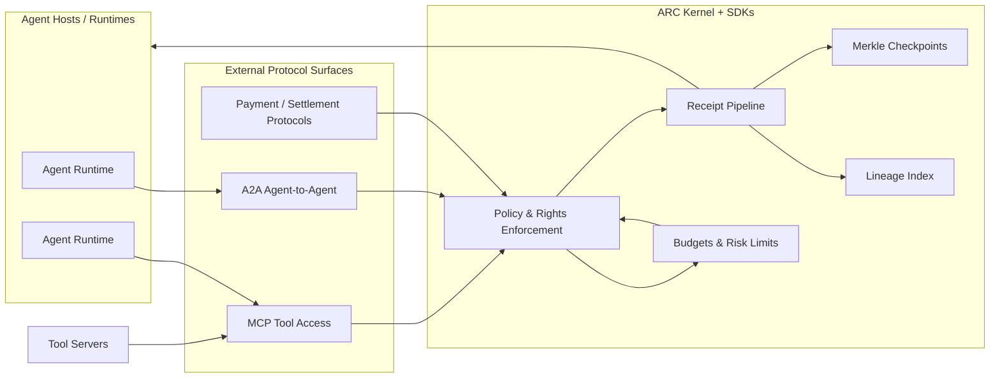
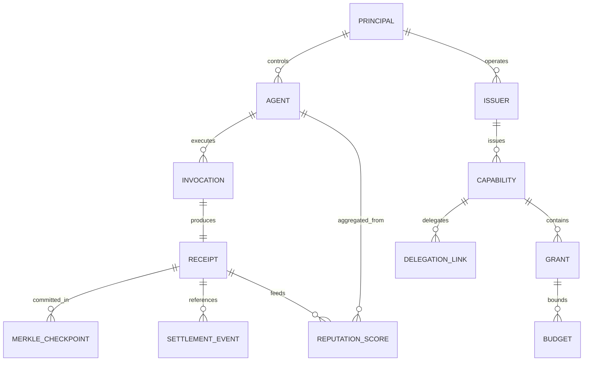
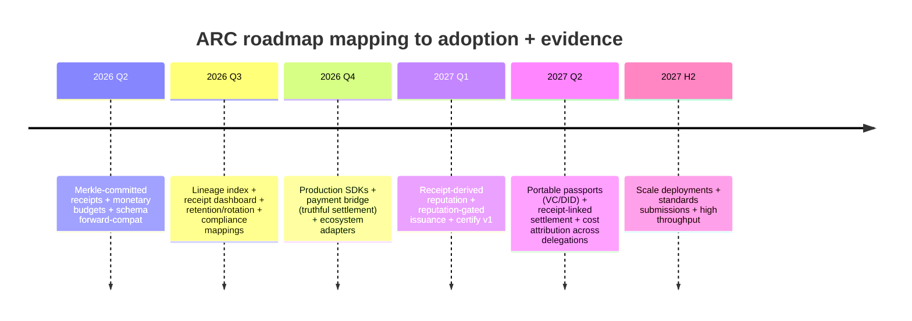

# ARC: Attested Rights Channel as Economic Security for AI Agents

## Executive summary

ARC (Attested Rights Channel) is best framed as a **trust-and-economics control plane** for agentic systems: it turns “an agent can call tools” into “an agent can execute governed actions with auditable authority, bounded cost, and provable outcomes.” This framing is strongly aligned with where standards and regulators are converging: **identity + authorization for non-human actors, tamper-evident logging, and traceability of actions**. citeturn16view0turn11search5turn11search16

A credible thesis for “economic security for AI agents” is:

**Economic security = (delegated authority) + (bounded spend) + (verifiable receipts) + (enforceable governance) across heterogeneous agent protocols.**

This matters because the market is rapidly standardizing “connectivity” (tool access and agent-to-agent messaging), but governance is still fragmented: **MCP** standardizes tool invocation, **A2A** standardizes agent-to-agent collaboration, and **agentic commerce protocols** standardize checkout/payment handshakes—yet none of these, on their own, solves the enterprise-grade problem of **who is accountable, what was authorized, what happened, what it cost, and what liabilities attach**. citeturn9search6turn9search0turn9search3turn0search12

ARC’s strategic advantage is to become the **portable “rights + receipts” layer under everything**:

- Under **MCP**, ARC can enforce scoped rights and budget limits and produce tamper-evident receipts for each tool invocation (including denials). citeturn9search6turn12search11turn12search1
- Under **A2A**, ARC can mediate delegation and provenance across multi-agent call chains, which standards bodies are explicitly discussing as an “agent identity & authorization” gap. citeturn9search0turn16view0turn12search3
- Under **payments**, ARC can link “authorization to act” with “authorization to spend,” while keeping settlement truthful (i.e., not conflating execution success with payment settlement success). Stripe’s Shared Payment Tokens (SPTs) show the industry’s direction: time/amount bounded payment credentials, scoped to a seller, observable through lifecycle—ARC can generalize this pattern beyond commerce into “pay-per-tool / pay-per-action.” citeturn12search2turn12search9turn6search31
- Under **web-native paywalls / API monetization**, x402 (HTTP 402 payments over stablecoins) demonstrates an alternative “machine-payable HTTP” path; ARC can act as the policy kernel that decides _when_ to pay, _how much_, and _what evidence to attach_. citeturn0search12turn13search14turn0search19

Regulatory timing increases urgency. The **EU AI Act** becomes broadly applicable on **2 Aug 2026**, with earlier/later phase-ins, and high-risk systems have explicit requirements for **risk management** and **record-keeping/logging**. citeturn2search10turn11search5turn11search16 In the US, entity["state","Colorado","us state"]’s SB 24-205 effective date was delayed from Feb 1 to **June 30, 2026**, and includes obligations around risk-management programs, impact assessments, and multi-year record retention—exactly the sort of compliance surface ARC receipts and lineage can power. citeturn5view0turn17view0turn3view0

The “gold at the end of the tunnel” is plausible but must be sequenced: **runtime underwriting and agent credit** become credible only after ARC has (1) high-volume receipts, (2) stable identity/lineage joins, (3) standardized cost semantics, and (4) a partner ecosystem (payments/ID/security). The most defensible endgame is: **a risk-and-liability marketplace for agent actions**—where every action can be insured/financed/approved because it is _bounded and evidentiary_. This is conceptually consistent with how remote-attestation standards talk about “partial trust,” e.g., allowing monetary transactions up to limits based on attestation evidence. citeturn14search13turn14search3turn14search1

## Thesis and strategic framing

A tight ARC pitch should treat “economic security” as a **unification of cybersecurity controls and financial controls** for autonomous actors.

**Core problem (market language):**  
Enterprises are adopting agents that can act across tools, systems, and vendors. Security teams need least-privilege, provenance, non-repudiation, and auditability; finance teams need spend limits, approvals, and reconciliation; legal/insurance teams need evidence and attribution. Standards bodies (notably entity["organization","National Institute of Standards and Technology","us standards agency"] and its entity["organization","National Cybersecurity Center of Excellence","nist center"]) are explicitly asking how identification/authentication/authorization, delegation, and tamper-proof logging should work for agents. citeturn16view0turn1search15

**ARC’s thesis (one sentence):**  
ARC is the protocol layer that lets agents transact with tools, agents, and payment rails using **attested rights** and produces **verifiable receipts** that establish accountability, cost attribution, and compliance evidence.

**Why “Attested Rights Channel” is a strong name:**  
It encodes three hard requirements that recur across standards:

- **Rights:** fine-grained delegated permissions (what may be done) map cleanly to OAuth authorization details (RFC 9396) and capability-style delegation patterns (including attenuating credentials like macaroons). citeturn15search1turn7search8
- **Attested:** the rights are bound to an identity and (optionally) an attested runtime. This aligns with sender-constrained tokens (DPoP RFC 9449; mTLS RFC 8705), and emerging “attestation-based client authentication” in OAuth, which explicitly brings key-bound attestations into OAuth interactions. citeturn1search0turn8search3turn10search0
- **Channel:** implies a transport-neutral “control plane” sitting under multiple ecosystems (MCP, A2A, commerce, HTTP). citeturn9search6turn9search0turn13search14

**Strategic positioning:**  
ARC should not be sold primarily as “an MCP replacement.” The stronger platform story is:

- MCP/A2A/ACP are “plumbing.” ARC is “governance + evidence + economics.” citeturn9search6turn9search0turn9search3
- ARC’s moat is **evidence quality**: tamper-evident receipts, replay-resistant invocation proofs, deterministic lineage, and eventually portable credentials/certification.

## Technical feasibility and architecture

ARC’s roadmap you provided (Merkle commitments, DPoP, budgets, lineage index, adapters, dashboards, reputation, passports) is technically coherent and aligned with existing standards primitives. The feasibility challenge is less “can this be built?” and more “can this be built with truthful semantics and adoptable interfaces before competitors commoditize it?”

### ARC in the ecosystem

ARC’s architecture can be described as a small number of invariants:

- **Every action is authorized by a right** (capability / grant / authorization detail).
- **Every action produces a receipt** (allowed/denied, inputs/outputs hashed or referenced, cost impact, identity bindings).
- **Receipts are tamper-evident** (Merkle-committed append-only checkpoints).
- **Spend and risk are first-class constraints** (monetary budgets, rate limits, multi-dimensional budgets), enforced _before_ action execution or recorded as truthful “pending settlement” states.

A merkle-based approach is well-understood and defensible: transparency systems such as Certificate Transparency use Merkle tree logs with signed tree heads to make logs cryptographically auditable and append-only. citeturn7search1turn7search9

This diagram is justified by the way MCP and A2A are positioned as interoperability protocols (tool-to-model and agent-to-agent), while payments protocols (agentic commerce, HTTP-native payments) handle settlement handshakes and cost primitives. citeturn9search6turn9search0turn9search3turn0search12

### Identity binding and replay resistance

ARC’s “attested rights” should explicitly align with the OAuth family’s established mechanisms:

- **DPoP (RFC 9449)**: sender-constrains OAuth tokens and enables detection of replay attacks by requiring a per-request proof. citeturn1search0
- **Mutual TLS (RFC 8705)**: binds tokens to client certificates and supports client authentication and certificate-bound tokens. citeturn8search3
- **OAuth 2.1** (in draft form) consolidates modern best practices and is commonly referenced by protocols like MCP for authorization flows. citeturn8search2turn12search11
- **OAuth Security BCP (RFC 9700)** is the standards-backed place to anchor security posture claims about token handling and threat mitigation. citeturn10search2

This matters because ARC’s credibility is proportional to how legible it is to security reviewers: “we follow RFC 9449 for per-invocation PoP and RFC 8705 where mTLS is appropriate” is easier to defend than bespoke crypto.

### Economic enforcement: budgets, pricing metadata, settlement truth

There are two distinct “economic control” problems ARC can solve:

- **Budget enforcement:** “this agent may spend up to $X for tool Y in time window T.”
- **Settlement semantics:** “a payment happened (or didn’t), and what does that imply about what was executed.”

Stripe’s design for Shared Payment Tokens shows an existence proof of agentic commerce primitives: tokens scoped to sellers and bounded by time and amount, with lifecycle observability intended to reduce unauthorized actions and disputes. citeturn12search2turn12search9turn12search15  
This gives ARC a model: an “approval to spend” artifact can be treated as a **capability** with explicit constraints.

x402 offers a different economic substrate: a standard that revives HTTP 402 and enables machine-to-machine payments over HTTP. citeturn0search12turn13search14 Importantly, HTTP 402 is defined as “reserved for future use” in HTTP Semantics (RFC 9110), which is precisely why implementations differ and ARC should treat x402 as a _rail_ rather than the _semantic source of truth_ for policy. citeturn13search14turn13search15

**Key feasibility risk (technical): cost truthfulness.**  
If tool servers can self-report “cost,” they can lie. ARC can mitigate this by adopting a **two-source cost model**:

- **pre-execution quoted cost** (pricing metadata, “max cost per invocation”),
- **post-execution settlement evidence** (payment rail receipt, or metered billing evidence),
- plus **policy choices**: “must prepay,” “hold/capture,” or “allow then settle” with a truthful pending settlement state.

This mirrors how payment systems distinguish authorization, capture, disputes, and reconciliation lifecycles. citeturn12search18turn6search31

### Attested environments as an “advanced tier”

Attested execution (TEEs, confidential VMs, Nitro Enclaves, SEV-SNP) can be a differentiator but should be treated as a **late-stage multiplier**—not a Q2 2026 adoption requirement.

Evidence and standards exist for doing this in a principled way:

- The IETF RATS architecture (RFC 9334) provides an architectural model for conveying and evaluating attestation evidence. citeturn14search1turn14search3
- The Entity Attestation Token (EAT) (RFC 9711) describes attested claims about an entity, used by a relying party to decide whether and how to interact—including “partial trust” decisions like limiting monetary transactions. citeturn14search13
- Cloud TEEs provide concrete attestation documents and verification flows (e.g., AWS Nitro Enclaves attestation documents and cryptographic attestation support). citeturn7search2turn7search18

ARC can leverage these without becoming a TEE platform: treat attestation as an **input to issuance** (stronger rights, higher budgets, longer TTL) and to **runtime underwriting** (risk gating) later.

### Receipts, lineage, and reputation: data model backbone

ARC’s receipts become a durable substrate only if the join path is deterministic: receipt → capability/grant → subject identity → delegation chain → cost attribution. This is exactly the substrate your roadmap calls a “capability lineage index.”

A clean conceptual ER graph:

Merkle commitment ensures receipts are tamper-evident (append-only checkpoints), which is a proven pattern in transparency logging. citeturn7search1turn7search9

## Protocol and standards landscape

ARC’s strongest posture is to be aggressively standards-aligned while staying pragmatically “adapter-first.”

### What each protocol layer is actually standardizing

The table below emphasizes the “job to be done” per protocol and where ARC slots in.

| Layer                  | Primary purpose                                         | Standardization focus                                                                     | “Missing piece” ARC can supply                                                                  | Primary sources                                                                                                 |
| ---------------------- | ------------------------------------------------------- | ----------------------------------------------------------------------------------------- | ----------------------------------------------------------------------------------------------- | --------------------------------------------------------------------------------------------------------------- |
| MCP                    | Tool invocation from LLM/agent hosts to tool servers    | Message formats, tool/resources/prompts, plus authorization guidance                      | Policy-grade enforcement, budgets, tamper-evident receipts                                      | MCP spec + security guidance; origin announcement citeturn9search6turn12search11turn9search9               |
| A2A                    | Agent-to-agent interoperability                         | Agent discovery (Agent Cards), message/session/task patterns                              | Delegation provenance, signed/verified capability chains, cross-agent cost attribution          | A2A spec; Linux Foundation launch citeturn9search0turn12search3                                             |
| ACP (agentic commerce) | Checkout/commerce handshakes between agents and sellers | Interaction model; tokenized payment credential delegation                                | Generalized “approval-to-spend” as a capability + verifiable receipts across non-commerce tools | Stripe docs + ACP repo + OpenAI docs citeturn9search3turn6search3turn6search18                             |
| x402                   | Machine-payable HTTP access                             | HTTP 402-based payment handshake; stablecoin verification over HTTP                       | Unified authorization+budget policy for when to pay; receipts/lineage for economic actions      | Coinbase x402 docs; HTTP 402 RFC; Cloudflare agentic payments citeturn0search12turn13search14turn0search19 |
| OAuth family           | Delegated authorization + modern security patterns      | Token issuance, sender-constrained tokens, rich authorization details, call-chain context | ARC can reuse formal semantics for “rights,” “intent,” and “transaction context”                | DPoP RFC 9449; RAR RFC 9396; Transaction Tokens draft citeturn1search0turn15search1turn15search22          |
| Attestation (RATS/EAT) | Evidence-based trust decisions                          | Roles, evidence formats, appraisal results                                                | Optional higher assurance tier: attested agents → higher rights/budgets                         | RFC 9334; RFC 9711 citeturn14search1turn14search13                                                          |
| DID/VC ecosystem       | Portable identity claims and credentials                | DID core resolution/data model; VC data model and proof formats                           | “Agent/tool passports” and certification credentials                                            | DID Core; VC Data Model 2.0 citeturn1search1turn1search2                                                    |

A key implication: ARC should treat “rights” as an intersection of **capabilities** and **OAuth authorization details** (RFC 9396), because RAR already encodes fine-grained permissions like “make a payment of X euros.” citeturn15search4turn15search1

### Standards-aligned identity options ARC can support

ARC can offer a tiered identity approach, each grounded in mature specs:

- **Enterprise IAM default:** OpenID Connect for human identity and OAuth for delegated authorization (widely adopted). citeturn8search1
- **Workload identity:** SPIFFE IDs and SVIDs for workload identity issuance/attestation in microservice environments (relevant because agents are rapidly converging toward “workloads with autonomy”). citeturn8search8turn8search0
- **Portable identity:** DID Core as a data model for decentralized identifiers. citeturn1search1
- **Portable credentials:** W3C Verifiable Credentials (VC Data Model v2.0), with JOSE/COSE and SD-JWT-based formats emerging in the broader ecosystem; OpenID4VCI defines an OAuth-protected API for credential issuance. citeturn1search2turn13search10turn13search3

This suggests a practical ARC sequencing:

- Q2–Q3 2026: bind rights to keys + DPoP, integrate with enterprise OAuth/OIDC. citeturn1search0turn8search1
- 2027+: introduce portable “passports” via VC/DID when there is an ecosystem reason (cross-org delegation, certification marketplace). citeturn1search2turn1search1

### Strategic note: emerging “agent authorization” work inside IETF OAuth

Two recent standards efforts are especially relevant to ARC’s “governed transactions” narrative:

- **OAuth 2.0 Attestation-Based Client Authentication** (draft, March 2026) enables a client instance to include key-bound attestations in OAuth interactions. This is conceptually aligned with ARC’s “attested rights” positioning. citeturn10search0turn10search3
- **Transaction Tokens** (draft, March 2026) aim to maintain and propagate identity and authorization context through a call chain within a trusted domain—very close to ARC’s desired “receipt-anchored call chain” semantics. citeturn15search22turn15search0

These are drafts (not final RFCs), but their existence is a signal: “agentic call chains need standardized identity + authorization context propagation.”

## Competitive landscape and partner map

ARC’s competition is less “one protocol” and more “adjacent stacks that could expand into your territory.” The most useful way to analyze competition is by **control plane ownership**.

### Competitive clusters

**Connectivity protocols (not direct competitors, but adoption gates)**

- MCP, originated by entity["company","Anthropic","ai company"], is positioned as the standard way to connect LLM apps to tools and context; major developer ecosystems have adopted it. citeturn9search9turn9search6turn9search36
- A2A, hosted by entity["organization","Linux Foundation","open source foundation"] and originally created by entity["company","Google","tech company"], is positioned as agent-to-agent interoperability. citeturn12search3turn9search0turn12search7

ARC’s strategic posture here: **integrate under them** and become the “trust substrate” they intentionally don’t try to be.

**Agentic commerce and payment infrastructure (possible coopetition)**

- entity["company","Stripe","payments company"]’s Agentic Commerce Protocol and Suite explicitly define new primitives (SPTs) for agent-permissioned payments; SPTs are scoped/time/amount bounded and observable. citeturn0search7turn12search2turn12search9
- entity["company","OpenAI","ai company"] co-maintains the ACP spec and positions it as open source; this anchors commerce inside major agent surfaces. citeturn6search3turn6search18
- Payment networks like entity["company","Visa","payment network"] and entity["company","Mastercard","payment network"] are launching “agentic payments” initiatives (e.g., Visa Intelligent Commerce, Mastercard Agent Pay). citeturn6search0turn6search1turn6search9

ARC’s opportunity: provide the **governance + evidence** layer that merchants, platforms, and insurers will eventually demand for disputes, risk, and compliance—without becoming a payment provider.

**HTTP-native crypto payments (partner + wedge)**

- entity["company","Coinbase","crypto exchange"] positions x402 as an open payment protocol enabling stablecoin payments over HTTP. citeturn0search12turn0search22
- entity["company","Cloudflare","internet infrastructure"] is publishing “agentic payments” patterns around HTTP 402 flows. citeturn0search19turn0search8

ARC’s opportunity: a reference integration where ARC receipts are the policy and accounting substrate for x402-based APIs (pay-per-call data, news, analytics).

**Identity providers and authorization engines (adjacent control planes)**  
Identity vendors and authorization platforms can expand “agent identity” into “agent permissions + auditing.” ARC should expect these companies to move.

- entity["company","Microsoft","tech company"] is strongly positioned in enterprise identity and will naturally connect agent identity to conditional access and governance (market direction echoed by NIST and general enterprise guidance). citeturn16view0turn1search3
- entity["company","Okta","identity vendor"] and entity["company","Auth0","identity platform"] could package “agent OAuth clients + DPoP + policy” quickly, because the primitives are in the OAuth ecosystem. citeturn1search0turn8search2turn15search1

ARC’s defense: be the specialist layer that not only authenticates, but **produces tamper-evident receipts + cost attribution + cross-protocol adapters**, which is a different surface than classic IAM.

### Partner map

The most leverage partners (by category) follow directly from the standards landscape:

- **Payments & commerce primitives:** Stripe (SPT/ACP), Visa/Mastercard agentic payment initiatives, plus marketplaces pushing agentic checkout. citeturn12search2turn6search0turn6search1
- **HTTP payments and edge distribution:** Coinbase x402 + Cloudflare for “paywalled API” distribution patterns. citeturn0search12turn0search19
- **Cloud attestation:** entity["company","Amazon Web Services","cloud provider"] (Nitro Enclaves/KMS attestation), plus other confidential computing stacks, for a high-assurance tier later. citeturn7search2turn7search18
- **Standards and credibility:** IETF / W3C / OpenID / NIST participation and comments, especially given the live NIST agent identity initiative with an explicit comment window and questions that align with ARC’s roadmap. citeturn16view0turn10search16turn10search18

## Regulatory and compliance implications

ARC’s “economic security” thesis becomes materially more compelling when anchored to concrete regulatory obligations: logging, traceability, risk management, human oversight, and retention.

### EU AI Act: logability + traceability are explicit requirements for high-risk systems

ARC’s receipts and dashboard map naturally onto “record-keeping” and “traceability” expectations for high-risk AI systems:

- The entity["place","European Union","political union"]’s public AI Act timeline states: the AI Act entered into force **1 Aug 2024**, is broadly applicable **2 Aug 2026**, with earlier phase-ins (prohibited practices and AI literacy from 2 Feb 2025; governance and GPAI obligations from 2 Aug 2025) and extended transition for certain high-risk systems embedded in regulated products until 2 Aug 2027. citeturn2search10turn2search4
- Article-level guidance emphasizes that high-risk systems must have **automatic logging/record-keeping** throughout lifecycle (Article 12) to support traceability, monitoring, and oversight. citeturn11search16turn2search3
- High-risk systems must implement a **continuous risk management system** (Article 9). citeturn11search5
- Human oversight obligations (Article 14) emphasize preventing/minimizing risks that may persist despite other requirements—ARC can implement this as “approval tokens,” step-up authorization, or human gates for certain actions. citeturn11search2

**ARC compliance implication:** If ARC receipts are designed as “automatic logs of system actions + intent + authority,” and backed by Merkle commitments, ARC can become the primitive enterprises use to satisfy record-keeping and traceability obligations—especially for _agentic architectures_, which NIST explicitly distinguishes from simple RAG-only systems. citeturn11search16turn16view0turn7search1

### Colorado AI Act: a near-term forcing function for operational evidence

Colorado’s SB 24-205 matters to ARC because it is operational and enforcement-oriented (consumer protections, algorithmic discrimination risk management), and it forces organizations to build inventory, policies, assessments, and retain records.

- The 2025 special-session change (SB 25B-004) delayed SB 24-205 implementation from Feb 1, 2026 to **June 30, 2026**. citeturn5view0turn17view0
- The statute’s structure explicitly connects compliance readiness to recognized frameworks like NIST AI RMF and ISO/IEC standards. citeturn3view0turn11search0turn11search10
- It requires multi-year retention of impact assessments and related records (e.g., “at least three years” following final deployment of a high-risk system, in the text shown). citeturn3view0

**ARC wedge:** ARC is not “AI governance paperwork.” It is the **audit substrate** that makes paperwork defensible: receipts are the raw events; Merkle checkpoints make tampering detectable; dashboards and exports provide operational evidence packages.

### NIST’s agent identity initiative: standards window + narrative legitimacy

ARC’s roadmap aligns unusually well with questions NIST is actively asking industry:

- NIST’s concept paper states that the benefits of agents require understanding how identification/authentication/authorization apply to agents, and it seeks input to inform a NCCoE project demonstrating how existing identity and authorization standards and best practices apply to agents. citeturn16view0turn1search3
- The paper explicitly asks about support for protocols such as MCP, delegation of authority, linking agent identity to human identity for human-in-the-loop authorization, and ensuring tamper-proof and verifiable logging/non-repudiation. citeturn16view0turn9search6

**ARC implication:** Submitting a comment that ARC proposes (a) rights binding, (b) receipts with Merkle checkpoints, (c) PoP proofs like DPoP, and (d) delegation-aware lineage, positions ARC as “doing the thing NIST is trying to standardize,” not as a proprietary alternative. citeturn16view0turn1search0turn7search1

## Roadmap alignment and adapter priorities

Your existing Q2 2026–Q4 2027 sequence is broadly strong; ARC should tighten it by explicitly mapping each quarter to “economic security primitives” and the adoption surface that drives receipt volume.

### Timeline mapping

This structure is consistent with the EU AI Act’s phased applicability and the Colorado AI Act’s June 30, 2026 effective date. citeturn2search10turn5view0

### Adapter priorities: where integrations multiply receipt volume fastest

ARC’s “trust layer under everything” strategy implies a rational adapter order: prioritize surfaces that already have distribution and high action volume.

| Adapter               | Why it matters                                                                        | Main dependencies                                       | Suggested timing                       | Primary reference points                                                                      |
| --------------------- | ------------------------------------------------------------------------------------- | ------------------------------------------------------- | -------------------------------------- | --------------------------------------------------------------------------------------------- |
| MCP adapter           | Largest near-term tool ecosystem; immediate enterprise relevance for tool governance  | OAuth 2.1 flows + token validation discipline; receipts | Q2–Q3 2026                             | MCP spec & security docs citeturn9search6turn12search11                                   |
| ACP / commerce bridge | Clear “economic” story; leverages existing SPT primitives rather than inventing rails | SPT semantics; truthful settlement mapping              | Q4 2026                                | Stripe ACP docs & SPT docs/blog citeturn9search3turn12search2turn12search9               |
| x402 bridge           | Fast “pay-per-API” adoption loop; developer-friendly demo wedge                       | HTTP 402 semantics + onchain receipt verification       | Q4 2026–Q1 2027                        | Coinbase x402 docs; HTTP 402 RFC citeturn0search12turn13search14                          |
| A2A adapter           | Unlocks cross-agent delegation and call-chain evidence; strategic                     | A2A spec stability + Agent Card trust model             | Q4 2026 (if stable), otherwise Q1 2027 | A2A spec + LF governance docs citeturn9search0turn12search3turn12search7                 |
| Attested runtime tier | Differentiated assurance and underwriting path                                        | RATS/EAT or cloud attestation evidence pipelines        | 2027+                                  | RFC 9334 / RFC 9711; cloud attestation docs citeturn14search1turn14search13turn7search18 |
| Passport / VC layer   | Cross-org portability; certification marketplace                                      | DID/VC + issuance (OID4VCI) + revocation/status         | 2027 Q2+                               | DID Core; VC DM 2.0; OID4VCI citeturn1search1turn1search2turn13search3                   |

The prioritization is also consistent with NIST’s push toward applying existing standards (OAuth family, IAM, logging) to agents rather than inventing new foundations first. citeturn16view0turn10search2

## Go-to-market wedges, business models, endgame, and experiments

This section is intentionally “idea-dense,” because your request is to pressure-test adjacent wedges and find the strongest angles.

### Wedge analysis: value, requirements, risk, time-to-market, partners, opportunity size

The table below evaluates the ideas you listed plus the adjacent “gold paths” they imply.

| Wedge / adjacent idea                  | Value proposition                                                        | Technical requirements (ARC features)                       | Main implementation risks                              | Time-to-market (if focused) | Likely partners                    | Opportunity size                |
| -------------------------------------- | ------------------------------------------------------------------------ | ----------------------------------------------------------- | ------------------------------------------------------ | --------------------------- | ---------------------------------- | ------------------------------- |
| Delegated authority for tools & agents | “Least privilege for agents” with explicit delegation + attenuation      | Capability model + DPoP/mTLS binding + lineage index        | Developer ergonomics; interop with OAuth/IAM           | Near-term (Q2–Q3 2026)      | IAM vendors; MCP ecosystem         | Large (security/IAM budgets)    |
| Governed transactions                  | “No action without intent + approval + receipt” (human or policy gate)   | Approval tokens; policy engine; receipts with intent fields | UX friction; correct policy defaults                   | Near-term (Q3–Q4 2026)      | Regulated vertical design partners | Large (compliance + security)   |
| Economic budgets                       | “Agents can spend safely” (caps, velocity limits, cost attribution)      | Monetary budget store; pricing metadata; rate limits        | Cost truthfulness; currency / pricing semantics        | Near-term (Q2 2026 v1)      | Commerce, data providers           | Very large (every agent spend)  |
| Payment-rail bridges                   | “Receipts → settlement and reconciliation” without ARC becoming a PSP    | Mapping execution vs settlement states; connectors          | Integration complexity; disputes/chargebacks semantics | Medium (Q4 2026 demo)       | Stripe ACP; x402 ecosystem         | Large (fees + platform lock-in) |
| Liability / insurability               | “Evidence-grade logs reduce disputes and enable underwriting”            | Tamper-evident receipts; retention; standardized exports    | Needs actuarial partners + consistent taxonomy         | Medium (2027)               | Insurers; security GRC vendors     | Large but slower                |
| Runtime underwriting                   | “Dynamic risk scoring at execution time” (approve/deny or raise capital) | Reputation + anomaly detection + attestation inputs         | Requires data scale; false positives                   | Medium–long (2027+)         | Insurers; risk engines             | Very large (platform endgame)   |
| Bonded agents / staking                | “Agents post bond; policy violations slash bond” (market discipline)     | Escrow/bond integration; violation proofs                   | Regulatory complexity; adversarial gaming              | Long (2027+)                | Crypto rails; insurers             | Medium–large (niche early)      |
| Attested environments                  | “Higher budgets and autonomy only in verified runtimes”                  | Attestation verification (RATS/EAT, cloud TEEs)             | Operational complexity; verifier trust                 | Medium (2027 tier)          | Cloud attestation stacks           | Medium (premium tier)           |
| Tool/agent passports                   | “Portable trust credentials” for cross-org delegation                    | DID/VC; verifier libs; revocation/status                    | Ecosystem coordination; identity politics              | Medium–long (2027 Q2+)      | W3C/OpenID VC ecosystem            | Large (marketplace enabling)    |
| Certification                          | “Certify tools/servers as ARC-compliant”                                 | Conformance suite + attestations + registry                 | Policing quality; liability of certification           | Medium (2027)               | Standards groups; SIEM/GRC         | Medium–large (platform fees)    |
| Multi-dimensional risk budgets         | “Budgets in $ + data sensitivity + action class + time”                  | Policy language + enforcement + telemetry                   | Hard to explain/sell; policy sprawl                    | Medium (2026 Q4–2027)       | Regulated enterprises              | Large (if simplified)           |

Where opportunity size is qualitative: the fastest-to-revenue wedges are budgets + governance; the largest long-run wedges are underwriting/credit/liability marketplaces, which depend on data scale. The standards literature explicitly anticipates “partial trust” decisions (e.g., monetary limits) based on attestation evidence, which supports the feasibility of multi-dimensional limits as an eventual ARC primitive. citeturn14search13turn11search5

### The “gold” paths: what is _better_ than the current idea?

Two adjacent ideas could be **even stronger than “economic security”** if expressed correctly, because they unify security, economics, and compliance in one narrative:

**Governed autonomy (the umbrella thesis):**  
“Agents are a new class of autonomous workload. ARC makes autonomy governable: every action is authorized, bounded, and evidence-producing.”

This aligns directly with NIST’s framing that agents increase scale and autonomy and require identity and authorization principles to be applied for governance. citeturn16view0

**Infrastructural non-repudiation for agent actions (the deep moat):**  
A tamper-evident receipt log with PoP-bound invocations provides a “who-did-what” substrate that is legible to regulators and insurers. NIST explicitly asks about tamper-proof logging and non-repudiation for agent actions. citeturn16view0turn1search0

### Top protocol feature comparison: where ARC differentiates

| Capability                      | MCP                                             | A2A                                 | ACP/x402                                                                               | What ARC adds                                                        |
| ------------------------------- | ----------------------------------------------- | ----------------------------------- | -------------------------------------------------------------------------------------- | -------------------------------------------------------------------- |
| Standard tool invocation        | Yes citeturn9search6                         | Not primary citeturn9search0     | Not primary citeturn9search3turn0search12                                          | Enforcement + evidence under invocation                              |
| Standard agent-to-agent         | Not primary citeturn9search6                 | Yes citeturn9search0             | Not primary                                                                            | Delegation provenance + identity binding                             |
| Payment handshake               | Not primary                                     | Not primary                         | Yes (commerce or HTTP paywall rails) citeturn12search2turn0search12turn13search14 | Budget/risk policy; truthful settlement state                        |
| Tamper-evident audit log        | Not defined as a protocol primitive             | Not defined as a protocol primitive | Not defined as a protocol primitive                                                    | Merkle-committed receipts (CT-like) citeturn7search1turn7search9 |
| PoP-bound invocation proofs     | Possible via OAuth ecosystem but not guaranteed | Varies                              | Varies                                                                                 | DPoP/mTLS alignment citeturn1search0turn8search3                 |
| Cross-protocol cost attribution | No                                              | No                                  | Partial for commerce                                                                   | End-to-end lineage + receipts                                        |

### Top experiments to run

The goal of these experiments is to turn ARC from a thesis into “felt truth” via demos and measurable outcomes.

| Experiment                          | Hypothesis                                                          | Minimal viable implementation                                          | Metrics                                     | Success criteria                                      |
| ----------------------------------- | ------------------------------------------------------------------- | ---------------------------------------------------------------------- | ------------------------------------------- | ----------------------------------------------------- |
| Merkle receipts + verifier          | “Tamper-evident receipts” becomes a defensible claim                | Batch receipts → Merkle root → signed checkpoint + inclusion proof API | Verify latency; proof size; failure rate    | 100% receipts verifiable vs published checkpoints     |
| DPoP per-invocation binding         | Token replay and delegation misuse materially decrease              | Implement RFC 9449-style DPoP validation on every invocation           | Replay attempts blocked; overhead           | Replayed proofs rejected; <5% perf overhead           |
| Monetary budgets with truthful cost | “Spend caps” become the killer product primitive                    | Cost-reporting interface + pre-quoting + post-charge receipt fields    | Budget violations; false denies             | Budget exhaustion reliably denies; no silent overrun  |
| ACP bridge demo                     | “Agents can spend safely in checkout” is immediate market resonance | Map ARC rights ↔ SPT constraints; link receipts to settlement events   | Conversion; fraud/dispute surrogate metrics | End-to-end demo + reconciliable receipts              |
| x402 pay-per-API demo               | “Economic gating for APIs” resonates outside commerce               | ARC decides pay/deny; x402 payment proof attached; receipts stored     | Successful paid calls; cost per call        | One-click demo: call → pay → receipt verified         |
| Lineage index + dashboard           | Compliance officers can answer “what happened” without engineers    | Receipt viewer + delegation chain graph                                | Time-to-answer queries                      | <2 minutes to trace action chain & cost               |
| Reputation-gated issuance           | Local scoring reduces risk and spend                                | Baseline reputation scoring gating TTL/budgets                         | Incident rate; policy violations            | Measurable reduction in violations in test corpus     |
| Attested runtime tier (pilot)       | Attestation can unlock higher autonomy/budgets safely               | Verify enclave/VM attestation doc; issue higher tier rights            | Attestation pass rate; denial reasons       | Clear risk ladder: non-attested vs attested behaviors |

These align with the existence of standards and primitives: DPoP (RFC 9449), Merkle-based transparency logs (RFC 6962 pattern), ACP SPT bounded tokens, x402’s HTTP 402 payment flow, and RATS/EAT-style attestation for “higher trust tiers.” citeturn1search0turn7search1turn12search2turn0search12turn14search13

### Recommended next experiments with steps, owners, and measurable success metrics

Below are the next six experiments (subset of the eight) that best match your Q2–Q3 2026 milestones and create the strongest GTM story fastest.

**Merkle receipts + inclusion proofs**  
Owner: Kernel/crypto  
Steps: wire receipt batching → Merkle tree build → signed checkpoint publication → verifier API + SDK helpers → negative tests (tamper, reorder, delete).  
Metrics: proof verification success; checkpoint publication frequency; mean verification time; failure modes classified.  
Success: independent verifier reproduces root and validates inclusion for any receipt in a batch; tampering is detected. citeturn7search1turn7search9

**Monetary budgets v1 (single currency) with cost truth model**  
Owner: Kernel + guards + SDK  
Steps: define MonetaryAmount; add budget fields; implement try_charge; implement tool cost reporting schema; encode in receipts; implement deny semantics on exhaustion.  
Metrics: budget drift = 0; denial correctness; tool reported vs settled cost mismatch rate (if settlement exists).  
Success: end-to-end demo with deterministic denial at zero remaining budget, and receipts show budget deltas. (Payment systems’ need for clear lifecycle semantics motivates this separation of execution vs settlement.) citeturn12search18turn6search31

**DPoP per-invocation**  
Owner: Security + SDK  
Steps: define proof payload binding (htu/htm/nonce/jti style); implement nonce cache; add SDK helper; add CI replay tests.  
Metrics: replay attempts blocked; nonce cache hit rate; overhead.  
Success: replayed invocation rejected; proof required for privileged grants. citeturn1search0

**Compliance mapping artifacts for Colorado and EU AI Act logging**  
Owner: Docs/compliance  
Steps: map receipt fields → required logging/traceability claims; define retention defaults; publish “evidence package” outline; get external domain review.  
Metrics: reviewer signoff; time to generate evidence package; completeness score vs checklist.  
Success: one design partner compliance stakeholder can answer “does this meet our logging requirements?” using ARC artifacts. citeturn11search16turn11search5turn5view0

**Receipt dashboard + lineage join**  
Owner: Product + data  
Steps: implement capability snapshots indexed by capability_id; implement receipt query filters; build minimal web UI; add delegation chain visualization; export JSONL.  
Metrics: time-to-trace in user tests; query latency; % receipts resolvable to a subject + grant.  
Success: “what did agent X do last Tuesday and how much did it cost” answered without CLI. citeturn16view0turn11search16

**x402 pay-per-API bridge demo**  
Owner: Integrations  
Steps: implement x402 client; on 402 response decide pay/deny based on ARC budgets; attach payment proof; store receipts; verify accounting.  
Metrics: successful paid calls; average cost per request; denial correctness; reconciliation.  
Success: working demo where an agent calls a paywalled endpoint, ARC enforces spend caps, and receipts show both execution and payment evidence. citeturn0search12turn13search14turn0search19

### Sample messaging

**Homepage headline (one line)**  
ARC is the **economic security layer** for AI agents—attested rights, bounded spend, and verifiable receipts for every action. citeturn16view0turn11search16

**Five-slide deck (bullets)**  
Slide 1: Problem

- Agents are autonomous workloads; connectivity is solved, governance isn’t. citeturn9search6turn9search0
- Security, finance, and compliance teams need **authority + cost + evidence** in one system. citeturn16view0turn11search16

Slide 2: ARC

- Attested Rights Channel: rights are bound to identity (DPoP/mTLS optional) and every invocation produces a receipt. citeturn1search0turn8search3
- Receipts are tamper-evident via Merkle checkpoints (transparency-log model). citeturn7search1turn7search9

Slide 3: Why now

- EU AI Act logging and risk-management requirements for high-risk systems. citeturn11search16turn11search5
- Colorado AI Act effective June 30, 2026. citeturn5view0turn17view0
- NIST actively shaping agent identity & authorization standards. citeturn16view0turn1search3

Slide 4: Ecosystem strategy

- ARC sits under MCP, A2A, commerce rails, and HTTP payment rails. citeturn9search6turn9search0turn0search12
- Bridges to ACP (SPT bounded tokens) and x402 (HTTP 402) make “economic security” real. citeturn12search2turn0search12turn13search14

Slide 5: Endgame

- Receipt volume → reputation → runtime underwriting → agent credit/liability markets (sequenced). citeturn14search13turn16view0

**One-paragraph manifesto**  
AI agents are becoming the new unit of execution: autonomous workloads that can touch every system, spend real money, and trigger real-world consequences. The missing infrastructure is not “more tools,” it is governable autonomy—rights that are explicit, bounded, and tied to identity; actions that are logged automatically and verifiably; and economics that are enforced as a first-class security primitive. ARC exists to make agent actions auditable and accountable across protocols, so enterprises can deploy agents at scale without turning every incident into an untraceable dispute. citeturn16view0turn11search16turn7search1

### Investor-ready pitch variants

**Seed pitch (why this exists, why now)**  
ARC is building the “economic security” layer for agents: a protocol/runtime that binds delegated authority to spend limits and produces tamper-evident receipts for every tool call and transaction. Standards and regulators are converging on this problem (EU AI Act logs, Colorado AI Act, NIST’s agent identity initiative), but current protocols focus on connectivity, not governance. ARC integrates under MCP and A2A and bridges into payment rails like ACP and x402, so every agent action is provably authorized, bounded, and auditable. citeturn11search16turn5view0turn16view0turn9search6turn9search0turn0search12

**Series A pitch (platform + distribution + defensible moat)**  
ARC is the control plane for governed agent operations. As agent ecosystems standardize (MCP, A2A, ACP), the bottleneck shifts to accountability, cost attribution, and liability. ARC’s moat is evidence quality: PoP-bound invocations (DPoP), Merkle-committed receipts, and deterministic lineage that enables compliance exports, dispute reduction, and underwriting-grade signals. With adapters, ARC scales with the ecosystem rather than competing with it; with certification and passports (VC/DID), ARC becomes the trust substrate for agent marketplaces and cross-org delegation. citeturn9search6turn9search0turn12search2turn1search0turn7search1turn1search2turn1search1

**Strategic acquirer pitch (payments / IAM / security buyer)**  
Agents are about to become the highest-frequency “API callers” and “buyers” on the internet. Payment networks and PSPs are building agentic payment primitives; IAM vendors are building non-human identity; security vendors are building agent observability. ARC is the missing convergence layer: it connects rights + spend + evidence so that disputes, fraud, and compliance can be managed with cryptographic auditability. Acquiring ARC accelerates a buyer’s ability to offer governed agent commerce and enterprise agent governance without inventing a new standards stack. citeturn6search0turn6search1turn12search2turn16view0turn10search2

### Business models that fit the architecture

ARC can credibly monetize in ways that align with its value creation:

- **Usage-based platform fees**: per receipt, per verified checkpoint, per policy evaluation—maps to “receipt volume flywheel.”
- **Enterprise control plane**: seat-based or environment-based pricing for dashboards, retention, SIEM export, and compliance evidence packages (because EU AI Act record-keeping creates ongoing obligations). citeturn11search16turn11search5
- **Certification + registry fees**: tool/server certification and a public registry (“ARC Certify”), which becomes a marketplace primitive.
- **Settlement-linked fees**: optional fee for payment bridge integrations (ACP/x402), while keeping ARC out of the regulated “payment rail” business. citeturn9search3turn0search12
- **Insurance/underwriting data feeds**: premium tier that exports standardized risk signals to insurers and enterprise risk teams (requires maturity and deployments).

### Endgame scenarios: underwriting, agent credit, liability marketplace

The cleanest “endgame ladder” is:

1. **Receipts at scale** (evidence) →
2. **Reputation & anomaly detection** (risk scoring) →
3. **Runtime underwriting** (policy decisions + pricing) →
4. **Agent credit / bonded autonomy** (capital allocation to agents) →
5. **Liability marketplace** (insured agent actions across org boundaries)

The technical plausibility is grounded in existing attestation and trust frameworks: RATS/EAT explicitly model evidence-based trust decisions and partial trust limits, which maps naturally onto “bigger budgets for higher-assurance agents.” citeturn14search13turn14search1turn7search18

## Assumptions used in this report

ARC-specific assumptions (because ARC is not an external standard yet):

- ARC is a protocol/runtime layer that can sit under MCP and A2A interactions (adapter model), and can integrate with agentic commerce/payment rails, without acting as a payment provider.
- ARC receipts can be designed to be exportable and verifiable offline (evidence packages).
- Tool cost semantics can be expressed as (quote, cap, settlement evidence) rather than trusting self-reported cost alone.
- Cross-org portability (DID/VC passports) is a 2027+ feature gated on real ecosystem pull, not pushed as a 2026 adoption requirement.

External assumptions (kept flexible as requested):

- Payment rails are not constrained; analysis covers ACP/SPT patterns and x402 as illustrative, widely discussed rails. citeturn12search2turn0search12
- Regulatory analysis is anchored to official sources and published timelines as of 2026-03-23. citeturn2search10turn5view0
