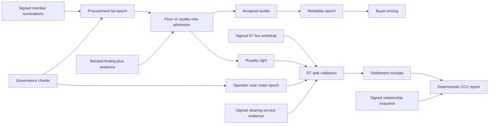
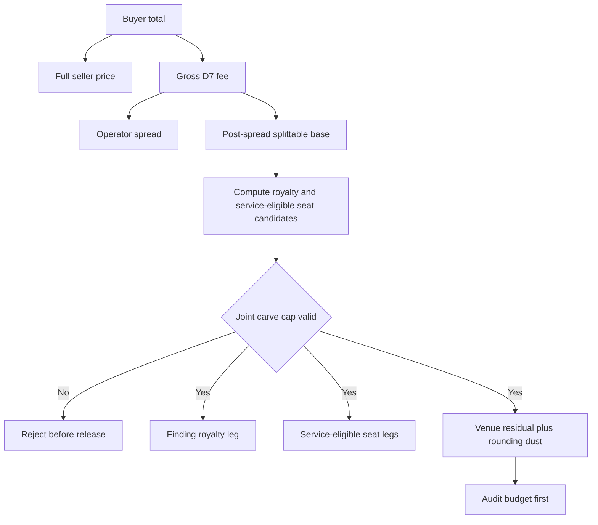

# Genesis Coverage Program Architecture

- Status: research draft (branch `research/genesis-program`)
- Basis: [GENESIS-PROGRAM.md](GENESIS-PROGRAM.md) (economics and mechanism),
  [ADR-0018](../../adr/ADR-0018-genesis-coverage-program-surfaces.md) (Proposed,
  the new wire surfaces), layered on the cognition-market
  [ARCHITECTURE.md](ARCHITECTURE.md)
- Discipline: paths cited for every claim about existing code; new surfaces are
  sketches and say so; every "reuse" row names the exact primitive reused and
  every "new" row justifies why nothing existing fits.

## 1. Why a sibling file, not an ARCHITECTURE.md extension

The cognition-market `ARCHITECTURE.md` is 956 lines and under active #1025
review (seven rounds). The Genesis surfaces are a distinct LAYER: a bootstrap
program that consumes the finding market rather than changing it. Keeping them
in a sibling file (a) leaves #1025's architecture byte-stable while its review
continues, (b) lets the Genesis architecture be reviewed as a stacked change,
and (c) matches the program boundary (the finding market can ship without the
Genesis program; the Genesis program cannot ship without the finding market).
Cross-references into `ARCHITECTURE.md` are by section number and are exact.

## 2. Reuse-first inventory (what the surface already provides)

Established during orientation (confidence: high for every path). The Genesis
program reuses these unchanged:

| Need | Existing primitive | Path |
|---|---|---|
| Canonical signing pair (inline-signature convention) | `Keypair::sign_canonical` / `PublicKey::verify_canonical` (the pair `SignedExportEnvelope` uses; genesis artifacts sign INLINE per the chio-finding convention, never the envelope wrapper, so registered schemas validate artifacts as-serialized) | `chio-core-types/src/receipt/lineage.rs:420-434` (pattern source) |
| Signed windowed aggregate pattern | portable reputation summary and canonical signing | `chio-credentials/src/portable_reputation.rs:224`, `chio-core-types/src/receipt/lineage.rs:420-434` |
| Signed governance charter with an operator allowlist | `SignedGenericGovernanceCharter`, `allowed_listing_operator_ids` | `chio-governance/src/generic.rs:181`; `chio-open-market/src/fee_schedule.rs:32` |
| Role revocation lever | governance `Sanction`/`Freeze` (`blocks_admission`) | `chio-governance/src/generic.rs:20`, `src/evaluation.rs:304-317` |
| On-chain operator deactivation | `deactivateOperator(address) onlyAdmin` | `contracts/src/ChioIdentityRegistry.sol:89` |
| Step-down basis-point schedule idiom | `TIER_DISCOUNT_PER_HUNDRED: [u32; 4]` | `chio-appraisal/src/marketplace_pricing.rs:148` |
| Single-beneficiary settlement release | `prepare_dual_sign_release` (full), `ChioEscrow` | `chio-settle/src/evm/prepare.rs:1027`; `contracts/src/interfaces/IChioEscrow.sol:7` |
| Multi-party exact-sum distribution (slash-only today) | `bond_distribution_hash` / `validate_bond_impair_distribution` | `chio-settle/src/evm/prepare.rs:971-1020` |
| Epoch root signing/anchoring cadence (operator-cron) | `AnchorAutomationJob` + `assess_*` | `chio-anchor/src/automation.rs:37` |
| Decaying topic-keyed signal (procurement staleness idiom) | pheromone deposit/decay | `chio-pheromone/src/lib.rs` (deposit), `src/validation.rs:782` (`strength_at`) |
| Wash/related-party signal | `root_budget_holder` / `delegation_depth` on financial metadata | `chio-core-types/src/receipt/economics.rs:33` |
| Descriptor search / listing publication | `chio-listing` discovery + namespace-owner signature | `chio-listing/src/discovery.rs:291`, `src/util.rs:27` |

The Genesis program adds four new signed artifacts and one metric, all in a new
leaf crate `crates/economy/chio-genesis` (mirroring the `chio-finding` style:
pure types plus fail-closed validators, no storage, no I/O). New wire surface is
gated on [ADR-0018](../../adr/ADR-0018-genesis-coverage-program-surfaces.md).
Separately, D7 requires the finding-market owners to ratify the additive sibling
`chio.registry.market-clearing-fee-schedule.v1` at G5. Mutating the existing
market-fee-schedule v1 meaning or hiding D7 in unsigned operator config is
forbidden. Thus there
are four Genesis artifact families plus one cross-program fee-schedule family,
not a claim that four signatures cover the whole feature.

## 3. New artifact data model

Schema ids proposed (registration path identical to ARCHITECTURE 7.1: JSON
schema under `spec/schemas/chio-genesis/v1/`, `spec/schemas/registry.json` row,
`SIGNED_ARTIFACT_SCHEMA_SPECS` row in `chio-core-types/src/signed_artifact.rs`,
PROTOCOL.md section). All register at their OWNING milestone, never ahead of it
(the #1025 M0 lesson: schemas ahead of their milestone are speculative public
surface).

All four sign INLINE (the chio-finding convention: a `signature` field over
the canonical body with `signature` cleared, verified against the embedded
authority key; NO `SignedExportEnvelope` wrapper, because the registered
schema must validate the artifact exactly as serialized, the same reason the
M0/M1 plan rejects the envelope for registered families).

| Schema | Kind | Owning milestone (registration happens HERE, never earlier) |
|---|---|---|
| `chio.genesis.procurement-list.v1` | signed demanded-descriptor list | G1b |
| `chio.genesis.royalty-right.v1` | signed forward-flow fee-split entry | G2 |
| `chio.genesis.reliability-epoch.v1` | signed r statistic over audits | G3 |
| `chio.genesis.operator-seat-roster.v1` | signed epoch-linked capped seat roster | G4 |

### Artifact lifecycle



The arrows are consumption dependencies, not ownership. The kernel mediates
finding delivery, but Genesis artifact validation and reporting remain in
`chio-genesis`, `chio-settle`, and the control plane.

### 3.1 `chio.genesis.procurement-list.v1` (Q3)

The demanded-descriptor list sellers mine against. NEW because verification found
no query telemetry, no demand artifact, and no commit-to-query privacy layer to
reuse (search is stateless; `recent_receipts_volume` is supply-side self-
reported, `chio-listing/src/discovery.rs:68`).

| Field | Type | Semantics |
|---|---|---|
| `schema` | string | `chio.genesis.procurement-list.v1` |
| `list_id` / `previous_list_id` | string | content address and linked prior epoch; previous is absent only at genesis |
| `governing_operator_id` | string | the venue governance operator that admits descriptors (NOT sellers, to defuse Goodhart, Q6) |
| `governance_charter_id` / `signer_key` | string/pubkey | charter and currently authorized signing key |
| `epoch` | u64 | monotone; each republish is a new epoch |
| `entries` | array | demanded descriptors, each `{ topic, context_sha256?, demand_bucket, nomination_set_root, coverage_state, required_guarantee_class, acceptance_recipe_sha256?, floor_schedule_ref, admitted_at, stale_after }`; FLOOR-BEARING entries MUST pin both `context_sha256` and a VENUE-authored `acceptance_recipe_sha256` (the audit executes the venue's recipe, not the seller's; GENESIS-PROGRAM 4.1, review finding GA-R4) |
| `min_distinct_nominating_orgs` | u32 | launch admission threshold over signed consortium member nominations; this is governance quorum, not a claim of anonymity |
| `issued_at` / `expires_at` | u64 | validity window |
| `signature` | inline sig | over canonical body, verifiable against the governance charter signer |

`demand_bucket` is a coarse bucket (not a raw count) so the list does not leak
per-buyer intent. `coverage_state` is `uncovered` / `partial` / `saturated`,
computed from the finding index; a `saturated` descriptor stops paying a floor
(K5) and is a removal candidate. `required_guarantee_class` carries the launch
determinism rule (GENESIS-PROGRAM 4.1): a floor is payable on this descriptor
only for findings of the named class, and at launch that class is
`deterministic_replay` (an ML non-convergence descriptor is listable only with
a pinned-deterministic recipe requirement until the M9 replication rules for
stochastic recipes exist).

**3.1.1 Sourcing demand without leaking buyer intent (net-new, Q3).** There is
no telemetry store and no query-privacy layer, and raw listing-search traffic
CANNOT be the launch demand signal (review finding GA-R5: the search surface is
stateless and public, queries produce no receipts, and `root_budget_holder`
exists only on receipt financial metadata, so search-based "k distinct
clusters" would be free to forge with k anonymous queries and the entire pool
allocation would key off an unpriced signal). The design, launch profile
first:

- LAUNCH (consortium): demand admission evidence is a SIGNED MEMBER DEMAND
  NOMINATION: an identified consortium member org signs a nomination naming
  the descriptor, optionally referencing evidence (a CI-failure receipt or a
  metered local re-derivation attempt). A descriptor is admitted only after at
  least `min_distinct_nominating_orgs` DISTINCT member orgs have nominated it. Sybil
  resistance is consortium identity itself (the GA3 launch posture), the
  signal is attributable and auditable, and its implicit price is membership.
  The nomination is an authenticated API request, not a fifth registered
  artifact family. Its canonical signed body binds venue id, procurement epoch,
  descriptor digest, `member_org_id`, signer key, nonce, issue/expiry times, and
  optional evidence refs. The server verifies current consortium membership,
  signer authority for that org, venue/epoch scope, freshness, and single-use
  nonce; quorum deduplicates by `member_org_id`, not key. Each admitted entry
  commits `nomination_set_root`; identities remain access-controlled, while a
  consortium auditor can reproduce the quorum from the committed request set.
- LATER (authenticated-telemetry profile): once queries become authenticated,
  receipt-producing actions (an undesigned surface with its own X1/X2
  leakage-ledger obligations, flagged, not assumed), the same `k` rule can run
  over query telemetry with clusters keyed by `root_budget_holder`
  (`chio-core-types/src/receipt/economics.rs:33`). Until that surface exists,
  search telemetry gates nothing.
  Buyer-cluster admission would require a distinct additive procurement
  telemetry schema family with explicit source semantics. The governance-quorum
  field in the current family is not overloaded.
- The list publishes coarse `demand_bucket`s, never raw counts or per-buyer
  data. This is the leakage-ledger discipline (THREAT-MODEL X1/X2) applied to
  demand: the descriptor topic is already a deliberate leak in the finding
  market; the demand bucket adds at most one coarse bit of aggregate demand.
- The pheromone substrate is explicitly NOT used to carry raw demand: its
  deposits are origin-identified (`kernel_id` + `agent_passport_key_hash`,
  `chio-pheromone/src/lib.rs`), which would attach buyer identity to intent. The
  decaying-half-life IDIOM (`strength_at`, `src/validation.rs:782`) is reused for
  `stale_after` computation, but the carrier is the signed governance-published
  list, not a pheromone deposit.

**3.1.2 Governance, capture, staleness (Q3).** Descriptors are admitted by the
venue governance operator, never by sellers: a seller that could add descriptors
would manufacture demand for its own inventory (Goodhart; THREAT-MODEL GA4). The
list is seller-read-only. Staleness: each entry has `stale_after`; entries decay
out on the half-life idiom, and `saturated` entries are removed so the pool stops
subsidizing solved descriptors. Removal is a new epoch (monotone), so the removal
is auditable. Validators require `epoch = previous.epoch + 1`,
`previous_list_id` linkage, non-overlapping validity, and signer authorization
under `governance_charter_id`. Two different artifacts claiming the same epoch
are equivocation evidence, not a tie to resolve locally.

### 3.2 `chio.genesis.royalty-right.v1` (Q2)

The forward-flow fee-split entry. NEW because no royalty / revenue-share /
fee-split primitive exists (verified: empty grep across crates and contracts). A
Proposed spec-shaped JSON schema stub for this artifact (deliberately located in
the research tree, unregistered, so the canonical schema manifest is untouched by
a research proposal) lives at
[genesis-schema-stubs/royalty-right.schema.json](genesis-schema-stubs/royalty-right.schema.json),
with a `.v999` negative fixture beside it; registration happens at G2 (the
family's owning milestone).

| Field | Type | Semantics |
|---|---|---|
| `schema` | string | `chio.genesis.royalty-right.v1` |
| `right_id` | string | content-addressed |
| `finding_id` | string | the finding whose hits generate the fee this right shares |
| `venue_id` / `fee_schedule_id` | string | collecting venue and exact D7 schedule revision |
| `beneficiary_identity_key` | pubkey | non-transferable seller identity |
| `beneficiary_settlement_binding_ref` | sha256 | signed identity-to-destination binding |
| `settlement_currency` | string | exact settlement unit; no implicit conversion |
| `step_down_schedule` | `[{effective_at, share_bps}]` | strictly increasing times and non-increasing shares |
| `carve_out_policy_ref` | sha256 | policy jointly capping royalty and seat shares |
| `change_of_control_rule_ref` | sha256 | rule whose satisfaction lapses the right |
| `granted_by` | string | the governance charter that granted it (the split authority) |
| `signer_key` | pubkey | embedded key, validated as authorized by `granted_by` |
| `issued_at` | u64 | grant time; first absolute-time schedule step equals this value |
| `expires_at` | u64 | genesis clock `T_g`; after which the share is 0 |
| `signature` | inline sig | over canonical body, verifiable against `granted_by` charter signer |

**Enforcement (Q2, honest limits in GENESIS-PROGRAM 5).** The right is a CLAIM,
not a transfer. Its denominator is the D7 clearing fee, a genesis-INTRODUCED
category absent from the settled fee taxonomy (GENESIS-PROGRAM 5; ADR-0018
D7): it is realized only once D7 lands (G5) on the M2/M5 collection machinery
(K1). When it exists:

- the operator collecting a clearing fee on a hit to `finding_id` computes
  `leg = splittable_base * effective_share_bps(now) / 10_000` and pays it to
  the destination in `beneficiary_settlement_binding_ref` through a separately
  opened single-beneficiary release
  (`chio-settle/src/evm/prepare.rs:1027`), OR batches accrued legs over an epoch
  through a distinct fee-distribution action that reuses the exact-sum,
  non-zero-recipient, and bounded-fan-out invariants from bond impair. Bond
  impair cannot move collected venue fees, so batching may require an additive
  EVM router or contract entry point (G6-gated, GENESIS-PLAN);
- forward-only (K2): the fee split is a new fee on a new hit; it never claws back
  settled seller revenue;
- the fee receipt binds gross D7 fee, operator spread, splittable base,
  currency, venue, fee-schedule revision, royalty schedule revision, and seat
  roster epoch. The royalty validator checks that its maximum scheduled share
  is within the royalty ceiling in `carve_out_policy_ref`; only the settlement
  validator has the royalty, eligible seat entries, and service receipts needed
  to enforce the joint transaction cap. Deterministic rounding dust goes to the
  venue residual;
- non-transferable by construction (the beneficiary is bound in the artifact and
  there is no transfer operation), with a CHANGE-OF-CONTROL LAPSE: validity is
  conditioned on continuity of control of the beneficiary org, and change of
  control lapses the right unless the charter re-grants it (GENESIS-PROGRAM 5;
  review finding GA-R6); this is the anti-token guarantee;
- a mis-split is challengeable: the right and the fee receipt are both signed, so
  an operator that applies the wrong share produces evidence-invalid settlement
  (the challenge lane, ARCHITECTURE 4.3).



All amounts use one `MonetaryAmount` currency and integer minor units
(`chio-core-types/src/capability/scope.rs:54`). Mixed currency, unchecked
overflow, negative residual, or a buyer total above the authorized amount
fails before release preparation.

### 3.3 `chio.genesis.reliability-epoch.v1` (the r feed, Q4)

The signed `r` statistic buyer pricing consumes. NEW, but a re-key of the
`SignedPortableReputationSummary` PATTERN rather than a novel construct; NOT a
reuse of the revocation oracle (which is set-membership only and cannot carry a
per-key value, `chio-revocation-oracle/src/sparse_merkle.rs:89-97`).

| Field | Type | Semantics |
|---|---|---|
| `schema` | string | `chio.genesis.reliability-epoch.v1` (genesis namespace: the program owns its introduction and its schema root; a `chio.finding.*` successor can be ratified if the finding-market owners adopt it post-genesis, review finding GA-R13) |
| `epoch_id` / `previous_epoch_id` | string | content address and linked prior epoch |
| `feed_operator_id` | string | the reliability-oracle operator (a genesis vertical, Q5) |
| `authority_roster_id` / `signer_key` | string/pubkey | active reliability-oracle seat roster and authorized operator key |
| `epoch` | u64 | monotone |
| `window` | fixed non-overlapping interval | population cutoff and terminal deadline |
| `population_root` | sha256 | frozen eligible audit population |
| `sampling_policy_sha256` | sha256 | deterministic sampler and rate policy |
| `auditor_roster_root` | sha256 | eligible auditors and related-party exclusions frozen at cutoff |
| `checkpoint_policy_sha256` | sha256 | source, network, finality rule, and maximum wait ratified before cutoff |
| `checkpoint_ref` | object | source, network, height/sequence, finalized hash, and finality evidence for the first policy-matching checkpoint after cutoff |
| `assignment_seed` | sha256 | canonical domain-separated population root plus `checkpoint_ref` |
| `assigned_audits_root` | sha256 | complete deterministic assignment set |
| `audit_receipts_root` | sha256 | terminal outcomes; missing or invalid audit outcomes become incomplete trials |
| `confidence_bps` | u32 | Wilson-bound confidence level |
| `rows` | array | each `{ corpus, seller, guarantee_class, correct, incorrect, incomplete, n_assigned, r_bps, r_lcb_bps }` |
| `signed_root` | ref | optional anchoring ref through the existing anchor lanes (K9) |
| `issued_at` / `expires_at` | u64 | consumers reject stale epochs |
| `signature` | inline sig | chio-finding convention (section 3 preamble); the `SignedPortableReputationSummary` precedent this artifact follows is its WINDOWED-AGGREGATE shape, not its envelope |

`r_bps` is `correct / n_assigned` in the fixed window; `r_lcb_bps` is its
Wilson lower bound. There is no time decay or fractional sample. A verifier
recomputes assignments from the frozen population, policy, and post-cutoff
seed, proves all terminal receipts, and treats missing, timed-out, or
integrity-invalid audit outcomes as incomplete denominator trials and operator
SLA failures, not seller fraud. `n_assigned` is mandatory: a small
sample is mechanically weak. Stratification by
`guarantee_class` is load-bearing (K6): a `metered_attested` `r` must never be
read as a `deterministic_replay` `r`.
Rows must satisfy `correct + incorrect + incomplete = n_assigned`; the epoch
must link `previous_epoch_id`, increment exactly once, start after the previous
window, and be unexpired at consumption.

**Why a new artifact and not the reputation summary directly:** the reputation
summary is per-SUBJECT (`subject_key`), single composite; the r feed needs the
`(corpus, seller, guarantee_class)` stratification and a compact buyer-facing row
set, and it consumes AUDIT receipts specifically, not a subject's whole receipt
corpus. It reuses the signed windowed-aggregate pattern, not
`compute_reliability`, whose allow/cancel/incomplete semantics do not measure
audit correctness.

**Deterministic assignment recipe.** Population leaves are canonical tuples
`{finding_id, seller_id, corpus, guarantee_class, listing_epoch}` sorted by
their canonical bytes. For each stratum, the policy computes
`sample_count = min(N, max(min_per_stratum,
ceil(N * rate_bps / 10_000)))`. The assignment seed is
the SHA-256 of canonical RFC 8785 JSON
`{domain: "chio.genesis.audit-assignment.v1", population_root,
checkpoint_ref}`. The checkpoint source, network, finality depth/rule, and
maximum wait are fixed by `checkpoint_policy_sha256` before cutoff; the operator
must use the first policy-matching finalized checkpoint and cannot choose among
sources. Candidates sort by the SHA-256 of canonical RFC 8785 JSON
`{domain: "chio.genesis.audit-rank.v1", seed, population_leaf}` and the first `sample_count` are
selected. Each selected finding is assigned to the first hash-ranked auditor
from `auditor_roster_root` that does not share seller organization, control, or
funding. Assignment leaves bind finding, auditor, stratum, deadline, policy,
and seed. No eligible auditor, timeout, missing receipt, or invalid receipt is
an incomplete trial, never an omitted observation or an automatic seller
slash. The integer
ceiling formula and lexical byte ordering are part of the schema semantics so
independent implementations cannot disagree. If the checkpoint does not arrive
before the policy deadline, the epoch fails closed and the previous epoch is not
silently extended.

### 3.4 `chio.genesis.operator-seat-roster.v1` (Q5)

The capped, non-transferable genesis seat roster. NEW because no seat / roster-with-
roles / capped-slot primitive exists (the `RosterPolicy` is unsigned config,
`chio-control-plane/src/trust_control/capital_and_liability/liability.rs:11`, and its referenced
`AdjudicationJurisdictionReceipt` type is crate-internal, `pub(super)` at
`chio-trust-market-context/src/artifacts.rs:239`, so unverifiable at the
consumption site).

| Field | Type | Semantics |
|---|---|---|
| `schema` | string | `chio.genesis.operator-seat-roster.v1` |
| `roster_id` / `previous_roster_id` | string | content address and linked prior epoch; previous absent only at genesis |
| `epoch` | u64 | monotone roster version |
| `granted_by` / `signer_key` | string/pubkey | charter and authorized signer |
| `vertical_caps` | map | published maximum active seats per vertical |
| `carve_out_policy_ref` | sha256 | joint royalty-plus-seat transaction cap |
| `seats` | array | complete active, revoked, and lapsed entries |
| `issued_at` / `expires_at` | u64 | roster validity and genesis clock |
| `signature` | inline sig | verifiable against `granted_by` |

Each seat entry binds `seat_id`, `vertical`, `operator_id`, `fee_share_bps`,
`state`, `active_from`, `expires_at`, neutrality and change-of-control rules,
the operator settlement binding, and transition evidence refs.
Validation rejects cap overflow, duplicate ids, duplicate active operator and
vertical pairs, invalid prior-to-next transitions, and fee shares outside the
seat ceiling in the carve policy. This makes the per-vertical count cap
independently enforceable from one artifact. A `Sanction`/`Freeze` decision can authorize a next-roster transition;
it does not directly revoke an arbitrary seat. The on-chain settlement key is
separately deactivated via `deactivateOperator`
(`contracts/src/ChioIdentityRegistry.sol:89`) when applicable.
The F6 conflict surface (the escrow `operator` field, `IChioEscrow.sol:7`) is
exactly what the neutrality covenant governs.

Fee eligibility is transaction-local. A clearing receipt references signed
service evidence for at most one `(vertical, operator_id)` per vertical. The
settlement validator pays only matching entries active at the clearing time,
then checks `effective_royalty_bps + sum(eligible_seat_bps)` against the joint
cap. An active seat with no referenced service earns nothing on that clearing.
For transitions, `epoch = previous.epoch + 1`; every prior seat remains present;
an active seat may move only to revoked, lapsed, or expired; terminal states
never reactivate. Changing operator, vertical, settlement binding, fee share,
or rules requires a new `seat_id`, preventing retroactive mutation of earned
terms.

## 4. The subsidy pool (Q1) is off-chain operator-custodied, not a new contract

Verification found no treasury / pool / fund-balance primitive; every money-
custody construct holds the poster's own funds and pays parties named at open
time (`ChioEscrow`, `ChioBondVault`, comptroller `reserve_units`). Building an
on-chain pool that pays later-discovered recipients would be new contract surface
that K7 forbids. The pool is therefore:

- an OFF-CHAIN, pre-funded budget in the settlement numeraire, custodied by the
  genesis venue operator (bonded, F6-neutral, Q5);
- paid out per admitted floor through the EXISTING escrow terminal states, no
  new custody primitive (GENESIS-PROGRAM 4.1): each admitted floor is an escrow
  with depositor = pool operator, beneficiary = seller, deadline = audit-window
  end plus cadence margin; floors RELEASE BY DEFAULT at window end via the
  operator-signed release digest (`releaseWithSignature`,
  `contracts/src/ChioEscrow.sol:199-228`, consumed single-use) binding the
  admission receipt hash, or early on a sampled passed audit's receipt hash; a
  sampled incorrect audit means no signature and the deadline `refund`
  (`ChioEscrow.sol:268`) returns the floor to the pool. A system-incomplete
  audit releases only at deadline through the operator-signed path binding the
  admission and incomplete-outcome receipts (GENESIS-PROGRAM 4.1, review
  finding GA-R2). In the non-EVM consortium profile the same contract
  SHAPE runs as a settle-mediated hold; the mapping, not the chain, is the
  design;
- disciplined by the ADMISSION GATE (descriptor match, mode-A burn, audit
  sample), not by an on-chain recipient allowlist (which does not exist, K1/K10
  gap);
- audited from receipts: every floor payment is a settlement leg with a receipt,
  so pool outflow is reconstructable and the leading indicators (GENESIS-PROGRAM
  9.1) are computable.

This is an honest limit (the pool trusts the operator), recorded in GENESIS-
PROGRAM 9.4 and THREAT-MODEL (GA-series). It is the same trust posture the wider
program already accepts for the venue operator (T1/T3).

## 5. D7 clearing record and CCV computation (Q8)

G5 introduces `chio.registry.market-clearing-fee-schedule.v1`, an additive sibling to
`OpenMarketFeeScheduleArtifact` (`crates/economy/chio-open-market/src/fee_schedule.rs:71`).
The sibling binds the existing market-fee-schedule id plus
`clearing_fee_bps`, `operator_spread_bps`, `genesis_carve_policy_ref`, and the
integer-rounding rule. `clearing_fee_bps` is in `[1, 10_000]` and
`operator_spread_bps` is in `[0, 9_999]`, so it cannot declare a zero fee or
consume the entire post-spread base. The existing schedule remains byte- and
meaning-stable and implies no D7 fee without a valid sibling.

The signed clearing receipt stores a validated `GenesisClearingBreakdown` in
the existing `FinancialReceiptMetadata.cost_breakdown` field
(`crates/core/chio-core-types/src/receipt/economics.rs:33,55`). It binds
the embedded discriminator `chio.genesis.clearing-breakdown.v1`, `finding_id`,
listing id, royalty-right id, fee-schedule id, seat-roster id,
service-evidence refs, seller principal, gross D7 fee, operator spread,
splittable base, royalty leg, seat legs, venue residual, and buyer total. Every
amount uses the receipt currency. The validator recomputes all sums and bps
arithmetic; a receipt whose breakdown is absent or invalid is reported under
`unclassified_volume` with reason `invalid_breakdown`, never silently dropped.

CCV (GENESIS-PROGRAM 7) is computed over settlement receipts, not stored as a
signed good:

```
CCV[currency, window] = sum of gross purchase principal over arm's-length paid
                        clearings in the reporting window.
```

The report partitions by currency and separately exposes clearing-fee revenue,
genesis-carve payouts, clearing count, and unique external buyer-finding pairs.
D7 is required for the revenue fields and royalty live flow, not for gross CCV.

Related-party exclusion keys primarily on signed consortium organization/member
identity and disclosed common-control, funding, and operator relationships.
`root_budget_holder` / `delegation_depth`
(`chio-core-types/src/receipt/economics.rs:33`) are same-capability-root signals,
not beneficial-ownership proof. The metric needs no new wire schema, only a
versioned methodology and a control-plane read surface. The first
agent-to-agent trade is a public receipt-backed event labeled the genesis
demonstration (self-dealing, excluded from CCV); CCV counts from the first
external arm's-length clearing.

Each response is a deterministic report, not a fifth registered signed-artifact
family. It carries `methodology_id`, `report_id`, window bounds, currency,
`settlement_receipts_root`, `relationship_snapshot_root`, included and excluded
receipt roots, exclusion counts by reason, CCV principal, fee revenue, carve
payouts, clearing count, and unique external pair count. `report_id` hashes the
canonical report body; its root can ride `AnchorAutomationJob`
(`chio-anchor/src/automation.rs:37`) without inventing another scheduler.

The relationship snapshot is assembled only from signed consortium membership
and disclosure inputs frozen before report computation. Exclusion reason codes
are `same_org`, `common_control`, `common_funding`, `common_operator`, and
`genesis_demo`; unclassified reasons include `invalid_breakdown` and
`unknown_relationship`. A paid clearing whose relationship cannot be
classified is reported as `unclassified_volume`, not CCV. Every receipt belongs
to exactly one of included, excluded-with-reason, or unclassified-with-reason,
making the public total independently reproducible and preventing the operator
from silently dropping inconvenient trades.

## 6. Kernel enforcement points: none new

The Genesis program adds no kernel enforcement obligation. The digest gate
(ARCHITECTURE 6) is the finding market's; the Genesis surfaces are all control-
plane and settlement artifacts plus a metric. This is deliberate: the program is
a bootstrap layer, and the invariant-dense kernel path (`validation.rs`) is
untouched. V1 royalties use separately opened settlement legs. If batching is
later justified, its distinct fee-distribution action is reviewed with the
settlement and contract owners; it remains outside the kernel.

## 7. Services and deployment (control-plane surfaces)

New control-plane surfaces follow the three-step pattern (ARCHITECTURE 8.1: path
const, route, handler), all ship-dark behind a cargo feature until qualified
(ARCHITECTURE 8.4):

- `GET/POST /v1/genesis/procurement-list` - publish (governance) and fetch the
  demanded-descriptor list.
- `GET /v1/findings/reliability/{feed}/epoch` - fetch the current signed
  reliability epoch.
- `POST /v1/genesis/seat-rosters` and `GET /v1/genesis/seat-rosters/current` -
  publish and fetch the complete epoch-linked roster.
- `GET /v1/genesis/ccv` - the computed CCV report (methodology-pinned).

- `POST /v1/genesis/demand-nominations` - signed member demand nominations
  (the launch demand signal, 3.1.1), restricted to identified consortium
  member keys.

Epoch ticking for the reliability feed and procurement-list republish run on
operator cron (K9; `AnchorAutomationJob` idiom), not a daemon.

**What operating a genesis vertical actually entails (Q5, on today's
surfaces).** A seat is an obligation set, not a title; per vertical, against
the shipped deployment surfaces:

| Vertical | Standing duties on today's surfaces | Key facts |
|---|---|---|
| Mediating kernel | run the kernel as the neutral reveal mediator (F6); publish checkpoint cadence and keep escrow deadlines derivable from it; maintain the operator settlement key in the identity registry | one control-plane deployment = one operator identity (server-side from config, `chio-control-plane/src/trust_control/report_validation.rs:403`); `EscrowTerms.operator` names it (`IChioEscrow.sol:7`) |
| Registry | host listing publish/search and the finding index; enforce namespace-owner signatures; run `BondBacked` admission | three-step surface pattern (ARCHITECTURE 8.1); `chio-listing/src/util.rs:27`; `trust_activation.rs` seam |
| Status oracle | run the finding-status oracle instance; tick epochs and anchor roots on cron; honor freshness windows | no job daemon exists (K9); `AnchorAutomationJob` descriptors + operator cron (`chio-anchor/src/automation.rs:37`) |
| Reliability oracle | freeze population; derive post-cutoff seed; publish deterministic assignments and terminal receipt roots; compute and sign fixed-window Wilson epochs; step audit rates down on evidence | GENESIS-PROGRAM 4.2 |

All four inherit: cron-driven cadence (K9), a posted operator bond, the F6
neutrality covenant, receipt-visible operations (every duty leaves signed
artifacts), and the seat's revocation and change-of-control rules (3.4).

CLI: keep the surface small: `chio genesis verify <artifact>` dispatches by
schema to the four validators; `chio genesis ccv --from <ts> --to <ts>
--currency <code>` reproduces a report. Publishing remains an authenticated
control-plane operation rather than duplicated CLI business logic. Follow the
existing clap pattern (ARCHITECTURE 8.3).

## 8. Crate-level integration map

| Crate | Change class | What |
|---|---|---|
| `crates/economy/chio-genesis` (NEW) | new leaf crate | four artifact types, `GenesisClearingBreakdown`, Wilson/sampling helpers, and pure fail-closed validators; begin in one `src/lib.rs`, split only when the repository file-size gate requires it |
| `crates/core/chio-core-types` | extend (additive) | four Genesis schema rows at `src/signed_artifact.rs:151`; reuse canonical JSON (`src/canonical.rs:119`), SHA-256 (`src/hashing.rs:119`), `MonetaryAmount` (`src/capability/scope.rs:54`), and receipt `cost_breakdown` (`src/receipt/economics.rs:33,55`) |
| `crates/trust/chio-reputation` | reuse patterns only | no API change; audit correctness uses a dedicated fixed-window binomial estimator in `chio-genesis` |
| `crates/economy/chio-settle` | extend (G6-gated) | prepare ordinary single-beneficiary royalty legs; any batch is a distinct fee-distribution action and may require additive EVM surface |
| `crates/economy/chio-open-market` | extend at G5 | retain the existing schedule; add ratified `market-clearing-fee-schedule.v1` and D7 validation beside `src/fee_schedule.rs:71`; floor escrow and audit bond continue to reuse current classes |
| `crates/trust/chio-governance` | reuse/extend | charter authorizes roster signer, caps, and procurement admission; Sanction receipts can justify roster transitions |
| `crates/platform/chio-control-plane` | extend | paths in `trust_control/service_types/paths.rs`, routes in `trust_control/service_runtime/router.rs`, one Genesis handler module, and existing storage conventions; no new web framework |
| `crates/products/chio-cli` | extend | `chio genesis` family per section 7 |
| `crates/economy/chio-anchor` | reuse | reliability-epoch and procurement-list root anchoring via `AnchorAutomationJob` |
| `spec/PROTOCOL.md` | extend | genesis family section; permissionless activation prerequisites |

## 9. Instance profiles (consortium launch vs permissionless later)

| Dimension | Consortium (launch) | Permissionless (later) |
|---|---|---|
| Procurement admit authority | venue governance operator | federated governance + reputation gate |
| Audit-mining participants | consortium members | any bonded challenger |
| Operator seats | governance-granted, small cap | auction or reputation-gated (a later ADR; auction risks the token boundary and is out of scope now) |
| Subsidy pool custody | one bonded venue operator | multi-operator or on-chain fund (needs the deferred ADR-0015 Follow-up A allowlist, K1/K10) |
| r-feed trust | one reliability-oracle operator | anchored multi-operator with equivocation slashing |
| Sybil resistance | consortium membership (identity is gated) | bonds + reputation tiers only (harder; THREAT-MODEL GA3) |

The permissionless column is a PROFILE, not the launch, and every cell that
hardens under it is flagged in the threat model. The launch profile leans on
consortium identity for Sybil resistance across all three mines, which is why
permissionless activation is qualification-gated on Sybil, custody, and
recipient safety (GENESIS-PLAN, Q7), not on demonstrated demand. Its
architecture is designed now; telemetry sizes parameters rather than deciding
whether it should exist.

## 10. Non-goals (restated)

No token or transferable reward unit (hard constraint 1). No new settlement rail
or escrow contract (K7). No on-chain subsidy pool (net-new custody avoided;
off-chain operator-custodied instead). No kernel change. No auction for seats at
launch (defers the token-boundary question). No permissionless profile at launch.
No reuse of the revocation oracle for the r statistic (it cannot carry values).

The anti-token properties above are architectural constraints, not legal
classification. Before external grants, royalty rights and fee-bearing seats
require securities, tax, accounting, custody, and jurisdictional review;
non-transferability is not treated as a safe harbor.
