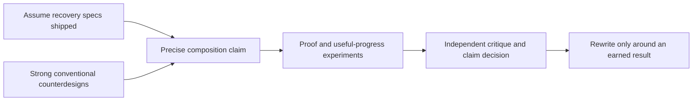

# Chio kernel breakthrough research

This is the entry point for the research requested on 2026-10-02, after the
completed funded-work manuscript was judged insufficient for Chio's foundational
ambition. Read this package before changing that manuscript or restarting the
novelty argument. The intended result is a consequential advance in how untrusted
agents perform work across independently owned systems.

**Current judgment:** the [G0 counterdesign pass](G0-DECISION.md) retains one
composition question. Strong conventional, capability-contract and OpenAPPA
constructions have plausible paths to the target behavior. Chio must establish a
nontrivial composition result or consequential systems advantage under matched
assumptions. A breakthrough remains unestablished.

Start with these documents in order:

1. [Research brief and design](../../superpowers/specs/2026-10-02-kernel-breakthrough-research-design.md):
   the user's ambition, the previous failure modes, three candidate contributions,
   the proposed model, and the decisions that must precede a paper rewrite.
2. [Prior-art comparison](2026-10-02-prior-art.md): primary sources, actual overlap,
   reading depth, and the strongest competing constructions to investigate.
3. [Execution plan](../../superpowers/plans/2026-10-02-kernel-breakthrough-research.md):
   ordered research tasks, concrete artifacts, experiments, acceptance criteria,
   and conditions for stopping an unsupported direction.
4. [G0 decision](G0-DECISION.md), [counterdesigns](counterdesigns.md),
   [recovery crosswalk](recovery-crosswalk.md) and [claim register](claim-register.json):
   the Task 1 result and the exact question for Tasks 2-3.
5. [Task 1 source audit](task1-source-audit.md) and
   [verification record](task1-validation.md): reading locations, source pins,
   reproducible checks and review scope.

## Resume state

| Item | State |
| --- | --- |
| Research and planning package | Written; source and documentation checks recorded in the plan |
| Assumed shipped baseline | PR #1172 revision 3, all P0-P6 recovery semantics, by the user's explicit instruction |
| Recommended investigation | R1 composition of the full kernel/recovery design across owners, using R2 cross-owner progress as the first difficult test |
| Task 1 | Complete: counterdesigns, crosswalk, claim register and G0 decision; fresh automated review accepted, clarifications resolved and checks passed |
| Next execution task | Task 2: shared model and F01-F16; then Task 3: minimal witness and G1 decision |
| New theorem or mechanism | Not established |
| New prototype or production changes | None; Task 1 adds research artifacts and a provenance/structure verifier |
| External operator | None available; existing trial package prepared, invitation unsent |
| Flagship manuscript | Frozen at the checkpoint below |
| Publication and breakthrough status | Existing false/open statuses remain in force |

The [recovery baseline manifest](recovery-baseline.json) pins PR #1172, its 111
requirements and architecture files. Treat those specifications as shipped when
reasoning about Chio's target contribution. Do not plan to rediscover or rebuild
them. The composed system, including recovery, is eligible to be the contribution;
it need not contain an unrelated additional invention beyond that PR.

The user explicitly requested brainstorming, research and an actual plan before
touching the paper again. This package satisfies that planning request; its
proposed research choices have not been represented as user-approved technical
designs or completed experiments. Execution should begin with the research
questions, not with a new abstract or a new kernel subsystem.

## Preserved checkpoint

- Branch: `paper/verifiable-work-20261002`.
- Source checkpoint: `5e1715636f2b66295ec3022d6161b91cb77a658d`.
- Frozen `docs/papers/verifiable-work` Git tree:
  `b8c5b771ca04903e219f9b42a50a050d326ba0ac`.
- [Existing paper and artifact](../../papers/verifiable-work/README.md).
- [Existing publication gates](../../papers/verifiable-work/PUBLICATION.json).
- [Existing external trial package](../../papers/verifiable-work/trial/README.md).

These are research provenance pins, not statements about the current main branch,
hosted qualification, release readiness, or independent operation. The active
security worktree and the user's original checkout are outside this planning
change. Keep this package in Git; do not depend on a chat summary or a temporary
directory as the only record of the reasoning.
