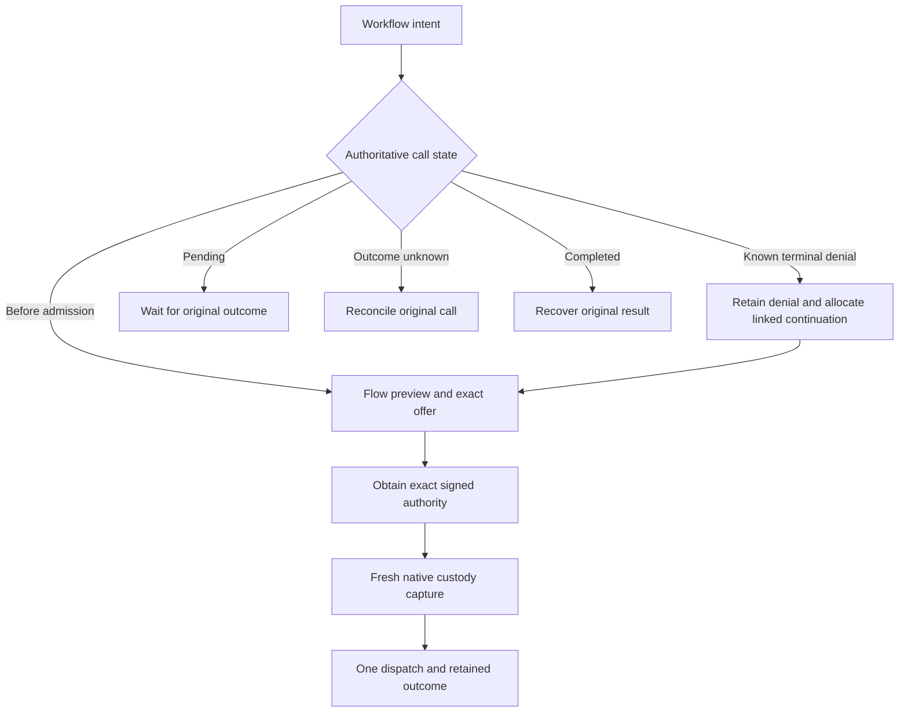

# Second pass: recovery over Chio's current security and agent processes

October 1, 2026. This continues the [first research pass](README.md) against the latest fetched integrated Chio development candidate, including September 27 execution-mode and simulation work. It uses an isolated research branch and preserves both original dirty checkouts. Development code and local tests are separate from public availability, hosted qualification and release acceptance.

**The newer code strengthens the case for adapting OpenAPPA's recovery experience onto Chio.** Chio already has much of the authority and execution machinery the first proposal needed. What remains is a coherent way for an agent to discover a legal next action, obtain its exact authority, and complete it through that machinery. Confidence: high about the inspected seams and measured local behavior; moderate about the proposed integration cost; unknown about comparative task completion until matched workloads run.

The strongest argument against this conclusion is product maturity. OpenAPPA owns a connected policy-to-remedy lifecycle, persists its offers, rederives their plans when used, and exposes the result to harnesses. A substantial security branch is not equivalent to that experience. Chio must demonstrate a joined workflow rather than treating its primitives as an already finished recovery product. [OpenAPPA engine/runtime boundary](https://github.com/archestra-ai/OpenAPPA/blob/a96f87d1fec900caf890f14342a089a32b3bfaff/appa-runtime/src/engine.rs#L31).

## What the newer foundation changes

| Foundation inspected | Significance for recovery | Remaining work |
|---|---|---|
| Durable capability-bound agent processes | One logical operation retains its immutable request, quota accounting and recovery identity across process-store reopen | Connect an agent-facing recovery workflow to these records |
| Host-selected flow identity | Tenant, principal, lineage, session and isolation epoch enter security context; workers do not select the profile | Make isolation and constrained returns usable without allowing arbitrary resets |
| Input observation and monotone flow state | The security path retains restrictive observations before destination evaluation | Offer an approved crossing while retaining what the agent has learned |
| Signed exact disclosure grants | Existing verification binds source, payload, recipient, tool, purpose, identity and authority | Build exact review requests and audience-safe approval displays |
| Native prepared dispatch capture | Flow, grant, credentials and budget custody join the actual dispatch lifecycle | Route remedies through this existing seam |
| Durable unknown-outcome recovery | An uncertain effect is resolved under retained identity; blanket retries are inappropriate | Distinguish recovery of an outcome from remediation of a known denial |
| Explicit response simulation | `DryRun` has a distinct request, snapshot and signed report, with no live effect ports | Use its architecture for advisory explanations without turning reports into permits |
| Process checkpoints and immutable state blobs | Processes can retain bounded state and verify blob integrity | Add label/provenance mediation for memory and export; a content digest alone does not supply it |

The relevant development paths and their content hashes are recorded in [the second-pass source inventory](evidence/second-pass-source-inventory.json). These files are not linked as public code because this pass did not establish that the newer implementation is published.

## Prototype: one exact disclosure remedy

Created a standalone Rust research crate that depends directly on current `chio-flow`, `chio-core-types` and `chio-security-types`. It uses a synthetic private support-owner label and public issue destination. The initial flow check denies disclosure and offers one registered action, `request_exact_disclosure_approval`.

The offer binds canonical content and the trusted host's observed capability, agent, operation, destination, purpose, source labels, flow generation, policy digest, contract digest, authority keys, revocation and budget basis. It lasts 30 seconds. Changing a bound dimension makes it stale; normal clock progression does not. Expiry and a backward clock are separate refusal conditions.

A fixture owner signs an actual Chio declassification grant. The lab verifies it with the real flow engine and prepares the exact public crossing. Its source label remains restricted. The next unapproved disclosure is still denied. Revoked or exhausted-capability observations, unknown labels and missing clearance do not produce an approval route. Pending, completed, uncertain and frozen-denied operation states cannot use the old offer to prepare another dispatch.

This is a real evaluator and signature-verification prototype with a synthetic host snapshot. It does not resolve live budget/revocation state, persist offers, consume production grants, call a model, obtain human approval or dispatch a provider tool. Its serialized offer is advisory and unauthenticated. Private Rust fields and a binding hash are useful local discipline, not an authenticated remote offer protocol.

The [captured demo](evidence/second-pass-demo.json) explicitly reports `dispatch_authorized: false`. Separate consumption tests use the real engine protocol through a test-only in-memory store, demonstrating one-use and failure/unknown retention semantics without claiming native durability.

The [second-pass test results](evidence/second-pass-test-results.json) separate the new lab, new process experiments, current flow tests, existing native custody tests and response-simulation tests. The first pass's 1,502 OpenAPPA tests remain a separate result on its recorded source. This pass does not turn that result into a Chio/OpenAPPA performance comparison.

| Owning target | Passed | Failed |
|---|---:|---:|
| New flow/offer/grant lab | 20 | 0 |
| New process binding experiments | 2 | 0 |
| Current flow crate | 47 | 0 |
| Selected native declassification tests | 6 | 0 |
| Existing process tests | 16 | 0 |
| Existing process crash-recovery target | 10 | 0 |
| Response simulation integration target | 3 | 0 |
| **Total** | **104** | **0** |

Nested crash subprocess summaries are excluded from the total. The crash target includes nine scenario tests and one subprocess entry point. The lab's all-target Clippy and formatting checks pass; the new process-test file passes formatting. This is selected macOS verification, not a full-workspace sweep.

## The important correction: workflow identity and call identity differ

The first proposal said an agent should approve and resume a denied operation. That needs a more precise contract in current Chio.

`ProcessRuntime` freezes the entire tool request under its operation key, including signed authorization extensions. A later request that adds a disclosure grant under the same key conflicts. This is valuable: a retry cannot quietly change what the kernel was asked to do.

| Situation | Correct action |
|---|---|
| A pre-admission flow check identifies a needed approval | Obtain exact authority before the operation is first admitted |
| A terminal denial occurred before dispatch and a remedy changes the request | Preserve that denial and create a new, explicitly linked continuation operation |
| An existing lifecycle holds a pending approval | Use that lifecycle's native pending/resume contract |
| The operation is pending | Wait or query its authoritative status |
| The outcome of an effect is unknown | Reconcile the original identity; do not allocate a replacement send |
| The operation completed | Recover its original result and evidence |

Two new experiments run against the actual process store and kernel with a counting local tool server. A capability-denied call remains immutable after reopening the process store: adding a signed artifact conflicts, and original denial replay still works. A different continuation consumes a second logical-call slot and remains denied by the narrowed capability. A completed call rejects a changed grant field and recovers the original result with one observed tool invocation.

The signed artifact in those process tests is only an identity fixture. It is not verified disclosure authority. Successful disclosure verification is tested separately by the lab; actual grant consumption and dispatch are tested separately by the native tests. Joining those paths into a single durable recovery workflow remains the next implementation step.

Continuation allocation needs durable workflow ownership. A known parent denial alone does not establish that no earlier continuation is already pending or uncertain. Retain an active-continuation reference and allocate with a compare-and-swap or the equivalent authority-owned protocol. Keep workflow links as evidence references to existing records instead of introducing a competing dispatch ledger.

## Where the remedy should enter the kernel

The inspected native flow path already supplies the critical seam. `NativeFlowResolver` prepares a `PreparedNativeFlowDispatch` borrowed from its resolver and bound to the native authority and selected manifest/policy. `capture_invocation` samples time again, validates custody, retains disclosure evidence, and enters native dispatch capture through the existing ledger and budget authority.

The remedy service should propose and collect exact authority, then enter that path. The production service should not dispatch from a pure `PreparedFlowAdmission`, replace native consumption with the lab's store, or use the narrower custody helper as a complete dispatch permit.

Six existing native declassification tests passed in this pass. They include an actual allowed kernel/tool invocation, unchanged principal/lineage/session restrictions, exact receipt replay without a second invocation, refused grant reuse, missing/substituted claims, required lifecycle selection, output/final-commit faults, and composition with nonce, runtime approval and proof of possession. This directly supports the feasibility of the integration seam. It does not establish that the new remedy workflow already uses it.

## What to replicate next, and where Chio can improve

**1. A recovery interface that understands effects.** OpenAPPA's remedies make policy restrictions navigable. Chio can add an equally explicit distinction among legal alternatives, awaiting authority, pending execution, uncertain effects, and recovered results. Present the next action as a typed option derived from current state. The first supported option should be exact disclosure approval; compatible destinations and reviewed transformations can follow.

Acceptance: a denied support disclosure produces an owner-readable exact proposal, a linked continuation sends once through native capture, restart recovers that send, reuse fails, source restrictions persist, and an uncertain send never becomes a new send merely because the agent asks for another remedy.

**2. Explanations with executable counterfactuals.** The current response simulation cleanly separates `DryRun` from `Live`. Its signed reports bind snapshot, deployment and expected signer; verification recomputes the model. It neither reserves live approval/budget authority nor owns an effect port. This is active-defense response simulation, not a generic disclosure-remedy simulator. Its architecture is a useful pattern for a future “why blocked, what would change” view.

Show a bounded comparison: current public destination denied; permitted internal destination requires no exception; owner approval permits only the exact public payload. Counterfactuals should carry their observed versions and expire as advice. Live capture must reevaluate. Confidence: high in the separation principle; moderate that the response machinery can be reused without expanding its meaning.

**3. Semantic connectors with operator-controlled truth.** Replicate OpenAPPA's batteries as useful source/sink semantics and tests. In Chio, bind the resolved contract to existing manifest and policy identities. The package describes tool meaning; the operator binds ACL providers, authority keys, tenant mappings and failure behavior. A package signature proves package identity, not that its asserted provider permissions are correct.

Start with support reads and issue writes, then add a second unrelated host/tool family. Count uncovered operations and incorrect recipient resolution, alongside completed benign work. Refuse missing semantics rather than treating a familiar tool name as sufficient evidence of its audience.

**4. Label-aware process memory and artifact provenance.** Chio's process blobs and checkpoints provide durability and integrity. They are a strong starting point for closing the restart gap demonstrated in the OpenAPPA file-ledger probe. They do not, by themselves, establish an artifact's permitted audience.

The proposed artifact reference should bind content version, producing operation, source dependencies, label, lineage/isolation context and retained evidence. Reading, exporting, restoring, summarizing or copying it must enter flow mediation. Restart and a new session must not adopt unknown persisted bytes as public. Test provider context restoration and failure diagnostics as well as filesystem copies. Confidence: high that durability plus mediation is required; unknown how much current storage machinery can be reused until an actual artifact path is integrated.

**5. Isolated readers whose return is a meaningful product.** Replicate constrained returns, but integrate them with host-owned process identity, isolation epoch, inherited lineage and return evidence. Offer a bounded fact or projection that helps the parent finish its task. Cover errors, logs, cancellation and checkpoint restoration, not only the successful final body. A return schema limits shape; it does not independently authorize disclosure or prove the returned statement is true.

**6. Evaluations that reward finished work and preserved authority.** Keep OpenAPPA's emphasis on legitimate completion. Add actual effect counts, duplicate-effect attempts, unresolved-operation handling, authority consumption, restart durability and application glue removed. Pair each attack with a benign case. Compare matched actors, tool semantics and work definitions before making superiority claims.

The current lab establishes a specific implementation route and exposes an important process-identity constraint. A useful later benchmark is the same two workflows across two host frameworks, with matched normal/attack trajectories and injected crash cutpoints.

## Concrete next implementation

Build a single durable support-disclosure workflow with these records: workflow intent, original denial evidence, current offer basis, exact approval reference, active continuation reference, original native outcome/evidence. Keep capability, flow, budget, consumption and execution ownership in their existing stores.

The cutpoint matrix should cover offer retention, approval arrival, continuation allocation, native capture, external effect, outcome persistence and receipt delivery. Include expiry, policy/contract reload, revocation, exhausted budget, duplicate approval delivery, duplicate continuation requests, stale flow, changed content, grant reuse and unknown outcome. Require one completed benign path as well as all expected refusals.

That vertical slice should precede a generic planner, broad connector marketplace or a new policy language. The new foundation makes this a focused integration problem. The product value is an agent that completes a legitimate blocked task while Chio retains ownership of the exact authority and effect.

All new code is on a local research branch. No production implementation was changed, no remote branch was pushed, and no release or hosted qualification was performed. Existing roadmap documents still retain open combined/trusted-runner/release acceptance gates; these focused macOS checks do not close them.
