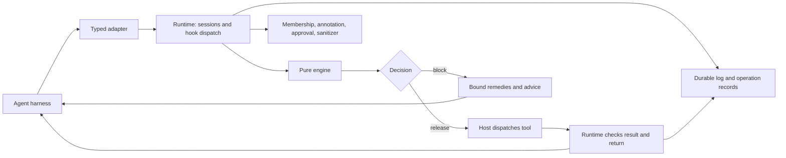

# OpenAPPA: source, mechanisms, product direction, and limits

All OpenAPPA source links below refer to the reviewed October 1 revision, `a96f87d1fec900caf890f14342a089a32b3bfaff`. Findings about execution below come from source inspection plus the selected local tests recorded in [test-results.json](evidence/test-results.json). Published evaluation results are the authors' earlier runs, not evaluations of this checkout that we independently reproduced.

## 1. What the project is trying to achieve

OpenAPPA's central product promise is that security should preserve useful agent work. It tracks restrictions induced by earlier reads, checks later actions, and gives an agent bounded ways to recover when an action would violate policy. The runtime retains the relevant history rather than requiring each application to reconstruct it for a stateless authorization call.

This is a narrow, intelligible wedge: source sensitivity and trust influence destination permission. Its practical scope now includes tool history, subagent returns, filesystem mediation, operations that can be approved once, prerequisite effects, and deployment-specific connector semantics. The [README](https://github.com/archestra-ai/OpenAPPA/blob/a96f87d1fec900caf890f14342a089a32b3bfaff/README.md) calls it preview/RFC and describes Claude Code as a playground for seeing the model work, while embedding and proxy integration are the broader adoption direction.

The important strategic feature is how much adoption work surrounds the algebra. There is an installation path, a protected launcher, an agent-guided policy setup flow, batteries for familiar services, examples, policy checks, trajectory replay, explanations, feedback reporting, and evaluation tasks. That makes the concept something a developer can try.

Its comparison pages contrast it with general authorization engines. Treat those pages as positioning, not impossibility proofs about competing languages. Their defensible distinction is the supplied combination of history propagation, policy evaluation, enforcement integration, and recovery. A sufficiently capable host could implement these around another policy engine. [OPA comparison](https://github.com/archestra-ai/OpenAPPA/blob/a96f87d1fec900caf890f14342a089a32b3bfaff/website/content/docs/openappa-vs-opa.md), [Cedar comparison](https://github.com/archestra-ai/OpenAPPA/blob/a96f87d1fec900caf890f14342a089a32b3bfaff/website/content/docs/openappa-vs-cedar.md).

**Confidence: high** about this product interpretation. Whether its integration path is easier than Chio's under an actual production workload remains unmeasured here.

## 2. Architecture and ownership

The workspace is Rust, version 0.30.0, edition 2024, with packages marked `publish = false`. The core separation is worth preserving:

| Component | Responsibility | Why the boundary matters |
|---|---|---|
| `appa-engine` | Pure decisions and validated event batches | No network, filesystem, clock, or store mutation in the decision core |
| `appa-policy` | Strict TOML compilation to the registry | Configuration failures appear before execution; registry bounds constrain planning |
| `appa-eventlog` | Log append, policy snapshots, host records, operation/result claims | Durable state is explicit rather than hidden in adapters |
| `appa-runtime-api` | Typed wire contract | Adapters translate harness events without implementing policy |
| Claude Code / kagent / Amp adapters | Decode and encode harness-specific events | Integration errors remain distinguishable from policy denials |
| `appa-runtime` (`appa`) | Sessions, hooks, offers, external consults, results, CLI, mediation | The runtime owns the actual bridge between policy and host activity |
| `appa-builtin` | Native module ABI for classifiers, sanitizers, authorities, membership | Trusted plugin execution is a separate boundary |
| `appa-package` | Versioned packages, installation, artifacts, offline bundles | Shipping semantic integrations is part of adoption |

The host's dispatch arrow is critical. If the harness can run a call after a denial, omit a read, or admit unchecked output, the core's sound decision does not repair that bypass. OpenAPPA supplies integrations to control those paths; it does not turn arbitrary agent hosting into complete mediation by merely evaluating a policy.

[Engine contract](https://github.com/archestra-ai/OpenAPPA/blob/a96f87d1fec900caf890f14342a089a32b3bfaff/appa-engine/src/lib.rs#L1), [event store contract](https://github.com/archestra-ai/OpenAPPA/blob/a96f87d1fec900caf890f14342a089a32b3bfaff/appa-eventlog/src/lib.rs#L1), [integration walkthrough](https://github.com/archestra-ai/OpenAPPA/blob/a96f87d1fec900caf890f14342a089a32b3bfaff/website/content/docs/add-to-agent.md).

## 3. The current algebra is richer than the paper shorthand

### Labels and symbolic audiences

A label contains a trust level and an audience. Ordinary propagation takes the minimum trust and intersects permitted audiences. Reading a public document after a private document does not remove the private restriction; reading trusted content after suspicious content does not automatically repair the trust floor.

The audience is a canonical intersection of union clauses, with a built-in `self ⊆ internal ⊆ public` chain, group references, and literal readers. The engine first uses a sound symbolic derivation where it can answer without expanding memberships. Where exact membership is needed, the runtime gathers evidence that is pinned to the operation and retained for replay. An unresolved membership question is an operational inability to answer, not a permissive label or a fabricated policy verdict.

This is important for integration with Chio. OpenAPPA's `Label::top()` is maximally permissive: maximum trust and public audience. In the newer Chio development implementation, `InformationLabel::Top` is maximally restrictive, and both top source labels and top operational clearances are refused for egress. Matching variant names would invert the meaning of the most important fallback value.

Chio's confidentiality label also carries owner-specific reader constraints and compartments. Collapsing those to an audience discards authority structure. OpenAPPA's trust dimension is not an automatic match for that confidentiality label. A bridge must specify a supported subset and preserve additional Chio restrictions independently; it must not advertise a lossless conversion for the whole model.

[Current model](https://github.com/archestra-ai/OpenAPPA/blob/a96f87d1fec900caf890f14342a089a32b3bfaff/appa-engine/src/lib.rs#L11), [label operations](https://github.com/archestra-ai/OpenAPPA/blob/a96f87d1fec900caf890f14342a089a32b3bfaff/appa-engine/src/label.rs#L949). Chio development evidence is identified separately in [the source inventory](evidence/source-inventory.json).

### Concrete per-call annotations

The current source requires one complete annotation for every released call: its restriction contribution, its requirements, and the effects it emits. The producer is either a declared contract or a registered per-call annotator. The latter's answer is bounded by its mandate and pinned to the call's canonical digest. Rewritten arguments need a fresh annotation; replay uses the retained answer rather than asking a classifier again.

This has evolved beyond the paper's description of gradual uncertainty. The current algebra says explicitly that there is no partial or pending label state. Uncertainty about a classifier or membership source belongs at the runtime's unanswered/refused boundary.

The default coding-agent configuration has a wildcard annotation path. That helps cover drifting tool inventories, but it moves correctness into an external classifier and its mandate. The Jev classifier implementation uses an external TypeSafe API; the actual approval and label algebra remains deterministic once its inputs are fixed. This does not prove that an opaque shell command's real reads and writes match a guessed annotation.

[Annotation contract](https://github.com/archestra-ai/OpenAPPA/blob/a96f87d1fec900caf890f14342a089a32b3bfaff/appa-engine/src/lib.rs#L27), [default policy](https://github.com/archestra-ai/OpenAPPA/blob/a96f87d1fec900caf890f14342a089a32b3bfaff/marketplace/plugins/claude-code/default.appa.toml), [classifier implementation](https://github.com/archestra-ai/OpenAPPA/blob/a96f87d1fec900caf890f14342a089a32b3bfaff/appa-runtime/src/model/jev.rs).

## 4. Recovery is the feature to study most closely

`PlannedBlock` preserves the underlying block and attaches executable remedy plans plus separately checked recommendations. The implemented operations include bounded authorization, acceptance of a narrowing, withholding output, sanitizing output, deriving replacement input, prerequisite redispatch, and constrained child returns.

Several details prevent the friendly UX from silently becoming permission escalation:

- Plans derive from registered authority and sanitizer mandates; the agent does not invent a new authority by asking for one.
- Offers are tied to proposal identity and state basis. Reusing a stale offer after relevant state changes does not make it fresh.
- Input transformation produces a different candidate and is checked again.
- A promise to sanitize a result after dispatch cannot justify a requirement that had to hold before dispatch.
- Withholding means executing without admitting the result to the model. The host must actually control success and failure outputs for that plan to be meaningful.
- A prerequisite recommendation names a tool that can clear the specific gap. That tool still has its own permission checks when proposed; the advice is not permission to execute it.
- Enumeration is bounded by a registry load-time planner cap rather than silently truncated at runtime.

The source describes an empty plan list as a proof that the block cannot be lifted **relative to the implemented remedy subset, current registry, and recorded denials**. It does not prove that no conceivable workflow, tool, policy change, or future authority could solve the task.

This distinction belongs in Chio's UX. The useful answer is often: “this disclosure is blocked; request approval for these exact bytes and recipient,” or “use the internal sink,” or “first reconcile the prior dispatch.” A generic retry suggestion after an unknown external outcome would be actively harmful.

[Planner semantics and limitations](https://github.com/archestra-ai/OpenAPPA/blob/a96f87d1fec900caf890f14342a089a32b3bfaff/appa-engine/src/plan.rs#L1), [state basis](https://github.com/archestra-ai/OpenAPPA/blob/a96f87d1fec900caf890f14342a089a32b3bfaff/appa-engine/src/basis.rs).

## 5. Durability and operation identity are real, not hypothetical

The event store supports standalone SQLite, memory, and optional embedded-host PostgreSQL. It retains exact policy bytes by content hash, log facts and host records, operation claims, and processed-result claims. Append compares against the previously read log basis. Operation claims precede work, and completed claims return stored decisions. A reused identifier with different input or a conflicting completion is rejected.

The engine also reserves emitted effects when dispatch is released. `prior(k)` is satisfied by committed successful effects; `no_prior(k)` is blocked by successful effects **or unsettled reservations**. An indeterminate close leaves the reservation standing. Root forks retain a frozen copy of inherited unsettled reservations. Neither a crash nor an independent root fork makes an unresolved effect disappear.

The local runtime crash-recovery suite passed all seven selected tests, including reopening persistent state and refusing compromised policy storage. This is meaningful behavior. It does not establish physical exactly-once execution across arbitrary external services. A runtime cannot infer whether an uncooperative remote endpoint performed a side effect after its last acknowledged record; it needs endpoint idempotency, effect evidence, or reconciliation.

OpenAPPA calls some idempotency records “receipts.” Their function is local operation/result ownership. That word alone does not establish equivalence with authenticated Chio receipt verification or independently verifiable exported evidence.

[Storage and claims](https://github.com/archestra-ai/OpenAPPA/blob/a96f87d1fec900caf890f14342a089a32b3bfaff/appa-eventlog/src/lib.rs#L16), [receipt types](https://github.com/archestra-ai/OpenAPPA/blob/a96f87d1fec900caf890f14342a089a32b3bfaff/appa-eventlog/src/receipts.rs), [reservations](https://github.com/archestra-ai/OpenAPPA/blob/a96f87d1fec900caf890f14342a089a32b3bfaff/appa-engine/src/projection.rs#L1149), [indeterminate test](https://github.com/archestra-ai/OpenAPPA/blob/a96f87d1fec900caf890f14342a089a32b3bfaff/appa-engine/src/projection.rs#L1598), [crash suite](https://github.com/archestra-ai/OpenAPPA/blob/a96f87d1fec900caf890f14342a089a32b3bfaff/appa-runtime/tests/crash_recovery.rs).

Full log reprojection is the engine's current read-model construction path. This makes reconstruction legible, but repeated decisions over long histories may accumulate substantial replay work. A scaling comparison would need optimized builds, equal persistence settings, equivalent histories, and separate startup versus per-decision measurements. No performance-superiority claim follows from this source observation alone. [Projection](https://github.com/archestra-ai/OpenAPPA/blob/a96f87d1fec900caf890f14342a089a32b3bfaff/appa-engine/src/projection.rs#L1).

## 6. Subagents, isolation, and structured returns

Subagent forks share family effect history and start from the parent's label. A root fork freezes the source label, effects, reservations, denials, and opening policy into a separate family. Neither fork is a way to wash away already admitted information.

Isolation can preserve parent utility when the parent delegates a sensitive read before admitting its raw result. A checked return declaration decides what can cross back. The implementation supports closed, bounded JSON return shapes. Removing arbitrary text limits instruction-bearing output, but a bounded choice can still encode information, and a correct schema does not prove that the returned fact is true. The authors make that latter limitation explicit in the benchmark interpretations.

The latest source hardens child routing with an HMAC-SHA256 seal tied to a released spawn's batch identity and validates it against the retained family log. That is a concrete defense against forged delegation references. It should not be confused with public-key evidence that another organization can independently verify.

For Claude Code, agent definitions declaring `maxTurns` can bypass the intended stop check. The current integration refuses those definitions and treats unclassifiable or unclosed frontmatter in its bounded read as unsafe. This illustrates the maintenance cost of a hook integration: security depends on the harness's actual lifecycle, including ways it can terminate without the expected callback.

[Fork semantics](https://github.com/archestra-ai/OpenAPPA/blob/a96f87d1fec900caf890f14342a089a32b3bfaff/appa-engine/src/lib.rs#L38), [return shapes](https://github.com/archestra-ai/OpenAPPA/blob/a96f87d1fec900caf890f14342a089a32b3bfaff/appa-engine/src/shape.rs), [spawn seal](https://github.com/archestra-ai/OpenAPPA/blob/a96f87d1fec900caf890f14342a089a32b3bfaff/appa-runtime/src/engine.rs#L2951), [harness constraints](https://github.com/archestra-ai/OpenAPPA/blob/a96f87d1fec900caf890f14342a089a32b3bfaff/website/content/docs/coding-agents.md#L204).

## 7. Filesystem mediation: good design, incomplete boundary

The file model distinguishes what a call returns to the model from what it publishes as file content. A copy can transfer restricted bytes without exposing those bytes to the model; the destination must still accept their label. A write acknowledgement does not automatically taint a context with all written bytes. A failure carrying text is checked at the value's label rather than treated as a safe back door.

The runtime's experimental file tools pin content versions, digests, labels, and paths. The source includes mutation reservations, staged writes, checks for changed content, and refusal of unsafe link/nonregular-file cases. Abandonment releases a reservation only when the expected bytes have not moved; uncertain mutation is quarantined for the process lifetime.

The limits are substantial and openly documented:

| Boundary | Current scope |
|---|---|
| File label ledger | In memory; new runtime starts from configured initial classification |
| Workspace concurrency | Assumes no external writer |
| Native file tools | Refused in this mode, but harness-side validation or implicit reads can precede hooks |
| Instructions and memory | Some are read by the harness without tool events |
| Model-provider requests and final response | Not checked by this file feature |
| Native shell | Refused in file mode; ordinary shell contracts classify spelled paths rather than confining execution |
| Sanitizers / label lowering | Unavailable in experimental file mode |

The authored `FileStore` probe confirms the first row: a recorded HR-only label disappeared on recreation, with identical content digest. Configuring a restrictive initial label changes the consequence, but does not make the prior version ledger durable.

Isolated file processing additionally uses an agentsh-derived Linux backend with namespaces, Landlock, seccomp, no network, empty environment, and bounded resources. This source path was inspected; it was not executed or qualified on the macOS host used here. Chio's comparable Linux execution claims also require their own exact-source qualification evidence.

[File semantics](https://github.com/archestra-ai/OpenAPPA/blob/a96f87d1fec900caf890f14342a089a32b3bfaff/appa-engine/src/lib.rs#L64), [file ledger](https://github.com/archestra-ai/OpenAPPA/blob/a96f87d1fec900caf890f14342a089a32b3bfaff/appa-eventlog/src/files.rs#L239), [mediation design](https://github.com/archestra-ai/OpenAPPA/blob/a96f87d1fec900caf890f14342a089a32b3bfaff/appa-runtime/FILE-MEDIATION.md), [documented limits](https://github.com/archestra-ai/OpenAPPA/blob/a96f87d1fec900caf890f14342a089a32b3bfaff/website/content/docs/coding-agents.md#L80), [probe evidence](evidence/experiments.json).

## 8. Packages, setup, reporting, and operations

Batteries supply provider-specific tool contracts plus classifier, sanitizer, authority, or audience sources. Root policy rules run before included battery rules. The operator defines deployment meanings for `self` and `internal` and supplies credentials; the package cannot make its own audience declarations into operator authority. This division is a valuable template for Chio's existing manifests and policy registry.

Package hashes and native module ABI checks establish artifact identity and compatibility; they do not prove a sanitizer's semantic correctness. Native modules are trusted code. Their bounded ABI and panic handling do not provide sandbox isolation, and aborting or pathological native code can still terminate the host.

`appa describe --check` validates configuration and can report tool coverage. `appa replay` runs scenario expectations through the real hook/runtime decision path while stubbing tool outputs, approvals, and sanitizer execution. It is excellent policy feedback, but it does not certify actual redaction or a live integration. Our authored scenarios relied on that exact distinction.

`appa yell` records agent/operator reports. The policy-maintenance vision is a separate agent proposing tested changes for review. Reporting does not change permissions. This is worth copying as a bounded operational loop, not as authorization for a live agent to relax its own constraints.

OpenTelemetry export is implemented in the current source and described by the dedicated observability page. Another integration page still calls it in development: an example of documentation drift. Telemetry and reports can contain sensitive data, so correlation should use bounded identifiers and safe classes rather than exporting raw arguments or confusing best-effort diagnostics with durable authority evidence.

The runtime also rejects requests with browser `Origin` headers and restricts management routes to loopback peers. Those are concrete ingress controls, not authentication for every caller that can reach a non-browser endpoint. Shared deployment identity, network isolation, and trusted host bindings still matter.

[Batteries](https://github.com/archestra-ai/OpenAPPA/blob/a96f87d1fec900caf890f14342a089a32b3bfaff/website/content/docs/batteries.md), [native ABI](https://github.com/archestra-ai/OpenAPPA/blob/a96f87d1fec900caf890f14342a089a32b3bfaff/appa-builtin/src/lib.rs), [replay scope](https://github.com/archestra-ai/OpenAPPA/blob/a96f87d1fec900caf890f14342a089a32b3bfaff/appa-runtime/src/replay.rs#L1), [maintenance vision](https://github.com/archestra-ai/OpenAPPA/blob/a96f87d1fec900caf890f14342a089a32b3bfaff/website/content/docs/self-improving-policies.md), [telemetry implementation](https://github.com/archestra-ai/OpenAPPA/blob/a96f87d1fec900caf890f14342a089a32b3bfaff/appa-runtime/src/telemetry/exporter.rs), [ingress](https://github.com/archestra-ai/OpenAPPA/blob/a96f87d1fec900caf890f14342a089a32b3bfaff/appa-runtime/src/main.rs#L684).

## 9. What the evaluation actually supports

The checked-in summaries reproduce the detailed same-model Claude comparison:

| Suite | Guarded OpenAPPA: completion / scored attacks | IFC-tuned Auto | Stock Auto |
|---|---:|---:|---:|
| Corp, 20 scenarios | 15/20 / 0 | 17/20 / 0 | 18/20 / 2 |
| Threat, 24 upstream tasks | 18/24 / 0 | 23/24 / 6 | 21/24 / 8 |

All three use the same actor model, prompts, and tools according to the evaluation description, but each task was run once in this comparison. The two extra local Threat controls are excluded from the 24-task table; [our recomputation](evidence/published-benchmark-crosscheck.json) does the same. This is a meaningful observed tradeoff, with no variance estimate. The broader “89% versus 90%” headline combines different evaluation context and should not substitute for this table.

The broader published runs report zero successful scored attacks in 1,320 evaluations. That is not 1,320 independent threat classes or a proof of universal safety. The 88–90% completion range is Corp-specific; it should not be carried over to every suite. Recovery ablations are a particularly useful research direction because they try to measure how much allowed work survives after enforcement.

Tau uses 97 banking tasks with four trials per configuration. Published completion is 151/388 (38.92%) for guarded OpenAPPA versus 156/388 (40.21%) for the stock agent, with reported average agent-token overhead of 4.22%. That overhead concerns complete agent trajectories, not just the cost of a pure decision. Corp scoring checks actual changes and sends without a model judge. Tau has one task with an `NL_ASSERTION` model judgment, so “all benchmarks use no LLM judge” would be false.

Current repository evidence includes summaries and archive indexes; full published raw archives are described as residing in a private store. We checked arithmetic and source definitions, not the complete raw archive or independent model runs. The run dates also precede this October 1 source. Benchmarks should be linked to the revision that produced them rather than used as qualification of every later change.

[Detailed evaluation](https://github.com/archestra-ai/OpenAPPA/blob/a96f87d1fec900caf890f14342a089a32b3bfaff/website/content/docs/evaluation.md), [scoring and archive notes](https://github.com/archestra-ai/OpenAPPA/blob/a96f87d1fec900caf890f14342a089a32b3bfaff/bench/README.md), [Corp summary](https://github.com/archestra-ai/OpenAPPA/blob/a96f87d1fec900caf890f14342a089a32b3bfaff/bench/corp/results/20260911-162255/summary.json), [Threat summary](https://github.com/archestra-ai/OpenAPPA/blob/a96f87d1fec900caf890f14342a089a32b3bfaff/bench/agentthreatbench/results/full-sonnet-5/summary.json), [Tau summary](https://github.com/archestra-ai/OpenAPPA/blob/a96f87d1fec900caf890f14342a089a32b3bfaff/bench/taubench/results/parallel-2026-09-16/summary.json).

**Confidence: high** in the checked arithmetic and documented scope; **unknown** in an independent reproduction or a Chio comparison.

## 10. Where Chio overlaps and where the opportunity lies

The captured public Chio source already includes combined admission capture with capability, authorization artifacts, revocation, quota, store fences, and operation identity. It includes outcome-unknown-after-dispatch projection and receipt replay requiring trusted kernel-key evidence. Generic durable admission and replay should therefore not be proposed as brand-new features.

The public guard called `DataFlowGuard` counts read/write bytes. It is not the owner/reader confidentiality lattice. Treating a name match as evidence of equivalent IFC would be an architectural error.

Newer local development source contains owner/reader and compartment labels, cumulative flow state, prepared flow admission, narrowly bound declassification, and persisted principal/lineage/session state. These are foundations for the proposal. They are not a claim that the current public default-branch checkout exposes all of them or that combined Linux qualification is complete. The inspected qualification ledger explicitly retains an incomplete combined acceptance boundary.

The missing layer found by this scoped review is an OpenAPPA-style general remedy planner and agent-facing workflow around those primitives. Existing CLI diagnostic and repair commands solve particular operational problems; they do not establish a complete recoverable IFC product. There could be additional work elsewhere; this finding is bounded to the inspected snapshots and paths.

Chio's strongest opportunity is a single kernel lifecycle that joins permission, exact disclosure, durable ownership, physical execution mediation, and authenticated evidence. OpenAPPA demonstrates that recovery, integrations, and evaluation must make that architecture usable. Chio still has to prove that it removes real host-side supervision and retains useful work across failures.

[Public admission capture](https://github.com/backbay-labs/chio/blob/5b8bec41d32f3838b880576fe6123c983ecebf8d/crates/kernel/chio-kernel/src/admission_operation/capture.rs), [public unknown-outcome projection](https://github.com/backbay-labs/chio/blob/5b8bec41d32f3838b880576fe6123c983ecebf8d/crates/kernel/chio-kernel/src/admission_operation/projection/outcome_unknown.rs), [public replay](https://github.com/backbay-labs/chio/blob/5b8bec41d32f3838b880576fe6123c983ecebf8d/crates/products/chio-cli/src/cli/replay.rs), [byte-count guard](https://github.com/backbay-labs/chio/blob/5b8bec41d32f3838b880576fe6123c983ecebf8d/crates/guards/chio-guards/src/data_flow.rs#L1), [local development inventory](evidence/source-inventory.json).
