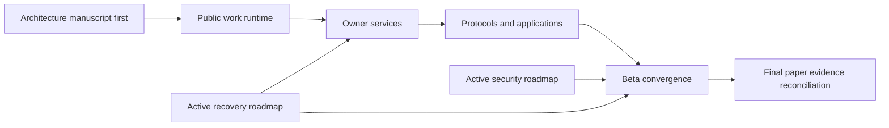

# Work as a reusable programming abstraction

This is the third Chio workstream, alongside the active security and recovery roadmaps. The accepted thesis is that a work commitment becomes a reusable programming abstraction across independent owners.

The package is a plan, not an implementation-completion or beta-release claim. It was prepared from exact code snapshots on October 3, 2026. The recovery implementation is active on the owner's Mac; the visible contract is PR #1172.

## Start here

1. [Architecture, authority ownership and beta scope](../../superpowers/specs/2026-10-03-agentic-work-kernel-design.md).
2. [Current code and gap review](CURRENT-STATE.md).
3. [Pinned source inputs](SOURCES.json).
4. [Planning review and validation](REVIEW.md).
5. [Session intent and incorporated refinements](SESSION-INTENT-REVIEW.md), preserving the brainstorm and mapping the six subsequently approved ideas into the current tasks.

## Plans and order

| Order | Plan | Concrete result |
| --- | --- | --- |
| First | [P: final whitepaper](../../superpowers/plans/2026-10-03-verifiable-work-finalization.md), P.1 through P.4 | Complete architecture manuscript, written before implementation and precise about actual evidence |
| 1 | [W1: reusable runtime](../../superpowers/plans/2026-10-03-work-runtime.md) | Public facade, resolved terms, owner preparation, accepted-result joins, existing D1/S1 composition and durable references |
| 2 | [W2: owner services](../../superpowers/plans/2026-10-03-work-owner-services.md) | Authenticated separate-owner execution, real co-signing, funded/unpaid profiles and recovery joins |
| 3 | [W3: developer surface](../../superpowers/plans/2026-10-03-work-developer-surface.md) | Protocol fidelity, installed Python/TypeScript clients, CLI and two applications sharing the model |
| 4 | [W4: beta convergence](../../superpowers/plans/2026-10-03-work-beta-convergence.md) | One exact candidate accepted against the existing release requirements |
| Last | [P: final whitepaper](../../superpowers/plans/2026-10-03-verifiable-work-finalization.md), P.5 | Actual implementation/evaluation reconciled into the publication package |

W1 through W3 are the third feature roadmap. W4 joins the three roadmaps and existing release obligations. It does not create a fourth feature program.

The work model should be evident in two applications: the growing API-review program and the recovery lane's owner-approved support disclosure with a separate analysis worker. Both use the same runtime, host protocol and SDK contract. Applications supply task logic, policy and acceptance procedures; Chio supplies the recurring authority and recovery coordination.

The [second architecture review](ARCHITECTURE-REVIEW.md) records eleven concrete plan corrections and their source evidence. The revised runtime plan qualifies allocation/graph issuance, uses checked client/service contracts, and keeps protected request custody and original-operation recovery in their existing owners.

The approved session refinements extend these same five plans. Two new runtime tasks resolve working terms (W1.3) and compose accepted results through existing joins (W1.5). The [six shared lifecycle cases](../../superpowers/specs/2026-10-03-work-developer-surface-design.md#required-composition-cases) cover collaborator formation, acceptance/dependencies, authorized recovery progress, policy changes, bounded substitution and incremental adoption, including the existing LangGraph harness. AW01-AW31 map the complete acceptance scope. No additional feature roadmap is needed.

## Decisions fixed by this package

- Extend chio-runtime and existing authorities rather than introducing another kernel, treaty system, scheduler or recovery coordinator.
- Preserve programmable sovereignty at local admission and result-release boundaries.
- Make owner-approved relationship formation, exact acceptance, dependency joins and policy evolution visible through the shared programming model.
- Reuse existing recovery operations from scoped links; preserve separate workflows/budgets for independent progress beside uncertainty.
- Promote reusable code from the standalone funded-work example; retain its historical evidence and fixture-specific behavior.
- Make owner-authorized preparation part of the public surface, so applications do not assemble signatures or hold foreign private keys.
- Treat adapter compatibility as explicit enforced capabilities, not a universal guarantee.
- Describe the intended completed architecture in the early paper without inventing implementation, measurements or outside operation.
- Separate the architectural publication profile from the earlier breakthrough/economic hypotheses while preserving the old record.
- Stop feature expansion when the two applications, supported profiles and inherited acceptance boundaries are complete.

No implementation, manuscript change, publication, dependency installation or test campaign is performed by creating this package.
