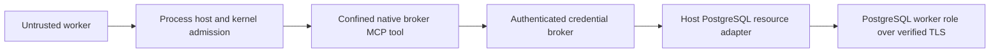

# PostgreSQL native resource mediation repair

Status: the caller projection, host resource and scripted qualification wiring
are implemented with bounded local evidence. Full native composition and final
qualification are incomplete. This plan stays inside #1160's existing blocked
PostgreSQL acceptance; it creates no additional landing PR or product track.
Use Superpowers inline execution. Do not spawn subagents.

## Intended outcome

Restore the existing PostgreSQL job handoff and lost-claim-response qualifications
under enforced native isolation. Preserve the real worker database role, TLS,
tenant isolation, lease owner and fence checks, original operation identity,
durable receipts and uncertainty after a committed effect loses its response.
The database credential and transport belong to the host resource boundary.
Confined tool processes receive neither the credential nor direct socket access.

## Confirmed starting point

- `agent_jobs/main.rs` reads database environment variables and connects before
  MCP initialization and tool discovery. The enforced launch clears undeclared
  environment and forbids direct socket creation and connection.
- Hosted run `37252205437` passes the public PostgreSQL worker API test, then
  fails native MCP discovery with a broken pipe. That log does not identify
  whether missing configuration or denied networking was the first failure.
- `agent_jobs/resource.rs` accepts caller metadata only because its original
  design assumes a trusted kernel-owned pipe. Copying that field through a new
  untrusted request would break lease ownership.
- Existing `NativeBrokerMcpTool`, process-host broker preparation, strict signed
  broker requests, encrypted credential custody, authenticated host HTTPS and
  original-operation recovery supply most of the required boundary.
- Existing broker configuration requires a unique server and audience per route.
  Preserve that rule. The six job operations can use six explicit routes.

Source examined: `8384454ca6d7b8951c4a90b6f996583499c1ee52`. The subsequent Swift
text-normalization commit does not change these owners. Recheck source and
existing branch repairs before implementation.

## Selected composition

The resource adapter reuses the bounded host HTTPS implementation used by
existing host adapters. It exposes only the six existing typed job operations,
with the tenant and operation selected by operator configuration. It does not
accept SQL, a database URL, a connection option or a user-selected credential.
Database migrations and initial seeding remain explicit operator operations.

A host-selected payload mapping constructs the resource envelope inside the
existing durable invocation preparation closure, after the original process
capability is available. Its caller digest is the canonical hash of that exact
capability, using the same calculation as the connection descriptor. Workers
supply only ordinary operation arguments. They cannot select or replace the
caller digest, tenant, operation, provider destination or credential reference.
The existing request proof binds the final provider body. Preparation recovery
returns the original retained envelope instead of reconstructing it using a new
capability or operation identity.

The resource envelope is an internal projection, not a credential by itself.
The adapter accepts it only over the existing pinned, broker-authenticated host
HTTPS channel. Provisioning must bind the adapter credential exclusively to the
six fixed resource mappings and their trusted issuer. A generic JSON route must
not share that credential. No request-supplied `_meta` becomes authority.

Use a thin, shared host HTTPS extension that exposes only bounded application
bytes to an adapter. Keep bearer material and TLS key custody private. The
PostgreSQL adapter validates its fixed resource and operation before entering
the existing typed lease API. It derives worker completion and renewal owners
from the authenticated envelope. Root-only assignment and release retain their
existing explicit target-owner argument and grant restrictions.

Allowing network syscalls in the cage would violate the selected isolation
contract. Moving the complete PostgreSQL driver into the kernel would enlarge
the kernel's trusted implementation. The existing broker composition preserves
the established mediation and credential-custody boundaries.

## Owning changes

1. `chio-cli/src/cli/process_host/native_broker/{payload,preparation}.rs`:
   fixed caller-bound resource projection and original preparation recovery.
   Keep normal JSON and model mappings behaviorally unchanged.
2. `chio-secret-broker/src/host_https.rs` and the smallest necessary public
   adapter interface: reuse bounded authenticated transport without exposing
   credentials, arbitrary outbound execution or a second broker verifier.
3. `chio-finding-market-store-postgres/examples/agent_jobs/`: separate operator
   migration/seed entry points, typed resource execution and host service
   lifecycle. Keep lease mutations in the existing store implementation.
4. `examples/postgres-job-swarm/`: provision fixed routes and private credentials,
   retain the existing logical worker/operator operations, and supervise the
   host-owned gateway and brokers. The confined target is the existing static
   broker MCP binary. No database environment reaches that target.
5. `.github/workflows/postgres-job-swarm.yml`: build the existing static broker
   target and run both real PostgreSQL qualifications with the enforced fixture.
   Retain original failures and newly observed intermediate failures distinctly.

## Dependency-ordered execution

- [ ] Reproduce rejected discovery on the supported enforcing host and retain
  bounded diagnostics without printing database credentials.
- [ ] Add hostile projection tests before changing preparation: forged caller,
  tenant or operation; duplicate/unknown envelope fields; oversized arguments;
  wrong route; replay under a different process; and configuration drift.
- [x] Implement the minimal fixed mapping using the original capability inside
  durable preparation. Verify repeat preparation returns the same signed body.
- [ ] Add adapter tests for credential rejection, fixed tenant and operation,
  typed argument refusal, bounded responses and deadlines. Reuse the existing
  HTTPS parser and credential custody rather than duplicating them.
- [x] Implement the host-owned PostgreSQL adapter and explicit private route
  provisioning. Validate route/credential exclusivity during provisioning.
- [ ] Port the handoff qualification without reducing its assertions. Show
  superseded worker refusal, successful replacement completion, fence integrity,
  independent receipt verification and unchanged database role restrictions.
- [ ] Port claim-response loss using a host-owned fault control unavailable to
  workers. Kill after the database commit and before the original response is
  delivered. Restart with durable broker and process state; prove recovery does
  not claim the second job or create a new operation. A separate new-intent
  control must still claim the second job.
- [ ] Run owning Rust tests, Clippy with warnings denied, Python contract tests,
  workflow contracts and both actual native PostgreSQL jobs.
- [ ] Obtain GitHub Codex review of the complete composition, reconcile findings,
  update the landing ledger and include the repair in final trusted qualification.

## Acceptance and limits

Native evidence must show actual PostgreSQL operations, actual enforced child
launches, retained original operation identities, independently verified receipts
and successful restart behavior. Mock adapters, direct database API tests and
source comparisons are supporting evidence only. Keep failure, cancellation,
skips and unavailable platforms explicit. No migration-stage downgrade,
credential echo, socket allowance, automatic retry, audit exemption, skipped
required job or administrator merge bypass is permitted.

The operator gateway, broker and process-host lifecycle must clean up their own
children and sockets without affecting another run. Every private file must be
created with the existing custody requirements. A timeout after dispatch retains
an uncertain outcome; it cannot become a successful response or a safe retry.

This repair does not add a general database connector, new worker operations,
new settlement behavior, workbench features or a new remote service product.
#1160 remains blocked until the implementation and required native/trusted
qualification are complete.

## Current execution evidence

The broker library passes all 179 tests. Five CLI broker tests pass, including
original caller binding, durable preparation after a real journal reopen,
argument/configuration drift refusal and separate process identities. The real
TLS/PostgreSQL worker-role component passes four hostile-request refusals plus
lease handoff, supersession, completion and resource deduplication. Two Python
contract tests, 13 native workflow contract methods and owning Clippy pass.
An initial component harness omitted BrokenPipeError from expected closed-channel
refusals; the corrected run is separate from that failure. Early test compilation
errors are retained separately from the passing recovery test.

Both native scenarios are wired to the existing prepared-broker fixture. Their
full execution has not passed yet. The fixture uses test identities and is not a
production migration or deployment approval. The original live framework
consumers remain present; their broker adaptation and product evidence are still
open outside this scripted foundation qualification. No native isolation,
credential custody, review or final trusted gate has been waived.
