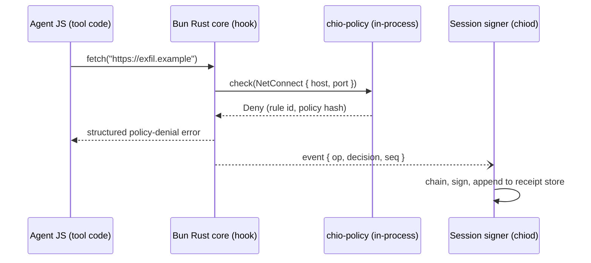

# Chio Runtime Enforcement for Bun: Policy Hooks and Receipts Below the JS Boundary

- Status: Draft for review (2026-07-15). Proposal only. Nothing in this document is implemented, and nothing in it may enter public copy until the claim-discipline gates in section 11 pass.
- Scope: three codebases - `arc` (Chio engine: `crates/guards/chio-policy`, the kernel receipt store, `crates/trust` attestation), `hush` (the open HushSpec at `standalone/hush`), and Bun's experimental Rust core (external, Anthropic-owned).
- Related: `docs/superpowers/specs/2026-07-15-policy-expansion-design.md` (enforcement disposition 0.6, monitor-mode semantics, vendor namespace, placement litmus), `spec/PROTOCOL.md`, `crates/protocol/chio-envoy-ext-authz` (the same pattern at the proxy plane), `crates/protocol/chio-egress-contract`.

## 1. Context and problem statement

Two external facts create the opening. Bun's core has been ported from Zig to Rust (announced 2026-07-08): the port is experimental and parallel to the stable v1.3.x Zig releases, at roughly 99.8% test compatibility on Linux x64 glibc, and Claude Code v2.1.181+ already ships on it. Anthropic acquired the Bun team in late 2025, so the runtime under Claude Code is Anthropic-owned, written in Chio's language, and young enough that its extension surface is not yet fixed.

Claude Code and the `@chio/bridge` host plugins execute on Bun. Chio's host-side gate today observes at the JS level, and JS-level observation is advisory by construction: code under policy can unpatch globals, import fresh module copies, reach `node:net` beneath a wrapped `fetch`, or call Bun-native APIs directly. The kernel path is authoritative where connected, but the host runtime itself has no enforcement point and no evidence trail.

Everything a JS program does to the outside world crosses from JS into Bun's native core at a small number of choke points: filesystem operations, socket connect, DNS resolution, fetch's connection pool, process spawn, worker creation, and FFI/addon loading. A policy check at those choke points is enforcement the code under policy cannot route around, and a signed record of those checks is a receipt source that does not depend on the honesty of the transcript. Deno's permission model proves the enforcement shape is viable in a mainstream runtime; it has no policy language beyond CLI flags and no evidence trail. This design is the runtime-plane instance of a pattern Chio already ships at the proxy plane (`chio-envoy-ext-authz`: policy evaluation at a choke point every request must transit), with the receipt chain as the differentiator.

Same-language matters here for one concrete reason: against the Zig core, a Chio hook meant a C ABI shim and hand-maintained bindings; against the Rust core, the hook is a trait and Chio crates are cargo dependencies, with `Operation`/`Decision` types shared with `chio-egress-contract` rather than serialized across a boundary.

## 2. Goals

- Non-bypassable, fail-closed policy enforcement for in-runtime JS I/O (network connect, filesystem, spawn decisions, FFI load, worker creation), implemented as synchronous hooks in Bun's Rust core evaluating compiled HushSpec via `chio-policy` in-process.
- Tamper-evident receipts for every governed operation, signed and chained out-of-process, so a compromised runtime can suppress events but cannot forge history, and suppression is itself detectable.
- Advisory (monitor) mode as a first-class product, not a degraded one: it is the adoption path, the policy-synthesis input, and a genuinely new audit surface on its own.
- Policy synthesis from observed behavior (`chio profile`), because nobody writes an egress allowlist from scratch and enforcement that never gets enabled is worth nothing.
- A fork-free end state: the strategic target is a generic security-hook API upstream in Bun, with Chio as one consumer.

## 3. Non-goals

- Governing subprocess behavior. Spawn is a gated decision point, not a covered surface (section 6). OS-level sandbox wrapping of children is named as the enforcement option but is its own future program.
- Enforcement after a permitted FFI load. Post-grant native code is attested, not enforced (section 6).
- Defending against OS or kernel compromise, or against an attacker with arbitrary native code already in the Bun process. The attestation split limits what such an attacker can forge; it does not restore enforcement.
- In-process key custody. Signing keys never live in the runtime process.
- Shipping product against Bun's experimental Rust tree. Paths B and C in section 10 are research and standards work respectively; only Path A touches stable Bun.
- Replacing kernel-side enforcement. The kernel remains authoritative where connected; this governs the host runtime the kernel cannot see into.

## 4. Trust model

| Adversary | Enforcement | Attestation |
|---|---|---|
| Agent-authored JS in the runtime | Holds. Every JS I/O path funnels through the native choke points. | Holds. |
| JS that loads native code | Holds up to the FFI/addon gate (default deny). After a policy-permitted load: void. | Receipts record the grant and the dylib hash; subsequent history is attested-but-not-enforced. |
| Fully compromised runtime process | Void. | Degrades, does not break: keys are out-of-process, so history cannot be forged or rewritten. Events can be suppressed; per-session sequence numbers make gaps detectable at verification time. |
| Compromised host OS | Void. | Void. Out of scope. |

The in-process/out-of-process split follows from this table. Enforcement must be synchronous and fast, so it lives in the runtime. Attestation must survive runtime compromise, so signing lives in a separate daemon (the session signer) that enrolls the session and holds the keys.

## 5. Architecture

Four components.

**5.1 Operation hooks in Bun's Rust core.** At each native choke point, Bun calls a registered hook before performing the operation:

```rust
pub trait OperationHook: Send + Sync {
    fn check(&self, op: &Operation) -> Decision;        // sync, hot path
    fn record(&self, op: &Operation, outcome: &Outcome); // queued, off hot path
}

pub enum Operation<'a> {
    NetConnect { host: &'a str, port: u16, initiator: Initiator },
    DnsResolve { name: &'a str },
    FsOpen { path: &'a Path, mode: AccessMode },
    Spawn { argv: &'a [OsString], cwd: &'a Path, env_hash: Hash },
    FfiLoad { dylib: &'a Path, dylib_hash: Hash },
    AddonLoad { path: &'a Path, hash: Hash },
    WorkerCreate { entry: &'a str },
}
```

`Operation` and `Decision` are shared with `chio-egress-contract`/`chio-core-types`. Worker threads share the process and hit the same hooks, so they are covered, not gated.

**5.2 In-process policy evaluation.** The hook links `chio-policy` and evaluates a compiled HushSpec document loaded and sealed at process start (policy hash fixed for the session; mid-session policy swap is a new session). Fail-closed: enforced mode with no loadable policy denies governed operations. The hot-path budget is sub-microsecond for cache hits: decisions are cached per (operation type, target), so repeated allowed operations cost a hash lookup, and only novel targets pay full evaluation. Proving this budget is the purpose of Path B.

**5.3 Out-of-process receipt signing.** Decision events (operation summary, decision, rule id, policy hash, monotonic per-session sequence number) go to a bounded queue drained over a Unix socket to the session signer, which chains and signs them into the kernel receipt store (the same store `configure_receipt_store` wires). Back-pressure is mode-dependent and fail-closed: in enforced mode a full queue blocks the operation; in advisory mode events drop and a drop-counter receipt records how many, so silent loss is impossible in either mode.

**5.4 Session binding.** At startup the signer enrolls the session and emits a binding receipt: Bun build hash, policy hash, plugin set, workspace identity, signer key id. Every subsequent receipt chains from it. This uses the existing `crates/trust` attestation machinery (`chio-attest-*`) rather than new key infrastructure.



The denial surfaces to JS as a structured error naming the rule, so the agent model can adapt or ask, instead of misreading policy as a network fault.

## 6. Enforcement boundary: gated, not covered

Fail-closed means naming the holes. There are exactly two, and both are handled by making the escape hatch itself a governed operation.

**6.1 FFI and native addons.** A dylib loaded via `bun:ffi` (or an N-API addon) makes raw syscalls and never touches Bun's choke points; native code punches straight through runtime-level hooks. Therefore `FfiLoad`/`AddonLoad` are themselves gated operations, default-deny in enforced sessions (the same reasoning behind Deno's `--allow-ffi`). When policy permits a load, the receipt records the dylib hash and the session is marked: everything after that grant is attested-but-not-enforced, and verification reports must say so. There is no design in which permitted native code stays enforced; the honest options are deny, or grant-with-evidence.

**6.2 Child processes.** A spawned `curl` never touches Bun's socket path, and for Claude Code specifically this is the dominant hole: spawning shell commands is most of what it does. `Spawn` is the decision point. Enforcement means deny, or wrap the child in an OS sandbox profile (seccomp/Landlock on Linux, sandbox-exec on macOS) generated from the same HushSpec document; sandbox-profile generation is a separate program (non-goal here) and until it exists, enforced-mode spawn grants are the same attested-but-not-enforced disposition as FFI grants. Even in advisory mode, a signed receipt per spawn carrying argv and env hash is a new audit surface: today nothing attests what Claude Code's tools actually executed at the runtime level.

**6.3 The claim, stated precisely.** What a verified receipt chain from this system proves: every network, DNS, filesystem, spawn, worker, and FFI operation this runtime performed during the session was policy-checked, with the decision record attached, and with FFI and spawn grants explicitly marked as enforcement-boundary exits. It does not prove anything about what permitted native code or child processes did afterward. Every consumer-facing artifact (verification output, export bundles, public copy) carries this scoping.

## 7. Receipt volume and aggregation

Filesystem reads are extremely hot (a Claude Code session performs orders of magnitude more fs operations than network operations); per-op receipts there would be absurd and would bury the signal. Aggregation rules ride the policy document: full per-operation receipts for net, DNS, spawn, worker, and FFI; per-path-per-session digest receipts for filesystem reads (first-touch receipt per path, counters folded into a session-close digest); writes configurable per path class. Aggregation is itself part of the attested policy, so a verifier knows exactly what granularity was in force. These rules start under `extensions.vendor.chio` per the placement litmus and are promotion candidates once a second engine wants them.

## 8. Policy surface

No new authoring plane. Operations map onto HushSpec blocks that already exist, which is the point of the consolidation program:

| Operation | HushSpec surface |
|---|---|
| `NetConnect`, `DnsResolve` | `egress` (plus SSRF companions) |
| `FsOpen` | `filesystem` |
| `Spawn` | `shell` |
| `WorkerCreate`, `FfiLoad`, `AddonLoad` | new; start under `extensions.vendor.chio.runtime` |
| aggregation rules | `extensions.vendor.chio.runtime` |

Advisory vs enforced mode is not a new mechanism: it is the `enforcement` disposition (`monitor` vs `enforce`) from item 0.6 of the policy expansion program, following hush section 6.2 exactly (operator config, never a document property, panic always enforces). FFI/worker gating is runtime-agnostic in principle (Deno and Node have parallel concepts), so it is a promotion candidate to a hush companion spec later; per the litmus, vendor first, promotion is the compatible move.

## 9. Operator experience

**Developer.** `chio init` drops a workspace policy and starts the session signer; the Claude Code plugin detects it and the session starts governed. Allowed operations are silent and full-speed. Denials surface to the agent as structured errors it can act on, and to the human as one-line grants (`chio allow crates.io --this-session`), each grant itself a receipt. Cold start is observation, not authorship: run advisory for a few days, then `chio profile` summarizes observed behavior (hosts, spawn patterns, fs footprint) and emits a candidate policy to trim and enforce. The trade replaces per-action permission prompts with categories approved once, enforced below the layer the agent's own code can reach.

**Platform team.** Org baseline policy lives in a repo, versioned and reviewed; workspace policies narrow it, never widen it (the relaxation-visibility work in the policy program's Phase 1.5 applies directly). Exceptions are filed with `chio request` and granted scoped (repo, host, duration), with request and grant both in the chain. The fleet view watches deny spikes, FFI/spawn grants, and sequence gaps (the tamper signal). Receipts binding session, workspace, policy hash, and Bun build hash turn "which machines run the unpatched runtime" into a query.

**Auditor.** Receives a signed export bundle (same shape as the existing alert-assurance exports) and verifies the chain offline with `chio verify`, trusting no operator. What is being verified is the section 6.3 claim, no more.

## 10. Integration paths

Three paths, cheapest to most strategic. A is independent and starts on stable Bun today; B produces the evidence C's proposal needs; C removes fork risk permanently.

**Path A: advisory mode on stable Bun, no fork.** A preload script plus an N-API module observing JS-level surfaces, feeding the same session signer and receipt schema. Route-aroundable by construction, so it is labeled a receipt source and never called enforcement, in any artifact. Value: the spawn/egress audit surface, the `chio profile` synthesis loop, and the fleet view all work today, and the receipt schema gets exercised before any Bun-side work exists.

**Path B: feature-flagged custom build of Rust Bun.** A `--features chio-hooks` build linking `chio-policy` and the hook trait, driven by a recorded corpus of real Claude Code sessions. Purpose: measure the hot-path cost of a policy-checked socket/fs layer, validate the decision-cache design, and prove the trait boundary is small enough to propose upstream. Research only (`docs/research` territory); never a shipping artifact; never against the moving tree without pinning a commit.

**Path C: upstream generic security-hook API in Bun.** The end state. The ask to the Bun team is a runtime hook API (the shape Node grew with `diagnostics_channel` and its permission model), not Chio-specific code: Bun gets a security/observability extension point with more consumers than Chio, and Chio ships a hook crate as one consumer. The timing argument is that this API is easiest to shape now, while the Rust core is pre-default and its internal boundaries are still moving. Path B's trait and measurements are the concrete proposal.

## 11. Rollout and claim discipline

Ordered gates, mirroring the release framing used everywhere else in Chio (RELEASE_AUDIT, QUALIFICATION, CHIO_BOUNDED_OPERATIONAL_PROFILE):

1. Path A ships as "runtime receipt source (advisory)". No enforcement language anywhere.
2. Enforcement language becomes available only when a Bun-side hook path (B or C) is qualified against a bounded operational profile: platform matrix, performance envelope from the Path B corpus, fail-closed behavior under signer loss and queue saturation, and the section 6.3 scoping in every claim.
3. The profile doc is the single place that says what is wired; public copy follows it and never precedes it.

## 12. Risks and open questions

- **Substrate churn and quality.** Bun's Rust port is weeks old, machine-translated, at parity only on Linux x64, and publicly contested (the Zig creator's "unreviewed slop" critique). Building enforcement on it before it stabilizes imports its memory-safety story into Chio's. Mitigation: Path A is independent of it; B pins commits; C waits for the port to become default.
- **No upstream hook API exists.** Path C depends on a standards conversation with the Bun team that has not happened. Named as the doc's largest external dependency.
- **Performance budget unproven.** Sub-microsecond cache-hit checks are a target, not a measurement. Path B exists to replace this line with numbers.
- **Spawn sandbox generation.** Hush-to-seccomp/Landlock profile compilation is a real program with real platform pain (sandbox-exec's deprecation status on macOS included). Until it lands, enforced-mode spawn is grant-with-evidence, and section 6.3 says so.
- **Signer lifecycle.** Daemon supervision, multi-session key handling, and enrollment against org identity are unspecified here; they should reuse `crates/trust` primitives rather than grow new ones.
- **Spec pressure.** New operation vocabulary and aggregation rules must follow the placement litmus and hush 9.5 discipline; this design must not become a second source of arc-only extension drift while the re-convergence program is mid-flight.
- **Host cooperation.** A Claude Code plugin cannot flip runtime flags today; enforced mode requires the host to launch Bun with the hook enabled, which is a product conversation, not a technical one.

## 13. Deliverables checklist

Path A: preload + N-API observer; session signer daemon; receipt schema for runtime operations (net/spawn full, fs aggregated); `chio profile` synthesis; `chio verify` support for runtime chains; advisory-only labeling in all artifacts.
Path B: pinned-commit Rust Bun build with hook trait; `chio-policy` in-process integration; recorded-session corpus; performance report (hot-path p50/p99, cache hit rates, queue behavior under saturation).
Path C: hook API proposal to the Bun team informed by B; Chio hook crate as reference consumer; qualification run against the bounded operational profile before any enforcement claim.

## 14. References

- Rewriting Bun in Rust (Bun blog, 2026-07-08): https://bun.com/blog/bun-in-rust
- Simon Willison's notes on the port: https://simonwillison.net/2026/Jul/8/rewriting-bun-in-rust/
- The Register on the Zig creator's response (2026-07-14): https://www.theregister.com/devops/2026/07/14/zig-creator-calls-buns-claude-rust-rewrite-unreviewed-slop/5270743
- Deno permission model: https://docs.deno.com/runtime/fundamentals/security/
- Node.js permission model: https://nodejs.org/api/permissions.html
