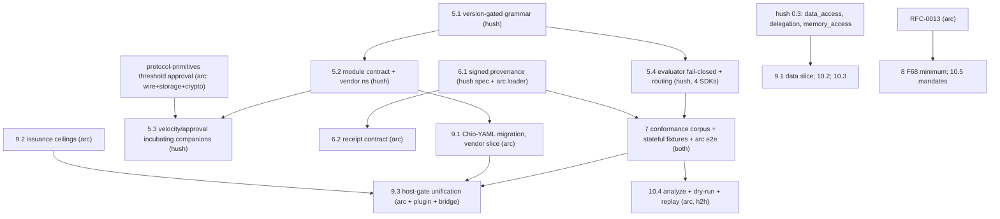

# Chio Policy Expansion: One Language Family, Authority-Specific Documents

- Status: Draft v2 for review (2026-07-15). v1 was reviewed and rejected; this revision incorporates all eleven findings.
- Repositories in scope: `arc` (Chio engine and control plane), `hush` (HushSpec specification, four SDKs, `h2h`), `chio-open-code-plugin` (preset templates), `@chio/bridge` host packages. The v1 claim of two-repository scope was inaccurate.
- Related: `docs/superpowers/specs/2026-07-09-protocol-primitives-design.md`, `docs/superpowers/specs/2026-07-09-security-folder-design.md`, `docs/formal/plan/FV-C4-policy-smt-analyzer.md`, `docs/architecture/reliability/RFC-0013-money-path-durability.md`, `docs/release/RISK_REGISTER.md`

## 1. Problem statement

A July 2026 research sweep assessed whether Chio policies cover the full use-case scope. Verified findings:

**Coverage inside the session-guardrail lane is strong.** HushSpec-driven enforcement covers tool access, egress with SSRF companions, filesystem, shell, computer-use, secrets, patch integrity, velocity, single-gate human-in-loop, injection/jailbreak detection, posture state machines, origin profiles, and reputation- and runtime-assurance-gated issuance. Cedar, the formal-rigor benchmark, deliberately covers none of obligations, velocity, sessions, or HITL; that whitespace is where this program aims. (v1 cited arXiv 2606.31498 for a seven-property gap taxonomy; that paper is actually a six-dimension community-governance study and does not support the claim. The citation is removed. The gap scorecard now rests on the verified internal evidence below and the named-system survey.)

**Three verified gap clusters:**

1. **Wired-vs-staged holes.** `ChioApproverSet {n, of}` parses but is inert. `Warn` does not survive compilation; `jailbreak.warn_threshold` is parsed then dropped (`crates/guards/chio-policy/src/compiler/detection.rs`). Governance metadata is advisory in both repos (hush explicitly so: `hush/crates/hushspec/src/governance.rs`). There is no crypto-floor field anywhere in the HushSpec document model (`crates/guards/chio-policy/src/models.rs`), so nothing exists to wire. `merge` is not deny-absorptive.
2. **Plane fragmentation.** The control-plane loader forks between HushSpec and legacy Chio-YAML (`chio-control-plane/src/policy/loader.rs:24`). Kernel budget and monetary caps ride capability tokens. Federation admission uses separate signed records. The Python host gate (`sdks/python/chio-code-agent/.../policy.py`) is a bespoke parser with hardcoded constants, and it is the authoritative gate on that path.
3. **Spec schism, worse than prose drift.** At the same version string `0.1.0`: hush prose defines 10 rule blocks; hush schemas and SDK models parse 12; arc parses 14 plus three extension keys hush section 9.5 requires parsers to reject. hush's reference evaluator routes only 8 action types and **returns Allow for unknown action types** (`hush/crates/hushspec/src/evaluate.rs:110`), so `browser_automation` and `code_execution` are parsed but fail-open at evaluation, and the evaluator fixture enum omits both. Extends addressing has three dialects in the wild: hush `builtin:`, arc `chio:`/`hushspec:`, plugin `chio://preset/...`. Policy signing covers only the leaf file's raw bytes (`hush/crates/hushspec/src/signing.rs:91`) while arc resolves unsigned parents and auxiliary assets after verification. arc does not consume the hush crate, vectors, or receipt schema.

## 2. Architecture frame: language family, not one authoring plane

v1 proposed "HushSpec becomes the single authoring plane." That is the wrong security abstraction: guard configuration, capability issuance, host admission, and runtime enforcement have different owners, signers, consumers, and lifecycles (federation admission already respects this by design).

The frame this program adopts:

- **One interchange language.** HushSpec grammar, schemas, and conformance vectors are the shared syntax and semantics, specified in hush.
- **Authority-specific signed documents.** Issuer policy (Capability Authority ceilings), runtime policy (kernel guards), and host policy (client-side gate) are separate documents with separate signers and lifecycles, all written in the language.
- **Monotonic composition.** Issuer ceilings are authoritative maxima. Runtime and host documents may only narrow the effective policy (a meet in the decision lattice), never widen it. Compilation and issuance must reject a document that attempts to widen an upstream authority's bound.

## 3. Goals

- One specification with a version-gated grammar and a module-support contract, so a document either enforces as written on a given engine or is rejected by that engine (parse-only tooling may losslessly preserve content it does not interpret).
- Conformance that covers arc's real enforcement path end to end, not just the reference evaluator.
- Signed provenance for the effective policy (resolved chain plus assets), bound into receipts.
- New expressiveness lands spec-first where portable, vendor-scoped where Chio-specific, and never as core until its state and conformance contracts exist.

## 4. Non-goals

- Topical confinement, learned policy mining, general content moderation, SMT analysis backends (unchanged from v1).
- Merging federation admission into HushSpec (separate authority; documented boundary).
- Payment mandates before RFC-0013 lands.
- Upstreaming stateful velocity or multiparty approval into hush 0.2 **core** (v1 proposed this; withdrawn, see 5.3).
- Freezing at v1.0.

## 5. Spec mechanics (hush 0.2)

### 5.1 Version-gated grammar

Today one v0 schema accepts any `0.x.y` string and one union model parses everything, so a document declaring `hushspec: "0.1.0"` would silently accept 0.2-only fields. 0.2 fixes this: structural validation dispatches on the declared version **before** model conversion; the exact 0.1 grammar is frozen as its own schema; 0.2-only constructs in a document declaring 0.1 are rejected. "An engine supports 0.1 and 0.2" is distinct from "a 0.1 document is reinterpreted as 0.2." Strict conformance mode and migration mode are separate, explicitly selected modes.

### 5.2 Module-support contract (required-module negotiation)

Companion "parsers MAY ignore contents" semantics let a document carrying a security restriction load on an engine that silently ignores it. 0.2 replaces this with an in-document contract:

- A top-level `requires` list declares every companion, extension module, and vendor block the document uses: `{module, version, enforcement: required | optional}`.
- An enforcement engine MUST reject a document whose `requires` names a `required` module it does not enforce at that version.
- `optional` modules an engine does not enforce load with the block inert, and the receipt records the inert module list.
- A companion or vendor block present in the body but absent from `requires` is a validation error.
- Parse-only tooling (formatters, `h2h` inspect, signers) preserves unsupported content losslessly and never claims enforcement.

Vendor namespace: `extensions.vendor.<name>` with a registration file in hush (name, owner, schema URL, version), opaque-mapping round-trip guaranteed, and whole-block `replace` merge semantics unless the vendor registers a structured schema. arc migrates `extensions.chio` to `extensions.vendor.chio` behind an explicit migration mode; aliases live only in that mode and removal is tied to two arc minor releases, a date, and observed legacy-load telemetry.

arc's `reputation` and `runtime_assurance` extension keys also move under `extensions.vendor.chio` for 0.2 (their current types embed Chio tier and verifier concepts; v1's plan to mirror them into companion specs is withdrawn). Extracting genuinely neutral vocabularies into companions is a candidate for 0.3, gated on the module contract, not a 0.2 commitment. This gives every arc-parsed key a conformant home under 0.2.

Extends addressing: 0.2 canonicalizes `builtin:<name>`; `chio:`, `hushspec:`, and `chio://preset/...` parse only in migration mode and rewrite via `chio policy migrate`.

### 5.3 Velocity and multiparty approval: incubating companions, not core

Both are stateful. arc's velocity guard is process-local and keyed by capability/grant, with no currency field on the rule (`crates/guards/chio-policy/src/models/rules.rs:311`); hush's evaluator input carries no clock, usage state, cost, or approval artifacts, and its fixture format supports only independent actions. Neither repo can define or test portable semantics today, and n-of-m approval is a stateful cryptographic protocol (wire, storage, signer identity), not a rule block.

0.2 therefore ships `hushspec-velocity.md` and `hushspec-approval.md` as **incubating companion specs** defining the full state contract before any core promotion: clock authority, state key (subject identity), persistence and restart behavior, consistency model, cost and currency semantics, whether the current action counts against the window, approver identity and signature verification, replay protection, timeout precedence, and missing-state fail-closed behavior. Both specs are authored: `hush:spec/hushspec-velocity.md` and `hush:spec/hushspec-approval.md`, with the vendor namespace rules in `hush:spec/vendor-registry.md`, the `vendor.chio` block specification in `arc:spec/CHIO_VENDOR_EXTENSIONS.md`, and the implementation plan in `docs/superpowers/plans/2026-07-16-policy-companions-vendor-home.md`. Single-gate confirmation stays core (it already is, via `tool_access.require_confirmation` and warn). arc remains the reference implementation through the protocol-primitives threshold-approval workstream, which is its own cross-cutting project (wire format, storage, verification), not a Phase 1 compiler task.

### 5.4 Reference-evaluator corrections in hush

- Unknown action types MUST deny (fail-closed), replacing today's Allow arm.
- `browser_automation` and `code_execution` get routed evaluation semantics in all four SDKs, prose sections, and fixture-enum entries, or they are removed from the schemas until they do. No "implemented" claim while parse-only.
- Prose sections for the two blocks close the existing prose-vs-schema gap only together with the above.

## 6. Trust and provenance

### 6.1 Signed effective policy, not signed leaf

Signing the leaf file while resolving unsigned parents and assets means the effective semantics can change without invalidating the signature. 0.2 defines:

- A trusted-key registry with signer roles (issuer, operator, host), `key_id` lookup, revocation, rotation, and freshness windows. A present-but-invalid signature always rejects (never falls back to unsigned handling).
- Resolution returns a **provenance manifest** (every ancestor and security-relevant asset with digests), not only a merged document.
- Verification covers either every input in the manifest or a signed canonical resolved-bundle manifest; operator chooses per trust domain, both are conformance-tested.
- Receipts bind the effective-policy digest and the provenance manifest digest.
- Negative vectors: tampered parent, unsigned parent, wrong key, revoked key, stale signature, changed asset.

### 6.2 Receipt contract

arc adopts the hush receipt schema v0 as published or declares an explicit arc profile projection of it. The schema's real shape (v1 misdescribed it): per-rule trace entries `{rule_block, outcome, evaluated}` plus an enforcement object `{mode: enforce | monitor, outcome: allowed | confirmed | blocked | would_block}`. arc's current `DecisionReceipt` lacks both the rule trace and the enforcement object and gains them. Monitor mode follows hush core section 6.2 (operator config, never a document property; panic always enforces).

Replay is impossible from receipts alone (no action content, arguments, origin/posture input, state, or policy body). Tooling that replays defines a **replay bundle**: hash-addressed policy and input store keyed by the receipt's digests.

## 7. Conformance

- **Corpus vendoring.** arc vendors the complete hush corpus - valid, invalid, merge, resolution, and evaluator fixtures - with a pinned corpus hash checked in CI (sync script, same pattern as supply-chain baselines).
- **Stateful sequence fixtures.** A new fixture family with injected clock, identities, costs, approval artifacts, initial state, expected end state, and expected receipt, for the incubating velocity/approval companions and posture transitions.
- **arc end-to-end profile tests.** Beyond the reference evaluator: parse, resolve, validate, compile, control-plane materialization, kernel enforcement, receipt emission, asserted against expected decisions and expected receipts. This is the layer where v1's warn-loss finding lives, and reference-evaluator-only conformance cannot see it.
- **Compilation honesty.** `compile_policy` rejects constructs it cannot faithfully represent instead of silently narrowing or widening; every such rejection is a named error with a vector.
- arc publishes `spec/HUSHSPEC_PROFILE.md`: conformance level per hush's cumulative L0-L3 definition, supported spec versions, enforced modules with versions, vendor blocks, and every intentional delta. The profile doc is the only place that says what is real.

## 8. arc-side corrections (former Phase 1, re-scoped)

- **Warn semantics.** Compiled plane maps warn-producing constructs to the confirmation machinery where a channel exists and to deny where none does (hush core section 6: engines that cannot confirm SHOULD deny). `jailbreak.warn_threshold` wires to an advisory signal with receipt evidence or becomes a validation error.
- **Governance metadata.** hush semantics stay advisory (per its spec and `governance.rs`). arc adds a **deployment-admission profile** outside evaluator conformance: control-plane load rejects expired `expiry_date` or non-{approved, deployed} `lifecycle_state` when `enforce_governance_metadata` is on. Semantics specified: absent metadata admits, `effective_date` in the future rejects, boundaries inclusive, timestamps UTC, clock injected.
- **Crypto floor.** There is no policy field today; define one first: `extensions.vendor.chio.security.crypto_floor` (versioned vendor block). Precedence: effective floor = the stricter of operator-configured minimum and policy-declared minimum; a document can never lower the operator floor. Loader wires the result to `set_capability_crypto_floor`.
- **Relaxation semantics.** "Narrowing" is rule-specific: shrinking a blocklist relaxes, shrinking an allowlist tightens. Define the relaxation order per rule kind; a child relaxing a parent in production mode requires explicit signed authorization (an `allow_relaxation` grant naming the block), not a log line.
- **Money-path minimums.** F72 (currency-mismatch cap bypass in `chio-metering`) fixes unconditionally: mismatch denies. F68's minimum (log plus dead-letter instead of discarding the settlement observer result) proceeds inside RFC-0013's plan, on which it depends.
- **Drift fixes.** Stale "12 guard types" header and test name; false retry/dead-letter comment in `chio-settle/src/hook.rs`; `PARTNER_PROOF.md` TOCTOU caveats; the `QUALIFICATION.md` vs `CHIO_BOUNDED_OPERATIONAL_PROFILE.md` stale-leader-fencing contradiction resolved in whichever direction the evidence supports.

## 9. Consolidation as compiler family (former Phase 2, dependencies made explicit)

- **9.1 Chio-YAML retirement.** `chio policy migrate` (legacy in, HushSpec out; unsupported legacy fields are migration **errors**, not warnings), loader deprecation warnings, removal after two arc minor releases with telemetry. Vendor-side knobs (cloud_guardrails, external threat intel, wasm_guard entries) land under `extensions.vendor.chio.guards` and depend only on 5.2. Portable data knobs (sql_query, vector/warehouse/query caps) are proposed as a `data_access` block in hush 0.3 and that slice of migration waits for it.
- **9.2 Policy-authored issuance ceilings.** Issuer documents author default token constraints (monetary caps, invocation ceilings) the way reputation tiers already flow (`chio-control-plane/src/issuance/scope.rs`). Delegation-depth authoring moves out of this item; it belongs to the delegation module (10.2) and is blocked on it.
- **9.3 Host-gate unification.** Blocked on: (a) 9.1 migration of `code_agent.yaml` (currently legacy Chio-YAML with `kernel:`/`guards:` sections - the "byte-identical" pair is the arc Python default and the chio-cli preset; the plugin template is a separate HushSpec document), (b) a **normative host action adapter** specifying path canonicalization (resolve, cwd containment, original/resolved/relative forms), command classification, and TOCTOU posture, because hush middleware today passes raw paths into glob evaluation and would regress the Python gate's traversal/symlink protections, and (c) issuance-schema work from 9.2. The adapter ships with adversarial path tests: `..` traversal, absolute paths, symlinks, non-existing write targets, cwd changes, and TOCTOU behavior. Cutover process: dual-run old and new gates with reviewed expected deltas (not blind golden parity), monitor-mode soak, one-release rollback flag.
- **9.4 Federation boundary doc.** Unchanged from v1.

## 10. New expressiveness (former Phase 3)

- **10.1 Obligations, split by enforcement point.** Three classes with distinct failure semantics: (a) **pre-dispatch prerequisites**, whose failure prevents invocation; (b) **output transformations** (redact, watermark), whose failure suppresses output and records that invocation occurred; (c) **post-effect duties** (notify, escalate), which require durable retry, idempotency keys, deadlines, evidence, and possibly compensation, because a tool side effect may already be committed (`crates/kernel/chio-kernel/src/post_invocation.rs`, `kernel/responses/finalization.rs`). The v1 claim "undischargeable obligation converts allow to deny" applies only to class (a), or to tools that opt into a prepare/commit protocol. A receipt's "discharged" entry is evidence, not proof, unless it binds an attested executor and an evidence digest; the companion spec says exactly that.
- **10.2 Delegation module.** `delegation { max_depth, require_attenuation, allowed_delegates, family_budgets }` as a hush 0.3 module. Workload-identity matching exists in arc only today (not in hush schemas or evaluators); the module spec ports the match grammar, and hush SDKs implement it before the module leaves incubation.
- **10.3 Memory governance.** `memory_access` module (hush 0.3): store allowlists, write constraints, provenance labels, retention TTL, read receipts. Builds on arc's existing `MemoryStoreAllowlist` token constraint; closes the risk register's HIGH ungoverned-memory item.
- **10.4 Tooling.** `chio policy analyze` per FV-C4 plus relaxation-order and extends-alias lint; dry-run via monitor mode and receipt `enforcement`; decision replay via the 6.2 replay bundle. A thin `h2h lint` mirrors document-level checks later; the full analyzer stays arc-side.
- **10.5 Payment mandates.** Deferred behind RFC-0013; named so the roadmap shows intent without widening claims.

## 11. Dependency graph and scope

arc-only items with no hush dependency (start anytime): warn semantics, governance admission profile, crypto-floor vendor block definition, relaxation order, F72, drift fixes, 9.4.

## 12. Exit gates (measurable)

- **Spec 0.2 release**: all four SDKs pass the 0.2 corpus; unknown-action deny vectors green in all four; package install smoke tests (crates.io, npm, PyPI, Go module) pass.
- **Conformance coupling**: arc CI pins the corpus hash; arc end-to-end profile run shows **zero unexplained differential decisions** against the reference evaluator on the full corpus; every explained delta is listed in `HUSHSPEC_PROFILE.md`.
- **Migration**: `chio policy migrate` round-trips the arc fixture corpus losslessly (re-emit and re-parse equal), and rejects unsupported legacy fields with named errors.
- **Host cutover (9.3)**: dual-run delta report reviewed and signed off; 14-day monitor-mode soak with zero unexplained `would_block` events; rollback rehearsed and documented before enforce.
- **Signing**: all six negative vectors (tampered/unsigned parent, wrong/revoked key, stale signature, changed asset) reject in arc and `h2h`.
- **Claim discipline**: nothing is announced as covered until its vectors pass and the profile doc lists it as wired.

## 13. Risks

- **Cross-repo sequencing.** hush 0.2 must land before arc's 0.2 support; the pinned corpus keeps arc from floating against an unreleased spec. arc-only items (section 8) de-risk the critical path.
- **Version-gating rework.** Freezing the 0.1 grammar retroactively may reclassify existing in-the-wild documents; migration mode plus `h2h lint` gives a detection and rewrite path.
- **Host cutover regression.** Mitigated by the adapter spec, dual-run with reviewed deltas, soak, and rollback gate (section 12).
- **Companion incubation stalls.** Velocity/approval could sit incubating indefinitely; each has a named owner workstream (velocity: guard-state contract; approval: protocol-primitives) and promotion criteria written into the companion spec itself.
- **Scope discipline.** 0.2 is limited to sections 5-7. `data_access`, delegation, and memory wait for 0.3 regardless of pressure.
