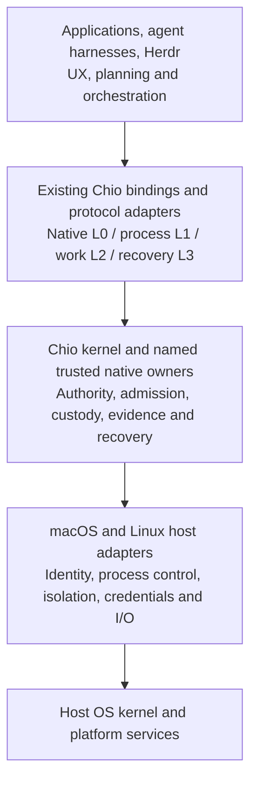

# Native host integration contract

Status: accepted planning direction, amended 2026-10-08 UTC. Implementation and
installed qualification remain open. This contract supplements the existing
kernel and owner interfaces; it defines no new wire operation, signer, store or
universal daemon. [ADR-0038](../../../adr/ADR-0038-desktop-operator-program.md)
owns the decision; [PROGRAM-MAP](../../../architecture/PROGRAM-MAP.md) owns exact
source and dependency reconciliation.

## Product identity and boundary

**Chio is a Rust kernel for building agentic operating systems.**

**Chio is a Rust kernel for agentic operating systems that coordinate work,
share resources, and cooperate across organizational boundaries.**

The product is reusable systems infrastructure. Agent harnesses, Herdr,
application coordinators and other operator tools consume it through supported
bindings and native services. Their UX, planning, assignment strategy, model
selection and business completion criteria remain application responsibilities.
Chio owns its authority, admission, process/resource custody, governed work,
knowledge/release, evidence and recovery contracts. A resource owner remains
responsible for the actual effect and its independently observable state.

Removing every Chio graphical client must not remove or weaken an advertised
systems capability. Browser workbench, menu bar and Omarchy QML are optional
consumers. A graphical approval mechanism may be required by a *selected approval
policy*, but no named Chio frontend is the authority or a universal prerequisite.
Loss of a consumer leaves original operations, capacity, fences and native
recovery with their owners. An SDK/control-plane caller is authenticated and
scoped like every other caller; automation is not an approval bypass.

## Layers and trust

This is a logical decomposition, not a requirement to route everything through
one new process. The portable Rust kernel can be embedded at an explicitly
trusted host boundary; separately hosted process/control/resource services use
their existing contracts. Each deployment inventories which components hold
keys, assert facts, dispatch effects, own persistent state and enforce isolation.
An application component performing one of those trusted roles is part of that
role's declared TCB, even if the application's planner and UI are outside it.

| Layer | Required ownership rule |
| --- | --- |
| L0 kernel | Reuse S1's closed operation registry and native admission/crossing semantics; no product-private evaluator or security callback that silently grants authority. |
| L1 agent process | Durable agent identity and authority are distinct from the current OS worker PID/incarnation. Spawn, invoke, observe and control descend through the process owner. Reconcile incompatible historical ABI versions before binding. |
| L2 work | Use landed W1 preparation, command, query and acceptance contracts only when exposed. App scheduling does not synthesize a work commitment or accepted result. |
| L3 recovery | Retain original operation identity, revisions, exact endorsements and owner retry dispositions. A lost reply never becomes a fresh dispatch automatically. |
| Native services | Reuse secure IPC, process host, secret broker, resource, storage, release and federation owners. Platform code extends their missing OS ports; it cannot introduce parallel custody. |
| Consumer projection | `chio.operator.v1` remains an optional, proposed C-layer projection for composed operator views. Its controller is outside the TCB and is not the kernel ABI, authority ingress, mandatory host daemon or prerequisite for direct supported owner bindings. |

No claim of universal mediation follows from installing a service. Harnesses
must route the selected calls and supply required provenance through qualified
adapters. Native confinement must deny alternate paths before a protection claim
is made. Observation hooks remain `detect_only`; unmediated activity remains
`cannot_see`. Internal writes within an explicitly authorized sandbox execution
are not automatically individual Chio calls or receipts.

## Deployment profiles

These are planning labels, not S7 enum additions or released support claims.
Every exposed capability selects exactly one qualified deployment context.

| Profile | Meaning and required scope |
| --- | --- |
| Embedded host | A trusted application embeds the portable kernel and provides explicitly inventoried native ports. Portable evaluation alone does not qualify effect, credential, storage, transport or isolation ports. |
| User-session host | Headless service/host bound to one explicitly enrolled native user session. No browser/menu/terminal workspace is needed to run it. Existing lock, logout, identity, credential and session-reconciliation fences remain effective. |
| Service host | A separately enrolled service principal with explicit operator authorization, installation identity, scopes, expiry, credential custody, persistent state and boot/restart semantics. Its permitted unattended continuation is declared independently of any human login. A lingering user manager, root UID, detached process, launch registration or unlocked keychain alone grants no authority. |
| Optional presentation | Workbench, Herdr plugin, Omarchy panel, Mac menu app and diagnostic clients. Closing or uninstalling a presentation component cannot delete native custody or replenish capacity. A consumer with its own application host preserves that host's declared ownership instead of registering a competing authority. |

A user-session host can qualify while the service-host profile remains
unavailable, but it must not be advertised as login-independent. Service-host
qualification cannot be inferred from GUI-free startup. The complete platform
roadmap must disposition both profiles with exact supported scope and remaining
gates; partial releases name the one they actually qualify.

Service credentials and human credentials have distinct ownership. In
particular, macOS per-user data-protection Keychain assumptions cannot be copied
to a daemon/system context. Each native credential owner selects and qualifies a
supported implementation and caller policy for its context. Missing credentials
or consent refuse; no root impersonation, personal-login copying, weakened store
or unattended permission approval is a fallback.

## Native port inventory

Before implementation, resolve each row to existing source symbols, supported
bindings, actual tests and runtime evidence in PROGRAM-MAP. Missing source is an
owner delivery packet, never permission to fabricate an adapter API.

| Port | Native obligation | Independent acceptance observation |
| --- | --- | --- |
| Identity and IPC | Authenticate the actual client and intended service, session/service principal, release and incarnation before private bytes or authority flow; bound pre-auth resources. | Wrong-code/user/service, endpoint replacement, handoff/reuse and overload cause no unauthorized bytes/effects; fresh authorized clients remain usable. |
| Process lifecycle | Retain logical-to-OS incarnation mapping, scoped descendant custody, launch/control/closure and restart reconciliation. | Native process census and resource markers establish the exact closure; UI exit or PID disappearance alone cannot establish it. |
| File/resource access | Bind caller authority to exact resource identity, audience, generation and owner-supported operation; recheck atomic owner conditions. | Stale assignment/version, path/alias substitution and concurrent access cannot modify or disclose another resource. |
| Network/model access | Preserve brokered credential custody, exact destination/service identity and permitted egress; reject alternate routes under selected confinement. | Direct-route and fake-peer canaries show no credential or unauthorized payload release. |
| Resource accounting | Enforce owner-defined invocation/token/money/time and host CPU/memory/storage/process/IPC bounds separately. | Concurrent reservations and saturation cannot overspend the same allowance or consume retained evidence/stop headroom. Unknown capacity is unavailable. |
| Storage, clocks and recovery | Use owner commits and boot/incarnation-bound supported time; preserve receipt and original-operation continuity through crash, sleep, upgrade and restore. | No authority or budget renewal, lost tail accepted as current, duplicate effect or invented terminal outcome. |
| OS delivery | Bind accepted source, component bytes, configuration, credential context and OS/backend tuple; preserve scoped custody during install/update/removal. | Clean installed headless consumers pass, including denial, interrupted lifecycle, cross-user and rollback cases. |

## Coordination, shared resources and independent organizations

Coordination is more than showing a list of agent tasks. A reusable host must
carry stable process/work/resource references, authorized handoffs and retained
outcomes between independently connected consumers. The application chooses
which worker acts next; the receiving owner decides whether that worker may act.

Within a single authority domain, consumers can share an owner-enforced capacity
family. Read usage from that owner, not a UI counter or a new plugin ledger.
Reserved in-flight capacity counts under the owner's rules; changing clients,
restarting a host or reopening a workspace never creates a new allowance.
Megastart's direct worker grants and persistent aggregate family illustrate this
boundary; its current multi-hop limitation is not waived by this program.

For cross-organization cooperation, each organization retains independent keys,
policy, resources and refusal authority. Use the actual federation/treaty/work
owners to bind the enrolled peer, audience, intent, resource and result release.
Transport authentication alone is not permission. A peer can refuse a locally
valid request, and revocation or unavailable freshness must fence the relevant
new crossing. Do not share databases/private keys or silently turn a local
single-writer budget into a globally atomic distributed allowance. Name each
owner's allocation and evidence boundary; any stronger shared accounting claim
requires that owner's specific consistency and recovery contract.

Basic local hosting does not require a marketplace, paid settlement, global
scheduler or the complete W2-W4 programs. A release claiming cross-organization
operation must nevertheless implement and qualify the applicable enrolled-peer,
local policy, custody, disclosure and bilateral recovery contracts. Mark that
capability unavailable until its owner gates pass; a two-user local demo does
not demonstrate independent organizational control.

## North-star alignment and release meaning

The kernel roadmap remains the owner of the pure admission machine, common
crossing transaction, closed layered ABI, integrity-gated admission, authority
tree, durable stop, verified extension seams and independently verifiable evidence.
Host integration supplies real OS ports and consumer conformance for these
contracts. It must shrink duplication rather than adding a second runtime.

Full keystone redesigns are not artificial blockers for every initial host read
or supported operation. Every selected effect still must pass its present
admission/crossing/receipt/recovery invariants. A host release cannot claim the
roadmap's formal proof, target latency, complete injection resistance or witnessed
log properties merely because the interfaces are compatible. Keep source,
model/proof, benchmark, installed platform, independent organization and external
consumer evidence as distinct qualification dimensions.

[CONSUMERS](CONSUMERS.md) defines the required application/harness acceptance;
[QUALIFICATION](QUALIFICATION.md) retains all applicable native failure cases.
A useful first result is an external harness and an application coordinating
through real Chio owners on an installed host, with every Chio frontend absent.
The complete ambition additionally demonstrates shared resources and separately
authorized organizational cooperation. A coding patch is one test workload,
not the product definition or a mandatory frontend dependency.
