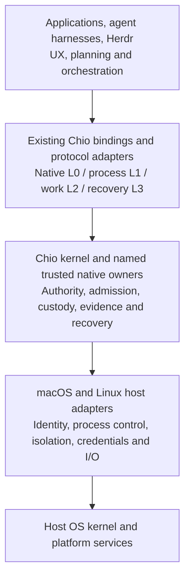

# Native host integration contract

Status: accepted planning direction, amended 2026-10-08 UTC. See
[STATUS-GLOSSARY](STATUS-GLOSSARY.md). This contract supplements the existing
kernel and owner interfaces; it defines no new wire operation, signer, store or
universal daemon. [ADR-0038](../../../adr/ADR-0038-native-host-program.md) owns
the decision and [PROGRAM-MAP](../../../architecture/PROGRAM-MAP.md) owns source
and dependency reconciliation.

## Product identity and boundary

**Chio is a Rust kernel for agentic operating systems that coordinate work,
share resources, and cooperate across organizational boundaries.**

Harnesses, Herdr, applications and operator tools consume Chio through
supported bindings; their interface, planning, assignment and completion stay
theirs. Chio owns authority, admission, process and resource custody, governed
work, release, evidence and recovery; a resource owner stays responsible for
the actual effect.

Removing every Chio graphical client must not remove or weaken an advertised
systems capability. A selected approval policy may require a graphical approval
mechanism, but no Chio frontend is the authority or a universal prerequisite.
SDK and control-plane callers are authenticated and scoped like every other
caller; automation is not an approval bypass. Required coverage is in
[FIRST-CLASS-INTEGRATIONS](FIRST-CLASS-INTEGRATIONS.md); no single harness or
mini-swe defines the kernel API, a mandatory backend or the promotion order.

## Layers and trust

This is a logical decomposition, not one new process. Each deployment
inventories which components hold keys, dispatch effects, own state and enforce
isolation; an application component in such a role is inside its TCB.

| Layer | Ownership rule |
| --- | --- |
| L0 kernel | Reuse S1's closed operation registry and native admission; no product-private evaluator or callback that grants authority. |
| L1 agent process | Durable agent identity is distinct from the OS PID and incarnation; spawn, invoke, observe and control descend through the process owner. |
| L2 work | Use landed W1 contracts only when exposed; application scheduling never synthesizes a commitment or accepted result. |
| L3 recovery | Keep original operation identity, revisions, endorsements and owner retry dispositions; a lost reply never becomes a fresh dispatch. |
| Native services | Reuse secure IPC, process host, secret broker, resource, storage, release and federation owners; platform code adds missing OS ports, never parallel custody. |
| Consumer projection | `chio.operator.v1` stays an optional C-layer projection outside the TCB ([OPERATOR](OPERATOR.md)). |

Projecting a Chio grant into an external runtime policy documents its semantic
loss and rejects restrictions it cannot represent; an external policy approval
is never a Chio grant. Installing a service claims no universal mediation. Harnesses route selected
calls through qualified adapters, and native confinement denies alternate paths
before any protection claim. Hooks are `detect_only` and unmediated activity is
`cannot_see`. Writes inside an explicitly authorized sandbox execution are not
automatically individual Chio calls or receipts.

## Deployment profiles

Planning labels, not S7 enum additions; each exposed capability selects one.

| Profile | Scope |
| --- | --- |
| Embedded host | A trusted application embeds the portable kernel and inventories its native ports. Portable evaluation alone qualifies no effect, credential, storage, transport or isolation port. |
| User-session host | A headless service bound to one enrolled user session. Lock, logout, identity, credential and session fences stay effective. |
| Service host | A separately enrolled service principal with explicit authorization, installation identity, scopes, expiry, credential custody, state and boot semantics. A lingering user manager, root UID, detached process, launch registration or unlocked keychain grants nothing. |
| Optional presentation | Workbench, Herdr plugin, Omarchy panel, Mac menu app and diagnostic clients. Closing or removing one cannot delete native custody or replenish capacity. |

A user-session host can qualify while the service host stays unavailable, but is
never advertised as login-independent; GUI-free startup does not qualify a
service host. Service and human credentials have distinct owners: a per-user
data-protection Keychain assumption cannot be copied to a daemon context.
Missing credentials or consent refuse; no root impersonation, copied personal
login, weakened store or unattended permission approval is a fallback.

## Native port inventory

Resolve each row to source symbols, bindings, tests and runtime evidence in
PROGRAM-MAP before implementation; missing source is an owner delivery packet,
never permission to fabricate an adapter. Each obligation is observed
independently through the named cases.

| Port | Obligation | Cases |
| --- | --- | --- |
| Identity and IPC | Authenticate client, service, principal, release and incarnation before private bytes or authority flow; bound pre-authentication resources so overload cannot starve authorized clients. | Q10 |
| Process lifecycle | Keep the logical-to-OS incarnation map, descendant custody, closure and restart reconciliation; UI exit or PID disappearance never proves closure. | Q07, Q19 |
| File and resource access | Bind authority to exact resource identity, audience and generation and recheck owner conditions atomically. | Q14, Q27 |
| Network and model access | Keep brokered credential custody and exact destination identity; reject alternate routes under confinement. | Q12, Q13 |
| Resource accounting | Enforce invocation, token, money and time limits and host CPU, memory, storage, process and IPC bounds as separate dimensions, keeping evidence and stop headroom; unknown capacity is unavailable. | Q15, Q27 |
| Storage, clocks and recovery | Use owner commits and boot-bound time; keep receipt and original-operation continuity through crash, sleep, upgrade and restore without renewal or invented outcomes. | Q02, Q31 |
| OS delivery | Bind source, bytes, configuration, credential context and OS tuple; keep custody through install, update, removal and rollback. | Q20 |

## Coordination, shared resources and organizations

The application chooses which worker acts next; the receiving owner decides
whether it may. Consumers in one authority domain share an owner-enforced
capacity family; restarting or reopening a client never creates allowance.

Across organizations each owner keeps its keys, policy, resources and refusal.
Federation, treaty and work owners bind peer, audience, intent, resource and
result release; transport authentication alone is not permission, and
revocation or stale freshness fences new crossings. Never share databases or
private keys, or present a local budget as a distributed atomic allowance. A
release claiming cross-organization operation qualifies the enrolled-peer,
custody, disclosure and bilateral recovery contracts (Q28); a two-user local
demo does not count.

Host integration supplies OS ports for the kernel roadmap's owners and adds no
runtime; a host release cannot claim that roadmap's proofs, latency targets or
witnessed logs because its interfaces are compatible.

## Model-provider resource boundaries

Bind each inference route to its harness, endpoint, model and account,
credential custodian and admission owner. Invocation, output-token, money and
OS-local limits are distinct. A dimension required by the grant, policy or
advertised profile has an enforceable bound before dispatch, or the capability
is unavailable; displaying an unknown limit authorizes nothing.

An output-token claim needs a route-supported hard ceiling, reasoning output
included; a money claim also needs a worst-case bound and an atomic
reservation, or the request refuses before credential release. Timeouts and
disconnects do not prove billing stopped, so obligations stay retained across
loss and restart, with no replay.

The pinned Pi Codex-subscription route has no demonstrated output-token
ceiling, so it cannot satisfy a bounded-output or bounded-spend profile. A
separately approved narrower profile may run with token and spend explicitly
unclaimed if its grants do not require them; nothing switches to it, another
account or API billing automatically. Q15, Q27 and C04 carry the route cases.
