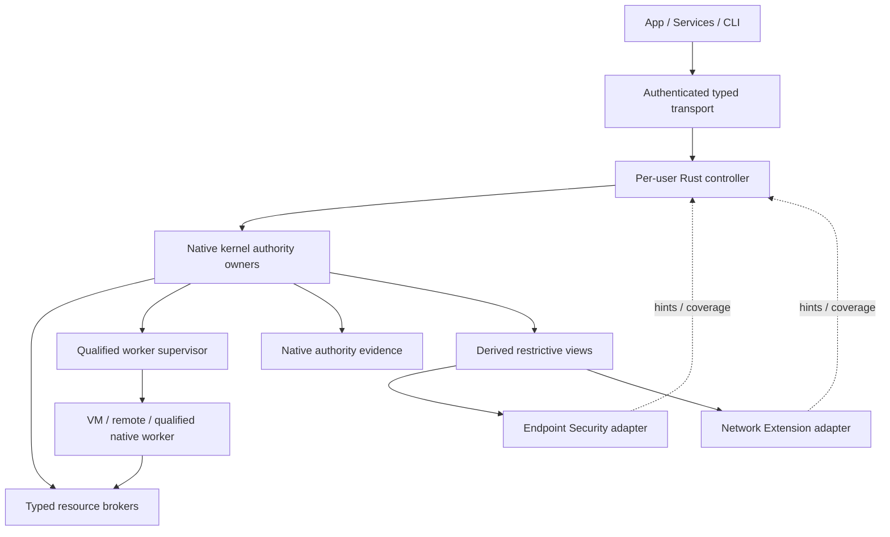

# Mac host architecture

Status: proposed normative design, 2026-10-07. Implementation baseline is CHIO-MAIN in [source pins](research/source-pins.json). No Mac runtime is delivered by this document.

## Decision and alternatives

Use a native SwiftUI/AppKit operator, a per-user Rust controller, existing native kernel owners, typed resource brokers, and separately qualified worker/provider adapters. The controller translates and projects state; the authority kernel decides consequential crossings. ES and NE providers may impose further restrictions. A global endpoint daemon with its own approvals was rejected because it creates competing authority. A browser-only local dashboard remains possible as a reader, but does not supply the chosen native review and permission experience.

## Ownership and proposed source layout

| Proposed path | Owner and boundary |
| --- | --- |
| `integrations/macos/app/` | Native views, selected-resource enrollment, review presentation, accessibility, Services and App Intents |
| `integrations/macos/native/` | Swift package for XPC, platform launch and provider bridges; no issuer or second approval store |
| `crates/products/chio-desktop/src/operator/` | Shared versioned operator codec, peer/session checks, bounded request admission and projections |
| `crates/products/chio-desktop/src/platform/macos/` | Mac adapter for qualified installed kernel/broker interfaces |
| `integrations/macos/qualification/` | Independent test drivers and evidence collection, never production authority |
| Existing kernel/store/resource owners | Native admission, reservations, integrity joins, approval consumption, stop/fences, original-operation recovery and evidence |

The app, Swift package and desktop crate above are proposed files, absent at this base. Existing owner paths and missing native contracts are inventoried in [readiness](research/chio-readiness.md). A missing interface is an M0 dependency; an adapter may not fabricate it. These proposals do not restructure unrelated existing crates.

Two trusted native UI entrypoints precede the shared operator methods: selected-resource intake seals workspace/task-input resources, and publication preparation binds a sealed artifact to an enrolled destination, absent-target condition and current policy/influence. Both authenticate the operator and are registered in the native closed ABI/crossing census. Publication preparation returns the original native operation reference used by `review.open` and `approval.submit`; it performs no unapproved publication. M0 supplies these owner contracts. Neither entrypoint is a generic path/shell operator method, and artifact publication cannot be smuggled through `evidence.export`.

## Trust and process topology

The operator app and controller execute in the user's session. A native review component is part of the trusted operator surface and authenticates its caller/session before invoking the native approval owner. Provider extensions may run globally and therefore receive the minimum task-scoped restriction data. A privileged helper is introduced only for a named platform operation that requires it, with a fixed method set and separate code identity.

The worker is untrusted. Its network, files, launch ancestry, IPC and credentials are constrained by its selected profile. Agent frameworks retain their planning interface but cannot bypass that profile through a plugin or subprocess. A broker is trusted for its resource effect and must not reinterpret untrusted strings as arbitrary commands. The host OS and admitted trusted components are in the trust base; root compromise is outside the initial confinement claim.

XPC peer code validation authenticates a channel, not an agent grant. The service must bind the audit identity to the current session and native principal, then apply the operation's authority. The peer restriction, signed executable requirement, owner UID, audit-session identity, and endpoint service identity are provisioned through the signed package, not supplied by an untrusted request. See [Apple peer requirements](https://developer.apple.com/documentation/xpc/xpc_connection_set_peer_requirement).

## Requirements

| ID | Requirement | Acceptance |
| --- | --- | --- |
| MAC-ARC-001 | Each effect path MUST identify its native owner, crossing kind, input influence, stop disposition and evidence disposition before it is enabled. Missing mappings MUST make that operation unavailable. | AT-MAC-ARC-001 |
| MAC-ARC-002 | The controller MUST NOT issue capabilities, mint budgets, sign approvals or receipts, or maintain a competing authority ledger. Native state references MUST be verified by their native owner. | AT-MAC-ARC-002 |
| MAC-ARC-003 | Each user session MUST have isolated controller state and principal binding. A global provider MUST partition restrictions and observations by the authenticated subject and run incarnation. | AT-MAC-ARC-003 |
| MAC-ARC-004 | IPC MUST authenticate both service and caller code identity and bind UID/audit session before exchanging sensitive payloads. A same-team unrelated application MUST NOT gain access merely by sharing Team ID. | AT-MAC-ARC-004 |
| MAC-ARC-005 | A privileged bridge MUST expose only enumerated typed operations with independent native authorization; it MUST reject shell strings, arbitrary environment injection, caller-selected executable paths and forwarded inherited descriptors outside the registered contract. | AT-MAC-ARC-005 |
| MAC-ARC-006 | Brokers MUST retain reusable provider/account credentials outside workers and MUST bind each use to the admitted operation, destination and current resource generation. | AT-MAC-ARC-006 |
| MAC-ARC-007 | Worker creation MUST bind the kernel authority/run generation to the actual launch incarnation and qualified backend. A PID, process name, code signature or UI task ID alone MUST NOT establish this binding. | AT-MAC-ARC-007 |
| MAC-ARC-008 | Provider policy views MUST be derived restrictive state with explicit generation and convergence evidence. An extension allow result MUST NOT create or enlarge Chio authority. | AT-MAC-ARC-008 |
| MAC-ARC-009 | Hints and cached projections MUST NOT authorize mutations. The native owner MUST recheck the authoritative state at every required crossing. | AT-MAC-ARC-009 |
| MAC-ARC-010 | Every enabled feature MUST be associated with an exact installed qualification tuple and current prerequisite observation. Incompatible or withdrawn prerequisites MUST close affected admission without silently switching profile. | AT-MAC-ARC-010 |
| MAC-ARC-011 | The controller MUST bound message size, queue depth, concurrency and memory independently of trusted native store retention; overload MUST not discard native closure obligations. | AT-MAC-ARC-011 |
| MAC-ARC-012 | On controller or app restart, projections MUST rebuild from native retained operations and stable subscriptions. Missing local cache MUST NOT imply missing effects, renewed grants or a fresh authority generation. | AT-MAC-ARC-012 |
| MAC-ARC-013 | A resource adapter MUST separate capture, execution and release crossings, including model input export and post-return artifact release. Trusted code identity MUST NOT promote content integrity. | AT-MAC-ARC-013 |
| MAC-ARC-014 | Cross-platform reuse MUST preserve the existing Omarchy ABI through explicit versioned mapping and conformance vectors. The new proposed shared desktop protocol MUST NOT silently replace an installed Omarchy protocol. | AT-MAC-ARC-014 |
| MAC-ARC-015 | Component crash policy MUST name which new admissions close, which already committed operations may continue, and who retains the original recovery obligation. No component MAY announce universal stop from its own termination alone. | AT-MAC-ARC-015 |
| MAC-ARC-016 | Provider health, qualified capability, current authority and operator presentation MUST remain separately represented. A healthy provider MUST NOT stand in for an admitted operation or complete sensor coverage. | AT-MAC-ARC-016 |

## Lifecycle and crossing disposition

| Trigger | Native owner action | Controller projection |
| --- | --- | --- |
| App launches | Authenticate session; inspect delivered native contracts | Read-only view until feature prerequisites are established |
| Task requested | Resolve existing intent or commit admission through native owner | Retain native operation reference; never invent completion |
| OS observation | Record sensor identity/coverage; join influence when used as input | Hint to reread and display qualified coverage |
| Review submitted | Validate exact native endorsement and commit its permitted disposition | Show native recorded decision or classified refusal |
| Stop requested | Advance authoritative fence; reconcile committed work | Display admission, worker, flow, cleanup and external-outcome dimensions |
| Broker reply lost | Preserve original operation and reconcile it | Unresolved, never automatic fresh operation |
| Controller removed | Native owner retains closure and unresolved external obligations | No authority implied by UI disappearance |

The north-star five consolidated primitives are exact approval, sealed hierarchical ledger, fence, hash-chained log and hint. No Mac-specific positive-authority primitive is introduced here. See [kernel contracts](03-kernel-contracts.md), [authority](04-authority-integrity.md), [protocol](06-operator-protocol.md), and [recovery](11-state-recovery.md).

## Acceptance procedures

| Acceptance | Setup and action | Required independent evidence |
| --- | --- | --- |
| AT-MAC-ARC-001 | Remove one crossing-owner mapping from the selected test profile and request its operation. | Admission refusal before credential access or resource dispatch; native observer confirms no crossing. |
| AT-MAC-ARC-002 | Inspect linked production symbols/stores and submit fabricated native references. | No controller issuer/signing key; native verifier rejects references; resource observer sees no effect. |
| AT-MAC-ARC-003 | Run two user sessions with colliding local task IDs and one global provider. | Each can observe/control only its own native bindings; provider evidence includes the correct incarnation. |
| AT-MAC-ARC-004 | Connect unsigned, differently signed, same-team unrelated and stale-session clients; replace the service endpoint. | Rejection before secret/payload exchange; designated signed client and service provide positive controls. |
| AT-MAC-ARC-005 | Supply shell metacharacters, environment overrides, executable substitution and extra descriptor handles. | Closed decoding or native authorization refusal; independent process observer records no unintended executable. |
| AT-MAC-ARC-006 | Compromise a worker and inspect filesystem/environment/IPC; attempt credential export and reuse across operations. | No reusable credential retrieved; external test service accepts only the brokered positive control. |
| AT-MAC-ARC-007 | Reuse a PID and launch an identically signed executable outside the admitted task. | Launch binding mismatch rejected; correct worker incarnation succeeds under its bounded authority. |
| AT-MAC-ARC-008 | Replay a provider allow view from before revocation and request a new effect. | Native serving writer refuses; provider state is recorded as stale without expanding authority. |
| AT-MAC-ARC-009 | Inject a valid-looking UI event and stale healthy projection before a consequential request. | Native state still decides; no crossing follows merely from event delivery. |
| AT-MAC-ARC-010 | Change one installed component digest or withdraw a required permission. | Affected profile unavailable; no migration to another profile or implicit weakening. |
| AT-MAC-ARC-011 | Saturate each bounded queue while a committed operation returns. | Backpressure/error for new work, bounded memory, original closure obligation recoverable. |
| AT-MAC-ARC-012 | Delete only projection cache, restart, reconnect and replay a prior create intent. | Same native operation is recovered; no duplicated effect or new authority. |
| AT-MAC-ARC-013 | Capture malicious app text, send it to an agent, then request export and artifact release. | Influence joins before delivery; relevant crossings are separately admitted and recorded. |
| AT-MAC-ARC-014 | Run current Omarchy vectors against its adapter and shared desktop vectors against the proposed adapter. | Explicit version selection, semantic parity for mapped operations, old protocol unchanged. |
| AT-MAC-ARC-015 | Crash UI, controller, worker, broker and provider separately at pre-intent and post-intent cuts. | Each outcome follows its named owner; uncertain remote effect stays unresolved. |
| AT-MAC-ARC-016 | Make provider responsive while dropping sensor events or revoking native authority. | UI distinguishes healthy process from incomplete coverage and denied authority. |

Implementation: [protocol/controller plan](../../plans/2026-10-07-macos-integration/02-protocol-controller.md), followed by profile-specific plans. Acceptance descriptions above are not tests executed by the document validator.
