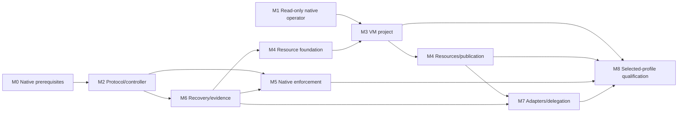

# Delivery roadmap, decisions and dependency gates

Status: proposed program, 2026-10-07. The user approved expanding the researched native Mac host into specifications and plans. These documents authorize no claim that the app, extensions or execution profiles have been delivered.

## Decisions

| Decision | Selected approach | Reason and revisiting condition |
| --- | --- | --- |
| D01 Authority | One Rust native authority kernel and its existing owners | Avoid competing Swift approvals, budgets, stop and receipt authority. Revisit only through the native ABI/design program. |
| D02 Operator | SwiftUI/AppKit app, menu bar, Services and bounded App Intents | Fit the user's existing Mac workflow. The UI remains a view/controller over typed authority. |
| D03 First task | Fixed portable project-change recipe from committed Git objects; sealed task input; protected test harness; local review artifact | Coherent source generation and controlled effects are definable. Dirty-directory imports require a separate verified snapshot contract. |
| D04 First untrusted local execution | Linux VM with no virtual NIC and narrow broker transport | Explicit isolation boundary without ambient host credentials; ARM64 guest and every device/channel need qualification. |
| D05 Native execution | Separate descendant-scoped ES research and qualification track | Promising native coverage, but source metadata/final SDK and lifecycle behavior require evidence; cannot inherit VM qualification. |
| D06 Native app-only tools | Narrow trusted brokers for Darwin-specific build/signing/app operations | Linux guests do not provide Xcode or Simulator. Signing binds exact artifact and identity, with keys retained by the host. |
| D07 OS providers | Derived restrictive ES/NE views and separately identified observations | An allow cache cannot become positive native authority; queue gaps and provider death remain visible. |
| D08 Shared desktop contract | New proposed `chio.desktop.operator.v1` with explicit Omarchy migration | Share semantics without silently rewriting an independently proposed/platform-specific ABI. |
| D09 Source reuse | HushSpec frontend, Clawdstrike sensors, provider mechanics, detection, health and test harnesses | Keep kernel authority, approval and evidence ownership intact; qualify each reused component in the actual composition. |
| D10 Initial app experiment | arm64/macOS 15.0 deployment-target candidate | Concrete starting toolchain choice, not support for every 15+ build. Intel, older builds and native macOS 27 are independent rows. |
| D11 Publication | No-replace local artifact export first; external Git/app publication independently gated | Exact resource generation, destination and recovery must be established before broadening consequential effects. |
| D12 Restore | Inspection-only when independent freshness cannot be established | A consistent old database or hash chain cannot prove current authority after whole-host restoration. |

Public-source references and facts are in [source pins](research/source-pins.json), [readiness](research/chio-readiness.md), [Apple platform research](research/apple-platform.md), and [Clawdstrike research](research/clawdstrike.md). The initial conceptual research is summarized in the [decision record](research/decision-record.md).

## Dependency order

Track IDs identify responsibility, not a numeric total execution order.

M8 consumes only the dependencies applicable to a selected profile, as fixed in its pre-run applicability manifest. A first VM project release does not wait for optional native ES or managed-device functionality, and it cannot advertise those functions. M1 read-only prototype work and component codec work can start while M0 is unresolved. Runtime mutations require the delivered native prerequisites.

M4 is explicitly split at task boundaries to avoid a dependency cycle. After M0/M2/M6, implement resource plan tasks 1, 3, 2 and 5 (intake, path rules, immutable import and provider foundation). Complete VM task 0's source/image/supervisor preparation, then VM tasks 1 through 7; task 0's integrated boot probes run after host tasks 2 through 4 are available. Integrate resource task 4 using actual worker output, then run VM task 8 alongside resource tasks 6 and 7. Resource task 8 composes the useful task and publication before M8. The foundation does not wait for the completed VM workflow, and a completed VM backend alone does not claim the whole user workflow.

| Track | Primary owner | Entry / output / refusal |
| --- | --- | --- |
| M0 | Native kernel/security maintainers | Inspect current source; deliver NK-01..NK-09 as applicable, exact owner contracts and evidence. Missing contracts yield explicit unavailable mutations. |
| M1 | Mac product/UI maintainers | Read-only projections and unavailable states can start immediately; signed app and native review integration follow their prerequisites. |
| M2 | Shared desktop/controller maintainers | Closed protocol and authenticated session; actual native binding replaces no authority. M0-dependent methods stay unavailable. |
| M6 | Native recovery/evidence maintainers | Original-operation lookup, durable stop order, event identity and restoration freshness; precedes any completed execution claim. |
| M3 | Mac execution maintainers | Signed local supervisor, qualified guest tuple and broker transport, useful fixed portable task; no NIC or arbitrary host mounts. |
| M4 | Resource/approval maintainers | Foundation tasks precede VM integration; actual-worker output, protected tests and exact no-replace publication follow the backend; external effects qualify separately. |
| M5 | Apple platform/security maintainers | ES/NE integration and independently qualified native or managed profiles; lifecycle or attribution gaps close the affected profile. |
| M7 | Host/delegation maintainers | Exact framework adapter tuple, attenuation, remote custody and selective Clawdstrike reuse; observation-only adapters stay labeled. |
| M8 | Release owner plus independent verifier | Signed installation, full applied-profile case set, drift/operations/privacy/performance evidence and independent release decision. |

## Native prerequisite register

The authoritative missing-contract details and owners are in [readiness](research/chio-readiness.md). M0 tracks one artifact per native contract, with exact installed source/ABI identity and required negative cases. The root program does not make these gaps disappear by naming an adapter.

| Gate family | Required disposition |
| --- | --- |
| Pure admission and crossing | Deliver the north-star owner contract, writer serialization, expected-version and durability semantics. A desktop queue cannot replace it. |
| Exact approval and integrity | Bind native endorsement and bootstrap/input influence before permitting consequential agent calls. Existing parameter-hash approval alone is insufficient. |
| Durable stop and recovery | Bind stop scope/generation and preserve precommitted effects, original lookup and release checks. Process-only flags cannot satisfy it. |
| Native lineage and budgets | Deliver hierarchical ownership, attenuation, reservations and closure accounting. Local process enumeration is not an authority tree. |
| Stable events | Deliver subscription identity, rebase/ack serialization and hint semantics. Transport sequences cannot identify native subscriptions. |
| Backend evidence | Add versioned Mac backend types, installed tuple identity and verifier support. Existing Linux enums/evidence do not qualify Mac. |
| Restore freshness | Deliver independently anchored generation/freshness evidence for the selected recovery claim; otherwise remain inspection-only. |

## Early experiments and rejection rules

| Experiment | Owner | Go / no-go criterion |
| --- | --- | --- |
| Entitlement and signed installation | Apple platform/release | Actual team entitlement, expected normal-system activation and signed code census. Source entitlement strings or disabled SIP do not count. |
| Current kernel contract probe | Native kernel | Exact delivered APIs and required writer behavior are demonstrated. Unavailable contract is a recorded dependency, not an emulated allow. |
| VM broker bypass | Execution | Useful project completes while independent host/network sentinels demonstrate blocked direct effects. Any undeclared channel keeps profile closed. |
| Descendant client lifecycle | Apple platform | Final target SDK/OS behavior, inherited handles, helpers, client death and deadline/queue pressure meet stated coverage. Otherwise native profile remains unavailable. |
| NE task attribution | Apple platform | Source app/process identities bind unambiguously to admitted run/incarnation. Ambiguous helper traffic cannot acquire task authority. |
| Approval/change race | Resource/approval | Changed input, influence, destination or resource generation invalidates endorsement as specified, with zero changed-binding effects. |
| Restore a whole old environment | Recovery | An independent freshness owner rejects rollback and prevents reuse. A locally self-consistent snapshot alone is a no-go for mutation. |
| First-user workflow | Product/release | User can understand scope, complete a bounded useful task, review artifact, stop/recover, and distinguish unresolved outcomes using the qualified profile. |

## Requirements

| ID | Requirement | Acceptance |
| --- | --- | --- |
| MAC-RDM-001 | Each work track MUST have an owner, concrete plan, entry dependencies, unavailable behavior and acceptance artifacts. | AT-MAC-RDM-001 |
| MAC-RDM-002 | Read-only/component progress MUST remain distinguishable from delivered native contracts and installed execution qualification. | AT-MAC-RDM-002 |
| MAC-RDM-003 | Missing native contracts MUST be tracked as upstream prerequisites and MUST NOT be replaced with controller-local authority shims. | AT-MAC-RDM-003 |
| MAC-RDM-004 | Numeric track IDs MUST NOT imply execution order; M6 recovery and applicable M0/M2 gates MUST precede completed M3/M4 execution claims. | AT-MAC-RDM-004 |
| MAC-RDM-005 | Every profile and optional feature MUST have immutable pre-run applicability and an independent qualification decision; optional unfinished tracks MUST remain unavailable. | AT-MAC-RDM-005 |
| MAC-RDM-006 | Source and installed artifacts MUST be pinned separately; public installation claims MUST reference revisions and archives verified to exist publicly. | AT-MAC-RDM-006 |
| MAC-RDM-007 | Changes to selected architecture, protocol, profile scope or security assumptions MUST update the decision, affected specs/plans, schemas and acceptance manifest together. | AT-MAC-RDM-007 |
| MAC-RDM-008 | The specification package MUST validate local references, requirement/acceptance uniqueness, plan coverage, closed contract shapes, correlation and negative fixture behavior before publication. | AT-MAC-RDM-008 |
| MAC-RDM-009 | Review findings MUST be evaluated against current source and the current document head; fixes MUST preserve scope and evidence distinctions rather than merely suppressing a finding. | AT-MAC-RDM-009 |
| MAC-RDM-010 | A release decision MUST report actual source/component/runtime evidence, unresolved limitations and profile exclusions, without inferring implementation from specification approval. | AT-MAC-RDM-010 |

## Acceptance procedures

| Acceptance | Setup/action | Required independent evidence |
| --- | --- | --- |
| AT-MAC-RDM-001 | Enumerate all tracks and requirement plan mappings. | Every track links one concrete plan and names ownership, dependencies, refusal and deliverables. |
| AT-MAC-RDM-002 | Present source-only and mocked/component reports as release inputs. | Profile decision refuses runtime qualification and user-visible claims remain appropriately limited. |
| AT-MAC-RDM-003 | Remove a native gate and inspect proposed adapter behavior. | Feature unavailable before mutation; no local issuer, approval token or alternate recovery saga added. |
| AT-MAC-RDM-004 | Attempt to complete M3 while M6 original recovery or M0 stop is absent. | Dependency verifier refuses execution qualification despite successful UI/codec tests. |
| AT-MAC-RDM-005 | Select a VM-only manifest and attempt to advertise native or managed coverage. | Claims rejected; absence of optional features is explicit and tested as unavailable. |
| AT-MAC-RDM-006 | Compare referenced public revisions and downloaded installed artifacts with their recorded identities. | Public source/archive existence and exact installed hashes verified independently; internal pins never become public checkout instructions. |
| AT-MAC-RDM-007 | Change a method, profile or security assumption in only one artifact. | Document or review consistency check fails until affected contracts and cases agree. |
| AT-MAC-RDM-008 | Run validator and intentional malformed/response-substitution fixtures. | Deterministic expected outcomes, complete requirements manifest, no runtime qualification claim. |
| AT-MAC-RDM-009 | Review a deliberately seeded stale-source assumption and fix it on a new head. | Finding disposition cites fresh source; current-head rereview confirms the actual correction. |
| AT-MAC-RDM-010 | Compare candidate release copy with independently verified qualification result. | Every claim maps to the actual tuple and evidence class; open native/OS/profile gates remain visible. |

Implementation plans are indexed [here](../../plans/2026-10-07-macos-integration/README.md). Document validation and bot approval concern this specification change, not the runtime acceptance procedures above.
