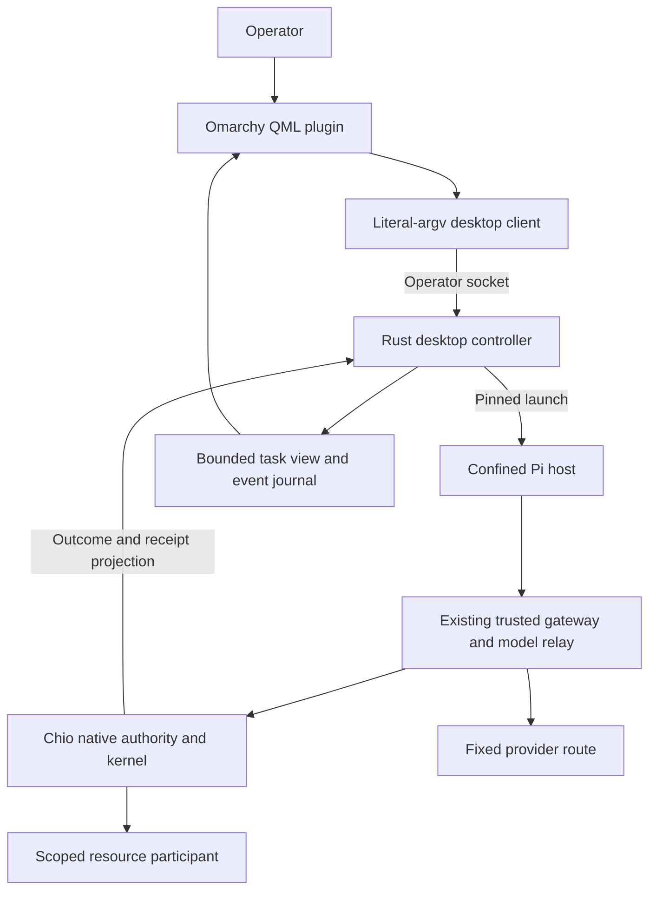

# Controller architecture and ownership

Status: Proposed. Confidence: high in the separation of responsibilities;
moderate in exact backend integration until P0 qualification. Dependencies:
[product](01-product-scope.md), [native readiness](research/chio-readiness.md),
[operator protocol](05-operator-protocol.md), [state](14-state-evidence-data.md).

## Context and decision

The controller is a user-session product adapter. It provides a stable desktop
view over Chio execution owners, supervises the selected installed host, and
reconciles presentation after interruption. It does not implement a parallel
capability issuer, tool dispatcher, approval authority, budget accountant or
uncertain-operation resolver.

The figure combines logical roles for readability. Deployment must retain the
actual existing parent/gateway/key custody boundaries of the selected host tuple.
A diagram arrow is not permission to move native keys into the controller.

## Components and responsibility

| Proposed unit | Owns | Must not own |
| --- | --- | --- |
| `chio-omarchy-plugin` Git repository | QML presentation and declared settings | Kernel credentials, signing keys, tool effects |
| `chio-desktop-controller` Rust binary | Enrolled task metadata, launch supervision, operator API and reconciliation | Native admission decisions or forged terminal outcomes |
| `chio-desktop-client` Rust binary | Literal-argv/stdin bridge to operator socket | Shell command interpolation, secret-bearing arguments |
| Existing host adapter | Stock-host integration, guest confinement, parent-held relay | Independent local execution after a precheck |
| Existing kernel/native services | Capability validation, dispatch, decision verification and durable outcomes | Desktop presentation state |
| Project or desktop resource | Concrete protected effects and independent result observation | Capability issuance or retry of a fenced native operation |
| Trusted reviewer frontend | Present the native exact proposal and collect an operator decision | Treating model explanation text as authorization |

Binary names and future paths are proposed. The new core code belongs in
`crates/products/chio-desktop/`, with `src/controller`, `src/client`,
`src/contracts`, `src/store`, `src/adapter` and `src/supervision` responsibilities.
Keep the controller, client and fixed-view opener binaries in one crate initially, sharing typed contracts. The QML
repository stays separately installable because Omarchy's plugin installer
expects its manifest at the repository root. During implementation a vendored
fixture in `integrations/omarchy/fixtures/plugin/` supplies reproducible tests;
it is not a second editable upstream copy.

## Task creation sequence

1. Trusted operator enrollment registers a resource handle, import policy, native
   profile and provider tuple. The UI never passes arbitrary executable paths.
2. `task.create` is validated and durably reserved by idempotency key before any
   launch. Task description is data, not an executable or policy.
3. The controller verifies current qualification tuple and prerequisite health.
   It asks the existing provisioning owner for a task-scoped native binding;
   unavailable provisioning is refusal, not local token issuance.
4. Resource import creates an immutable project generation and returns its
   digest. The final native binding includes that actual resource identity.
   No guest starts during partially completed preparation.
5. The native binding and exact host launch descriptor are durably retained.
   A successful launch is acknowledged only after confinement and native route
   readiness are independently observed.
6. The controller streams bounded progress projections. Tool calls go through
   the existing gateway/kernel path, never through an operator UI callback.
7. Terminal classification joins native outcomes and resource evidence. The
   controller cannot infer success from process exit zero or model text.

Preparation uses explicit stages `reserved`, `resource_ready`, `authority_ready`,
`guest_started`, retained as task setup metadata. A crash before a stage commit
requires identity-based reconciliation of its original provisioning request.
Removing a half-prepared task is permitted only after proving no native grant,
resource import or guest remains active. Otherwise it is retained for diagnosis.

## Lifecycle and command ownership

One controller owns a private state root using an exclusive retained lock.
Each guest launch has a native binding, task revision and observed process
identity. A single supervisor actor serializes state-changing commands per task;
independent tasks have separate queues. P2 admits one worker task at a time.
Commands that race with shutdown stop before launch or join the existing retained
operation. No arbitrary retry queue owns tool effects.

The controller service starts with the graphical user session and has no linger
requirement. QML reload is independent of task lifetime. Logout terminates owned
guests through the selected native host's lifecycle contract, retains unresolved
operations and closes the operator service. On restart, every nonterminal task
enters reconciliation before new admissions.

UI clients are dispensable. Disconnecting a client does not cancel work, approve
an action or delete task state. A user can explicitly cancel through the trusted
operator API. Native subtree cancellation, provider abort and actual process
termination are reported separately. See [state model](14-state-evidence-data.md).

## Failure partitioning

| Failure | Required behavior |
| --- | --- |
| UI or shim exits | Preserve task; reconnect from a bounded snapshot/event cursor |
| Controller dies | Supervised guest follows qualified parent-death contract; preserve original operations |
| Kernel unavailable before admission | Refuse start or hold task blocked; no local execution |
| Kernel reply lost after dispatch | Retain unknown outcome and original operation identity |
| Resource unavailable | Preserve the admitted operation; recover via its owner |
| Provider unavailable | Classify provider failure separately from already completed resource effects |
| Status projection write fails | Report unhealthy and stop new launch/control admissions; retain native outcomes |
| Disk full during native persistence | Native fail-closed behavior controls effects; controller never overrides it |
| Backend schema changes | Read-only bounded diagnostic mode if compatible; mutations refused |

## Extensibility

Each host adapter exposes a descriptor with supported profile identifiers,
versions, features, confinement kind and evidence tuple. The controller chooses
from operator-installed descriptors, never from guest-supplied discovery.
Resource capabilities are negotiated independently. A host that supports MCP
does not thereby qualify its built-in shell, browser or extension paths.

Runtime portability is deliberate: the controller's authoritative adapters do
not depend on QML. A later desktop frontend can reuse the operator contract.
Omarchy-specific operations stay in the plugin and desktop resource modules.

## Normative requirements

| ID | Requirement | Proposed acceptance |
| --- | --- | --- |
| OM-ARC-001 | The controller MUST delegate authority, dispatch and recovery decisions to selected native owners. | AT-ARC-001 |
| OM-ARC-002 | Task creation MUST be durably reserved and reconciled by original identity across every preparation cutpoint. | AT-ARC-002 |
| OM-ARC-003 | A guest MUST start only after actual resource, authority and confinement readiness. | AT-ARC-003 |
| OM-ARC-004 | Client or QML failure MUST NOT change task authority or clear uncertainty. | AT-ARC-004 |
| OM-ARC-005 | One state-root owner and per-task serialization MUST prevent duplicate launches and conflicting control. | AT-ARC-005 |
| OM-ARC-006 | Backend incompatibility MUST refuse mutations and label any diagnostic projection. | AT-ARC-006 |
| OM-ARC-007 | Terminal task classification MUST join the actual native and resource outcome contracts. | AT-ARC-007 |
| OM-ARC-008 | New adapters MUST provide independent qualification of every consequential host surface. | AT-ARC-008 |

## Proposed acceptance

### AT-ARC-001: No second execution authority
Trigger: replace a native adapter with one that refuses admission and monitor all
resource/provider entrypoints. Expected: no effect path remains in controller or
QML. Oracle: static ownership review plus independent resource counters.
Artifact: `authority-ownership.json` and `native-refusal.json`.

### AT-ARC-002: Preparation crash matrix
Trigger: kill controller before/after each of the four preparation stage commits.
Expected: original provisioning is reconciled; at most one guest/grant/import is
created for the same create request. Oracle: separate native/resource records.
Artifact: `preparation-cutpoints.json` containing each cutpoint and identities.

### AT-ARC-003: Readiness cannot be simulated by a port
Trigger: listening kernel with wrong signer, resource identity mismatch or failed
confinement. Expected: zero guest/provider start. Oracle: executable and traffic
observer. Artifact: `readiness-negatives.json` with valid positive control.

### AT-ARC-004: Desktop reload leaves ownership intact
Trigger: reload QML and kill the client during a tool call. Expected: original
task and operation remain; new view reconnects. Oracle: native IDs before/after.
Artifact: `ui-reconnect.json` plus rendered state.

### AT-ARC-005: Duplicate owner and command races
Trigger: two controllers and concurrent create/cancel calls. Expected: second
owner refuses; create deduplicates; cancellation linearizes once. Oracle: guest
process observer, command journal and native admission history. Artifact:
`controller-ownership-races.json`.

### AT-ARC-006: Unsupported native ABI
Trigger: substitute a descriptor with unknown ABI or source profile. Expected:
no start, resume or approval; bounded diagnostics identify mismatch. Oracle:
zero mutation dispatches. Artifact: `abi-refusal.json`.

### AT-ARC-007: Exit status is not success
Trigger: host exits zero with unknown native operation or failed test observation.
Expected: no false successful artifact claim. Oracle: native journal/resource
ledger. Artifact: `terminal-classification.json`.

### AT-ARC-008: Adapter closure audit
Trigger: submit a new adapter with one unmediated file, shell or extension path.
Expected: profile qualification refuses. Oracle: hostile host probe and absent
outside sentinel changes, with working allowed controls. Artifact:
`adapter-action-closure.json`.
