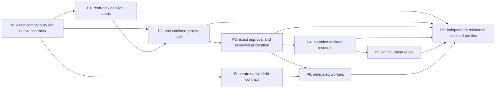

# Roadmap, architectural decisions and prerequisite ownership

Status: Proposed delivery plan. Confidence: high in the dependency ordering;
moderate in engineering effort until P0 selects a distributable native tuple.
No calendar or completion estimate is inferred from source presence.

## Dependency graph

Edges into P7 are conditional on selected profiles. Releasing `observe-v1` does
not require P6, and passing P7 for `observe-v1` does not enable any mutation.
P0 is incremental: a read-only compatibility bundle can enable P1 while execution
prerequisites stay open. The first useful execution milestone is P2 plus P7 for
`project-v1`; optional later phases must not turn into prerequisites for that pilot.

| Phase | Delivered result | Entry / exit boundary | Accountable role |
| --- | --- | --- | --- |
| P0 | Exact source, package and native facade inventory; fail-closed probe | Research pins -> reproducible read-only and execution prerequisite bundles, separately evaluated | Integration lead + native owner |
| P1 | Native bar/panel, read-only status, bounded reconnect and diagnostics | Read-only bundle -> actual Omarchy UX/compatibility acceptance, mutations unavailable | Desktop maintainer |
| P2 | One confined Pi project task, fixed tests, sealed review artifact | Qualified native/Pi/resource/provider tuple -> original-effect recovery and independent confinement evidence | Host and resource maintainers |
| P3 | Exact native approve/deny, reviewed destination publication | Native decision-validation blocker resolved -> replay/substitution/race acceptance | Native approval + resource owners |
| P4 | Bounded metadata and numbered-workspace desktop tools | P3 + compositor contract -> actual denied/allowed effect evidence | Desktop resource owner |
| P5 | Single-file scalar configuration repair | P4 + writer-exclusion/reload prerequisites -> preview/apply/readback and interruption evidence | Configuration resource owner |
| P6 | Attenuated child tasks and aggregate budgets | P3 + separately qualified registry/launcher -> parent/child restart and revocation evidence | Native process + host owners |
| P7 | Installable selected profile and operator evidence | Exact chosen phase gates -> independent clean install/update/rollback/removal and signed publication | Release maintainer + independent tester |

Implementation task files live in the [plan set](../../plans/2026-10-07-omarchy-integration/README.md).
They are future work, not commands that work on today's checkout. Research and
contract validation can be merged without claiming any phase delivered.

## Prerequisite register

All rows begin **open**. A closure requires source identity, executable/package
identity, machine tuple, positive and negative acceptance, independent oracle
and artifact digest. A callback interface or status string is insufficient.

| ID | Prerequisite / owner | Blocks | Closure evidence |
| --- | --- | --- | --- |
| P0-NATIVE-BUNDLE | Native release maintainer: one distributable process/session/resource/receipt bundle | P2+ | Source-to-binary provenance, compatible ABI and real kernel round trip |
| P0-OPERATOR-FACADE | Native owner: typed status, stable IDs, original-operation query and retained control semantics | P1 selected native views; P2 execution | Closed capability contract, forbidden admin/guest requests, crash reconciliation |
| P0-READONLY-TUPLE | Desktop maintainer: v4.0.4 built-in bar, QML facade, injected lifecycle and session ownership | P1 | Manifest validation plus actual shell/reconnect/lock test |
| P0-PROFILE-MATRIX | Integration lead: reviewed requirement applicability and disabled-feature refusal cases for each profile | P7 | Complete requirement map, no discretionary omitted tests, native owner sign-off |
| P2-LINUX-X64 | Confinement owner: actual non-root x86_64 Pi/recipe/runtime closure | P2+ | Outside guest probes and real provider/resource positive controls |
| P2-PRIVATE-PROMPT | Pi host owner: private FD/stdin or qualified SDK embedding, replacing current prompt argv route | P2+ | Hostile prompt and process metadata canary test |
| P2-RESOURCE-IMPORT | Resource owner: coherent enrolled source capture using qualified snapshot/exclusion without changing original permissions | P2+ | Concurrent-writer/symlink tests, immutable snapshot manifest and preserved originals |
| P2-RECOVERY-FACADE | Native owner: exact retained-operation/continuation API with no fresh-ID escape | P2+ | Dispatch/delivery/ACK crash matrix and deadline/budget retention |
| P2-PROVIDER-LIMITS | Provider adapter owner: exact usable route and truthful enforced budget dimensions | P2+ | Real route, denied disclosure, exhausted budget and interrupted request evidence |
| P3-DECISION-VALIDATION | Native approval owner: validate requested approve/deny before token retention | P3+ | Regression for deny-request/approved-token confusion and original-decision replay |
| P3-DESTINATION-PUBLISH | Resource owner: exact enrolled destination, revision comparison and retained publication | P3+ | Stale destination, substitution, interrupted effect and review fidelity matrix |
| P4-COMPOSITOR | Desktop resource owner: bounded pinned compositor adapter | P4+ | Live methods, forbidden raw strings, session ownership and restart tests |
| P5-WRITER-EXCLUSION | Resource/native owner: enforceable exclusion or equivalent qualified conditional replacement | P5 apply | Demonstrate other writers cannot invalidate the admitted replacement point |
| P5-RELOAD-CLOSURE | Desktop resource owner: bounded reload graph/effects | P5 apply | Static scalar boundary, dynamic hook refusal and independent readback |
| P6-NATIVE-CHILD | Native process/host owners: registry, signer custody, child launcher and aggregate reservation | P6 | Real attenuated child, no-parent-secret probes and uncertain parent/child restart |
| P7-PUBLICATION | Release owner: publicly retrievable pinned package/plugin and revocable trust metadata | P7 | Fresh download signature/hash verification and independent clean installation |

Readiness and source locations are enumerated in [Chio readiness](research/chio-readiness.md).
Reported recovery components absent from inspected trees remain a separate source
discovery/delivery task, not a route to invent in the controller.

## Recorded architecture decisions

| Decision | Selected approach and reason | Rejected/deferred alternative |
| --- | --- | --- |
| ADR-01 Native shell surface | QML plugin `computer.chio.desktop` uses the real bar/panel/service contracts | Browser dashboard as primary UX; replacing Omarchy shell |
| ADR-02 Authority reuse | Thin Rust controller adapts native contracts and stores projections | Second permission engine, receipt signer or recovery authority |
| ADR-03 Separate packaging | Signed native Arch package plus independently pinned Git QML artifact | Expecting plugin clone to provision backend or run install hooks |
| ADR-04 First host | Restricted Pi print/SDK task with closed tools and fixed resources | Automatically wrapping interactive agent CLIs or changing default-agent launcher |
| ADR-05 Agent confinement | Qualified guest with only exact resource/model routes | Calling selected tools through Chio while guest retains raw host access |
| ADR-06 Desktop tools | New bounded native resource adapter; optional upstream MCP edge later | Granting general `hyprctl`, arbitrary D-Bus, browser/CDP or shell capability |
| ADR-07 Repair | One enrolled scalar file with exact publication/reload contract | Whole-home agent repair, arbitrary Lua execution, claiming Btrfs snapshot protects home |
| ADR-08 Local operator ABI | AF_UNIX typed NDJSON through compiled literal-argv shim | HTTP listener by default, CLI human-output parsing, QML authority store reads |
| ADR-09 Truthful recovery | Original native operation reconciliation and explicit unknown fences | Automatic replay, new IDs, broad exception-based retry or optimistic success |
| ADR-10 Evidence | Profile-specific independently observed runtime acceptance | Promoting source fixtures, schema checks or one architecture's results to all profiles |

These are proposed design decisions open to evidence-based revision in review.
Changing one requires updating affected contracts, requirement mapping and plans
in the same change. Keep superseded reasoning in the decision history, not in
contradictory active instructions.

## Experiments and rejection rules

1. **Native plugin lifecycle.** On released Omarchy, inject service props late,
   create two bar instances, reload the plugin and disconnect the backend. Retain
   exactly one service/client and consistent state. Reject the approach if it
   requires private upstream singleton access or a shell fork.
2. **Indispensable project workflow.** An independent developer performs three
   enrolled project tasks and can explain scope, inspect a denial, interrupt once
   and recover the original outcome. Reject expansion if the Chio path removes
   no meaningful application burden or requires weakening confinement.
3. **Exact approval.** Force requested-deny/returned-approve, stale revisions,
   duplicated submission and lost responses. Keep P3 closed until every mismatch
   leaves no retained approval or effect. A UI confirmation dialog is not closure.
4. **Repair feasibility.** Race a normal editor against the selected scalar file
   and inspect the full reload graph. If enforceable writer exclusion or bounded
   reload cannot be established, ship preview-only diagnostics and keep `repair-v1`
   unavailable. Do not lower the contract to hash-then-rename.
5. **Adoption/release fit.** Install without developer checkout paths, preserve
   existing Omarchy customizations and uninstall without losing native evidence.
   Revise packaging if a routine upstream update silently bypasses tuple checks.

## Normative requirements

| ID | Requirement | Proposed acceptance |
| --- | --- | --- |
| OM-PLN-001 | Phase execution MUST respect native prerequisites and selected-profile dependency edges. | AT-PLN-001 |
| OM-PLN-002 | Open prerequisite closure MUST include exact identity and independently observed acceptance. | AT-PLN-002 |
| OM-PLN-003 | Architecture changes MUST update contracts, applicability and plans together. | AT-PLN-003 |
| OM-PLN-004 | Failed experiments MUST preserve explicit unavailable profiles instead of weakening authority. | AT-PLN-004 |

## Proposed acceptance

### AT-PLN-001: Phase dependency refusal
Trigger: request P3 with unresolved native decisions and P7 for observe-v1 while
P6 remains open. Expected: first refuses; second needs only its explicit profile
graph. Oracle: reviewed graph and prerequisite resolver. Artifact: `phase-gates.json`.

### AT-PLN-002: Incomplete prerequisite closure
Trigger: submit a source commit or passing fixture as complete Linux evidence.
Expected: gate remains open. Oracle: independent artifact/class inspection.
Artifact: `prerequisite-closure-audit.json`.

### AT-PLN-003: Contract drift
Trigger: change a method, state or package role without updating consumers/tests.
Expected: contract review/validation blocks promotion. Oracle: schema/catalog and
traceability comparison. Artifact: `contract-drift-review.json`.

### AT-PLN-004: Failed pilot
Trigger: simulate unavailable writer exclusion and host confinement prerequisites.
Expected: preview/read-only remains possible but execution profiles unavailable.
Oracle: method availability and protected destination counters.
Artifact: `pilot-rejection-rules.json`.
