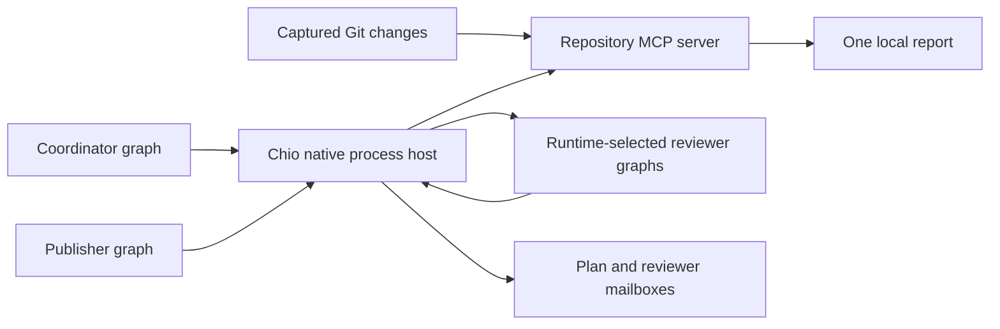

# Runtime-planned repository review

Let a coordinator inspect a Git change set and choose its reviewer processes
at runtime. Each reviewer gets a signed child capability, its own persistent
LangGraph and a dedicated result mailbox. A separate publisher combines the
guarded results into one local report after the native runner completes every
child.

The prepared plan contains only a coordinator and publisher. The operator
declares bounded reviewer templates, not concrete review jobs. The coordinator
chooses assignments after a mediated inventory read. The host creates and
schedules the resulting child processes through ordinary signed tool calls.



## Run

Use Linux and Python 3.11 or later. From the Chio checkout:

```bash
uv sync --project sdks/python/chio-langgraph --locked --extra process --extra dev
cargo build --locked -p chio-cli --bin chio

sdks/python/chio-langgraph/.venv/bin/python examples/repository-review/adaptive_review.py prepare \
  --repo /path/to/repository --base HEAD~1 --head HEAD \
  --run-dir /tmp/adaptive-review --chio "$PWD/target/debug/chio"
sdks/python/chio-langgraph/.venv/bin/python examples/repository-review/adaptive_review.py run \
  --run-dir /tmp/adaptive-review
```

Choose a new, short run path with an existing parent. Preparation creates a
private directory and refuses to overwrite it. Successful preparation ends
with `run.json`. A failed preparation can leave private diagnostic state.
The run prints paths to `report.md` and `evidence.json` after verification.
`chio process status --state /tmp/adaptive-review/host` reports the latest
recorded worker states, attempts and dependencies. Retain the full private
directory for recovery.

The default `inventory` planner groups changed paths by component and merges
groups when needed to fit the reviewer ceiling. Reviewers produce line counts
and explicit omissions. This mode performs no model review or test execution.
The shared snapshot implementation accepts 1-128 changed paths, captures at
most 8 MiB of source, and omits binary files, links, submodules and text blobs
over 64 KiB. It reads committed Git objects, never the working tree or
repository executables.

## Model-selected assignments

Prepare with `--model-factory review_model:create` to supply an importable
factory accepting `coordinator` or `reviewer` and returning a configured
LangChain chat model. Install its provider integration and expose the module
through the worker's Python import path. For example:

```python
from my_application.models import review_chat_model

def create(role):
    return review_chat_model(role=role)
```

Provider credentials belong in the private environment, never messages or
graph state. The factory is trusted application code. A remote provider
receives the source passed to its model. The factory and installed provider
dependencies are not included in the application's source digest.

The coordinator first receives the guarded change inventory. It can call
`changes` and `read_file`, then returns only this JSON shape:

```json
{
  "reviews": [
    {
      "paths": ["crates/example/src/lib.rs"],
      "focus": "Check the changed lifecycle transition and its failure behavior."
    }
  ]
}
```

Every captured path must be assigned at least once. Each job must select
unique paths from the mediated inventory and a nonempty focus of at most
1,000 UTF-8 bytes. Assignments can overlap for independent review objectives.
Malformed JSON, duplicate keys, extra fields, missing paths, out-of-snapshot
paths and excess jobs stop planning before delegation. There is one planning
wave per review. The model cannot choose executable commands, a parent
identity or capability material.

Reviewer models receive only repository-read schemas. They inspect captured
base/head content and return bounded Markdown. Their assigned paths express
review focus; their read capability permits other captured changed files for
context. It does not grant arbitrary repository or filesystem reads. The
model has no publication or mailbox schemas. The graph sends its completed
review through the slot's authorized mailbox. Findings need human verification.

## Authority and limits

| Process | Authorized tools |
| --- | --- |
| Coordinator | Repository reads, selected reviewer spawns, direct-child waits, plan and reviewer sends |
| Reviewer in slot N | Repository reads and `send_review_N` |
| Publisher | Publication and receive/ack on the configured mailboxes |

The coordinator retains child-send rights so its capabilities can attenuate
them into reviewers. Mailbox rights do not attest sender identity. The broader
parent can use its granted endpoints. The publisher cannot read repository
files or spawn work; reviewers cannot publish or send to another slot.
Application result files carry completion metadata and receipts. Review text
reaches publication through guarded mailbox outputs.

`--max-reviews` defaults to 8 and accepts 1-16. `--max-parallel` defaults to 2
and accepts 1-16; it includes the coordinator and publisher. The shared root
`--max-calls` ceiling defaults to 300 and includes spawn, join, mailbox and
repository operations. Coordinator and publisher hold 80% and 20% root budget
shares. Each child receives at most `8000 / max_reviews` basis points of its
parent's budget, rounded down. Child allocations remain reserved after a
child exits or is cancelled.

`--max-rounds` defaults to eight persisted model responses per graph. Model
calls occur outside Chio tool admission and are not provider token or monetary
budgets. Configure provider limits separately. Each native attempt has a
ten-minute timeout; the coordinator and publisher have four lifetime attempts
and reviewers have three. A cooperative suspension consumes an attempt too.
Capabilities expire one hour after preparation and cannot be renewed here.
These bounds can prevent a large or slow model review from completing.

## Recovery and verification

Run the same command with the same directory to recover. Application source,
native binary bytes, snapshot identity, initialized authority configuration
and executable plan must still match preparation. Python dependencies,
factory implementation and environment must also remain suitable; they are
not attested by those pins. Same-user worker processes are not OS sandboxes.

LangGraph checkpoints the validated assignment and stable tool-call identities
before spawn effects. Each child's task is committed with its process identity
in the native process store. The runner reconstructs dynamic workers from that
store and the pinned template commands. It rotates credentials and enforces
bounded attempts across worker and host restarts.

A pending join records direct children, checkpoints a LangGraph interrupt and
exits with code 75, releasing the worker slot. The native runner resumes the
coordinator after those children complete. The resumed graph makes a new join
poll while retaining the original pending result. This permits a whole review
to finish with `--max-parallel 1`. Completed native workers do not start again.

Known spawn, handoff and publication outcomes replay their original signed
receipts after a lost graph checkpoint. Kernel admission and tool effects have
separate commits. A child can be durably created and scheduled before its spawn
outcome becomes uncertain. Recovery of that original invocation then denies
redispatch; it does not erase the child or invent a replacement key. Denials,
MCP errors, unknown outcomes and exhausted attempts stop completion. Preserve
the state for inspection.

Completion verifies all exported receipt signatures and canonical action
parameter hashes against the host public key pinned at initialization. It
also checks assignments against signed spawn inputs and the coordinator's
signed handoff, and checks the exact report and snapshot identity against the
publisher's signed parameters and the single stored publication. The native
runner journal supplies worker completion evidence. Receipts do not sign
arbitrary tool return values or prove model correctness, complete causal
provenance, log inclusion or absence of omitted operations. Verify the signer
key through trusted host setup before trusting an exported evidence package.

## Qualification

```bash
sdks/python/chio-langgraph/.venv/bin/python -m pytest -q \
  examples/repository-review/test_snapshot.py examples/repository-review/test_adaptive.py
sdks/python/chio-langgraph/.venv/bin/python examples/repository-review/qualify_adaptive.py \
  --chio "$PWD/target/debug/chio" --output /tmp/adaptive-review-evidence
```

The native qualification changes a real Git fixture from three changed paths
in two components to four paths in three components. Inventory creates two
then three children; the scripted model chooses one child per file. Initial
plans still contain only the two fixed workers. No live provider is called.

It exercises one-slot suspension, child creation before a lost graph
checkpoint, reviewer handoff and publication restarts, host death after known
spawn results, original receipt replay, unchanged completed runs, invalid
plans, persisted model round ceilings, authority denials and corrupted report,
assignment, source and run metadata. Successful evidence is exported without
private host state; failures preserve their private directory for diagnosis.
These checks establish application behavior under the tested failure points.
Live model quality and independent application adoption remain unverified.
