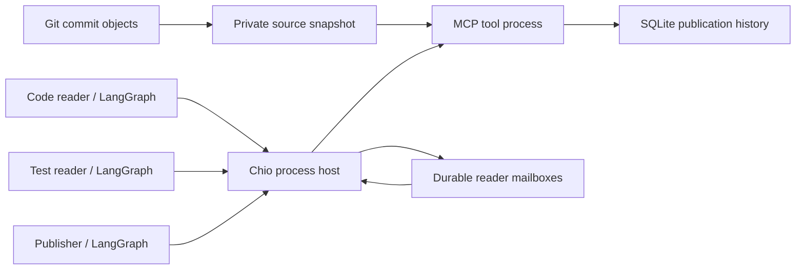

# Repository review application

The application uses the public CLI and worker protocol to run a review over
immutable Git objects. It does not embed the Rust kernel or introduce another
tool authorization path.

## Ownership

- `snapshot.py` resolves commit references, reads regular Git blobs, records
  omissions and computes the bounded source snapshot identity.
- `tools.py` serves inventory, captured file reads and append-only publication
  through MCP. It cannot read arbitrary paths supplied by a model.
- `worker.py` constructs one persistent LangGraph per OS worker, retaining
  tool-call identities and original receipt text. The optional model factory
  supplies application planning. It has no publication tool in reader roles.
- `handoffs.py` plans reader sends, publisher receives, report assembly and
  acknowledgements. Every message operation uses ordinary kernel tools.
- `review.py` initializes the declared authority tree, owns host lifecycle,
  rotates worker credentials, launches concurrent readers and then the
  publisher, and verifies receipt exports.
- `qualify.py` supplies the failure oracle and behavioral assertions. Its
  scripted model is separate from the application's inventory default.
- `native.py` declares the same workers for `chio process run`; `run-native`
  leaves direct-worker launch, dependencies, credentials and bounded restarts
  to the native host, then verifies and exports results. `qualify_native.py`
  checks automatic handoff/publication recovery and completed-run replay.

## Durable identities

The source snapshot digest is the graph thread id. Each reader and publisher
has a distinct Chio process and SQLite graph checkpoint file. Namespace,
thread, assistant-message and tool-call ids determine each operation key.
Attempt ids select transport endpoints and credential files only. They never
enter operation identity or report content.

`run.json` pins the original host key, source digest, commit range, model
factory configuration and application source hash. Native host state pins
the issuance/runtime policies, mailbox configuration and tool definitions.
Reader graphs checkpoint their send plans before handing off through the
kernel. Publisher receives and publication planning are checkpointed before
publication; acknowledgement follows its recorded completion. Rebuilding
export files cannot authorize a new tool effect.

## Trust and failure boundaries

The coordinator, source snapshot, model factory and MCP server are trusted
host code. Same-user worker processes are not sandboxed. The native kernel
owns scope enforcement, call limits, admission, original receipts and outcome
recovery. LangGraph owns planning checkpoints, and SQLite owns local report
history. Reader review text travels through capability-scoped mailbox calls;
local result files carry completion metadata and original receipt exports.
Readers can send to their own channel, while the publisher can receive and
acknowledge both channels. Models receive only repository-read tool schemas.
Channel rights do not establish sender-process attestation; broader parent
capabilities retain their authorized endpoint operations. Guards can transform
received payloads. Publication uses those guarded reader results.

MCP tool errors, kernel denials and unknown outcomes stop the graph. A known
publication or handoff can replay after worker and host death. An uncertain
effect cannot be automatically redispatched. Mailbox commits and kernel outcome
commits are separate transactions. The offline verifier establishes
receipt signature integrity against an independently pinned key; it does not
assert model correctness, log inclusion or complete causal provenance.
