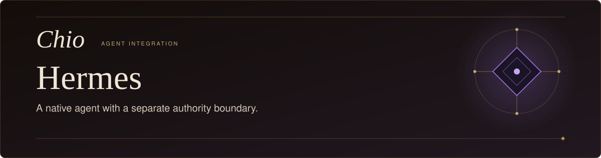
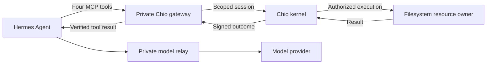

<p align="center">
  <picture>
    <source media="(max-width: 600px)" srcset="docs/assets/readme-hero-mobile.svg" />
    
  </picture>
</p>

<p align="center">
  <a href="https://github.com/backbay-labs/chio"></a>
  
  <a href="../../../LICENSE"></a>
</p>

# Chio for Hermes

**Let Hermes work on your files. Keep authority with the kernel.**

A native [Hermes Agent](https://github.com/NousResearch/hermes-agent) integration
for [Chio](https://www.chio.computer). The restricted launcher gives Hermes four scoped
filesystem tools through a separate kernel and resource owner. The agent can
read, write, edit and list the designated workspace while the operator retains
credentials, policy and signed operation records.

[How it works](#how-it-works) · [Build from source](#build-from-source) ·
[Run a task](#run-a-task) · [Operator guide](docs/OPERATOR.md) ·
[Evidence](#validation-and-evidence)

> **Source candidate:** `chio-hermes` 0.1.2 has bounded local native-host
> evidence on macOS with pinned Hermes 0.20.5. Full integration acceptance and
> compatible public artifact delivery remain open. This package is not yet
> available on PyPI; build from the source revision below.

## What you can do

| Workflow | Kernel tool |
| --- | --- |
| Read a file in the designated workspace | `read_text_file` |
| Create or replace a permitted file | `write_file` |
| Apply a scoped text edit | `edit_file` |
| Inspect a permitted directory | `list_directory` |

The supported mode runs one task in a fresh isolated host profile. Native
shell, local filesystem access, browser tools, other MCP servers, delegation,
scheduled jobs and background sessions are disabled or confined. It is a file
work integration; running builds, tests or Git commands is outside this mode.

## How it works



The parent launcher owns the gateway and model relay. Hermes receives temporary
loopback tokens; the parent retains the kernel bearer, trusted signer pins,
provider credentials and durable journal. The protected files live at the
resource owner, outside the agent's local filesystem.

A macOS Seatbelt profile confines the agent and its bootstrap descendants to
explicit paths and the two private relay ports. A missing sandbox, incompatible
host or malformed configuration prevents launch. The gateway verifies caller,
request, signer and result bindings before it acknowledges delivery. Uncertain
outcomes stay fenced for operator reconciliation.

The [action inventory](ACTION_INVENTORY.md) describes each enforcement point.
The legacy `pre_tool_call` plugin is a diagnostic compatibility surface; use
`chio-hermes-restricted` for this boundary.

## Build from source

You need Git, Python 3.11 or later, and uv. The adapter and its Python dependency
sources are included in one public Chio checkout:

```bash
git init chio-hermes-source
git -C chio-hermes-source fetch --no-tags --depth=1 \
  https://github.com/backbay-labs/chio.git \
  70071260afe514b06cac1c319487bd48e465d39e
git -C chio-hermes-source checkout --detach FETCH_HEAD
cd chio-hermes-source/sdks/python/chio-hermes
uv sync --locked --extra dev
uv run --locked chio-hermes-restricted --help
```

This installs the adapter into a project environment. It does not start Hermes,
provision a kernel or alter your normal agent profile. A source build has its
own artifact identity; it does not inherit qualification from a recorded wheel.

Before running a task, follow the [operator guide](docs/OPERATOR.md#installation-and-launch)
to install the pinned native host and compatible bridge, and prepare the kernel
session. Hermes is installed separately from the adapter. Its upstream lockfile
requires uv 0.12.11 in the recorded installation.

| Component | Selected local candidate |
| --- | --- |
| Native host | Hermes 0.20.5 at `175054c14b54404663d8614a178280cffe6062eb` |
| Adapter | `chio-hermes` 0.1.2 |
| Host gateway | `@chio/bridge` 0.3.0, selected archive |
| Kernel | CLI 0.1.1-rc.1 at `bafa02b06de93553cecb6f60b340f3dd8fd9b401` |
| Protected platform | macOS with `/usr/bin/sandbox-exec` |

[Exact artifact identities](evidence/2026-09-10/static-kernel-native/README.md#frozen-inputs)
include the separately installed recovery operator. Version numbers alone are
insufficient to select a compatible installation.

## Run a task

After provisioning, create a query file such as:

```text
Write a short project note to /workspace/project-note.md, read it back,
and report the contents returned by the tool.
```

The path must be permitted by the resource owner's policy. From the adapter
source directory, launch with your explicit installation paths and prepared
private gateway configuration:

```bash
uv run --locked chio-hermes-restricted \
  --host-python /opt/hermes/venv/bin/python \
  --host-root /opt/hermes/pinned-source \
  --node /opt/node/bin/node \
  --gateway-script /opt/chio-bridge/dist/gateway-http.js \
  --gateway-config /private/operator/hermes-gateway.json \
  --state-dir /private/operator/runs/hermes-unique-run \
  --query-file /private/operator/task.txt \
  --model gpt-5.5 \
  --model-auth codex-subscription \
  --codex-auth-file /private/operator/codex-profile/auth.json
```

Use a new state directory for each independent run. The explicit native Codex
login cache stays with the parent; account access determines model availability.
The operator guide also documents [API-key authentication](docs/OPERATOR.md#installation-and-launch)
and [subscription renewal](docs/OPERATOR.md#chatgpt-subscription-model-transport).

Retain `launch.json`, `terminal.json`, host output and the private gateway journal. Judge a file
action by its verified outcome and an independent resource observation. An
agent's final text or process exit is insufficient evidence of completion.

## Recovery and lifecycle

Cancellation or launcher loss terminates the isolated host and closes its tool
route. An action may already have reached the resource before that happens.
Preserve the original journal and authority, inspect the resource, and use the
[recovery procedure](docs/OPERATOR.md#reconcile-a-retained-outcome). Never reset
state or create a replacement session to replay an unknown outcome.

The [upgrade and removal guide](docs/OPERATOR.md#recovery-upgrade-and-removal)
covers separate candidate environments, retained state, revocation and cleanup.
Automatic task resume and background sessions are not exposed.

## Validation and evidence

Run the component checks from the adapter directory:

```bash
uv run --locked --extra dev pytest -q
uv run --locked --extra dev ruff check src tests scripts
```

| Record | What it establishes |
| --- | --- |
| [Acceptance ledger](ACCEPTANCE.md) | Observed cases, source/artifact identities, failures and remaining gates |
| [Native subscription coverage](evidence/2026-09-09/subscription-r15/COVERAGE.md) | Useful work, negative controls and identity/recovery checks through Hermes |
| [Static-kernel native record](evidence/2026-09-10/static-kernel-native/README.md) | Pinned public host install, failure cutpoints and offline lifecycle observations |
| [Action inventory](ACTION_INVENTORY.md) | Reachable tools, disabled paths and resource ownership |

Four legacy sidecar tests are opt-in and remain unresolved. Mock-client tests
and deterministic provider fixtures are labeled separately from live-model,
real-kernel observations. None of these results establishes another host's
acceptance or a published release.

---

Part of [Chio](https://www.chio.computer) · [Protocol source](https://github.com/backbay-labs/chio) ·
[Apache 2.0](../../../LICENSE)
