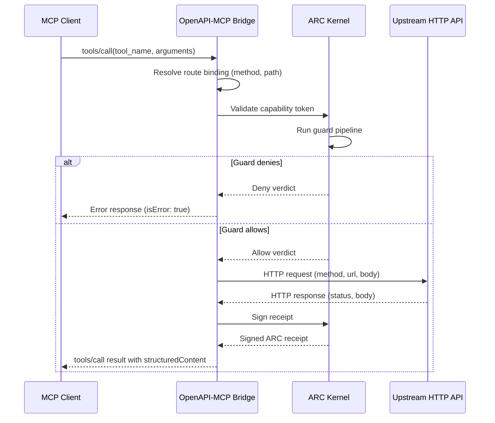
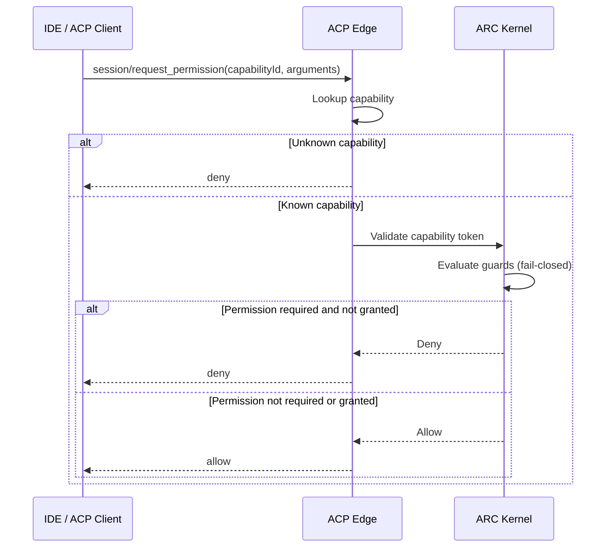
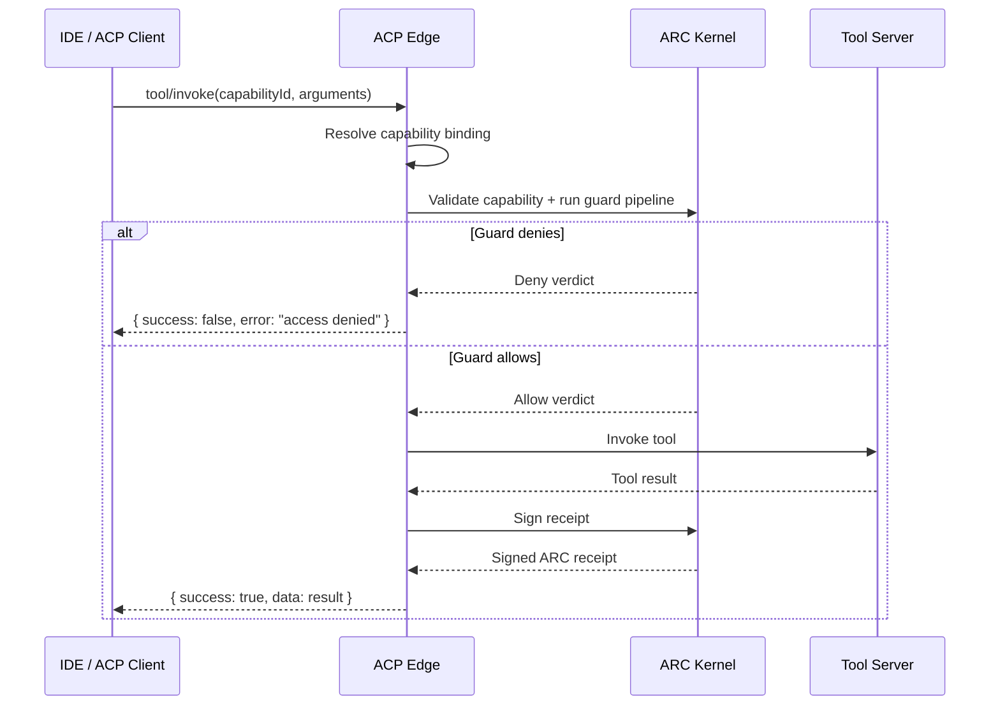
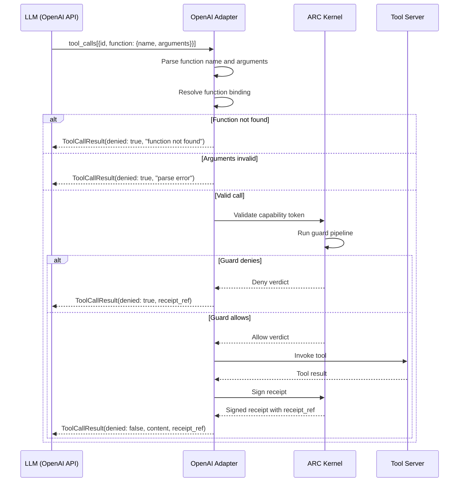

# Protocol Bridges and Edge Documentation

**Version:** 3.0
**Date:** 2026-04-14
**Status:** Normative companion to PROTOCOL.md

This document specifies how the ARC kernel's trust contract extends to
external protocol surfaces through bridges and edges. Each section covers
one bridge or edge crate, its invocation flow, fidelity assessment, and
receipt integration.

All bridges and edges share the same security invariant: every mediated
action flows through the ARC kernel guard pipeline, producing a signed
receipt regardless of the upstream or downstream protocol.

---

## 1. OpenAPI-to-MCP Bridge (`arc-openapi-mcp-bridge`)

### 1.1 Overview

The OpenAPI-to-MCP bridge presents ARC-governed HTTP APIs as MCP tool
surfaces. Given an OpenAPI 3.x specification, the bridge:

1. Parses the spec via `arc-openapi` to produce `ToolDefinition` values.
2. Wraps each HTTP operation as an MCP-visible tool via `arc-mcp-edge`.
3. Routes invocations through the ARC kernel for capability validation
   and receipt signing before dispatching to the upstream HTTP API.

The bridge MUST generate a valid `arc.manifest.v1` manifest from the
OpenAPI spec. If the spec contains zero publishable operations, the
bridge MUST reject construction with a manifest error.

### 1.2 tools/list Generation

Each HTTP operation (method + path pair) in the OpenAPI spec becomes one
entry in the MCP `tools/list` response. The mapping rules are:

| OpenAPI Field | MCP Tool Field | Notes |
|---|---|---|
| `operationId` | `name` | Falls back to `"{METHOD} {path}"` if absent |
| `summary` / `description` | `description` | Concatenated if both present |
| Request body schema or parameters | `inputSchema` | Merged into a single JSON Schema object |
| Response schema (200/201) | `outputSchema` | Optional; included when `include_output_schemas` is set |
| HTTP method | `annotations.readOnlyHint` | `true` for GET/HEAD/OPTIONS; `false` otherwise |

The bridge MUST set `has_side_effects` to `false` for GET, HEAD, and
OPTIONS operations and `true` for all other HTTP methods.

When `x-arc-*` extensions are present in the OpenAPI spec, they are
propagated to the corresponding `ToolDefinition` fields as specified in
[OPENAPI-INTEGRATION.md](OPENAPI-INTEGRATION.md).

### 1.3 Invocation Flow



The bridge MUST resolve the route binding from the tool name before
dispatching. If the tool name does not match any known route binding, the
bridge MUST return a `ToolNotFound` error without contacting the upstream
API.

The `structuredContent` field in the MCP response MUST include:

- `httpStatus`: the HTTP status code from the upstream response
- `method`: the HTTP method used
- `path`: the URL path template
- `body`: the parsed response body

### 1.4 Receipt Generation

Every bridged invocation that reaches the upstream HTTP API MUST produce
a signed ARC receipt. The receipt MUST include:

- `tool_name`: the MCP tool name (derived from `operationId`)
- `server_id`: the bridge's configured server ID
- `decision`: `allow` for successful invocations; `deny` if the guard
  pipeline rejects the request

When no HTTP dispatcher is configured, the bridge operates in simulation
mode. Simulation mode responses MUST set `structuredContent.bridgeMode`
to `"simulation"` and SHOULD NOT produce receipts since no upstream call
occurs.

### 1.5 Kernel Integration

The bridge implements `ToolServerConnection`, allowing direct
registration with an ARC kernel instance. Both borrowed (`BridgeToolServer`)
and owned (`OwnedBridgeToolServer`) variants are provided:

- `BridgeToolServer<'a>`: borrows the bridge; suitable for scoped kernel
  registration.
- `OwnedBridgeToolServer`: consumes the bridge; suitable for long-lived
  kernel registration where the bridge outlives the construction scope.

Both variants delegate `invoke()` to the bridge's internal dispatch
logic, mapping `BridgeError` to `KernelError::ToolServerError`.

---

## 2. A2A Edge (`arc-a2a-edge`)

### 2.1 Overview

The A2A edge exposes ARC kernel-governed tools as A2A (Agent-to-Agent)
skills. This is the reverse direction from `arc-a2a-adapter`: instead of
consuming a remote A2A server, this crate serves ARC tools to external
A2A clients.

Every invocation flows through the kernel guard pipeline, producing a
signed ARC receipt.

### 2.2 Agent Card Generation

The edge MUST serve an Agent Card at `/.well-known/agent-card.json`. The
Agent Card is generated from the edge configuration and registered tool
manifests.

The Agent Card structure:

| Field | Source | Notes |
|---|---|---|
| `name` | `A2aEdgeConfig.agent_name` | MUST be non-empty |
| `description` | `A2aEdgeConfig.agent_description` | Human-readable summary |
| `version` | `A2aEdgeConfig.agent_version` | Semantic version |
| `supportedInterfaces` | Derived from config | One entry per endpoint URL |
| `capabilities.streaming` | `A2aEdgeConfig.streaming_enabled` | Defaults to `false` |
| `defaultInputModes` | `["text"]` | Fixed for current implementation |
| `defaultOutputModes` | `["text"]` | Fixed for current implementation |
| `skills` | Derived from tool manifests | One skill per ARC tool |

Each interface entry MUST include:

- `url`: the A2A endpoint URL
- `protocolBinding`: the protocol binding (default: `"JSONRPC"`)
- `protocolVersion`: `"1.0"`

### 2.3 Tool-to-Skill Mapping

Each ARC `ToolDefinition` from registered manifests becomes one A2A
skill entry. The mapping rules are:

| ARC Field | A2A Skill Field | Notes |
|---|---|---|
| `tool.name` | `id`, `name` | Skill ID matches the ARC tool name |
| `tool.description` | `description` | Passed through unchanged |
| (inferred) | `tags` | Empty by default; MAY be populated by operators |
| (fixed) | `inputModes` | `["text"]` |
| (fixed) | `outputModes` | `["text"]` |
| `tool.has_side_effects` | `bridgeFidelity` | Used as fidelity signal |

When multiple manifests contain tools with the same name, the edge MUST
use the first encountered definition and skip duplicates silently.

### 2.4 SendMessage and SendStreamingMessage

#### 2.4.1 SendMessage (Blocking)

The edge handles `message/send` JSON-RPC requests by:

1. Resolving the target skill ID from `params.metadata.arc.targetSkillId`.
   If only one skill is registered, the edge MAY infer the target
   automatically.
2. If multiple skills are registered and no `targetSkillId` is provided,
   the edge MUST return a JSON-RPC error (code `-32602`).
3. Extracting arguments from the message parts. If a `Data` part is
   present, it is used as the arguments object. Otherwise, `Text` parts
   are concatenated and wrapped as `{"message": "<text>"}`.
4. Invoking the tool through the `ToolServerConnection`.
5. Returning a `TaskResponse` with a unique task ID.

The task response MUST include:

- `id`: a monotonically increasing task identifier (format: `a2a-task-{n}`)
- `status`: `completed` on success; `failed` on tool server error
- `message`: present when status is `completed`; contains the tool result
  converted to A2A message parts
- `statusMessage`: present when status is `failed`; contains the error
  description

#### 2.4.2 SendStreamingMessage (SSE)

The `message/stream` method is accepted on the same handler as
`message/send`. When `A2aEdgeConfig.streaming_enabled` is `true`, the
Agent Card advertises streaming support.

The current implementation handles `message/stream` synchronously
(single-shot response). Future versions MAY emit SSE events for
long-running tool invocations.

#### 2.4.3 Result Conversion

Tool results are converted to A2A message parts using these rules:

| Result Type | A2A Part Type | Conversion |
|---|---|---|
| String value | `text` | Used directly |
| Object with `content` array | `text` (per entry) | Each `content[].text` becomes a text part |
| Other object or array | `data` | Passed through as structured data |
| Other scalar | `text` | Converted via `to_string()` |

### 2.5 BridgeFidelity Evaluation

The edge evaluates fidelity per tool at registration time. The assessment
indicates how faithfully an ARC tool maps to A2A semantics.

| Fidelity Level | Criteria | Implications |
|---|---|---|
| `full` | Tool is read-only (`has_side_effects` is `false`) | Perfect mapping; no semantic loss |
| `partial` | Tool has side effects (`has_side_effects` is `true`) | A2A does not distinguish read-only from mutating operations; the side-effect signal is lost in translation |
| `degraded` | Reserved for tools with streaming output or binary payloads | Significant semantic loss; A2A text/data parts cannot fully represent the output |

The `bridgeFidelity` field is included in each skill entry in the Agent
Card. Clients SHOULD use this field to assess whether the A2A interface
is sufficient for their use case.

### 2.6 Kernel-Mediated Receipts

Every `SendMessage` invocation that reaches the tool server MUST flow
through the kernel guard pipeline. The resulting signed receipt includes:

- `tool_name`: the ARC tool name (matching the A2A skill ID)
- `server_id`: the server ID from the manifest that owns the tool
- `decision`: `allow` for completed tasks; `deny` for guard rejections

When the tool server returns an error, the task status is `failed` but a
receipt is still generated with the `deny` or `incomplete` decision as
appropriate.

---

## 3. ACP Edge (`arc-acp-edge`)

### 3.1 Overview

The ACP edge exposes ARC kernel-governed tools as ACP (Agent Client
Protocol) capabilities. This allows ACP-compatible editors and IDEs to
access ARC-governed tools through the ACP permission model.

ACP has a narrow tool model organized around four categories: filesystem,
terminal, browser, and generic tool. The edge maps ARC tools into this
model with category inference and fidelity assessment.

### 3.2 ARC Tools as ACP Capabilities

Each ARC `ToolDefinition` becomes one ACP capability advertisement. The
mapping rules are:

| ARC Field | ACP Capability Field | Notes |
|---|---|---|
| `tool.name` | `id`, `name` | Capability ID matches the ARC tool name |
| `tool.description` | `description` | Passed through unchanged |
| (inferred) | `category` | See Section 3.3 |
| `tool.has_side_effects` + config | `requiresPermission` | `true` if config requires permission OR tool has side effects |
| (evaluated) | `bridgeFidelity` | See Section 3.5 |

When multiple manifests contain tools with the same name, the edge MUST
use the first encountered definition and skip duplicates.

### 3.3 Category Inference

The edge infers the ACP category from the tool name using keyword
matching. The inference rules, applied in order:

| Pattern | Category | Examples |
|---|---|---|
| Name contains `read_file`, `write_file`, `list_dir`, or starts with `fs_` | `filesystem` | `read_file`, `fs_stat`, `write_file` |
| Name contains `terminal`, `exec`, `shell`, or `command` | `terminal` | `exec_command`, `run_shell` |
| Name contains `browser`, `navigate`, or `screenshot` | `browser` | `browser_click`, `take_screenshot` |
| No match | `tool` (configurable default) | `search`, `get_weather` |

When no pattern matches, the edge MUST fall back to
`AcpEdgeConfig.default_category`, which defaults to `tool`.

### 3.4 Permission Evaluation

The edge implements fail-closed permission evaluation backed by ARC
capabilities.

The edge handles `session/request_permission` JSON-RPC requests by:

1. Looking up the capability by ID. If the capability is unknown, the
   edge MUST return `deny`.
2. If `requiresPermission` is `true` for the capability, the edge MUST
   return `deny` by default. Explicit permission grants require kernel
   capability token validation (full integration deferred to Phase 324).
3. If `requiresPermission` is `false`, the edge MUST return `allow`.



### 3.5 BridgeFidelity Assessment

The edge evaluates fidelity based on both the inferred ACP category and
tool properties.

| Fidelity Level | Criteria | Implications |
|---|---|---|
| `full` | Category is `filesystem` or `terminal` | ACP natively supports these primitives; no semantic loss |
| `partial` | Category is `browser`, or category is `tool` with `has_side_effects` = `false` | Minor semantic loss; ACP's browser model is narrower than arbitrary tools; read-only generic tools lose category specificity |
| `degraded` | Category is `tool` with `has_side_effects` = `true` | ACP has no generic "mutating tool" primitive; the side-effect and scope semantics are lost |

The `bridgeFidelity` field is included in each capability advertisement.
Clients SHOULD use this field to determine whether the ACP interface
provides sufficient fidelity for their use case.

### 3.6 JSON-RPC Interface

The ACP edge exposes three JSON-RPC methods:

| Method | Purpose | Response |
|---|---|---|
| `session/list_capabilities` | List all ACP capabilities | `{ capabilities: [...] }` |
| `session/request_permission` | Evaluate permission for a capability | `{ decision: "allow" \| "deny" }` |
| `tool/invoke` | Invoke a capability through the kernel | Invocation result or error |

Unknown methods MUST return a JSON-RPC error with code `-32601`.

### 3.7 Invocation Flow



Every invocation that reaches the tool server MUST produce a signed
receipt. Failed invocations (tool server errors) MUST return
`{ success: false, error: "<message>" }` and still produce a receipt.

---

## 4. OpenAI Adapter (`arc-openai`)

### 4.1 Overview

The OpenAI adapter intercepts OpenAI-style `tool_use` / function-calling
requests and routes them through the ARC kernel for capability validation
and receipt signing. It supports both the Chat Completions API format and
the Responses API format.

Every function call produces a signed receipt. Guards fail closed by
default.

### 4.2 Function Definition Generation

The adapter generates OpenAI-compatible tool definitions from ARC
`ToolManifest` entries. Each `ToolDefinition` becomes one OpenAI function:

| ARC Field | OpenAI Field | Notes |
|---|---|---|
| `tool.name` | `function.name` | Used directly; MUST match the receipt `tool_name` |
| `tool.description` | `function.description` | Passed through unchanged |
| `tool.input_schema` | `function.parameters` | JSON Schema for function parameters |

The adapter generates the `tools` array in the format expected by the
Chat Completions API:

```json
[
  {
    "type": "function",
    "function": {
      "name": "get_weather",
      "description": "Get the weather for a location",
      "parameters": {
        "type": "object",
        "properties": {
          "location": { "type": "string" }
        },
        "required": ["location"]
      }
    }
  }
]
```

### 4.3 Invocation Flow



### 4.4 Chat Completions API Support

The adapter processes tool calls from Chat Completions API responses. The
extraction flow:

1. The LLM response message contains a `tool_calls` array.
2. `extract_tool_calls()` deserializes each entry into an
   `OpenAiToolCall` struct.
3. Each tool call is executed via `execute_tool_call()`.
4. Results are converted to `role: "tool"` messages via
   `results_to_messages()` for inclusion in the next Chat Completions
   request.

The result message format:

```json
{
  "role": "tool",
  "tool_call_id": "call_abc123",
  "content": "<serialized result>"
}
```

### 4.5 Responses API Support

The adapter also supports the OpenAI Responses API format. The
extraction flow:

1. The response contains an `output` array with items typed as
   `"function_call"`.
2. `extract_responses_api_calls()` filters for `function_call` items and
   extracts `name`, `arguments`, and `call_id`.
3. Each call is executed through the same `execute_tool_call()` path.
4. Results are converted to `function_call_output` items via
   `results_to_responses_api()`.

The output format:

```json
{
  "type": "function_call_output",
  "call_id": "fc_123",
  "output": "<serialized result>"
}
```

### 4.6 Receipt Generation

Every function call MUST produce a signed receipt. The receipt MUST
include:

- `tool_name`: the OpenAI function name, which matches the ARC tool name
- `server_id`: the adapter's configured server ID
- `receipt_ref`: a unique reference (format:
  `arc-receipt-{server_id}-{counter}`) included in the `ToolCallResult`

Receipt generation occurs for both successful and failed invocations:

| Outcome | `denied` | `receipt_ref` | Notes |
|---|---|---|---|
| Successful invocation | `false` | Present | Normal execution path |
| Guard denial | `true` | Present | Kernel denied the capability |
| Tool server error | `true` | Present | Tool execution failed |
| Function not found | `true` | Absent | No kernel interaction occurred |
| Argument parse failure | `true` | Absent | No kernel interaction occurred |

When `receipt_ref` is absent, no kernel interaction occurred and
therefore no signed receipt was produced. The adapter MUST still mark
these calls as `denied: true`.

### 4.7 Batch Execution

The adapter supports executing multiple tool calls in a single batch via
`execute_tool_calls()`. This is the common case when an LLM issues
parallel function calls.

Batch execution MUST:

- Process each tool call sequentially in the provided order.
- Generate a unique `receipt_ref` for each call that reaches the kernel.
- Return one `ToolCallResult` per input `OpenAiToolCall`.

Each call in the batch is independent. A failure in one call MUST NOT
prevent execution of subsequent calls. The caller receives the full
results array and can inspect each entry's `denied` field individually.

---

## 5. Cross-Cutting Concerns

### 5.1 BridgeFidelity Summary

All edges use a three-level fidelity assessment:

| Level | Meaning | Guidance |
|---|---|---|
| `full` | The ARC tool maps perfectly to the target protocol's native primitives | No semantic loss; the bridge is transparent |
| `partial` | The ARC tool maps with minor semantic loss | Some ARC metadata (side-effect signals, scopes, structured output) may be collapsed or omitted |
| `degraded` | The ARC tool maps with significant semantic loss | The target protocol cannot represent key ARC properties; callers should verify results independently |

### 5.2 Fail-Closed Invariant

All bridges and edges MUST maintain the ARC fail-closed invariant:

- If the kernel is unreachable, requests MUST be denied.
- If a capability token is invalid or expired, requests MUST be denied.
- If guard evaluation produces an error, the request MUST be denied.
- Unknown tools, capabilities, or functions MUST be rejected before any
  upstream dispatch occurs.
- Unknown JSON-RPC methods MUST return error code `-32601`.

### 5.3 Receipt Chain Continuity

Signed receipts from bridged invocations MUST be compatible with the
core ARC receipt contract (PROTOCOL.md Section 6). Specifically:

- Receipts use the same `arc.receipt.v1` schema.
- Receipts are included in the same Merkle-committed receipt log.
- Receipts from bridged invocations are indistinguishable from native
  ARC receipts to downstream consumers (trust-control, evidence export,
  federation).

This ensures that auditors and operators see a unified evidence trail
regardless of the protocol surface that originated the invocation.
