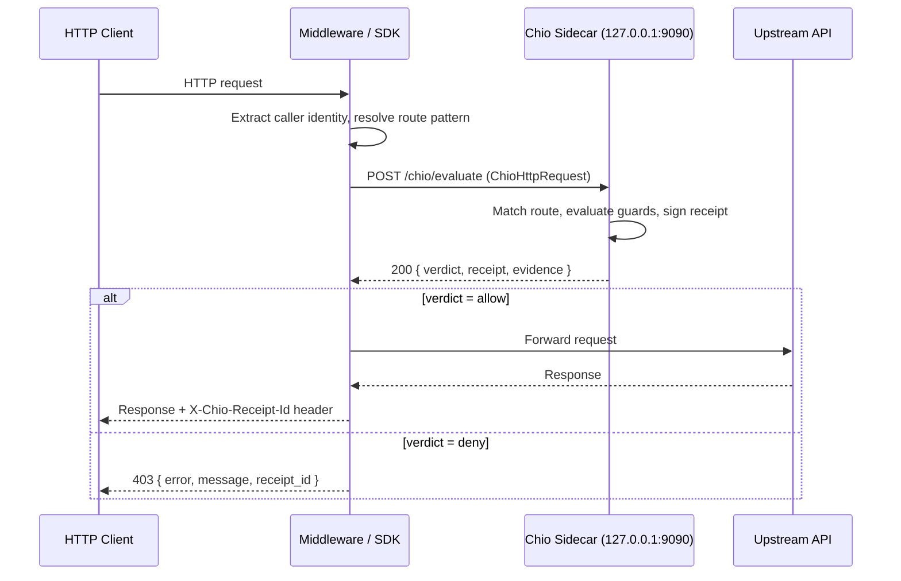
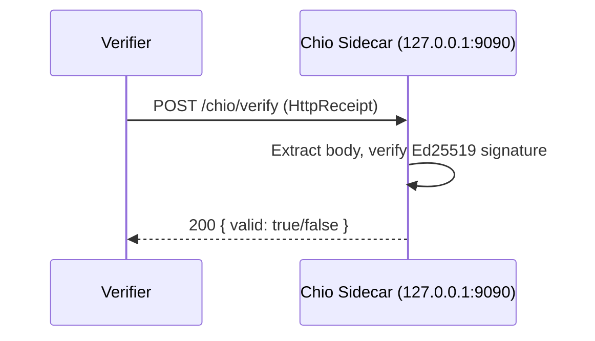

# Chio HTTP Substrate Protocol

**Version:** 1.0
**Date:** 2026-04-14
**Status:** Normative

This document defines the HTTP substrate protocol for Chio. The HTTP substrate
enables Chio to protect arbitrary HTTP APIs by evaluating requests against policy,
signing receipts, and returning structured verdicts. It is the foundation that
all HTTP-layer SDKs, middleware crates, and sidecar deployments consume.

The keywords **MUST**, **SHOULD**, and **MAY** are normative in this document
(per RFC 2119).

---

## 1. Overview

The HTTP substrate introduces a sidecar evaluation model: an Chio kernel runs as
a local process and exposes an HTTP API on localhost. Language-specific middleware
(Express, Actix, Axum, etc.) intercepts incoming HTTP requests, constructs an
`ChioHttpRequest`, sends it to the sidecar, and enforces the returned verdict.

The substrate defines:

- A sidecar evaluation protocol (three HTTP endpoints)
- A typed request model (`ChioHttpRequest`) for policy evaluation
- A typed receipt model (`HttpReceipt`) for signed proof of evaluation
- Supporting types for caller identity, authentication, sessions, and verdicts
- A deterministic mapping from `HttpReceipt` to the core `ChioReceipt` type

## 2. Sidecar Evaluation Protocol

### 2.1 Transport

The sidecar **MUST** listen on `127.0.0.1:9090` by default. Implementations
**MAY** override the sidecar URL via:

1. An explicit configuration value (`sidecarUrl` in SDK config, or equivalent)
2. The `CHIO_SIDECAR_URL` environment variable

If both are set, the explicit configuration value takes precedence. If neither
is set, the default `http://127.0.0.1:9090` **MUST** be used.

All request and response bodies **MUST** use `Content-Type: application/json`.

### 2.2 Endpoints

The sidecar exposes three endpoints:

| Endpoint | Method | Purpose |
| --- | --- | --- |
| `/chio/evaluate` | POST | Evaluate an HTTP request against policy |
| `/chio/verify` | POST | Verify a receipt signature |
| `/chio/health` | GET | Sidecar health check |

### 2.3 POST /chio/evaluate

Evaluates an HTTP request against the loaded policy and returns a signed receipt.

**Request body:** `ChioHttpRequest` (see [Section 3.1](#31-archttprequest))

**Response body:** `EvaluateResponse`

| Field | Type | Required | Description |
| --- | --- | --- | --- |
| `verdict` | `Verdict` | MUST | The evaluation verdict |
| `receipt` | `HttpReceipt` | MUST | Signed receipt proving the evaluation |
| `evidence` | `GuardEvidence[]` | MUST | Per-guard evidence collected during evaluation |

**Status codes:**

- `200 OK`: Evaluation completed (regardless of verdict). The `verdict` field
  indicates whether the request was allowed or denied.
- `400 Bad Request`: The request body is malformed or missing required fields.
- `500 Internal Server Error`: The sidecar encountered an internal error during
  evaluation.

Implementations **MUST** return `200` for both allow and deny verdicts. The
HTTP status code of the sidecar response reflects the health of the evaluation
pipeline, not the policy outcome. The policy outcome is encoded in the `verdict`
field.

### 2.4 POST /chio/verify

Verifies the Ed25519 signature on a previously issued `HttpReceipt`.

**Request body:** `HttpReceipt` (see [Section 4](#4-httpreceipt))

**Response body:**

| Field | Type | Required | Description |
| --- | --- | --- | --- |
| `valid` | `boolean` | MUST | Whether the receipt signature is valid |

**Status codes:**

- `200 OK`: Verification completed. The `valid` field indicates the result.
- `400 Bad Request`: The request body is malformed.

A receipt with a valid signature but an expired timestamp is still `valid: true`
from the verification endpoint's perspective. Temporal validity is the caller's
responsibility.

### 2.5 GET /chio/health

Returns the sidecar's health status.

**Response body:**

| Field | Type | Required | Description |
| --- | --- | --- | --- |
| `status` | `string` | MUST | One of `"healthy"`, `"degraded"`, or `"unhealthy"` |
| `version` | `string` | MUST | Sidecar version string |

**Status codes:**

- `200 OK`: Sidecar is healthy or degraded.
- `503 Service Unavailable`: Sidecar is unhealthy.

### 2.6 Timeout and Failure Behavior

SDKs **MUST** implement a configurable timeout for sidecar calls. The default
timeout **SHOULD** be 5000 milliseconds.

When the sidecar is unreachable or times out, SDKs **MUST** default to
**fail-closed** behavior (deny the request). SDKs **MAY** expose a
configuration option to override this to fail-open, but fail-closed **MUST**
be the default.

### 2.7 Sequence Diagram





## 3. Supporting Types

### 3.1 ChioHttpRequest

The protocol-agnostic HTTP request that Chio evaluates. This is the shared input
type for all HTTP substrate adapters (reverse proxy, framework middleware, and
sidecar alike).

| Field | Type | Required | Default | Description |
| --- | --- | --- | --- | --- |
| `request_id` | `string` | MUST | | Unique request identifier. UUIDv7 recommended. |
| `method` | `HttpMethod` | MUST | | HTTP method of the request |
| `route_pattern` | `string` | MUST | | Matched route pattern (e.g., `"/pets/{petId}"`). Used for policy matching. |
| `path` | `string` | MUST | | Actual request path (e.g., `"/pets/42"`) |
| `query` | `map<string, string>` | MAY | `{}` | Query parameters |
| `headers` | `map<string, string>` | MAY | `{}` | Selected request headers relevant to policy evaluation. Substrate adapters **MUST NOT** include raw auth credential headers. |
| `caller` | `CallerIdentity` | MUST | | Extracted caller identity |
| `body_hash` | `string` or `null` | MAY | `null` | SHA-256 hex hash of the request body. `null` for bodyless requests (GET, HEAD, OPTIONS). |
| `body_length` | `integer` | MAY | `0` | Content-Length of the request body in bytes |
| `session_id` | `string` or `null` | MAY | `null` | Session ID this request belongs to |
| `capability_id` | `string` or `null` | MAY | `null` | Capability token ID presented with this request |
| `timestamp` | `integer` | MUST | | Unix timestamp (seconds) when the request was received |

**Content hash computation:** The content hash that binds a request to its
receipt is computed as the SHA-256 hex digest of the canonical JSON (RFC 8785)
of the following binding object:

```json
{
  "body_hash": "<body_hash or null>",
  "method": "<HTTP method>",
  "path": "<actual path>",
  "query": { "<sorted query params>" },
  "route_pattern": "<route pattern>"
}
```

### 3.2 CallerIdentity

The identity of the caller as extracted from the HTTP request.

| Field | Type | Required | Default | Description |
| --- | --- | --- | --- | --- |
| `subject` | `string` | MUST | | Stable identifier for the caller (e.g., user ID, service account, agent ID) |
| `auth_method` | `AuthMethod` | MUST | | How the caller authenticated |
| `verified` | `boolean` | MUST | `false` | Whether this identity has been cryptographically verified (e.g., JWT signature checked, API key validated) |
| `tenant` | `string` or `null` | MAY | `null` | Tenant or organization the caller belongs to |
| `agent_id` | `string` or `null` | MAY | `null` | Agent identifier when the caller is an AI agent |

**Identity hash:** The `caller_identity_hash` in receipts is the SHA-256 hex
digest of the canonical JSON representation of the full `CallerIdentity` object.
This hash **MUST** be deterministic: the same identity **MUST** always produce
the same hash.

### 3.3 AuthMethod

A tagged union representing how the caller authenticated. The discriminator
field is `method`.

| Variant | Tag value | Fields | Description |
| --- | --- | --- | --- |
| Bearer | `"bearer"` | `token_hash: string` | Bearer token (JWT or opaque). `token_hash` is the SHA-256 hex hash of the raw token value. Implementations **MUST NOT** store or transmit raw tokens. |
| ApiKey | `"api_key"` | `key_name: string`, `key_hash: string` | API key. `key_name` is the header or query parameter name. `key_hash` is the SHA-256 hex hash of the key value. |
| Cookie | `"cookie"` | `cookie_name: string`, `cookie_hash: string` | Session cookie. `cookie_name` is the cookie name. `cookie_hash` is the SHA-256 hex hash of the cookie value. |
| MtlsCertificate | `"mtls_certificate"` | `subject_dn: string`, `fingerprint: string` | mTLS client certificate. `subject_dn` is the Subject DN. `fingerprint` is the SHA-256 fingerprint of the certificate. |
| Anonymous | `"anonymous"` | (none) | No authentication was presented. |

**Serialization:** The `AuthMethod` type uses internally tagged serialization
with `"method"` as the tag key and `snake_case` variant names.

Example (Bearer):

```json
{
  "method": "bearer",
  "token_hash": "a1b2c3d4e5f6..."
}
```

Example (Anonymous):

```json
{
  "method": "anonymous"
}
```

### 3.4 SessionContext

Per-session context carried through the Chio HTTP pipeline. A session groups
related requests from the same caller over a bounded time window.

| Field | Type | Required | Default | Description |
| --- | --- | --- | --- | --- |
| `session_id` | `string` | MUST | | Unique session identifier |
| `caller` | `CallerIdentity` | MUST | | Authenticated caller for this session |
| `created_at` | `integer` | MUST | | Unix timestamp (seconds) when the session was created |
| `expires_at` | `integer` or `null` | MAY | `null` | Unix timestamp (seconds) when the session expires. Guards **MAY** deny requests after this time. |
| `request_count` | `integer` | MAY | `0` | Number of requests evaluated in this session |
| `bytes_read` | `integer` | MAY | `0` | Cumulative bytes read by this session (for data-flow guards) |
| `bytes_written` | `integer` | MAY | `0` | Cumulative bytes written by this session (for data-flow guards) |
| `delegation_depth` | `integer` | MAY | `0` | Current delegation depth. `0` means direct caller. |
| `metadata` | `object` or `null` | MAY | `null` | Extensibility metadata |

### 3.5 Verdict

The verdict for an HTTP request evaluation. Uses internally tagged
serialization with `"verdict"` as the tag key and `snake_case` variant names.

| Variant | Tag value | Fields | Description |
| --- | --- | --- | --- |
| Allow | `"allow"` | (none) | Request is allowed. Proceed to upstream. |
| Deny | `"deny"` | `reason: string`, `guard: string`, `http_status: integer` | Request is denied. `reason` is human-readable. `guard` identifies the guard or policy rule that triggered the denial. `http_status` is the suggested HTTP status code (default `403`). |
| Cancel | `"cancel"` | `reason: string` | Evaluation was cancelled (e.g., timeout, circuit breaker). |
| Incomplete | `"incomplete"` | `reason: string` | Evaluation did not reach a terminal state. |

**Fail-closed semantics:** When the verdict is `cancel` or `incomplete`,
middleware **MUST** treat the request as denied. Only an explicit `allow`
verdict permits forwarding to the upstream API.

**Default deny status:** When deserializing a `deny` verdict without an
explicit `http_status` field, implementations **MUST** default to `403`.

Example (Allow):

```json
{ "verdict": "allow" }
```

Example (Deny):

```json
{
  "verdict": "deny",
  "reason": "side-effect route requires a capability token",
  "guard": "CapabilityGuard",
  "http_status": 403
}
```

### 3.6 HttpMethod

An enumeration of HTTP methods supported by the Chio HTTP substrate.
Serialized as uppercase strings.

| Value | Safe | Requires Capability |
| --- | --- | --- |
| `"GET"` | Yes | No |
| `"HEAD"` | Yes | No |
| `"OPTIONS"` | Yes | No |
| `"POST"` | No | Yes |
| `"PUT"` | No | Yes |
| `"PATCH"` | No | Yes |
| `"DELETE"` | No | Yes |

**Safe methods** (GET, HEAD, OPTIONS) are considered side-effect-free by
default and receive session-scoped allow verdicts. **Unsafe methods**
(POST, PUT, PATCH, DELETE) require an explicit capability grant.

### 3.7 GuardEvidence

Evidence from a single guard's evaluation during the request pipeline.

| Field | Type | Required | Description |
| --- | --- | --- | --- |
| `guard_name` | `string` | MUST | Name of the guard (e.g., `"CapabilityGuard"`, `"PolicyGuard"`) |
| `verdict` | `boolean` | MUST | Whether the guard passed (`true`) or denied (`false`) |
| `details` | `string` or `null` | MAY | Human-readable details about the guard's decision |

## 4. HttpReceipt

A signed receipt proving that an HTTP request was evaluated by the Chio kernel.
The receipt binds the request identity, route, method, verdict, and guard
evidence under an Ed25519 signature from the kernel.

### 4.1 Fields

| Field | Type | Required | Default | Signed | Description |
| --- | --- | --- | --- | --- | --- |
| `id` | `string` | MUST | | Yes | Unique receipt ID. UUIDv7 recommended. |
| `request_id` | `string` | MUST | | Yes | Unique request ID this receipt covers |
| `route_pattern` | `string` | MUST | | Yes | Matched route pattern (e.g., `"/pets/{petId}"`) |
| `method` | `HttpMethod` | MUST | | Yes | HTTP method of the evaluated request |
| `caller_identity_hash` | `string` | MUST | | Yes | SHA-256 hex hash of the caller identity |
| `session_id` | `string` or `null` | MAY | `null` | Yes | Session ID the request belonged to |
| `verdict` | `Verdict` | MUST | | Yes | The kernel's verdict |
| `evidence` | `GuardEvidence[]` | MAY | `[]` | Yes | Per-guard evidence collected during evaluation |
| `response_status` | `integer` | MUST | | Yes | HTTP status Chio associated with the evaluation outcome at receipt-signing time. For deny receipts this is the concrete Chio error status; for allow receipts produced before proxy or app execution completes, it is evaluation-time status metadata rather than guaranteed downstream response evidence. |
| `timestamp` | `integer` | MUST | | Yes | Unix timestamp (seconds) when the receipt was created |
| `content_hash` | `string` | MUST | | Yes | SHA-256 hex hash binding the request content to this receipt |
| `policy_hash` | `string` | MUST | | Yes | SHA-256 hex hash of the policy that was applied |
| `capability_id` | `string` or `null` | MAY | `null` | Yes | Capability ID that was exercised, if any |
| `metadata` | `object` or `null` | MAY | `null` | Yes | Extensibility metadata |
| `kernel_key` | `string` | MUST | | Yes | Kernel's Ed25519 public key (64-character hex) |
| `signature` | `string` | MUST | | No | Ed25519 signature over canonical JSON of the body fields (128-character hex) |

### 4.2 Signing

To produce a signed receipt:

1. Construct an `HttpReceiptBody` containing all fields from the table above
   **except** `signature`.
2. Serialize the body to canonical JSON (RFC 8785).
3. Sign the canonical bytes with the kernel's Ed25519 private key.
4. Attach the resulting signature to the receipt.

### 4.3 Verification

To verify a receipt:

1. Extract the body (all fields except `signature`).
2. Serialize the body to canonical JSON (RFC 8785).
3. Verify the `signature` against the canonical bytes using the `kernel_key`
   embedded in the receipt.

Implementations **SHOULD** verify the receipt signature before treating
receipt content as authoritative.

### 4.4 Cryptographic Representations

- `kernel_key`: Ed25519 public key serialized as a 64-character lowercase hex
  string (32 bytes). Pattern: `^[0-9a-f]{64}$`.
- `signature`: Ed25519 signature serialized as a 128-character lowercase hex
  string (64 bytes). Pattern: `^[0-9a-f]{128}$`.

## 5. HttpReceipt to ChioReceipt Mapping

The `to_chio_receipt()` conversion maps an HTTP-layer receipt into the core
`ChioReceipt` type for unified storage and cross-surface querying.

### 5.1 Field Mapping

| HttpReceipt field | ChioReceipt field | Transformation |
| --- | --- | --- |
| `id` | `id` | Copied directly |
| `timestamp` | `timestamp` | Copied directly |
| `capability_id` | `capability_id` | Unwrapped; defaults to empty string if `null` |
| (constant) | `tool_server` | Set to `"http"` |
| `method` + `route_pattern` | `tool_name` | Formatted as `"{method} {route_pattern}"` (e.g., `"GET /pets/{petId}"`) |
| `method`, `route_pattern`, `request_id` | `action.parameters` | JSON object: `{ "method": "<method>", "route": "<route_pattern>", "request_id": "<request_id>" }` |
| `content_hash` | `action.parameter_hash` | Copied directly |
| `verdict` | `decision` | Converted via `Verdict.to_decision()` (see below) |
| `content_hash` | `content_hash` | Recomputed as SHA-256 of canonical JSON of `ChioReceiptBody` |
| `policy_hash` | `policy_hash` | Copied directly |
| `evidence` | `evidence` | Copied directly (same `GuardEvidence` type) |
| `metadata` | `metadata` | Copied directly |
| `kernel_key` | `kernel_key` | Copied directly |
| `signature` | `signature` | Copied directly (see limitation below) |

### 5.2 Verdict to Decision Mapping

| Verdict variant | Decision variant |
| --- | --- |
| `allow` | `allow` |
| `deny { reason, guard, http_status }` | `deny { reason, guard }` (http_status is dropped) |
| `cancel { reason }` | `cancelled { reason }` |
| `incomplete { reason }` | `incomplete { reason }` |

### 5.3 Signature Limitation

**Important:** The `signature` field is copied directly from the `HttpReceipt`
to the `ChioReceipt`. It is **not** re-signed over the `ChioReceiptBody`. This
means the `ChioReceipt.signature` was computed over the `HttpReceiptBody`
canonical JSON, not the `ChioReceiptBody` canonical JSON.

Consumers that verify `ChioReceipt` signatures from HTTP-origin receipts
**MUST** be aware that standard `ChioReceipt` signature verification will fail
for these converted receipts. The intended use is unified storage and querying,
not independent cryptographic verification of the converted form.

In production deployments, the kernel **SHOULD** sign both `HttpReceipt` and
`ChioReceipt` independently from the same evaluation, rather than relying on
the conversion method.

## 6. Default Policy Semantics

The HTTP substrate defines default policy behavior based on HTTP method safety:

- **Safe methods** (GET, HEAD, OPTIONS): Session-scoped allow. These methods
  are considered side-effect-free and are permitted without an explicit
  capability token.
- **Unsafe methods** (POST, PUT, PATCH, DELETE): Deny by default. These methods
  require an explicit capability token presented in the `X-Chio-Capability`
  request header or via `capability_id` in the `ChioHttpRequest`.

When a route is not matched in the loaded policy, the evaluator **MUST** fall
back to method-based default policy.

## 7. Error Handling

### 7.1 Sidecar Error Codes

SDKs **MUST** use the following error codes when communicating sidecar failures
to callers:

| Code | Meaning |
| --- | --- |
| `chio_access_denied` | The request was denied by policy |
| `chio_sidecar_unreachable` | The sidecar process is not reachable |
| `chio_evaluation_failed` | The sidecar returned a non-200 status |
| `chio_invalid_receipt` | Receipt verification failed |
| `chio_timeout` | The sidecar did not respond within the timeout |

### 7.2 Structured Error Response

When middleware denies a request, the response body **SHOULD** be a structured
JSON object:

| Field | Type | Required | Description |
| --- | --- | --- | --- |
| `error` | `string` | MUST | Error code from the table above |
| `message` | `string` | MUST | Human-readable error message |
| `receipt_id` | `string` or `null` | MAY | Receipt ID for the denied evaluation |
| `suggestion` | `string` or `null` | MAY | Actionable suggestion for the caller |

## 8. Schemas and Conformance

Versioned HTTP substrate schemas live under:

- `spec/schemas/chio-http/v1/`

Normative requirements:

- Schema files in that directory are the machine-readable contract for the
  HTTP substrate types.
- Implementations **MUST** serialize all HTTP substrate types in a form
  accepted by those schemas.
- Schema validation **SHOULD** be exercised against live Rust serialization,
  not handwritten examples alone.

The schema files are:

| File | Described type |
| --- | --- |
| `http-receipt.schema.json` | `HttpReceipt` |
| `chio-http-request.schema.json` | `ChioHttpRequest` |
| `caller-identity.schema.json` | `CallerIdentity` with `AuthMethod` |
| `verdict.schema.json` | `Verdict` |
| `evaluate-request.schema.json` | POST `/chio/evaluate` request body (alias for `ChioHttpRequest`) |
| `evaluate-response.schema.json` | POST `/chio/evaluate` response body (`EvaluateResponse`) |
