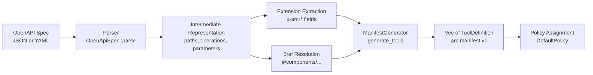

# ARC OpenAPI Integration

**Version:** 1.0  
**Date:** 2026-04-14  
**Status:** Normative

This document specifies how ARC ingests OpenAPI specifications and enforces
capability-based access control over HTTP APIs. It covers the OpenAPI-to-manifest
pipeline (`arc-openapi`), the `x-arc-*` extension vocabulary, the default
deny-by-method policy, and the `arc api protect` reverse proxy contract.

The keywords **MUST**, **SHOULD**, and **MAY** are normative in this document.

---

## 1. OpenAPI to ARC Manifest Pipeline (SPEC-06)

### 1.1 Scope

The `arc-openapi` crate parses OpenAPI specifications and produces ARC
`ToolDefinition` values conforming to `arc.manifest.v1` (see
[PROTOCOL.md Section 7](PROTOCOL.md#7-manifest-contract)). Each HTTP operation
(method + path pair) in the OpenAPI spec becomes one `ToolDefinition`.

### 1.2 Supported OpenAPI Versions

The parser **MUST** accept specifications declaring version `3.0.x` or `3.1.x`
in the top-level `openapi` field. The value **MUST** begin with `3.`.

The parser **MUST** reject specifications with any other version prefix with an
`UnsupportedVersion` error. In particular, OpenAPI 2.0 (Swagger) specifications
are not supported.

### 1.3 Supported Formats

The parser **MUST** accept both JSON and YAML input formats. Format detection
is automatic:

- If the input, after leading whitespace is trimmed, begins with `{`, the parser
  treats the input as JSON.
- Otherwise, the parser treats the input as YAML.

No explicit format flag is required from the caller.

### 1.4 Required Fields

The parser **MUST** require the following top-level fields:

| Field | Error if absent |
| --- | --- |
| `openapi` | `MissingField("openapi")` |
| `info` | `MissingField("info")` |
| `paths` | `MissingField("paths")` |

When `info.title` is absent, the parser **MUST** default to `"Untitled API"`.
When `info.version` is absent, the parser **MUST** default to `"0.0.0"`.

### 1.5 Route Extraction

For each entry in the `paths` object, the parser **MUST** extract operations for
the following HTTP methods, in this order: `GET`, `POST`, `PUT`, `PATCH`,
`DELETE`, `HEAD`, `OPTIONS`. The parser **MUST** ignore any unrecognized method
keys.

For each operation, the parser extracts:

| Field | Source | Required |
| --- | --- | --- |
| `operationId` | `operationId` field | No |
| `summary` | `summary` field | No |
| `description` | `description` field | No |
| `tags` | `tags` array | No |
| `parameters` | Operation-level `parameters` array, merged with path-level `parameters` | No |
| `request_body_schema` | `requestBody.content.application/json.schema`, falling back to first content type | No |
| `response_schemas` | Each entry in `responses`, with schema from `content.application/json.schema` | No |

### 1.6 Parameter Extraction

Each parameter **MUST** have a `name` field and an `in` field. The `in` field
**MUST** be one of `path`, `query`, `header`, or `cookie`. Unknown values
default to `query`.

Path parameters (`in: "path"`) are always treated as required, regardless of the
`required` field value. For other parameter locations, if `required` is absent,
the parser defaults to `false`.

Header and cookie parameters are parsed but **MUST NOT** appear in the generated
`ToolDefinition` input schema. Only path and query parameters are promoted to
tool input properties.

### 1.7 Parameter Merging

Path-level parameters and operation-level parameters **MUST** be merged before
tool generation. If an operation-level parameter has the same `name` and
`location` as a path-level parameter, the operation-level parameter **MUST**
override the path-level parameter.

### 1.8 Request Body Schema

When a `requestBody` is present, the parser **MUST** look for a
`content["application/json"].schema` entry first. If that content type is absent,
the parser **MUST** fall back to the first available content type. If the schema
is a `$ref`, the parser resolves it before returning.

### 1.9 Response Schema Selection

The output schema for a `ToolDefinition` is derived from response schemas. The
parser **MUST** prefer the `200` response, then `201`, then any `2xx` response
that includes a schema. If no successful response includes a schema, the
output schema is `None`.

### 1.10 `$ref` Resolution

The parser **MUST** resolve JSON Reference (`$ref`) pointers that begin with
`#/`. This covers the `#/components/schemas`, `#/components/parameters`, and
other `#/components/` namespaces.

The parser **MUST** reject:

- External references (URIs not beginning with `#/`) with an `UnresolvedRef`
  error.
- Internal references that point to nonexistent paths within the document with
  an `UnresolvedRef` error.

### 1.11 ToolDefinition Derivation

Each operation produces one `ToolDefinition` with the following field mapping:

| ToolDefinition field | Source |
| --- | --- |
| `name` | `operationId` if present; otherwise `"{METHOD} {path}"` |
| `description` | `summary` if present, else `description`, else `"{METHOD} {path}"` |
| `input_schema` | JSON Schema object built from path + query parameters as properties, plus `body` property from request body schema |
| `output_schema` | Selected 2xx response schema per Section 1.9 |
| `annotations.read_only` | `true` if the operation has no side effects (see Section 3) |
| `annotations.destructive` | `true` if method is `DELETE` |
| `annotations.idempotent` | `true` if method is `GET`, `PUT`, or `DELETE` |
| `annotations.requires_approval` | Value of `x-arc-approval-required` extension, defaulting to `false` |
| `pricing` | `None` (reserved for future use) |

The `input_schema` **MUST** be a JSON Schema object with `type: "object"`. Path
and query parameters become top-level properties. If a parameter has no explicit
schema, the generator defaults to `{ "type": "string" }`. Required parameters
appear in the `required` array. If a request body schema is present, it appears
as a required property named `"body"`.

### 1.12 Pipeline Diagram



### 1.13 Configuration

The `ManifestGenerator` accepts a `GeneratorConfig` with the following options:

| Option | Type | Default | Effect |
| --- | --- | --- | --- |
| `server_id` | `String` | `"openapi-server"` | Identifier for the generated manifest body |
| `include_output_schemas` | `bool` | `true` | Whether to derive output schemas from response definitions |
| `respect_publish_flag` | `bool` | `true` | Whether to honor `x-arc-publish: false` (see Section 2.5) |

---

## 2. `x-arc-*` Extension Vocabulary (SPEC-07)

ARC defines five vendor extension fields for OpenAPI operation objects. These
fields provide per-route policy hints that the manifest generator and the
`arc api protect` proxy consume.

All `x-arc-*` fields are optional. If absent, the system uses default behavior
as specified below.

### 2.1 `x-arc-sensitivity`

| Property | Value |
| --- | --- |
| Key | `x-arc-sensitivity` |
| Type | `string` |
| Allowed values | `public`, `internal`, `sensitive`, `restricted` |
| Default | `internal` (when not specified) |
| Effect | Metadata classification for the route. Consumed by the guard pipeline for logging level and audit granularity. Does not change policy directly. |

Sensitivity levels:

| Level | Meaning |
| --- | --- |
| `public` | Publicly available data, no special handling |
| `internal` | Internal data, logged but not restricted beyond defaults |
| `sensitive` | Sensitive data, may trigger additional approval in the guard pipeline |
| `restricted` | Highly restricted data, always flagged for elevated scrutiny |

If the value does not match one of the four allowed strings, the parser **MUST**
ignore it (treat as absent).

### 2.2 `x-arc-side-effects`

| Property | Value |
| --- | --- |
| Key | `x-arc-side-effects` |
| Type | `boolean` |
| Default | Determined by HTTP method (see Section 3) |
| Effect | Overrides the method-based side-effect default. `true` forces the operation to deny-by-default. `false` forces session-scoped allow. |

This extension enables two critical overrides:

- A `GET` endpoint that mutates state (e.g., `GET /admin/reset-cache`) can be
  annotated with `x-arc-side-effects: true` to require a capability token.
- A `POST` endpoint that is purely a query (e.g., `POST /search`) can be
  annotated with `x-arc-side-effects: false` to permit session-scoped access.

### 2.3 `x-arc-approval-required`

| Property | Value |
| --- | --- |
| Key | `x-arc-approval-required` |
| Type | `boolean` |
| Default | `false` |
| Effect | When `true`, forces deny-by-default regardless of HTTP method or `x-arc-side-effects` value. Sets `annotations.requires_approval` in the generated `ToolDefinition`. |

`x-arc-approval-required: true` **MUST** take precedence over all other policy
inputs. Even if `x-arc-side-effects` is `false` and the method is `GET`, the
operation is deny-by-default when approval is required.

### 2.4 `x-arc-budget-limit`

| Property | Value |
| --- | --- |
| Key | `x-arc-budget-limit` |
| Type | `integer` (unsigned, 64-bit) |
| Default | None (no limit) |
| Effect | Per-invocation cost cap in minor currency units. Consumed by the budget guard when evaluating whether the caller's remaining budget permits the call. |

### 2.5 `x-arc-publish`

| Property | Value |
| --- | --- |
| Key | `x-arc-publish` |
| Type | `boolean` |
| Default | `true` |
| Effect | Controls whether the operation appears in the generated ARC manifest. When `false`, the operation is excluded from the `Vec<ToolDefinition>` output. |

This extension is useful for internal or health-check endpoints that should
remain accessible through the proxy but should not be advertised as agent tools.

When `GeneratorConfig::respect_publish_flag` is `false`, this extension is
ignored and all operations are included.

### 2.6 Extension Precedence Summary

The following table summarizes how extensions interact with the default
deny-by-method policy:

| Method | `x-arc-side-effects` | `x-arc-approval-required` | Resulting Policy |
| --- | --- | --- | --- |
| GET | absent | absent | SessionAllow |
| GET | absent | `true` | DenyByDefault |
| GET | `true` | absent | DenyByDefault |
| GET | `false` | `true` | DenyByDefault |
| POST | absent | absent | DenyByDefault |
| POST | `false` | absent | SessionAllow |
| POST | `false` | `true` | DenyByDefault |
| POST | absent | `true` | DenyByDefault |

---

## 3. Default Deny-by-Method Policy (SPEC-08)

### 3.1 Method Classification

HTTP methods are classified into two categories for default policy assignment:

| Category | Methods | Default Policy |
| --- | --- | --- |
| Safe (read-only) | `GET`, `HEAD`, `OPTIONS` | SessionAllow |
| Side-effect (mutating) | `POST`, `PUT`, `PATCH`, `DELETE` | DenyByDefault |

### 3.2 SessionAllow

Operations classified as SessionAllow are permitted by default within an active
session. No capability token is required. The proxy **MUST** still generate a
signed `HttpReceipt` for every SessionAllow request (audit receipt).

### 3.3 DenyByDefault

Operations classified as DenyByDefault require the caller to present a valid
capability token. Without a token, the proxy **MUST** return a structured 403
response (see Section 4.4).

The caller presents a capability token via the `X-Arc-Capability` HTTP header
or the `arc_capability` query parameter. When a valid token is present, the
request proceeds to the upstream.

### 3.4 Extension Overrides

The `x-arc-side-effects` and `x-arc-approval-required` extensions override
the method-based default as follows:

1. If `x-arc-approval-required` is `true`, the result is **always**
   DenyByDefault. This check takes highest precedence.
2. If `x-arc-side-effects` is explicitly set, it overrides the method default:
   `true` forces DenyByDefault, `false` forces SessionAllow.
3. If neither extension is set, the method classification from Section 3.1
   applies.

### 3.5 Fallback for Unmatched Routes

If a request path does not match any route in the loaded OpenAPI spec, the proxy
**MUST** fall back to method-based default policy. Safe methods receive
SessionAllow; side-effect methods receive DenyByDefault.

---

## 4. `arc api protect` Contract (SPEC-09)

### 4.1 Purpose

`arc api protect` is a zero-code reverse proxy that interposes ARC's
capability-based access control between callers and an existing HTTP API. It
requires no code changes to the upstream API.

### 4.2 Command Interface

```text
arc api protect --upstream <URL> [--spec <path>] [--listen <addr>]
```

| Flag | Required | Default | Description |
| --- | --- | --- | --- |
| `--upstream` | Yes | -- | Base URL of the upstream API to proxy to |
| `--spec` | No | Auto-discover | Path to a local OpenAPI spec file (JSON or YAML) |
| `--listen` | No | `127.0.0.1:9090` | Address and port for the proxy to bind |

### 4.3 Spec Auto-Discovery

When `--spec` is not provided, the proxy **MUST** attempt to auto-discover the
OpenAPI specification from the upstream server. The proxy probes the following
well-known paths in order:

| Priority | Path |
| --- | --- |
| 1 | `/openapi.json` |
| 2 | `/openapi.yaml` |
| 3 | `/swagger.json` |
| 4 | `/api-docs` |

For each path, the proxy issues an HTTP `GET` request to
`{upstream}{path}`. The first response that returns a successful HTTP status
(2xx) with a non-empty body is used as the spec.

If none of the probes succeed, the proxy **MUST** fail with a `SpecLoad` error
directing the operator to use `--spec`.

### 4.4 Structured 403 Response

When a request is denied (DenyByDefault policy without a valid capability token),
the proxy **MUST** return an HTTP 403 response with a JSON body conforming to
this schema:

```json
{
  "error": "arc_access_denied",
  "message": "<human-readable denial reason>",
  "receipt_id": "<receipt ID for the denial>",
  "suggestion": "provide a valid capability token in the X-Arc-Capability header or arc_capability query parameter"
}
```

| Field | Type | Description |
| --- | --- | --- |
| `error` | `string` | Always `"arc_access_denied"` |
| `message` | `string` | Reason for denial from the guard evaluation |
| `receipt_id` | `string` | ID of the signed receipt that records this denial |
| `suggestion` | `string` | Actionable guidance for the caller |

The `Content-Type` header on the 403 response **MUST** be `application/json`.

### 4.5 Receipt Generation

The proxy **MUST** generate a signed `HttpReceipt` for every request, regardless
of whether the request is allowed or denied. The receipt records:

| Receipt Field | Source |
| --- | --- |
| `id` | Unique receipt ID (UUIDv7) |
| `request_id` | Unique request ID (UUIDv7) |
| `route_pattern` | Matched OpenAPI path pattern (e.g., `/pets/{petId}`) |
| `method` | HTTP method |
| `caller_identity_hash` | SHA-256 hash of the caller identity |
| `verdict` | `Allow` or `Deny` with reason and guard name |
| `evidence` | Guard evaluation evidence chain |
| `response_status` | ARC evaluation-time HTTP status (`403` for denied; typically `200` for allowed sidecar/proxy evaluations before the upstream response exists) |
| `timestamp` | Unix timestamp of the request |
| `content_hash` | Hash of the request content |
| `policy_hash` | SHA-256 hash of the loaded OpenAPI spec |
| `kernel_key` | Public key of the proxy's ephemeral keypair |

The receipt **MUST** be signed using the proxy's ephemeral keypair, which is
generated at startup. The receipt signature **MUST** be verifiable using the
`kernel_key` field embedded in the receipt.

### 4.6 Receipt Header

For proxied responses (allowed requests forwarded to upstream), the proxy
**MUST** include an `X-Arc-Receipt-Id` header in the response. The value is the
receipt ID of the signed receipt generated for that request.

For denied requests (403 responses), the receipt ID appears in the JSON response
body as `receipt_id`. The proxy is not required to add the `X-Arc-Receipt-Id`
header on 403 responses.

### 4.7 Caller Identity Extraction

The proxy extracts caller identity from request headers using the following
precedence:

| Priority | Header | Identity Format |
| --- | --- | --- |
| 1 | `Authorization: Bearer <token>` | `bearer:<truncated-sha256>` |
| 2 | `X-Api-Key` / `X-API-Key` / `x-api-key` | `apikey:<truncated-sha256>` |
| 3 | (none) | `anonymous` |

Credential values are never stored in receipts. Only SHA-256 hashes of tokens
and API keys are retained.

### 4.8 Request Forwarding

When a request is allowed, the proxy forwards it to the upstream URL constructed
as `{upstream}/{path}`. The proxy forwards the following headers from the
original request:

- `Content-Type`
- `Accept`
- `User-Agent`

The request body is forwarded verbatim. The maximum permitted body size is
10 MiB. The proxy **MUST** reject requests with bodies exceeding this limit.

### 4.9 Upstream Error Handling

If the upstream returns an error or the connection fails, the proxy **MUST**
return HTTP 502 (Bad Gateway). The receipt for that request records the original
allow verdict; the upstream failure does not change the access-control decision.

### 4.10 Startup Behavior

On startup, the proxy:

1. Loads the OpenAPI spec (from `--spec` or via auto-discovery).
2. Parses the spec using `arc-openapi`.
3. Builds a route table mapping (method, path pattern) to policy decisions.
4. Generates an ephemeral signing keypair.
5. Computes the SHA-256 hash of the spec content for use as `policy_hash` in
   receipts.
6. Binds to the `--listen` address and begins accepting requests.

The proxy logs the number of routes loaded and the upstream URL at startup.

---

## 5. Example: PetStore Spec to Generated Manifest

### 5.1 Input: PetStore OpenAPI Spec

```yaml
openapi: "3.0.3"
info:
  title: Petstore
  description: A sample API for pets
  version: "1.0.0"
paths:
  /pets:
    get:
      operationId: listPets
      summary: List all pets
      parameters:
        - name: limit
          in: query
          required: false
          schema:
            type: integer
            format: int32
          description: How many items to return
      responses:
        "200":
          description: A list of pets
          content:
            application/json:
              schema:
                type: array
                items:
                  $ref: "#/components/schemas/Pet"
    post:
      operationId: createPet
      summary: Create a pet
      x-arc-sensitivity: internal
      requestBody:
        required: true
        content:
          application/json:
            schema:
              type: object
              properties:
                name:
                  type: string
                tag:
                  type: string
              required:
                - name
      responses:
        "201":
          description: Pet created
  /pets/{petId}:
    get:
      operationId: showPetById
      summary: Info for a specific pet
      parameters:
        - name: petId
          in: path
          required: true
          schema:
            type: string
          description: The id of the pet to retrieve
      responses:
        "200":
          description: Expected response to a valid request
          content:
            application/json:
              schema:
                $ref: "#/components/schemas/Pet"
    delete:
      operationId: deletePet
      summary: Delete a pet
      x-arc-approval-required: true
      parameters:
        - name: petId
          in: path
          required: true
          schema:
            type: string
      responses:
        "204":
          description: Pet deleted
components:
  schemas:
    Pet:
      type: object
      properties:
        id:
          type: integer
          format: int64
        name:
          type: string
        tag:
          type: string
      required:
        - id
        - name
```

### 5.2 Output: Generated ToolDefinitions

The pipeline produces four `ToolDefinition` values:

**Tool 1: `listPets`**

| Field | Value |
| --- | --- |
| `name` | `listPets` |
| `description` | `List all pets` |
| `annotations.read_only` | `true` |
| `annotations.destructive` | `false` |
| `annotations.idempotent` | `true` |
| `annotations.requires_approval` | `false` |
| Policy | SessionAllow |

Input schema:
```json
{
  "type": "object",
  "properties": {
    "limit": {
      "type": "integer",
      "format": "int32",
      "description": "How many items to return"
    }
  }
}
```

Output schema:
```json
{
  "type": "array",
  "items": {
    "type": "object",
    "properties": {
      "id": { "type": "integer", "format": "int64" },
      "name": { "type": "string" },
      "tag": { "type": "string" }
    },
    "required": ["id", "name"]
  }
}
```

**Tool 2: `createPet`**

| Field | Value |
| --- | --- |
| `name` | `createPet` |
| `description` | `Create a pet` |
| `annotations.read_only` | `false` |
| `annotations.destructive` | `false` |
| `annotations.idempotent` | `false` |
| `annotations.requires_approval` | `false` |
| Policy | DenyByDefault |

Input schema:
```json
{
  "type": "object",
  "properties": {
    "body": {
      "type": "object",
      "properties": {
        "name": { "type": "string" },
        "tag": { "type": "string" }
      },
      "required": ["name"]
    }
  },
  "required": ["body"]
}
```

**Tool 3: `showPetById`**

| Field | Value |
| --- | --- |
| `name` | `showPetById` |
| `description` | `Info for a specific pet` |
| `annotations.read_only` | `true` |
| `annotations.destructive` | `false` |
| `annotations.idempotent` | `true` |
| `annotations.requires_approval` | `false` |
| Policy | SessionAllow |

Input schema:
```json
{
  "type": "object",
  "properties": {
    "petId": {
      "type": "string",
      "description": "The id of the pet to retrieve"
    }
  },
  "required": ["petId"]
}
```

Output schema:
```json
{
  "type": "object",
  "properties": {
    "id": { "type": "integer", "format": "int64" },
    "name": { "type": "string" },
    "tag": { "type": "string" }
  },
  "required": ["id", "name"]
}
```

**Tool 4: `deletePet`**

| Field | Value |
| --- | --- |
| `name` | `deletePet` |
| `description` | `Delete a pet` |
| `annotations.read_only` | `false` |
| `annotations.destructive` | `true` |
| `annotations.idempotent` | `true` |
| `annotations.requires_approval` | `true` |
| Policy | DenyByDefault |

Input schema:
```json
{
  "type": "object",
  "properties": {
    "petId": { "type": "string" }
  },
  "required": ["petId"]
}
```

### 5.3 Policy Summary for PetStore

| Operation | Method | Policy | Reason |
| --- | --- | --- | --- |
| `listPets` | GET | SessionAllow | Safe method, no overrides |
| `createPet` | POST | DenyByDefault | Side-effect method |
| `showPetById` | GET | SessionAllow | Safe method, no overrides |
| `deletePet` | DELETE | DenyByDefault | Side-effect method + `x-arc-approval-required: true` |

---

## 6. Error Catalog

The `arc-openapi` crate defines the following error conditions:

| Error | Condition |
| --- | --- |
| `InvalidJson` | Input detected as JSON but failed to parse |
| `InvalidYaml` | Input detected as YAML but failed to parse |
| `MissingField` | A required top-level field (`openapi`, `info`, or `paths`) is absent |
| `UnsupportedVersion` | The `openapi` version does not begin with `3.` |
| `UnresolvedRef` | A `$ref` pointer could not be resolved (external URI or nonexistent internal path) |

The `arc-api-protect` crate defines the following additional error conditions:

| Error | Condition |
| --- | --- |
| `SpecLoad` | The OpenAPI spec file cannot be read or auto-discovery failed |
| `SpecParse` | The loaded spec failed OpenAPI parsing (wraps `arc-openapi` errors) |
| `Config` | Configuration error (e.g., cannot bind listen address) |
| `ReceiptSign` | Receipt signing or content hashing failed |
| `Io` | IO error during server operation |
| `HttpClient` | HTTP client error during upstream communication |

---

## 7. Implementation References

| Component | Crate | Entry Point |
| --- | --- | --- |
| OpenAPI parser | `arc-openapi` | `crates/arc-openapi/src/parser.rs` |
| Manifest generator | `arc-openapi` | `crates/arc-openapi/src/generator.rs` |
| Extension vocabulary | `arc-openapi` | `crates/arc-openapi/src/extensions.rs` |
| Default policy | `arc-openapi` | `crates/arc-openapi/src/policy.rs` |
| Reverse proxy | `arc-api-protect` | `crates/arc-api-protect/src/proxy.rs` |
| Request evaluator | `arc-api-protect` | `crates/arc-api-protect/src/evaluator.rs` |
| Spec discovery | `arc-api-protect` | `crates/arc-api-protect/src/spec_discovery.rs` |
| Convenience function | `arc-openapi` | `arc_openapi::tools_from_spec()` |
