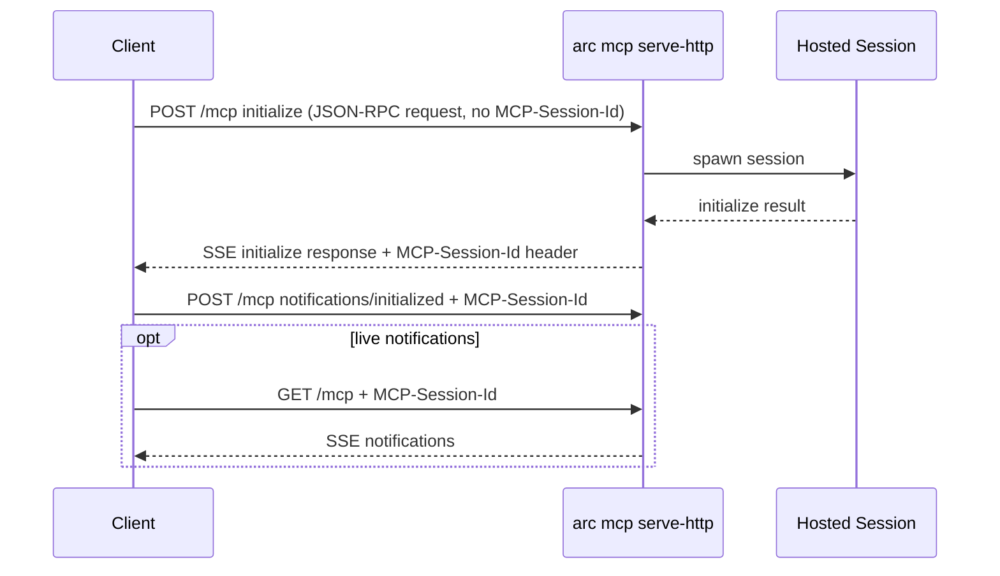
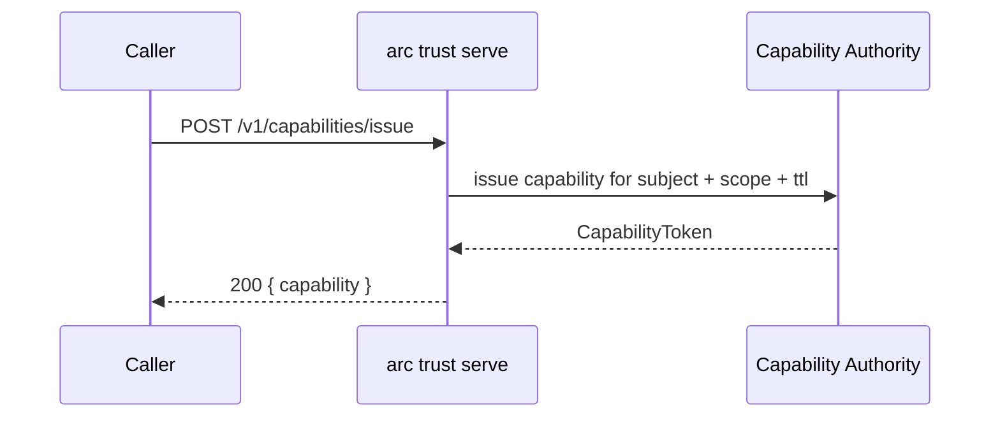
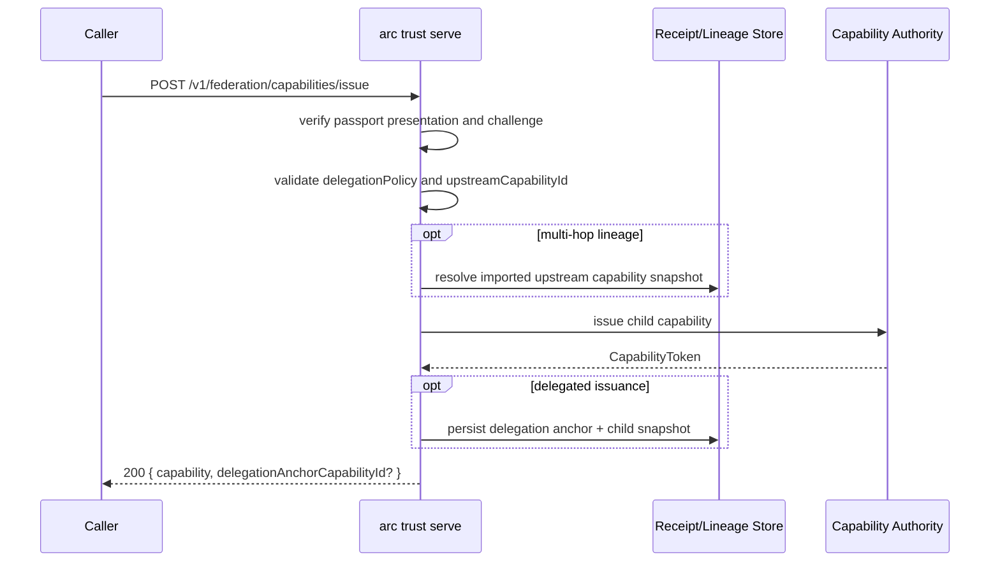
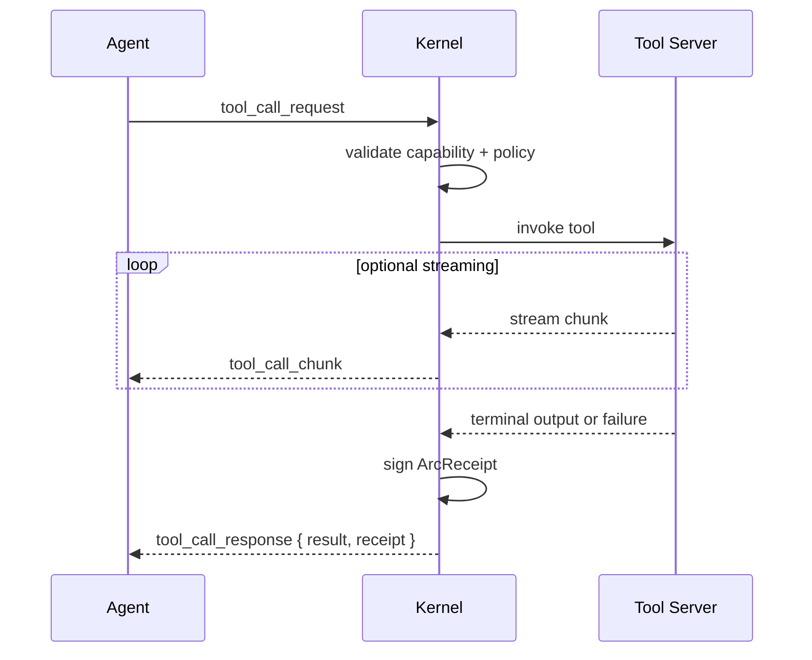
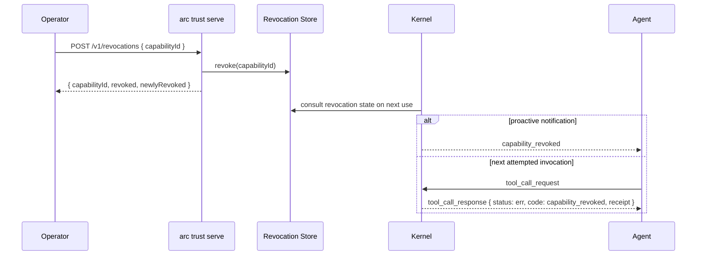
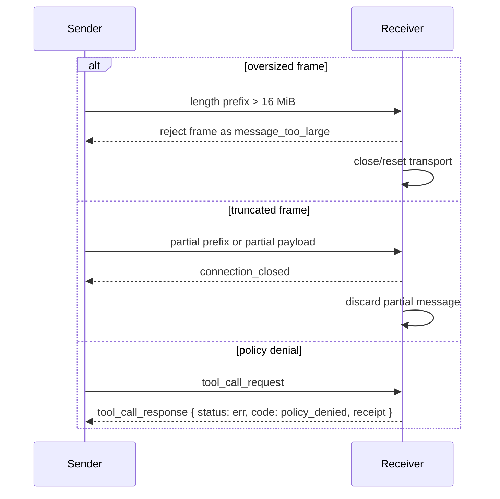

# ARC Wire Protocol

**Version:** 1.0  
**Date:** 2026-04-13  
**Status:** Normative shipped surface

This document defines the shipped ARC wire protocol tightly enough for an
independent implementation. It is narrower than [PROTOCOL.md](PROTOCOL.md),
which remains the repository-wide profile.

## 1. Surface Model

ARC ships three cooperating protocol surfaces:

| Surface | Transport | Purpose |
| --- | --- | --- |
| Native ARC transport | Length-prefixed canonical JSON | Direct agent-to-kernel messaging |
| Hosted MCP edge | JSON-RPC over HTTP POST plus SSE | Remote session admission and MCP-compatible runtime traffic |
| Trust-control lifecycle APIs | JSON over HTTP | Capability issuance, delegated issuance, receipt lookup, and revocation |

The native ARC transport does **not** define a session-initialization message.
Initialization in the shipped stack happens on the hosted MCP surface. Native
direct peers are expected to obtain capability material out of band and then
begin sending `AgentMessage` frames immediately.

The keywords **MUST**, **SHOULD**, and **MAY** are normative in this document.

## 2. Native ARC Transport

### 2.1 Framing

Each native ARC frame is encoded as:

```text
+----------------------+---------------------------+
| 4-byte length prefix | canonical JSON payload    |
+----------------------+---------------------------+
```

Normative rules:

- The length prefix **MUST** be an unsigned 32-bit integer in big-endian byte
  order.
- The length value **MUST** count only the payload bytes that follow the
  prefix.
- The payload **MUST** be canonical JSON as produced by RFC 8785-style
  canonicalization.
- The maximum permitted payload length is `16,777,216` bytes (`16 MiB`).
- A sender **MUST NOT** emit a larger frame.
- A receiver **MUST** reject any frame whose advertised length exceeds that
  maximum.

Example: a payload length of `256` bytes is encoded as
`00 00 01 00`.

### 2.2 Sender Requirements

- Senders **MUST** serialize native messages as canonical JSON before writing
  the frame.
- Senders **MUST** emit exactly one top-level JSON object per frame.
- Senders **MUST** use the discriminators and field names defined in
  [Section 2.4](#24-native-message-catalog).

### 2.3 Receiver Behavior And Error Recovery

Native receiver behavior is defined by the shipped transport implementation in
`crates/arc-kernel/src/transport.rs`.

- If EOF occurs before the 4-byte prefix is fully read, the receiver
  **MUST** treat the connection as closed and deliver no partial message.
- If EOF occurs after the prefix but before the full payload is read, the
  receiver **MUST** treat the connection as closed and deliver no partial
  message.
- If the advertised length is greater than `16 MiB`, the receiver
  **MUST** reject the frame as `message_too_large`.
- If the payload is not valid JSON for the expected message family, the
  receiver **MUST** reject the frame as a deserialization failure.

Recovery rules:

- ARC defines no in-band resynchronization marker for the native framed lane.
- After `connection_closed`, `message_too_large`, or deserialization failure,
  an implementation **SHOULD** close the current transport and establish a new
  connection before continuing.
- Serialization failure on send is terminal for the attempted message; no
  partial frame is defined.

### 2.4 Native Message Catalog

The native message catalog is defined by:

- `crates/arc-core-types/src/message.rs`
- `crates/arc-kernel/src/transport.rs`

#### 2.4.1 AgentMessage

All agent-to-kernel frames are JSON objects with a `type` discriminator.

| `type` | Required fields | Meaning |
| --- | --- | --- |
| `tool_call_request` | `id`, `capability_token`, `server_id`, `tool`, `params` | Invoke one tool under one signed capability |
| `list_capabilities` | none | Ask the kernel for the caller's currently valid capabilities |
| `heartbeat` | none | Liveness probe |

`tool_call_request` fields:

| Field | Type | Meaning |
| --- | --- | --- |
| `id` | string | Correlation identifier echoed by kernel responses |
| `capability_token` | `CapabilityToken` object | Signed authority for this call |
| `server_id` | string | Target tool server identifier |
| `tool` | string | Tool name within the target server |
| `params` | JSON value | Tool arguments |

#### 2.4.2 KernelMessage

All kernel-to-agent frames are JSON objects with a `type` discriminator.

| `type` | Required fields | Meaning |
| --- | --- | --- |
| `tool_call_chunk` | `id`, `chunk_index`, `data` | Streaming chunk emitted before the final response |
| `tool_call_response` | `id`, `result`, `receipt` | Terminal result plus signed receipt |
| `capability_list` | `capabilities` | Reply to `list_capabilities` |
| `capability_revoked` | `id` | Notification that a capability identifier is no longer valid |
| `heartbeat` | none | Liveness reply |

`tool_call_chunk` fields:

| Field | Type | Meaning |
| --- | --- | --- |
| `id` | string | Parent request identifier |
| `chunk_index` | integer | Zero-based arrival index |
| `data` | JSON value | Stream payload |

`tool_call_response` fields:

| Field | Type | Meaning |
| --- | --- | --- |
| `id` | string | Parent request identifier |
| `result` | `ToolCallResult` object | Terminal execution status |
| `receipt` | `ArcReceipt` object | Signed receipt for the evaluated action |

`capability_list` fields:

| Field | Type | Meaning |
| --- | --- | --- |
| `capabilities` | array of `CapabilityToken` | Capabilities currently considered valid |

`capability_revoked` fields:

| Field | Type | Meaning |
| --- | --- | --- |
| `id` | string | Revoked capability identifier |

#### 2.4.3 ToolCallResult

`KernelMessage.tool_call_response.result` is a tagged object with a `status`
discriminator.

| `status` | Required fields | Meaning |
| --- | --- | --- |
| `ok` | `value` | Tool completed and returned a value |
| `stream_complete` | `total_chunks` | Tool completed after streaming chunks |
| `cancelled` | `reason`, `chunks_received` | Explicit cancellation |
| `incomplete` | `reason`, `chunks_received` | Non-terminal interruption or upstream truncation |
| `err` | `error` | Denial or failure |

#### 2.4.4 ToolCallError

`ToolCallResult.status = "err"` carries a tagged `error` object with a `code`
discriminator.

| `code` | Required fields | Meaning |
| --- | --- | --- |
| `capability_denied` | `detail` string | Capability was malformed, invalid, or bound to the wrong subject |
| `capability_expired` | none | Capability is outside its validity window |
| `capability_revoked` | none | Capability identifier is revoked |
| `policy_denied` | `detail.guard`, `detail.reason` | A policy guard denied the action |
| `tool_server_error` | `detail` string | Upstream tool server failed |
| `internal_error` | `detail` string | Kernel-side internal failure |

### 2.5 Signed Artifact Requirements

Two nested signed ARC artifacts appear directly on the native wire:

- `CapabilityToken`
- `ArcReceipt`

Normative requirements:

- Implementations **MUST** preserve all fields on those nested objects exactly
  as received.
- A native sender **MUST NOT** rewrite or recanonicalize nested signed object
  fields prior to forwarding.
- Receivers **SHOULD** verify signatures before treating capability or receipt
  content as authoritative.

## 3. Hosted MCP HTTP Session Transport

The hosted edge is implemented by `arc mcp serve-http` in
`crates/arc-cli/src/remote_mcp/http_service.rs`.

### 3.1 Endpoint Shape

- `POST /mcp` carries JSON-RPC requests and notifications.
- `GET /mcp` is the notification replay/live stream.
- `DELETE /mcp` terminates an existing session.

Session headers:

- `MCP-Session-Id`
- `MCP-Protocol-Version`

Initialization rules:

- An `initialize` request **MUST** be sent to `POST /mcp`.
- An `initialize` request **MUST** be a JSON-RPC request and therefore
  include an `id`.
- An `initialize` request **MUST NOT** include `MCP-Session-Id`.
- A successful initialize response **MUST** return an SSE stream and include
  `MCP-Session-Id` on the HTTP response.
- After successful initialize, the client **MUST** send
  `notifications/initialized` before relying on ready-state operations.

Established-session rules:

- Non-initialize requests **MUST** include `MCP-Session-Id`.
- If the session has a bound protocol version and the client sends
  `MCP-Protocol-Version`, that header **MUST** match the stored session value.
- POST requests **MUST** use `Content-Type: application/json`.
- GET notification streams **MUST** include `MCP-Session-Id`.

### 3.2 Notification Stream And Replay

- At most one active GET notification stream is allowed per session.
- Notification replay uses the `Last-Event-ID` request header.
- Event identifiers are encoded as `{session_id}-{sequence}`.
- Replay requests outside the retained event window fail with `409 Conflict`.

### 3.3 Hosted Session Lifecycle

Hosted sessions move through these states:

- `initializing`
- `ready`
- `draining`
- `deleted`
- `expired`
- `closed`

Rules:

- Requests against `draining`, `deleted`, `expired`, or `closed` sessions
  **MUST** not silently resume prior state.
- Clients encountering those terminal states **MUST** re-run initialization.

### 3.4 Version Negotiation

The machine-readable negotiation artifact for the shipped stack is:

- `spec/versions/arc-protocol-negotiation.v1.json`

Hosted MCP negotiation rules:

- Clients **MAY** send `initialize.params.protocolVersion`.
- The server compares that value against its supported version set.
- The current shipped implementation supports one MCP protocol version:
  `2025-11-25`.
- Compatibility determination is therefore an exact-match test against that
  supported set.
- The current implementation has no downgrade path; unsupported requested
  versions are rejected rather than silently downgraded.
- On success, the selected version is echoed in `result.protocolVersion` and
  exposed again under
  `result.capabilities.experimental.arcProtocol.selectedProtocolVersion`.
- On failure, initialize is rejected with JSON-RPC `-32600` plus a structured
  ARC protocol error descriptor in `error.data.arcError`.

Native ARC direct transport versioning rules:

- Native ARC framed transport is currently `arc-wire-v1`.
- Native direct peers do not negotiate in-band today; compatibility is an
  exact-match, out-of-band requirement.
- Because no in-band downgrade exists, incompatible native peers **MUST**
  close or reset the transport instead of attempting best-effort interop.

## 4. Trust-Control Capability Lifecycle

The trust-control service is implemented by `arc trust serve`.

### 4.1 Capability Issuance

Endpoint:

- `POST /v1/capabilities/issue`

Request body:

| Field | Type | Meaning |
| --- | --- | --- |
| `subjectPublicKey` | string | Ed25519 subject key in hex |
| `scope` | `ArcScope` | Capability scope to issue |
| `ttlSeconds` | integer | Requested lifetime |
| `runtimeAttestation` | object, optional | Attestation evidence used by issuance policy |

Success response:

| Field | Type | Meaning |
| --- | --- | --- |
| `capability` | `CapabilityToken` | Signed issued capability |

### 4.2 Federated / Delegated Issuance

Endpoint:

- `POST /v1/federation/capabilities/issue`

Delegation-relevant request fields:

| Field | Meaning |
| --- | --- |
| `presentation` | Passport presentation proving federated subject identity |
| `expectedChallenge` | Challenge the presentation must satisfy |
| `capability` | Requested issued capability body |
| `delegationPolicy` | Optional signed ceiling for delegated issuance |
| `upstreamCapabilityId` | Optional imported parent capability anchor for multi-hop lineage |

Success response fields relevant to delegation:

| Field | Meaning |
| --- | --- |
| `capability` | Newly issued child capability |
| `delegationAnchorCapabilityId` | Optional lineage anchor persisted by trust-control |
| `subjectPublicKey` | Resolved subject key used for issuance |

Normative delegation rules from the shipped service:

- If `upstreamCapabilityId` is supplied, the request **MUST** also carry a
  delegation policy bound to that exact parent capability id.
- If a delegation policy is supplied, the requested child capability
  **MUST NOT** exceed the policy ceiling.
- The trust-control service **MUST** reject untrusted delegation-policy
  signers.

### 4.3 Receipt Query

Endpoint:

- `GET /v1/receipts/query`

Supported query parameters:

- `capabilityId`
- `toolServer`
- `toolName`
- `outcome`
- `since`
- `until`
- `minCost`
- `maxCost`
- `cursor`
- `limit`
- `agentSubject`

Response body:

| Field | Type | Meaning |
| --- | --- | --- |
| `totalCount` | integer | Total matched receipts |
| `nextCursor` | integer or null | Cursor for the next page |
| `receipts` | array | Receipt rows serialized as JSON values |

### 4.4 Revocation

Endpoint:

- `POST /v1/revocations`

Request body:

| Field | Type | Meaning |
| --- | --- | --- |
| `capabilityId` | string | Capability identifier to revoke |

Success response:

| Field | Type | Meaning |
| --- | --- | --- |
| `capabilityId` | string | Revoked identifier |
| `revoked` | boolean | Current revocation state |
| `newlyRevoked` | boolean | Whether this call changed state |

## 5. Error Taxonomy

The machine-readable error registry for the shipped stack is:

- `spec/errors/arc-error-registry.v1.json`

Registry guarantees:

- every ARC error entry has a unique numeric code
- every entry names one category
- every entry is marked `transient: true|false`
- every entry carries explicit retry guidance

The current registry categories are:

- `protocol`
- `auth`
- `capability`
- `guard`
- `budget`
- `tool`
- `internal`

Surface mapping rules:

- Native ARC `ToolCallError` discriminators map deterministically to registry
  entries such as `capability_denied`, `capability_expired`,
  `capability_revoked`, `guard_denied`, `tool_server_error`, and
  `internal_error`.
- Hosted MCP initialize-time protocol rejection communicates the numeric ARC
  protocol code under JSON-RPC `error.data.arcError.code`.
- Trust-control remains HTTP-status-driven, but registry codes define the
  stable cross-surface classification and retry semantics for future
  conformance and SDK work.

## 6. Sequence Diagrams

### 6.1 Hosted Initialization



### 6.2 Capability Issuance



### 6.3 Delegated Issuance



### 6.4 Native Tool Invocation With Receipt



### 6.5 Revocation Propagation



### 6.6 Error Handling



## 7. Schemas And Conformance

Versioned native message schemas live under:

- `spec/schemas/arc-wire/v1/agent/`
- `spec/schemas/arc-wire/v1/kernel/`
- `spec/schemas/arc-wire/v1/result/`
- `spec/schemas/arc-wire/v1/error/`

Normative requirements:

- Schema files in that directory are the machine-readable contract for the
  native ARC message families.
- Implementations **MUST** continue to serialize the native message variants in
  a form accepted by those schemas.
- Schema validation **MUST** be exercised against live Rust serialization,
  not handwritten examples alone.

The shipped validation harness for this document is
`crates/arc-core-types/tests/wire_protocol_schema.rs`.
